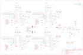

Contents
========

* [PRS10507 > Quadstepper Motor Driver](#prs10507--quadstepper-motor-driver)
	* [Schematic](#schematic)
	* [PCB](#pcb)
	* [OOMP Parts](#oomp-parts)
	* [Images](#images)
	* [Tags](#tags)
  
![][im]
# PRS10507 > Quadstepper Motor Driver

- ID: PROJ-SPAR-10507-STAN-01
- Hex ID: PRS10507
- Name: Sparkfun
- Description: Sparkfun
- Long Link: [http://oom.lt/PROJ-SPAR-10507-STAN-01](http://oom.lt/PROJ-SPAR-10507-STAN-01)
- Short Link: [http://oom.lt/PRS10507](http://oom.lt/PRS10507)

## Schematic
  

## PCB
  

## OOMP Parts
  

|OOMP Parts|
| :---: |
|C1 C1,CAPC-0402-X-UF1D-01|
|C2 C2,CAPX-UNMATCHED-X-UF100-01|
|C3 C3,CAPX-UNMATCHED-X-UF10-01|
|C4 C4,CAPC-0805-X-UF1-01|
|C5 C5,CAPC-0402-X-UF1D-01|
|C6 C6,CAPC-0402-X-UF1D-01|
|C7 C7,CAPC-0402-X-UF1D-01|
|C8 C8,CAPC-0402-X-NF220-01|
|C9 C9,CAPC-0402-X-UF1D-01|
|C10 C10,CAPC-0402-X-UF1D-01|
|C11 C11,CAPC-0402-X-UF1D-01|
|C12 C12,CAPC-0402-X-UF1D-01|
|C13 C13,CAPC-0402-X-UF1D-01|
|C14 C14,CAPC-0402-X-NF220-01|
|C15 C15,CAPC-0402-X-UF1D-01|
|C16 C16,CAPC-0402-X-UF1D-01|
|C17 C17,CAPC-0402-X-UF1D-01|
|C18 C18,CAPC-0402-X-UF1D-01|
|C19 C19,CAPC-0402-X-UF1D-01|
|C20 C20,CAPC-0402-X-NF220-01|
|C21 C21,CAPC-0402-X-UF1D-01|
|C22 C22,CAPC-0402-X-UF1D-01|
|C23 C23,CAPC-0402-X-UF1D-01|
|C24 C24,CAPC-0402-X-UF1D-01|
|C25 C25,CAPC-0402-X-UF1D-01|
|C26 C26,CAPC-0402-X-NF220-01|
|C27 C27,CAPC-0402-X-UF1D-01|
|C28 C28,CAPC-0402-X-UF1D-01|
|C29 C29,CAPC-0402-X-UF1D-01|
|D1 D1,DIOD-UNMATCHED-X-UNMATCHED-01|
|F1 F1,UNMATCHED-1206-X-UNMATCHED-01|
|J1 J1,UNMATCHED-UNMATCHED-X-UNMATCHED-01|
|[JP1 TERS-35D-L-PI02-01 3.5 mm 2 Pin Blue Screw Terminal](https://github.com/oomlout/oomlout_OOMP_parts/tree/main/TERS-35D-L-PI02-01/)|
|[JP2 TERS-35D-L-PI02-01 3.5 mm 2 Pin Blue Screw Terminal](https://github.com/oomlout/oomlout_OOMP_parts/tree/main/TERS-35D-L-PI02-01/)|
|[JP3 HEAD-I01-X-PI02-01 2.54 mm 2 Pin Header](https://github.com/oomlout/oomlout_OOMP_parts/tree/main/HEAD-I01-X-PI02-01/)|
|[JP4 HEAD-I01-X-PI02-01 2.54 mm 2 Pin Header](https://github.com/oomlout/oomlout_OOMP_parts/tree/main/HEAD-I01-X-PI02-01/)|
|[JP5 TERS-35D-L-PI02-01 3.5 mm 2 Pin Blue Screw Terminal](https://github.com/oomlout/oomlout_OOMP_parts/tree/main/TERS-35D-L-PI02-01/)|
|[JP6 TERS-35D-L-PI02-01 3.5 mm 2 Pin Blue Screw Terminal](https://github.com/oomlout/oomlout_OOMP_parts/tree/main/TERS-35D-L-PI02-01/)|
|[JP7 TERS-35D-L-PI02-01 3.5 mm 2 Pin Blue Screw Terminal](https://github.com/oomlout/oomlout_OOMP_parts/tree/main/TERS-35D-L-PI02-01/)|
|[JP8 TERS-35D-L-PI02-01 3.5 mm 2 Pin Blue Screw Terminal](https://github.com/oomlout/oomlout_OOMP_parts/tree/main/TERS-35D-L-PI02-01/)|
|[JP14 TERS-35D-L-PI02-01 3.5 mm 2 Pin Blue Screw Terminal](https://github.com/oomlout/oomlout_OOMP_parts/tree/main/TERS-35D-L-PI02-01/)|
|[JP15 TERS-35D-L-PI02-01 3.5 mm 2 Pin Blue Screw Terminal](https://github.com/oomlout/oomlout_OOMP_parts/tree/main/TERS-35D-L-PI02-01/)|
|[JP16 HEAD-I01-X-PI08-01 2.54 mm 8 Pin Header](https://github.com/oomlout/oomlout_OOMP_parts/tree/main/HEAD-I01-X-PI08-01/)|
|[JP17 HEAD-I01-X-PI08-01 2.54 mm 8 Pin Header](https://github.com/oomlout/oomlout_OOMP_parts/tree/main/HEAD-I01-X-PI08-01/)|
|[JP18 HEAD-I01-X-PI08-01 2.54 mm 8 Pin Header](https://github.com/oomlout/oomlout_OOMP_parts/tree/main/HEAD-I01-X-PI08-01/)|
|[JP19 HEAD-I01-X-PI08-01 2.54 mm 8 Pin Header](https://github.com/oomlout/oomlout_OOMP_parts/tree/main/HEAD-I01-X-PI08-01/)|
|[JP21 HEAD-I01-X-PI02-01 2.54 mm 2 Pin Header](https://github.com/oomlout/oomlout_OOMP_parts/tree/main/HEAD-I01-X-PI02-01/)|
|[JP22 HEAD-I01-X-PI08-01 2.54 mm 8 Pin Header](https://github.com/oomlout/oomlout_OOMP_parts/tree/main/HEAD-I01-X-PI08-01/)|
|[LED1 LEDS-0603-G-STAN-01 SMD (0603) Green LED](https://github.com/oomlout/oomlout_OOMP_parts/tree/main/LEDS-0603-G-STAN-01/)|
|[LED2 LEDS-0603-G-STAN-01 SMD (0603) Green LED](https://github.com/oomlout/oomlout_OOMP_parts/tree/main/LEDS-0603-G-STAN-01/)|
|[LED3 LEDS-0603-G-STAN-01 SMD (0603) Green LED](https://github.com/oomlout/oomlout_OOMP_parts/tree/main/LEDS-0603-G-STAN-01/)|
|[LED4 LEDS-0603-G-STAN-01 SMD (0603) Green LED](https://github.com/oomlout/oomlout_OOMP_parts/tree/main/LEDS-0603-G-STAN-01/)|
|[LED5 LEDS-0603-G-STAN-01 SMD (0603) Green LED](https://github.com/oomlout/oomlout_OOMP_parts/tree/main/LEDS-0603-G-STAN-01/)|
|R1 R1,RESE-0402-X-O241-01|
|R2 R2,RESE-0402-X-O391-01|
|R3 R3,RESE-UNMATCHED-X-UNMATCHED-01|
|R4 R4,RESE-0805-X-UNMATCHED-01|
|R5 R5,RESE-0805-X-UNMATCHED-01|
|[R6 RESE-0402-X-O203-01 SMD (0402) 20k Ohm Resistor](https://github.com/oomlout/oomlout_OOMP_parts/tree/main/RESE-0402-X-O203-01/)|
|R7 R7,RESE-0402-X-O331-01|
|R8 R8,RESE-0402-X-O1003-01|
|R9 R9,RESE-0402-X-O1003-01|
|R10 R10,RESE-UNMATCHED-X-UNMATCHED-01|
|R11 R11,RESE-0805-X-UNMATCHED-01|
|R12 R12,RESE-0805-X-UNMATCHED-01|
|[R13 RESE-0402-X-O203-01 SMD (0402) 20k Ohm Resistor](https://github.com/oomlout/oomlout_OOMP_parts/tree/main/RESE-0402-X-O203-01/)|
|R14 R14,RESE-0402-X-O331-01|
|R15 R15,RESE-0402-X-O1003-01|
|R16 R16,RESE-0402-X-O1003-01|
|R17 R17,RESE-UNMATCHED-X-UNMATCHED-01|
|R18 R18,RESE-0805-X-UNMATCHED-01|
|R19 R19,RESE-0805-X-UNMATCHED-01|
|[R20 RESE-0402-X-O203-01 SMD (0402) 20k Ohm Resistor](https://github.com/oomlout/oomlout_OOMP_parts/tree/main/RESE-0402-X-O203-01/)|
|R21 R21,RESE-0402-X-O331-01|
|R22 R22,RESE-0402-X-O1003-01|
|R23 R23,RESE-0402-X-O1003-01|
|R24 R24,RESE-UNMATCHED-X-UNMATCHED-01|
|R25 R25,RESE-0805-X-UNMATCHED-01|
|R26 R26,RESE-0805-X-UNMATCHED-01|
|[R27 RESE-0402-X-O203-01 SMD (0402) 20k Ohm Resistor](https://github.com/oomlout/oomlout_OOMP_parts/tree/main/RESE-0402-X-O203-01/)|
|R28 R28,RESE-0402-X-O331-01|
|R29 R29,RESE-0402-X-O1003-01|
|R30 R30,RESE-0402-X-O1003-01|
|R31 R31,RESE-0402-X-O1003-01|
|R32 R32,RESE-0402-X-O1003-01|
|R33 R33,RESE-0402-X-O1003-01|
|R34 R34,RESE-0402-X-O1003-01|
|R35 R35,RESE-0402-X-O331-01|
|R36 R36,RESE-0402-X-O331-01|
|R37 R37,RESE-0402-X-O1003-01|
|R38 R38,RESE-0402-X-O1003-01|
|R39 R39,RESE-0402-X-O1003-01|
|R40 R40,RESE-0402-X-O1003-01|
|R41 R41,RESE-0402-X-O1003-01|
|R42 R42,RESE-0402-X-O1003-01|
|R43 R43,RESE-0402-X-O1003-01|
|R44 R44,RESE-0402-X-O1003-01|
|R45 R45,RESE-0402-X-O1003-01|
|R46 R46,RESE-0402-X-O1003-01|
|R47 R47,RESE-0402-X-O1003-01|
|R48 R48,RESE-0402-X-O1003-01|
|U1 U1,UNMATCHED-UNMATCHED-X-UNMATCHED-01|
|U2 U2,UNMATCHED-UNMATCHED-X-UNMATCHED-01|
|U3 U3,UNMATCHED-UNMATCHED-X-UNMATCHED-01|
|U4 U4,UNMATCHED-UNMATCHED-X-UNMATCHED-01|
|U5 U5,UNMATCHED-UNMATCHED-X-UNMATCHED-01|

## Images
  
  

|kicadPcb3d|kicadPcb3dFront|kicadPcb3dBack|eagleImage|eagleSchemImage|
| :---: | :---: | :---: | :---: | :---: |
||||||

## Tags

- hexID: PRS10507
- oompType: PROJ
- oompSize: SPAR
- oompColor: 10507
- oompDesc: STAN
- oompIndex: 01
- oompName: Quadstepper Motor Driver
- sources: All source files from https://github.com/sparkfun/Quadstepper_Motor_Driver (source licence details in srcLicense.md)
- linkBuyPage: https://www.sparkfun.com/products/10507
- oompID: PROJ-SPAR-10507-STAN-01
- oompParts: C1,CAPC-0402-X-UF1D-01
- oompParts: C2,CAPX-UNMATCHED-X-UF100-01
- oompParts: C3,CAPX-UNMATCHED-X-UF10-01
- oompParts: C4,CAPC-0805-X-UF1-01
- oompParts: C5,CAPC-0402-X-UF1D-01
- oompParts: C6,CAPC-0402-X-UF1D-01
- oompParts: C7,CAPC-0402-X-UF1D-01
- oompParts: C8,CAPC-0402-X-NF220-01
- oompParts: C9,CAPC-0402-X-UF1D-01
- oompParts: C10,CAPC-0402-X-UF1D-01
- oompParts: C11,CAPC-0402-X-UF1D-01
- oompParts: C12,CAPC-0402-X-UF1D-01
- oompParts: C13,CAPC-0402-X-UF1D-01
- oompParts: C14,CAPC-0402-X-NF220-01
- oompParts: C15,CAPC-0402-X-UF1D-01
- oompParts: C16,CAPC-0402-X-UF1D-01
- oompParts: C17,CAPC-0402-X-UF1D-01
- oompParts: C18,CAPC-0402-X-UF1D-01
- oompParts: C19,CAPC-0402-X-UF1D-01
- oompParts: C20,CAPC-0402-X-NF220-01
- oompParts: C21,CAPC-0402-X-UF1D-01
- oompParts: C22,CAPC-0402-X-UF1D-01
- oompParts: C23,CAPC-0402-X-UF1D-01
- oompParts: C24,CAPC-0402-X-UF1D-01
- oompParts: C25,CAPC-0402-X-UF1D-01
- oompParts: C26,CAPC-0402-X-NF220-01
- oompParts: C27,CAPC-0402-X-UF1D-01
- oompParts: C28,CAPC-0402-X-UF1D-01
- oompParts: C29,CAPC-0402-X-UF1D-01
- oompParts: D1,DIOD-UNMATCHED-X-UNMATCHED-01
- oompParts: F1,UNMATCHED-1206-X-UNMATCHED-01
- oompParts: J1,UNMATCHED-UNMATCHED-X-UNMATCHED-01
- oompParts: JP1,TERS-35D-L-PI02-01
- oompParts: JP2,TERS-35D-L-PI02-01
- oompParts: JP3,HEAD-I01-X-PI02-01
- oompParts: JP4,HEAD-I01-X-PI02-01
- oompParts: JP5,TERS-35D-L-PI02-01
- oompParts: JP6,TERS-35D-L-PI02-01
- oompParts: JP7,TERS-35D-L-PI02-01
- oompParts: JP8,TERS-35D-L-PI02-01
- oompParts: JP14,TERS-35D-L-PI02-01
- oompParts: JP15,TERS-35D-L-PI02-01
- oompParts: JP16,HEAD-I01-X-PI08-01
- oompParts: JP17,HEAD-I01-X-PI08-01
- oompParts: JP18,HEAD-I01-X-PI08-01
- oompParts: JP19,HEAD-I01-X-PI08-01
- oompParts: JP21,HEAD-I01-X-PI02-01
- oompParts: JP22,HEAD-I01-X-PI08-01
- oompParts: LED1,LEDS-0603-G-STAN-01
- oompParts: LED2,LEDS-0603-G-STAN-01
- oompParts: LED3,LEDS-0603-G-STAN-01
- oompParts: LED4,LEDS-0603-G-STAN-01
- oompParts: LED5,LEDS-0603-G-STAN-01
- oompParts: R1,RESE-0402-X-O241-01
- oompParts: R2,RESE-0402-X-O391-01
- oompParts: R3,RESE-UNMATCHED-X-UNMATCHED-01
- oompParts: R4,RESE-0805-X-UNMATCHED-01
- oompParts: R5,RESE-0805-X-UNMATCHED-01
- oompParts: R6,RESE-0402-X-O203-01
- oompParts: R7,RESE-0402-X-O331-01
- oompParts: R8,RESE-0402-X-O1003-01
- oompParts: R9,RESE-0402-X-O1003-01
- oompParts: R10,RESE-UNMATCHED-X-UNMATCHED-01
- oompParts: R11,RESE-0805-X-UNMATCHED-01
- oompParts: R12,RESE-0805-X-UNMATCHED-01
- oompParts: R13,RESE-0402-X-O203-01
- oompParts: R14,RESE-0402-X-O331-01
- oompParts: R15,RESE-0402-X-O1003-01
- oompParts: R16,RESE-0402-X-O1003-01
- oompParts: R17,RESE-UNMATCHED-X-UNMATCHED-01
- oompParts: R18,RESE-0805-X-UNMATCHED-01
- oompParts: R19,RESE-0805-X-UNMATCHED-01
- oompParts: R20,RESE-0402-X-O203-01
- oompParts: R21,RESE-0402-X-O331-01
- oompParts: R22,RESE-0402-X-O1003-01
- oompParts: R23,RESE-0402-X-O1003-01
- oompParts: R24,RESE-UNMATCHED-X-UNMATCHED-01
- oompParts: R25,RESE-0805-X-UNMATCHED-01
- oompParts: R26,RESE-0805-X-UNMATCHED-01
- oompParts: R27,RESE-0402-X-O203-01
- oompParts: R28,RESE-0402-X-O331-01
- oompParts: R29,RESE-0402-X-O1003-01
- oompParts: R30,RESE-0402-X-O1003-01
- oompParts: R31,RESE-0402-X-O1003-01
- oompParts: R32,RESE-0402-X-O1003-01
- oompParts: R33,RESE-0402-X-O1003-01
- oompParts: R34,RESE-0402-X-O1003-01
- oompParts: R35,RESE-0402-X-O331-01
- oompParts: R36,RESE-0402-X-O331-01
- oompParts: R37,RESE-0402-X-O1003-01
- oompParts: R38,RESE-0402-X-O1003-01
- oompParts: R39,RESE-0402-X-O1003-01
- oompParts: R40,RESE-0402-X-O1003-01
- oompParts: R41,RESE-0402-X-O1003-01
- oompParts: R42,RESE-0402-X-O1003-01
- oompParts: R43,RESE-0402-X-O1003-01
- oompParts: R44,RESE-0402-X-O1003-01
- oompParts: R45,RESE-0402-X-O1003-01
- oompParts: R46,RESE-0402-X-O1003-01
- oompParts: R47,RESE-0402-X-O1003-01
- oompParts: R48,RESE-0402-X-O1003-01
- oompParts: U1,UNMATCHED-UNMATCHED-X-UNMATCHED-01
- oompParts: U2,UNMATCHED-UNMATCHED-X-UNMATCHED-01
- oompParts: U3,UNMATCHED-UNMATCHED-X-UNMATCHED-01
- oompParts: U4,UNMATCHED-UNMATCHED-X-UNMATCHED-01
- oompParts: U5,UNMATCHED-UNMATCHED-X-UNMATCHED-01
- rawParts: C1,0.1uF,CAP0402-CAP,0402-CAP,Capacitor,,
- rawParts: C2,100uF,CAP_POLG,PANASONIC_G,Capacitor Polarized,,
- rawParts: C3,10uF,CAP_POL1206,EIA3216,Capacitor Polarized,,
- rawParts: C4,1uF,CAP0805,0805,Capacitor,,
- rawParts: C5,0.1uF,CAP0402-CAP,0402-CAP,Capacitor,,
- rawParts: C6,0.1uF,CAP0402-CAP,0402-CAP,Capacitor,,
- rawParts: C7,0.1uF,CAP0402-CAP,0402-CAP,Capacitor,,
- rawParts: C8,0.22uF,CAP0402-CAP,0402-CAP,Capacitor,,
- rawParts: C9,0.1uF,CAP0402-CAP,0402-CAP,Capacitor,,
- rawParts: C10,0.1uF,CAP0402-CAP,0402-CAP,Capacitor,,
- rawParts: C11,0.1uF,CAP0402-CAP,0402-CAP,Capacitor,,
- rawParts: C12,0.1uF,CAP0402-CAP,0402-CAP,Capacitor,,
- rawParts: C13,0.1uF,CAP0402-CAP,0402-CAP,Capacitor,,
- rawParts: C14,0.22uF,CAP0402-CAP,0402-CAP,Capacitor,,
- rawParts: C15,0.1uF,CAP0402-CAP,0402-CAP,Capacitor,,
- rawParts: C16,0.1uF,CAP0402-CAP,0402-CAP,Capacitor,,
- rawParts: C17,0.1uF,CAP0402-CAP,0402-CAP,Capacitor,,
- rawParts: C18,0.1uF,CAP0402-CAP,0402-CAP,Capacitor,,
- rawParts: C19,0.1uF,CAP0402-CAP,0402-CAP,Capacitor,,
- rawParts: C20,0.22uF,CAP0402-CAP,0402-CAP,Capacitor,,
- rawParts: C21,0.1uF,CAP0402-CAP,0402-CAP,Capacitor,,
- rawParts: C22,0.1uF,CAP0402-CAP,0402-CAP,Capacitor,,
- rawParts: C23,0.1uF,CAP0402-CAP,0402-CAP,Capacitor,,
- rawParts: C24,0.1uF,CAP0402-CAP,0402-CAP,Capacitor,,
- rawParts: C25,0.1uF,CAP0402-CAP,0402-CAP,Capacitor,,
- rawParts: C26,0.22uF,CAP0402-CAP,0402-CAP,Capacitor,,
- rawParts: C27,0.1uF,CAP0402-CAP,0402-CAP,Capacitor,,
- rawParts: C28,0.1uF,CAP0402-CAP,0402-CAP,Capacitor,,
- rawParts: C29,0.1uF,CAP0402-CAP,0402-CAP,Capacitor,,
- rawParts: D1,B340A,DIODESMA,SMA-DIODE,Diode,,
- rawParts: F1,PTC,PTCSMD,PTC-1206,Resettable Fuse PTC,,
- rawParts: J1,Barrel Jack,POWER_JACKSMD,POWER_JACK_SMD,Power Jack,,
- rawParts: JP1,,M023.5MM_LOCK,SCREWTERMINAL-3.5MM-2_LOCK,Header 2,,
- rawParts: JP2,,M023.5MM_LOCK,SCREWTERMINAL-3.5MM-2_LOCK,Header 2,,
- rawParts: JP3,,M02PTH,1X02,Header 2,,
- rawParts: JP4,,M02PTH,1X02,Header 2,,
- rawParts: JP5,,M023.5MM_LOCK,SCREWTERMINAL-3.5MM-2_LOCK,Header 2,,
- rawParts: JP6,,M023.5MM_LOCK,SCREWTERMINAL-3.5MM-2_LOCK,Header 2,,
- rawParts: JP7,,M023.5MM_LOCK,SCREWTERMINAL-3.5MM-2_LOCK,Header 2,,
- rawParts: JP8,,M023.5MM_LOCK,SCREWTERMINAL-3.5MM-2_LOCK,Header 2,,
- rawParts: JP9,STAND-OFF,STAND-OFF,STAND-OFF,Stand Off,,
- rawParts: JP10,STAND-OFF,STAND-OFF,STAND-OFF,Stand Off,,
- rawParts: JP11,STAND-OFF,STAND-OFF,STAND-OFF,Stand Off,,
- rawParts: JP12,STAND-OFF,STAND-OFF,STAND-OFF,Stand Off,,
- rawParts: JP14,,M023.5MM_LOCK,SCREWTERMINAL-3.5MM-2_LOCK,Header 2,,
- rawParts: JP15,,M023.5MM_LOCK,SCREWTERMINAL-3.5MM-2_LOCK,Header 2,,
- rawParts: JP16,CH1,M08,1X08,Header 8,,
- rawParts: JP17,CH3,M08,1X08,Header 8,,
- rawParts: JP18,CH4,M08,1X08,Header 8,,
- rawParts: JP19,CH2,M08,1X08,Header 8,,
- rawParts: JP20,LOGO-SFENEW,LOGO-SFENEW,SFE-NEW-WEBLOGO,Spark Fun Electronics PCB Logo,,
- rawParts: JP21,,M02PTH,1X02,Header 2,,
- rawParts: JP22,,M08,1X08,Header 8,,
- rawParts: LED1,green,LED0603,LED-0603,LEDs,,
- rawParts: LED2,green,LED0603,LED-0603,LEDs,,
- rawParts: LED3,green,LED0603,LED-0603,LEDs,,
- rawParts: LED4,green,LED0603,LED-0603,LEDs,,
- rawParts: LED5,red,LED0603,LED-0603,LEDs,,
- rawParts: R1,240,RESISTOR0402-RES,0402-RES,Resistor,,
- rawParts: R2,390,RESISTOR0402-RES,0402-RES,Resistor,,
- rawParts: R3,Trimpot,TRIMPOTSMD,TRIMPOT-3MM,,,
- rawParts: R4,0.22,RESISTOR0805-RES,0805,Resistor,,
- rawParts: R5,0.22,RESISTOR0805-RES,0805,Resistor,,
- rawParts: R6,20k,RESISTOR0402-RES,0402-RES,Resistor,,
- rawParts: R7,330,RESISTOR0402-RES,0402-RES,Resistor,,
- rawParts: R8,100k,RESISTOR0402-RES,0402-RES,Resistor,,
- rawParts: R9,100k,RESISTOR0402-RES,0402-RES,Resistor,,
- rawParts: R10,Trimpot,TRIMPOTSMD,TRIMPOT-3MM,,,
- rawParts: R11,0.22,RESISTOR0805-RES,0805,Resistor,,
- rawParts: R12,0.22,RESISTOR0805-RES,0805,Resistor,,
- rawParts: R13,20k,RESISTOR0402-RES,0402-RES,Resistor,,
- rawParts: R14,330,RESISTOR0402-RES,0402-RES,Resistor,,
- rawParts: R15,100k,RESISTOR0402-RES,0402-RES,Resistor,,
- rawParts: R16,100k,RESISTOR0402-RES,0402-RES,Resistor,,
- rawParts: R17,Trimpot,TRIMPOTSMD,TRIMPOT-3MM,,,
- rawParts: R18,0.22,RESISTOR0805-RES,0805,Resistor,,
- rawParts: R19,0.22,RESISTOR0805-RES,0805,Resistor,,
- rawParts: R20,20k,RESISTOR0402-RES,0402-RES,Resistor,,
- rawParts: R21,330,RESISTOR0402-RES,0402-RES,Resistor,,
- rawParts: R22,100k,RESISTOR0402-RES,0402-RES,Resistor,,
- rawParts: R23,100k,RESISTOR0402-RES,0402-RES,Resistor,,
- rawParts: R24,Trimpot,TRIMPOTSMD,TRIMPOT-3MM,,,
- rawParts: R25,0.22,RESISTOR0805-RES,0805,Resistor,,
- rawParts: R26,0.22,RESISTOR0805-RES,0805,Resistor,,
- rawParts: R27,20k,RESISTOR0402-RES,0402-RES,Resistor,,
- rawParts: R28,330,RESISTOR0402-RES,0402-RES,Resistor,,
- rawParts: R29,100k,RESISTOR0402-RES,0402-RES,Resistor,,
- rawParts: R30,100k,RESISTOR0402-RES,0402-RES,Resistor,,
- rawParts: R31,100k,RESISTOR0402-RES,0402-RES,Resistor,,
- rawParts: R32,100k,RESISTOR0402-RES,0402-RES,Resistor,,
- rawParts: R33,100k,RESISTOR0402-RES,0402-RES,Resistor,,
- rawParts: R34,100k,RESISTOR0402-RES,0402-RES,Resistor,,
- rawParts: R35,330,RESISTOR0402-RES,0402-RES,Resistor,,
- rawParts: R36,330,RESISTOR0402-RES,0402-RES,Resistor,,
- rawParts: R37,100k,RESISTOR0402-RES,0402-RES,Resistor,,
- rawParts: R38,100k,RESISTOR0402-RES,0402-RES,Resistor,,
- rawParts: R39,100k,RESISTOR0402-RES,0402-RES,Resistor,,
- rawParts: R40,100k,RESISTOR0402-RES,0402-RES,Resistor,,
- rawParts: R41,100k,RESISTOR0402-RES,0402-RES,Resistor,,
- rawParts: R42,100k,RESISTOR0402-RES,0402-RES,Resistor,,
- rawParts: R43,100k,RESISTOR0402-RES,0402-RES,Resistor,,
- rawParts: R44,100k,RESISTOR0402-RES,0402-RES,Resistor,,
- rawParts: R45,100k,RESISTOR0402-RES,0402-RES,Resistor,,
- rawParts: R46,100k,RESISTOR0402-RES,0402-RES,Resistor,,
- rawParts: R47,100k,RESISTOR0402-RES,0402-RES,Resistor,,
- rawParts: R48,100k,RESISTOR0402-RES,0402-RES,Resistor,,
- rawParts: SJ1,SOLDERJUMPERNO,SOLDERJUMPERNO,SJ_2S-NO,Solder Jumper,,
- rawParts: SJ2,SOLDERJUMPERNO,SOLDERJUMPERNO,SJ_2S-NO,Solder Jumper,,
- rawParts: SJ3,SOLDERJUMPERNO,SOLDERJUMPERNO,SJ_2S-NO,Solder Jumper,,
- rawParts: SJ4,SOLDERJUMPERNO,SOLDERJUMPERNO,SJ_2S-NO,Solder Jumper,,
- rawParts: SJ5,SOLDERJUMPERNO,SOLDERJUMPERNO,SJ_2S-NO,Solder Jumper,,
- rawParts: SJ6,SOLDERJUMPERNO,SOLDERJUMPERNO,SJ_2S-NO,Solder Jumper,,
- rawParts: SJ7,SOLDERJUMPERNO,SOLDERJUMPERNO,SJ_2S-NO,Solder Jumper,,
- rawParts: SJ8,SOLDERJUMPERNO,SOLDERJUMPERNO,SJ_2S-NO,Solder Jumper,,
- rawParts: SJ9,SOLDERJUMPERNO,SOLDERJUMPERNO,SJ_2S-NO,Solder Jumper,,
- rawParts: TP1,TEST-POINT3X5,TEST-POINT3X5,PAD.03X.05,,,
- rawParts: TP2,TEST-POINT3X5,TEST-POINT3X5,PAD.03X.05,,,
- rawParts: TP3,TEST-POINT3X5,TEST-POINT3X5,PAD.03X.05,,,
- rawParts: TP4,TEST-POINT3X5,TEST-POINT3X5,PAD.03X.05,,,
- rawParts: U1,A4983,A4983,QFN-28-5MM,DMOS Microstepping Driver with Translator,,
- rawParts: U2,LM317,V_REG_MC33269DT,DPAK,,,
- rawParts: U3,A4983,A4983,QFN-28-5MM,DMOS Microstepping Driver with Translator,,
- rawParts: U4,A4983,A4983,QFN-28-5MM,DMOS Microstepping Driver with Translator,,
- rawParts: U5,A4983,A4983,QFN-28-5MM,DMOS Microstepping Driver with Translator,,

[im]: kicadPcb3d_450.png
