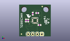
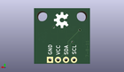
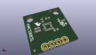

Contents
========

* [PROJ-SPAR-10530-STAN-01>Triple Axis Magnetometer-HMC5883L](#proj-spar-10530-stan-01triple-axis-magnetometer-hmc5883l)
	* [Images](#images)
	* [Interactive BOM](#interactive-bom)
	* [Tags](#tags)
  
![][im]
# PROJ-SPAR-10530-STAN-01>Triple Axis Magnetometer-HMC5883L

- ID: PROJ-SPAR-10530-STAN-01
- Hex ID: PRS10530
- Name: Triple Axis Magnetometer-HMC5883L
- Description: 

## Images
  
  

|eagleImage|kicadPcb3dFront|kicadPcb3dBack|kicadPcb3d|
| :---: | :---: | :---: | :---: |
|||||

## Interactive BOM

- Interactive BOM page: [ibom.html](kicad/bom/ibom.html)

## Tags

- hexID: PRS10530
- oompType: PROJ
- oompSize: SPAR
- oompColor: 10530
- oompDesc: STAN
- oompIndex: 01
- oompName: Triple Axis Magnetometer-HMC5883L
- sources: All source files from https://github.com/sparkfun/Triple_Axis_Magnetometer-HMC5883L (source licence details in srcLicense.md)
- linkBuyPage: https://www.sparkfun.com/products/10530
- oompID: PROJ-SPAR-10530-STAN-01
- oompParts: C1,UNMATCHED-UNMATCHED-UNMATCHED-UNMATCHED-UNMATCHED
- oompParts: C2,UNMATCHED-UNMATCHED-UNMATCHED-UNMATCHED-UNMATCHED
- oompParts: C3,UNMATCHED-UNMATCHED-UNMATCHED-UNMATCHED-UNMATCHED
- oompParts: JP1,UNMATCHED-UNMATCHED-UNMATCHED-UNMATCHED-UNMATCHED
- oompParts: JP2,UNMATCHED-UNMATCHED-UNMATCHED-UNMATCHED-UNMATCHED
- oompParts: JP3,UNMATCHED-UNMATCHED-UNMATCHED-UNMATCHED-UNMATCHED
- oompParts: JP4,UNMATCHED-UNMATCHED-UNMATCHED-UNMATCHED-UNMATCHED
- oompParts: R1,UNMATCHED-UNMATCHED-UNMATCHED-UNMATCHED-UNMATCHED
- oompParts: R2,UNMATCHED-UNMATCHED-UNMATCHED-UNMATCHED-UNMATCHED
- oompParts: U$1,UNMATCHED-UNMATCHED-UNMATCHED-UNMATCHED-UNMATCHED
- oompParts: U$2,UNMATCHED-UNMATCHED-UNMATCHED-UNMATCHED-UNMATCHED
- oompParts: U1,UNMATCHED-UNMATCHED-UNMATCHED-UNMATCHED-UNMATCHED
- rawParts: C1,.1uF,CAP0402-CAP,0402-CAP,Capacitor,,
- rawParts: C2,.22uF,CAP0402-CAP,0402-CAP,Capacitor,,
- rawParts: C3,4.7uF,CAP0402-CAP,0402-CAP,Capacitor,,
- rawParts: JP1,,M04PTH,1X04,Header 4,,
- rawParts: JP2,STAND-OFF,STAND-OFF,STAND-OFF,Stand Off,,
- rawParts: JP3,STAND-OFF,STAND-OFF,STAND-OFF,Stand Off,,
- rawParts: JP4,LOGO-SFESK,LOGO-SFESK,SFE-LOGO-FLAME,Spark Fun Electronics PCB Logo,,
- rawParts: JP5,FIDUCIAL1X2.5,FIDUCIAL1X2.5,FIDUCIAL-1X2.5,Fiducial Alignment Points,,
- rawParts: JP6,FIDUCIAL1X2.5,FIDUCIAL1X2.5,FIDUCIAL-1X2.5,Fiducial Alignment Points,,
- rawParts: R1,DNP,RESISTOR0402-RES,0402-RES,Resistor,,
- rawParts: R2,DNP,RESISTOR0402-RES,0402-RES,Resistor,,
- rawParts: U$1,CREATIVE_COMMONS,CREATIVE_COMMONS,CREATIVE_COMMONS,,,
- rawParts: U$2,OSHW-LOGOM,OSHW-LOGOM,OSHW-LOGO-M,Open Source Hardware Logo This logo indicates the piece of hardware it is found on incorporates a OSHW license and/or adheres to the definition of open source hardware found here: http://freedomdefined.org/OSHW,,
- rawParts: U1,HMC5883LSMD,HMC5883LSMD,16LPCC,3 Axis Digital Compass IC,,

[im]: kicadPcb3d_450.png
