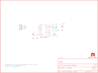

Contents
========

* [PRS10530 > Triple Axis Magnetometer-HMC5883L](#prs10530--triple-axis-magnetometer-hmc5883l)
	* [Schematic](#schematic)
	* [PCB](#pcb)
	* [Interactive BOM](#interactive-bom)
	* [OOMP Parts](#oomp-parts)
	* [Images](#images)
	* [Tags](#tags)
  
![][im]
# PRS10530 > Triple Axis Magnetometer-HMC5883L

- ID: PROJ-SPAR-10530-STAN-01
- Hex ID: PRS10530
- Name: Sparkfun
- Description: Sparkfun
- Long Link: [http://oom.lt/PROJ-SPAR-10530-STAN-01](http://oom.lt/PROJ-SPAR-10530-STAN-01)
- Short Link: [http://oom.lt/PRS10530](http://oom.lt/PRS10530)

## Schematic
  

## PCB
  

## Interactive BOM

- Interactive BOM page: [ibom.html](https://htmlpreview.github.io/?https://github.com/oomlout/oomlout_OOMP_projects/blob/main/PROJ-SPAR-10530-STAN-01/kicad/bom/ibom.html)

## OOMP Parts
  

|OOMP Parts|
| :---: |
|[CAPC-0402-X-NF100-V10  SMD (0402) 100 nF Capacitor (Ceramic) 10v  C1](https://github.com/oomlout/oomlout_OOMP_parts/tree/main/CAPC-0402-X-NF100-V10/)|
|[CAPC-0402-X-NF220-V16  SMD (0402) 220 nF Capacitor (Ceramic) 16v  C2](https://github.com/oomlout/oomlout_OOMP_parts/tree/main/CAPC-0402-X-NF220-V16/)|
|[CAPC-0402-X-UF47D-V63D  SMD (0402) 4.7 uF Capacitor (Ceramic) 6.3v  C3](https://github.com/oomlout/oomlout_OOMP_parts/tree/main/CAPC-0402-X-UF47D-V63D/)|
|[HEAD-I01-X-PI04-01  2.54 mm 4 Pin Header  JP1](https://github.com/oomlout/oomlout_OOMP_parts/tree/main/HEAD-I01-X-PI04-01/)|
|RESE-0402-X-UNMATCHED-01 R1, R2|
|UNMATCHED-UNMATCHED-X-UNMATCHED-01 U1|

## Images
  
  

|kicadPcb3d|kicadPcb3dFront|kicadPcb3dBack|eagleImage|eagleSchemImage|
| :---: | :---: | :---: | :---: | :---: |
||||||

## Tags

- hexID: PRS10530
- oompType: PROJ
- oompSize: SPAR
- oompColor: 10530
- oompDesc: STAN
- oompIndex: 01
- oompName: Triple Axis Magnetometer-HMC5883L
- sources: All source files from https://github.com/sparkfun/Triple_Axis_Magnetometer-HMC5883L (source licence details in srcLicense.md)
- linkBuyPage: https://www.sparkfun.com/products/10530
- oompID: PROJ-SPAR-10530-STAN-01
- oompParts: C1,CAPC-0402-X-NF100-V10
- oompParts: C2,CAPC-0402-X-NF220-V16
- oompParts: C3,CAPC-0402-X-UF47D-V63D
- oompParts: JP1,HEAD-I01-X-PI04-01
- oompParts: R1,RESE-0402-X-UNMATCHED-01
- oompParts: R2,RESE-0402-X-UNMATCHED-01
- oompParts: U1,UNMATCHED-UNMATCHED-X-UNMATCHED-01
- rawParts: C1,.1uF,CAP0402-CAP,0402-CAP,Capacitor,,
- rawParts: C2,.22uF,CAP0402-CAP,0402-CAP,Capacitor,,
- rawParts: C3,4.7uF,CAP0402-CAP,0402-CAP,Capacitor,,
- rawParts: JP1,,M04PTH,1X04,Header 4,,
- rawParts: JP2,STAND-OFF,STAND-OFF,STAND-OFF,Stand Off,,
- rawParts: JP3,STAND-OFF,STAND-OFF,STAND-OFF,Stand Off,,
- rawParts: JP4,LOGO-SFESK,LOGO-SFESK,SFE-LOGO-FLAME,Spark Fun Electronics PCB Logo,,
- rawParts: JP5,FIDUCIAL1X2.5,FIDUCIAL1X2.5,FIDUCIAL-1X2.5,Fiducial Alignment Points,,
- rawParts: JP6,FIDUCIAL1X2.5,FIDUCIAL1X2.5,FIDUCIAL-1X2.5,Fiducial Alignment Points,,
- rawParts: R1,DNP,RESISTOR0402-RES,0402-RES,Resistor,,
- rawParts: R2,DNP,RESISTOR0402-RES,0402-RES,Resistor,,
- rawParts: U$1,CREATIVE_COMMONS,CREATIVE_COMMONS,CREATIVE_COMMONS,,,
- rawParts: U$2,OSHW-LOGOM,OSHW-LOGOM,OSHW-LOGO-M,Open Source Hardware Logo This logo indicates the piece of hardware it is found on incorporates a OSHW license and/or adheres to the definition of open source hardware found here: http://freedomdefined.org/OSHW,,
- rawParts: U1,HMC5883LSMD,HMC5883LSMD,16LPCC,3 Axis Digital Compass IC,,

[im]: kicadPcb3d_450.png
