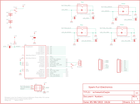

Contents
========

* [PRS10547 > Sparkfun](#prs10547--sparkfun)
	* [Images](#images)
	* [Tags](#tags)
  
![][im]
# PRS10547 > Sparkfun

- ID: PROJ-SPAR-10547-STAN-01
- Hex ID: PRS10547
- Name: Sparkfun
- Description: Sparkfun

## Images
  
  

|kicadPcb3d|kicadPcb3dFront|kicadPcb3dBack|eagleImage|eagleSchemImage|
| :---: | :---: | :---: | :---: | :---: |
||||||

## Tags

- hexID: PRS10547
- oompType: PROJ
- oompSize: SPAR
- oompColor: 10547
- oompDesc: STAN
- oompIndex: 01
- oompName: Simon-Says
- sources: All source files from https://github.com/sparkfun/Simon-Says (source licence details in srcLicense.md)
- linkBuyPage: https://www.sparkfun.com/products/10547
- oompID: PROJ-SPAR-10547-STAN-01
- oompParts: BAT1,UNMATCHED-UNMATCHED-UNMATCHED-UNMATCHED-UNMATCHED
- oompParts: BAT2,UNMATCHED-UNMATCHED-UNMATCHED-UNMATCHED-UNMATCHED
- oompParts: C1,UNMATCHED-UNMATCHED-UNMATCHED-UNMATCHED-UNMATCHED
- oompParts: C2,UNMATCHED-UNMATCHED-UNMATCHED-UNMATCHED-UNMATCHED
- oompParts: IC1,UNMATCHED-UNMATCHED-UNMATCHED-UNMATCHED-UNMATCHED
- oompParts: JP1,UNMATCHED-UNMATCHED-UNMATCHED-UNMATCHED-UNMATCHED
- oompParts: JP2,UNMATCHED-UNMATCHED-UNMATCHED-UNMATCHED-UNMATCHED
- oompParts: JP3,UNMATCHED-UNMATCHED-UNMATCHED-UNMATCHED-UNMATCHED
- oompParts: JP4,UNMATCHED-UNMATCHED-UNMATCHED-UNMATCHED-UNMATCHED
- oompParts: JP5,UNMATCHED-UNMATCHED-UNMATCHED-UNMATCHED-UNMATCHED
- oompParts: JP6,UNMATCHED-UNMATCHED-UNMATCHED-UNMATCHED-UNMATCHED
- oompParts: JP7,UNMATCHED-UNMATCHED-UNMATCHED-UNMATCHED-UNMATCHED
- oompParts: JP8,UNMATCHED-UNMATCHED-UNMATCHED-UNMATCHED-UNMATCHED
- oompParts: JP9,UNMATCHED-UNMATCHED-UNMATCHED-UNMATCHED-UNMATCHED
- oompParts: JP10,UNMATCHED-UNMATCHED-UNMATCHED-UNMATCHED-UNMATCHED
- oompParts: JP11,UNMATCHED-UNMATCHED-UNMATCHED-UNMATCHED-UNMATCHED
- oompParts: P1-,UNMATCHED-UNMATCHED-UNMATCHED-UNMATCHED-UNMATCHED
- oompParts: R1,UNMATCHED-UNMATCHED-UNMATCHED-UNMATCHED-UNMATCHED
- oompParts: S1,UNMATCHED-UNMATCHED-UNMATCHED-UNMATCHED-UNMATCHED
- oompParts: S2,UNMATCHED-UNMATCHED-UNMATCHED-UNMATCHED-UNMATCHED
- oompParts: SG1,UNMATCHED-UNMATCHED-UNMATCHED-UNMATCHED-UNMATCHED
- oompParts: U$1,UNMATCHED-UNMATCHED-UNMATCHED-UNMATCHED-UNMATCHED
- oompParts: U$2,UNMATCHED-UNMATCHED-UNMATCHED-UNMATCHED-UNMATCHED
- rawParts: BAT1,AA,BATTERYAA-KIT,BATTERY-AA-KIT,Battery Holders,,
- rawParts: BAT2,AA,BATTERYAA-KIT,BATTERY-AA-KIT,Battery Holders,,
- rawParts: C1,0.1uF,CAPCAP-PTH-SMALL-KIT,CAP-PTH-SMALL-KIT,Capacitor,,
- rawParts: C2,0.1uF,CAPCAP-PTH-SMALL-KIT,CAP-PTH-SMALL-KIT,Capacitor,,
- rawParts: IC1,AVR-MEGA8-P,AVR-MEGA8-PKIT,DIL28-3-SIMON-KIT,MICROCONTROLLER,,
- rawParts: JP1,Serial,M06-SFENOSILK,1X06-NOSILK,Header 6,,
- rawParts: JP2,,JUMPER-2NOSILK,SJ_2S_NO_SILK,Jumper,,
- rawParts: JP3,AVR_SPI_PRG_6NS,AVR_SPI_PRG_6NS,2X3-NS,AVR ISP 6 Pin,,
- rawParts: JP4,,M08NOSILK,1X08NOSILK,Header 8,,
- rawParts: JP5,,JUMPER-2NOSILK,SJ_2S_NO_SILK,Jumper,,
- rawParts: JP6,,JUMPER-2NOSILK,SJ_2S_NO_SILK,Jumper,,
- rawParts: JP7,,JUMPER-2NOSILK,SJ_2S_NO_SILK,Jumper,,
- rawParts: JP8,,JUMPER-2NOSILK,SJ_2S_NO_SILK,Jumper,,
- rawParts: JP9,,JUMPER-2NOSILK,SJ_2S_NO_SILK,Jumper,,
- rawParts: JP10,,JUMPER-2NOSILK,SJ_2S_NO_SILK,Jumper,,
- rawParts: JP11,,JUMPER-2NOSILK,SJ_2S_NO_SILK,Jumper,,
- rawParts: P1-,BUTTONPAD-2X2SINGLEKIT,BUTTONPAD-2X2SINGLEKIT,BUTTONPAD-2X2SINGLE-KIT,5mm Button Pad,,
- rawParts: R1,10K,RESISTORAXIAL-0.3-KIT,AXIAL-0.3-KIT,Resistor,,
- rawParts: S1,Power,SWITCH-SPSTKIT,SWITCH-SPDT_KIT,SPST Switch,,
- rawParts: S2,,SWITCH-SPSTKIT,SWITCH-SPDT_KIT,SPST Switch,,
- rawParts: SG1,BUZZER,BUZZERKIT,BUZZER-12MM-KIT,Buzzer 12mm,,
- rawParts: U$1,LOGO-SFENEW,LOGO-SFENEW,SFE-NEW-WEBLOGO,Spark Fun Electronics PCB Logo,,
- rawParts: U$2,CREATIVE_COMMONS,CREATIVE_COMMONS,CREATIVE_COMMONS,,,

[im]: kicadPcb3d_450.png
