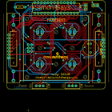

Contents
========

* [PROJ-SPAR-10547-STAN-01>Simon-Says](#proj-spar-10547-stan-01simon-says)
	* [Images](#images)
	* [OOMP Parts](#oomp-parts)
	* [Tags](#tags)
  
![][im]
# PROJ-SPAR-10547-STAN-01>Simon-Says

- ID: PROJ-SPAR-10547-STAN-01
- Hex ID: PRS10547
- Name: Simon-Says
- Description: 

## Images
  
  

|eagleImage|kicadPcb3dFront|kicadPcb3dBack|kicadPcb3d|
| :---: | :---: | :---: | :---: |
|||||

## OOMP Parts
  

|OOMP Parts|
| :---: |
|UNMATCHED-UNMATCHED-X-UNMATCHED-01, BAT1, 5.08, 31.75, 270,BAT1, AA, BATTERY-AA-KIT, SparkFun, (0.2, 1.25), R270|
|UNMATCHED-UNMATCHED-X-UNMATCHED-01, BAT2, 71.11999999999999, 31.75, 270,BAT2, AA, BATTERY-AA-KIT, SparkFun, (2.8, 1.25), R270|
|CAPE-UNMATCHED-X-NF100-01, C1, 60.959999999999994, 64.77, M270,C1, 0.1uF, CAP-PTH-SMALL-KIT, SparkFun, (2.4, 2.55), MR270|
|CAPE-UNMATCHED-X-NF100-01, C2, 69.85, 64.77, M0,C2, 0.1uF, CAP-PTH-SMALL-KIT, SparkFun, (2.75, 2.55), MR0|
|UNMATCHED-UNMATCHED-X-UNMATCHED-01, IC1, 38.099999999999994, 62.865, M180,IC1, AVR-MEGA8-P, DIL28-3-SIMON-KIT, Testing, (1.5, 2.475), MR180|
|UNMATCHED-UNMATCHED-X-UNMATCHED-01, JP1, 74.93, 25.4, M90,JP1, Serial, 1X06-NOSILK, unclepetes, (2.95, 1), MR90|
|UNMATCHED-UNMATCHED-X-UNMATCHED-01, JP2, 25.526999999999997, 39.878, M180,JP2, SJ_2S_NO_SILK, unclepetes, (1.005, 1.57), MR180|
|UNMATCHED-UNMATCHED-X-UNMATCHED-01, JP3, 17.779999999999998, 31.75, M90,JP3, AVR_SPI_PRG_6NS, 2X3-NS, SparkFun, (0.7, 1.25), MR90|
|UNMATCHED-UNMATCHED-X-UNMATCHED-01, JP4, 1.27, 24.13, M90,JP4, 1X08NOSILK, unclepetes, (0.05, 0.95), MR90|
|UNMATCHED-UNMATCHED-X-UNMATCHED-01, JP5, 25.526999999999997, 48.767999999999994, M0,JP5, SJ_2S_NO_SILK, unclepetes, (1.005, 1.92), MR0|
|UNMATCHED-UNMATCHED-X-UNMATCHED-01, JP6, 50.419, 48.894999999999996, M0,JP6, SJ_2S_NO_SILK, unclepetes, (1.985, 1.925), MR0|
|UNMATCHED-UNMATCHED-X-UNMATCHED-01, JP7, 50.419, 39.878, M180,JP7, SJ_2S_NO_SILK, unclepetes, (1.985, 1.57), MR180|
|UNMATCHED-UNMATCHED-X-UNMATCHED-01, JP8, 25.4, 14.858999999999998, M0,JP8, SJ_2S_NO_SILK, unclepetes, (1, 0.585), MR0|
|UNMATCHED-UNMATCHED-X-UNMATCHED-01, JP9, 25.526999999999997, 24.002999999999997, M180,JP9, SJ_2S_NO_SILK, unclepetes, (1.005, 0.945), MR180|
|UNMATCHED-UNMATCHED-X-UNMATCHED-01, JP10, 50.546, 14.858999999999998, M0,JP10, SJ_2S_NO_SILK, unclepetes, (1.99, 0.585), MR0|
|UNMATCHED-UNMATCHED-X-UNMATCHED-01, JP11, 50.546, 23.749, M180,JP11, SJ_2S_NO_SILK, unclepetes, (1.99, 0.935), MR180|
|UNMATCHED-UNMATCHED-X-UNMATCHED-01, P1-, 13.081, 6.873999968000001, 0,P1-, BUTTONPAD-2X2SINGLEKIT, BUTTONPAD-2X2SINGLE-KIT, SparkFun, (0.515, 0.27062992), R0|
|RESE-UNMATCHED-X-O103-01, R1, 10.16, 63.5, M180,R1, 10K, AXIAL-0.3-KIT, SparkFun, (0.4, 2.5), MR180|
|UNMATCHED-UNMATCHED-X-UNMATCHED-01, S1, 25.4, 2.54, 270,S1, Power, SWITCH-SPDT_KIT, SparkFun, (1, 0.1), R270|
|UNMATCHED-UNMATCHED-X-UNMATCHED-01, S2, 50.8, 2.54, 270,S2, SWITCH-SPDT_KIT, SparkFun, (2, 0.1), R270|
|UNMATCHED-UNMATCHED-X-UNMATCHED-01, SG1, 64.77, 31.75, M90,SG1, BUZZER, BUZZER-12MM-KIT, SparkFun, (2.55, 1.25), MR90|

## Tags

- hexID: PRS10547
- oompType: PROJ
- oompSize: SPAR
- oompColor: 10547
- oompDesc: STAN
- oompIndex: 01
- oompName: Simon-Says
- sources: All source files from https://github.com/sparkfun/Simon-Says (source licence details in srcLicense.md)
- linkBuyPage: https://www.sparkfun.com/products/10547
- oompPart: UNMATCHED-UNMATCHED-X-UNMATCHED-01, BAT1, 5.08, 31.75, 270
- oompPart: UNMATCHED-UNMATCHED-X-UNMATCHED-01, BAT2, 71.11999999999999, 31.75, 270
- oompPart: CAPE-UNMATCHED-X-NF100-01, C1, 60.959999999999994, 64.77, M270
- oompPart: CAPE-UNMATCHED-X-NF100-01, C2, 69.85, 64.77, M0
- oompPart: UNMATCHED-UNMATCHED-X-UNMATCHED-01, IC1, 38.099999999999994, 62.865, M180
- oompPart: UNMATCHED-UNMATCHED-X-UNMATCHED-01, JP1, 74.93, 25.4, M90
- oompPart: UNMATCHED-UNMATCHED-X-UNMATCHED-01, JP2, 25.526999999999997, 39.878, M180
- oompPart: UNMATCHED-UNMATCHED-X-UNMATCHED-01, JP3, 17.779999999999998, 31.75, M90
- oompPart: UNMATCHED-UNMATCHED-X-UNMATCHED-01, JP4, 1.27, 24.13, M90
- oompPart: UNMATCHED-UNMATCHED-X-UNMATCHED-01, JP5, 25.526999999999997, 48.767999999999994, M0
- oompPart: UNMATCHED-UNMATCHED-X-UNMATCHED-01, JP6, 50.419, 48.894999999999996, M0
- oompPart: UNMATCHED-UNMATCHED-X-UNMATCHED-01, JP7, 50.419, 39.878, M180
- oompPart: UNMATCHED-UNMATCHED-X-UNMATCHED-01, JP8, 25.4, 14.858999999999998, M0
- oompPart: UNMATCHED-UNMATCHED-X-UNMATCHED-01, JP9, 25.526999999999997, 24.002999999999997, M180
- oompPart: UNMATCHED-UNMATCHED-X-UNMATCHED-01, JP10, 50.546, 14.858999999999998, M0
- oompPart: UNMATCHED-UNMATCHED-X-UNMATCHED-01, JP11, 50.546, 23.749, M180
- oompPart: UNMATCHED-UNMATCHED-X-UNMATCHED-01, P1-, 13.081, 6.873999968000001, 0
- oompPart: RESE-UNMATCHED-X-O103-01, R1, 10.16, 63.5, M180
- oompPart: UNMATCHED-UNMATCHED-X-UNMATCHED-01, S1, 25.4, 2.54, 270
- oompPart: UNMATCHED-UNMATCHED-X-UNMATCHED-01, S2, 50.8, 2.54, 270
- oompPart: UNMATCHED-UNMATCHED-X-UNMATCHED-01, SG1, 64.77, 31.75, M90
- rawPart: BAT1, AA, BATTERY-AA-KIT, SparkFun, (0.2, 1.25), R270
- rawPart: BAT2, AA, BATTERY-AA-KIT, SparkFun, (2.8, 1.25), R270
- rawPart: C1, 0.1uF, CAP-PTH-SMALL-KIT, SparkFun, (2.4, 2.55), MR270
- rawPart: C2, 0.1uF, CAP-PTH-SMALL-KIT, SparkFun, (2.75, 2.55), MR0
- rawPart: IC1, AVR-MEGA8-P, DIL28-3-SIMON-KIT, Testing, (1.5, 2.475), MR180
- rawPart: JP1, Serial, 1X06-NOSILK, unclepetes, (2.95, 1), MR90
- rawPart: JP2, SJ_2S_NO_SILK, unclepetes, (1.005, 1.57), MR180
- rawPart: JP3, AVR_SPI_PRG_6NS, 2X3-NS, SparkFun, (0.7, 1.25), MR90
- rawPart: JP4, 1X08NOSILK, unclepetes, (0.05, 0.95), MR90
- rawPart: JP5, SJ_2S_NO_SILK, unclepetes, (1.005, 1.92), MR0
- rawPart: JP6, SJ_2S_NO_SILK, unclepetes, (1.985, 1.925), MR0
- rawPart: JP7, SJ_2S_NO_SILK, unclepetes, (1.985, 1.57), MR180
- rawPart: JP8, SJ_2S_NO_SILK, unclepetes, (1, 0.585), MR0
- rawPart: JP9, SJ_2S_NO_SILK, unclepetes, (1.005, 0.945), MR180
- rawPart: JP10, SJ_2S_NO_SILK, unclepetes, (1.99, 0.585), MR0
- rawPart: JP11, SJ_2S_NO_SILK, unclepetes, (1.99, 0.935), MR180
- rawPart: P1-, BUTTONPAD-2X2SINGLEKIT, BUTTONPAD-2X2SINGLE-KIT, SparkFun, (0.515, 0.27062992), R0
- rawPart: R1, 10K, AXIAL-0.3-KIT, SparkFun, (0.4, 2.5), MR180
- rawPart: S1, Power, SWITCH-SPDT_KIT, SparkFun, (1, 0.1), R270
- rawPart: S2, SWITCH-SPDT_KIT, SparkFun, (2, 0.1), R270
- rawPart: SG1, BUZZER, BUZZER-12MM-KIT, SparkFun, (2.55, 1.25), MR90

[im]: kicadPcb3d_450.png
