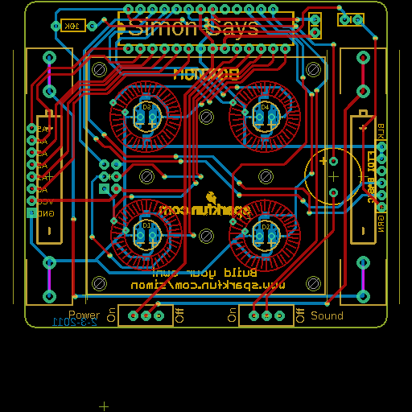
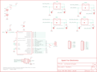

Contents
========

* [PRS10547 > Simon-Says](#prs10547--simon-says)
	* [Schematic](#schematic)
	* [PCB](#pcb)
	* [OOMP Parts](#oomp-parts)
	* [Images](#images)
	* [Tags](#tags)
  
![][im]
# PRS10547 > Simon-Says

- ID: PROJ-SPAR-10547-STAN-01
- Hex ID: PRS10547
- Name: Sparkfun
- Description: Sparkfun
- Long Link: [http://oom.lt/PROJ-SPAR-10547-STAN-01](http://oom.lt/PROJ-SPAR-10547-STAN-01)
- Short Link: [http://oom.lt/PRS10547](http://oom.lt/PRS10547)

## Schematic
  

## PCB
  

## OOMP Parts
  

|OOMP Parts|
| :---: |
|BAT1 BAT1,UNMATCHED-UNMATCHED-X-UNMATCHED-01|
|BAT2 BAT2,UNMATCHED-UNMATCHED-X-UNMATCHED-01|
|C1 C1,CAPX-UNMATCHED-X-UF1D-01|
|C2 C2,CAPX-UNMATCHED-X-UF1D-01|
|IC1 IC1,UNMATCHED-UNMATCHED-X-UNMATCHED-01|
|[JP1 HEAD-I01-X-PI06-01 2.54 mm 6 Pin Header](https://github.com/oomlout/oomlout_OOMP_parts/tree/main/HEAD-I01-X-PI06-01/)|
|JP2 JP2,UNMATCHED-UNMATCHED-X-UNMATCHED-01|
|JP3 JP3,UNMATCHED-UNMATCHED-X-UNMATCHED-01|
|[JP4 HEAD-I01-X-PI08-01 2.54 mm 8 Pin Header](https://github.com/oomlout/oomlout_OOMP_parts/tree/main/HEAD-I01-X-PI08-01/)|
|JP5 JP5,UNMATCHED-UNMATCHED-X-UNMATCHED-01|
|JP6 JP6,UNMATCHED-UNMATCHED-X-UNMATCHED-01|
|JP7 JP7,UNMATCHED-UNMATCHED-X-UNMATCHED-01|
|JP8 JP8,UNMATCHED-UNMATCHED-X-UNMATCHED-01|
|JP9 JP9,UNMATCHED-UNMATCHED-X-UNMATCHED-01|
|JP10 JP10,UNMATCHED-UNMATCHED-X-UNMATCHED-01|
|JP11 JP11,UNMATCHED-UNMATCHED-X-UNMATCHED-01|
|R1 R1,RESE-UNMATCHED-X-O103-01|
|S1 S1,UNMATCHED-UNMATCHED-X-UNMATCHED-01|
|S2 S2,UNMATCHED-UNMATCHED-X-UNMATCHED-01|
|SG1 SG1,UNMATCHED-UNMATCHED-X-UNMATCHED-01|

## Images
  
  

|kicadPcb3d|kicadPcb3dFront|kicadPcb3dBack|eagleImage|eagleSchemImage|
| :---: | :---: | :---: | :---: | :---: |
||||||

## Tags

- hexID: PRS10547
- oompType: PROJ
- oompSize: SPAR
- oompColor: 10547
- oompDesc: STAN
- oompIndex: 01
- oompName: Simon-Says
- sources: All source files from https://github.com/sparkfun/Simon-Says (source licence details in srcLicense.md)
- linkBuyPage: https://www.sparkfun.com/products/10547
- oompID: PROJ-SPAR-10547-STAN-01
- oompParts: BAT1,UNMATCHED-UNMATCHED-X-UNMATCHED-01
- oompParts: BAT2,UNMATCHED-UNMATCHED-X-UNMATCHED-01
- oompParts: C1,CAPX-UNMATCHED-X-UF1D-01
- oompParts: C2,CAPX-UNMATCHED-X-UF1D-01
- oompParts: IC1,UNMATCHED-UNMATCHED-X-UNMATCHED-01
- oompParts: JP1,HEAD-I01-X-PI06-01
- oompParts: JP2,UNMATCHED-UNMATCHED-X-UNMATCHED-01
- oompParts: JP3,UNMATCHED-UNMATCHED-X-UNMATCHED-01
- oompParts: JP4,HEAD-I01-X-PI08-01
- oompParts: JP5,UNMATCHED-UNMATCHED-X-UNMATCHED-01
- oompParts: JP6,UNMATCHED-UNMATCHED-X-UNMATCHED-01
- oompParts: JP7,UNMATCHED-UNMATCHED-X-UNMATCHED-01
- oompParts: JP8,UNMATCHED-UNMATCHED-X-UNMATCHED-01
- oompParts: JP9,UNMATCHED-UNMATCHED-X-UNMATCHED-01
- oompParts: JP10,UNMATCHED-UNMATCHED-X-UNMATCHED-01
- oompParts: JP11,UNMATCHED-UNMATCHED-X-UNMATCHED-01
- oompParts: R1,RESE-UNMATCHED-X-O103-01
- oompParts: S1,UNMATCHED-UNMATCHED-X-UNMATCHED-01
- oompParts: S2,UNMATCHED-UNMATCHED-X-UNMATCHED-01
- oompParts: SG1,UNMATCHED-UNMATCHED-X-UNMATCHED-01
- rawParts: BAT1,AA,BATTERYAA-KIT,BATTERY-AA-KIT,Battery Holders,,
- rawParts: BAT2,AA,BATTERYAA-KIT,BATTERY-AA-KIT,Battery Holders,,
- rawParts: C1,0.1uF,CAPCAP-PTH-SMALL-KIT,CAP-PTH-SMALL-KIT,Capacitor,,
- rawParts: C2,0.1uF,CAPCAP-PTH-SMALL-KIT,CAP-PTH-SMALL-KIT,Capacitor,,
- rawParts: IC1,AVR-MEGA8-P,AVR-MEGA8-PKIT,DIL28-3-SIMON-KIT,MICROCONTROLLER,,
- rawParts: JP1,Serial,M06-SFENOSILK,1X06-NOSILK,Header 6,,
- rawParts: JP2,,JUMPER-2NOSILK,SJ_2S_NO_SILK,Jumper,,
- rawParts: JP3,AVR_SPI_PRG_6NS,AVR_SPI_PRG_6NS,2X3-NS,AVR ISP 6 Pin,,
- rawParts: JP4,,M08NOSILK,1X08NOSILK,Header 8,,
- rawParts: JP5,,JUMPER-2NOSILK,SJ_2S_NO_SILK,Jumper,,
- rawParts: JP6,,JUMPER-2NOSILK,SJ_2S_NO_SILK,Jumper,,
- rawParts: JP7,,JUMPER-2NOSILK,SJ_2S_NO_SILK,Jumper,,
- rawParts: JP8,,JUMPER-2NOSILK,SJ_2S_NO_SILK,Jumper,,
- rawParts: JP9,,JUMPER-2NOSILK,SJ_2S_NO_SILK,Jumper,,
- rawParts: JP10,,JUMPER-2NOSILK,SJ_2S_NO_SILK,Jumper,,
- rawParts: JP11,,JUMPER-2NOSILK,SJ_2S_NO_SILK,Jumper,,
- rawParts: P1-,BUTTONPAD-2X2SINGLEKIT,BUTTONPAD-2X2SINGLEKIT,BUTTONPAD-2X2SINGLE-KIT,5mm Button Pad,,
- rawParts: R1,10K,RESISTORAXIAL-0.3-KIT,AXIAL-0.3-KIT,Resistor,,
- rawParts: S1,Power,SWITCH-SPSTKIT,SWITCH-SPDT_KIT,SPST Switch,,
- rawParts: S2,,SWITCH-SPSTKIT,SWITCH-SPDT_KIT,SPST Switch,,
- rawParts: SG1,BUZZER,BUZZERKIT,BUZZER-12MM-KIT,Buzzer 12mm,,
- rawParts: U$1,LOGO-SFENEW,LOGO-SFENEW,SFE-NEW-WEBLOGO,Spark Fun Electronics PCB Logo,,
- rawParts: U$2,CREATIVE_COMMONS,CREATIVE_COMMONS,CREATIVE_COMMONS,,,

[im]: kicadPcb3d_450.png
