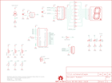

Contents
========

* [PRS10570 > DangerShield](#prs10570--dangershield)
	* [Schematic](#schematic)
	* [PCB](#pcb)
	* [Interactive BOM](#interactive-bom)
	* [OOMP Parts](#oomp-parts)
	* [Images](#images)
	* [Tags](#tags)
  
![][im]
# PRS10570 > DangerShield

- ID: PROJ-SPAR-10570-STAN-01
- Hex ID: PRS10570
- Name: Sparkfun
- Description: Sparkfun
- Long Link: [http://oom.lt/PROJ-SPAR-10570-STAN-01](http://oom.lt/PROJ-SPAR-10570-STAN-01)
- Short Link: [http://oom.lt/PRS10570](http://oom.lt/PRS10570)

## Schematic
  

## PCB
  

## Interactive BOM

- Interactive BOM page: [ibom.html](https://htmlpreview.github.io/?https://github.com/oomlout/oomlout_OOMP_projects/blob/main/PROJ-SPAR-10570-STAN-01/kicad/bom/ibom.html)

## OOMP Parts
  

|OOMP Parts|
| :---: |
|CAPX-UNMATCHED-X-UF1D-01 C1, C2|
|[HEAD-I01-X-PI05-01  2.54 mm 5 Pin Header  JP1](https://github.com/oomlout/oomlout_OOMP_parts/tree/main/HEAD-I01-X-PI05-01/)|
|LEDS-UNMATCHED-R-STAN-01 LED1|
|LEDS-UNMATCHED-Y-STAN-01 LED2, LED3|
|RESE-UNMATCHED-X-O331-01 R1, R2, R3, R9, R10, R11, R12, R13, R14, R15, R16|
|RESE-UNMATCHED-X-O105-01 R4|
|RESE-UNMATCHED-X-UNMATCHED-01 R5, R6, R7, R8|
|RESE-UNMATCHED-X-O103-01 R30|
|UNMATCHED-UNMATCHED-X-UNMATCHED-01 S1, S2, S3, S4, SG1, U1, U2, U4, U6|

## Images
  
  

|kicadPcb3d|kicadPcb3dFront|kicadPcb3dBack|eagleImage|eagleSchemImage|
| :---: | :---: | :---: | :---: | :---: |
||||||

## Tags

- hexID: PRS10570
- oompType: PROJ
- oompSize: SPAR
- oompColor: 10570
- oompDesc: STAN
- oompIndex: 01
- oompName: DangerShield
- sources: All source files from https://github.com/sparkfun/DangerShield (source licence details in srcLicense.md)
- linkBuyPage: https://www.sparkfun.com/products/10570
- oompID: PROJ-SPAR-10570-STAN-01
- oompParts: C1,CAPX-UNMATCHED-X-UF1D-01
- oompParts: C2,CAPX-UNMATCHED-X-UF1D-01
- oompParts: JP1,HEAD-I01-X-PI05-01
- oompParts: LED1,LEDS-UNMATCHED-R-STAN-01
- oompParts: LED2,LEDS-UNMATCHED-Y-STAN-01
- oompParts: LED3,LEDS-UNMATCHED-Y-STAN-01
- oompParts: R1,RESE-UNMATCHED-X-O331-01
- oompParts: R2,RESE-UNMATCHED-X-O331-01
- oompParts: R3,RESE-UNMATCHED-X-O331-01
- oompParts: R4,RESE-UNMATCHED-X-O105-01
- oompParts: R5,RESE-UNMATCHED-X-UNMATCHED-01
- oompParts: R6,RESE-UNMATCHED-X-UNMATCHED-01
- oompParts: R7,RESE-UNMATCHED-X-UNMATCHED-01
- oompParts: R8,RESE-UNMATCHED-X-UNMATCHED-01
- oompParts: R9,RESE-UNMATCHED-X-O331-01
- oompParts: R10,RESE-UNMATCHED-X-O331-01
- oompParts: R11,RESE-UNMATCHED-X-O331-01
- oompParts: R12,RESE-UNMATCHED-X-O331-01
- oompParts: R13,RESE-UNMATCHED-X-O331-01
- oompParts: R14,RESE-UNMATCHED-X-O331-01
- oompParts: R15,RESE-UNMATCHED-X-O331-01
- oompParts: R16,RESE-UNMATCHED-X-O331-01
- oompParts: R30,RESE-UNMATCHED-X-O103-01
- oompParts: S1,UNMATCHED-UNMATCHED-X-UNMATCHED-01
- oompParts: S2,UNMATCHED-UNMATCHED-X-UNMATCHED-01
- oompParts: S3,UNMATCHED-UNMATCHED-X-UNMATCHED-01
- oompParts: S4,UNMATCHED-UNMATCHED-X-UNMATCHED-01
- oompParts: SG1,UNMATCHED-UNMATCHED-X-UNMATCHED-01
- oompParts: U1,UNMATCHED-UNMATCHED-X-UNMATCHED-01
- oompParts: U2,UNMATCHED-UNMATCHED-X-UNMATCHED-01
- oompParts: U4,UNMATCHED-UNMATCHED-X-UNMATCHED-01
- oompParts: U6,UNMATCHED-UNMATCHED-X-UNMATCHED-01
- rawParts: C1,0.1uF,CAPPTH2,CAP-PTH-SMALL2,Capacitor,,
- rawParts: C2,0.1uF,CAPPTH2,CAP-PTH-SMALL2,Capacitor,,
- rawParts: JP1,,M05PTH,1X05,Header 5,,
- rawParts: JP2,LOGO-SFENEW,LOGO-SFENEW,SFE-NEW-WEBLOGO,Spark Fun Electronics PCB Logo,,
- rawParts: JP3,LOGO-SFENEW,LOGO-SFENEW,SFE-NEW-WEBLOGO,Spark Fun Electronics PCB Logo,,
- rawParts: JP5,LOGO-SFESK,LOGO-SFESK,SFE-LOGO-FLAME,Spark Fun Electronics PCB Logo,,
- rawParts: LED1,Red,LED5MM,LED5MM,LEDs,,
- rawParts: LED2,Yellow,LED5MM,LED5MM,LEDs,,
- rawParts: LED3,Yellow,LED5MM,LED5MM,LEDs,,
- rawParts: R1,330,RESISTORAXIAL-0.3,AXIAL-0.3,Resistor,,
- rawParts: R2,330,RESISTORAXIAL-0.3,AXIAL-0.3,Resistor,,
- rawParts: R3,330,RESISTORAXIAL-0.3,AXIAL-0.3,Resistor,,
- rawParts: R4,1M,RESISTORAXIAL-0.3,AXIAL-0.3,Resistor,,
- rawParts: R5,CdS,PHOTOCELLPTH,PHOTOCELL,Photocell Also known as a CdS photoresistor. This is a low cost way to detect light levels. Resistance decreases with more incoming light. SparkFun SKU: SEN-09088,,
- rawParts: R6,Slider3,SLIDER,SLIDER,,,
- rawParts: R7,Slider2,SLIDER,SLIDER,,,
- rawParts: R8,Slider1,SLIDER,SLIDER,,,
- rawParts: R9,330,RESISTORAXIAL-0.3,AXIAL-0.3,Resistor,,
- rawParts: R10,330,RESISTORAXIAL-0.3,AXIAL-0.3,Resistor,,
- rawParts: R11,330,RESISTORAXIAL-0.3,AXIAL-0.3,Resistor,,
- rawParts: R12,330,RESISTORAXIAL-0.3,AXIAL-0.3,Resistor,,
- rawParts: R13,330,RESISTORAXIAL-0.3,AXIAL-0.3,Resistor,,
- rawParts: R14,330,RESISTORAXIAL-0.3,AXIAL-0.3,Resistor,,
- rawParts: R15,330,RESISTORAXIAL-0.3,AXIAL-0.3,Resistor,,
- rawParts: R16,330,RESISTORAXIAL-0.3,AXIAL-0.3,Resistor,,
- rawParts: R30,10K,RESISTORAXIAL-0.3,AXIAL-0.3,Resistor,,
- rawParts: S1,Button1,SWITCH-MOMENTARY-212MM,TACTILE-PTH-12MM,,,
- rawParts: S2,Button2,SWITCH-MOMENTARY-212MM,TACTILE-PTH-12MM,,,
- rawParts: S3,Button3,SWITCH-MOMENTARY-212MM,TACTILE-PTH-12MM,,,
- rawParts: S4,Reset,SWITCH-MOMENTARY-2PTH,TACTILE-PTH,,,
- rawParts: SG1,BUZZER,BUZZERPTH,BUZZER-12MM,Buzzer 12mm,,
- rawParts: U$1,CREATIVE_COMMONS,CREATIVE_COMMONS,CREATIVE_COMMONS,Creative Commons License summary,,
- rawParts: U$2,OSHW-LOGOM,OSHW-LOGOM,OSHW-LOGO-M,Open Source Hardware Logo This logo indicates the piece of hardware it is found on incorporates a OSHW license and/or adheres to the definition of open source hardware found here: http://freedomdefined.org/OSHW,,
- rawParts: U1,ARDUINO_SHIELD,ARDUINO_SHIELDNO_SILK,DUEMILANOVE_VIAS,,,
- rawParts: U2,74LS595N,74LS595N,DIL16,8-bit SHIFT REGISTER, output latch,,
- rawParts: U4,TMP36,TMP36GT9,TO-92,Precision degC temp sensor, analog out,,
- rawParts: U6,7-SEGMENT-DISPLAY-1-RED,7-SEGMENT-DISPLAY-1-RED,7-SEGMENT-1PTH,7-Segment Display 1 Red (COM-08546),,

[im]: kicadPcb3d_450.png
