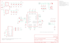

Contents
========

* [PRS10587 > Music Instrument Shield](#prs10587--music-instrument-shield)
	* [Schematic](#schematic)
	* [PCB](#pcb)
	* [Interactive BOM](#interactive-bom)
	* [OOMP Parts](#oomp-parts)
	* [Images](#images)
	* [Tags](#tags)
  
![][im]
# PRS10587 > Music Instrument Shield

- ID: PROJ-SPAR-10587-STAN-01
- Hex ID: PRS10587
- Name: Sparkfun
- Description: Sparkfun
- Long Link: [http://oom.lt/PROJ-SPAR-10587-STAN-01](http://oom.lt/PROJ-SPAR-10587-STAN-01)
- Short Link: [http://oom.lt/PRS10587](http://oom.lt/PRS10587)

## Schematic
  

## PCB
  

## Interactive BOM

- Interactive BOM page: [ibom.html](https://htmlpreview.github.io/?https://github.com/oomlout/oomlout_OOMP_projects/blob/main/PROJ-SPAR-10587-STAN-01/kicad/bom/ibom.html)

## OOMP Parts
  

|OOMP ID|Name|Identifier|
| :---: | :---: | :---: |
|[CAPT-3216-X-UF10-V10](https://github.com/oomlout/oomlout_OOMP_parts/tree/main/CAPT-3216-X-UF10-V10/)|[SMD (3216) 10 uF Capacitor (Tantalum) 10v](https://github.com/oomlout/oomlout_OOMP_parts/tree/main/CAPT-3216-X-UF10-V10/)|[C1, C6](https://github.com/oomlout/oomlout_OOMP_parts/tree/main/CAPT-3216-X-UF10-V10/)|
|[CAPC-0402-X-NF100-V10](https://github.com/oomlout/oomlout_OOMP_parts/tree/main/CAPC-0402-X-NF100-V10/)|[SMD (0402) 100 nF Capacitor (Ceramic) 10v](https://github.com/oomlout/oomlout_OOMP_parts/tree/main/CAPC-0402-X-NF100-V10/)|[C2, C5, C13, C14, C15, C16](https://github.com/oomlout/oomlout_OOMP_parts/tree/main/CAPC-0402-X-NF100-V10/)|
|[CAPC-0402-X-PF22-V50](https://github.com/oomlout/oomlout_OOMP_parts/tree/main/CAPC-0402-X-PF22-V50/)|[SMD (0402) 22 pF Capacitor (Ceramic) 50v](https://github.com/oomlout/oomlout_OOMP_parts/tree/main/CAPC-0402-X-PF22-V50/)|[C3, C8](https://github.com/oomlout/oomlout_OOMP_parts/tree/main/CAPC-0402-X-PF22-V50/)|
|CAPC-0402-X-PF470-01||C4|
|CAPC-0402-X-UNMATCHED-01||C9|
|[CAPC-0402-X-NF10-V50](https://github.com/oomlout/oomlout_OOMP_parts/tree/main/CAPC-0402-X-NF10-V50/)|[SMD (0402) 10 nF Capacitor (Ceramic) 50v](https://github.com/oomlout/oomlout_OOMP_parts/tree/main/CAPC-0402-X-NF10-V50/)|[C10, C11](https://github.com/oomlout/oomlout_OOMP_parts/tree/main/CAPC-0402-X-NF10-V50/)|
|[CAPC-0402-X-NF47-V25](https://github.com/oomlout/oomlout_OOMP_parts/tree/main/CAPC-0402-X-NF47-V25/)|[SMD (0402) 47 nF Capacitor (Ceramic) 25v](https://github.com/oomlout/oomlout_OOMP_parts/tree/main/CAPC-0402-X-NF47-V25/)|[C12](https://github.com/oomlout/oomlout_OOMP_parts/tree/main/CAPC-0402-X-NF47-V25/)|
|[HEAD-I01-X-PI03-01](https://github.com/oomlout/oomlout_OOMP_parts/tree/main/HEAD-I01-X-PI03-01/)|[2.54 mm 3 Pin Header](https://github.com/oomlout/oomlout_OOMP_parts/tree/main/HEAD-I01-X-PI03-01/)|[JP3](https://github.com/oomlout/oomlout_OOMP_parts/tree/main/HEAD-I01-X-PI03-01/)|
|[LEDS-0603-G-STAN-01](https://github.com/oomlout/oomlout_OOMP_parts/tree/main/LEDS-0603-G-STAN-01/)|[SMD (0603) Green LED](https://github.com/oomlout/oomlout_OOMP_parts/tree/main/LEDS-0603-G-STAN-01/)|[LED1](https://github.com/oomlout/oomlout_OOMP_parts/tree/main/LEDS-0603-G-STAN-01/)|
|UNMATCHED-UNMATCHED-X-UNMATCHED-01||Q1, S2, TP1, TP2, U2, U3, U4|
|[RESE-0402-X-O105-01](https://github.com/oomlout/oomlout_OOMP_parts/tree/main/RESE-0402-X-O105-01/)|[SMD (0402) 1M Ohm Resistor](https://github.com/oomlout/oomlout_OOMP_parts/tree/main/RESE-0402-X-O105-01/)|[R1](https://github.com/oomlout/oomlout_OOMP_parts/tree/main/RESE-0402-X-O105-01/)|
|RESE-0402-X-O1003-01||R2, R3, R4, R5, R10, R11, R12|
|RESE-0402-X-O200-01||R6, R7|
|[RESE-0402-X-O331-01](https://github.com/oomlout/oomlout_OOMP_parts/tree/main/RESE-0402-X-O331-01/)|[SMD (0402) 330 Ohm Resistor](https://github.com/oomlout/oomlout_OOMP_parts/tree/main/RESE-0402-X-O331-01/)|[R8](https://github.com/oomlout/oomlout_OOMP_parts/tree/main/RESE-0402-X-O331-01/)|
|[RESE-0402-X-O100-01](https://github.com/oomlout/oomlout_OOMP_parts/tree/main/RESE-0402-X-O100-01/)|[SMD (0402) 10 Ohm Resistor](https://github.com/oomlout/oomlout_OOMP_parts/tree/main/RESE-0402-X-O100-01/)|[R9](https://github.com/oomlout/oomlout_OOMP_parts/tree/main/RESE-0402-X-O100-01/)|
|[RESE-0402-X-O102-01](https://github.com/oomlout/oomlout_OOMP_parts/tree/main/RESE-0402-X-O102-01/)|[SMD (0402) 1k Ohm Resistor](https://github.com/oomlout/oomlout_OOMP_parts/tree/main/RESE-0402-X-O102-01/)|[R13, R14](https://github.com/oomlout/oomlout_OOMP_parts/tree/main/RESE-0402-X-O102-01/)|
|UNMATCHED-SO235-X-UNMATCHED-01||U1|
|TERS-35D-L-UNMATCHED-01||U5|

## Images
  
  

|bominteractivefront|bominteractiveback|kicadPcb3d|kicadPcb3dFront|kicadPcb3dBack|kicadSchem|eagleImage|eagleSchemImage|pcbdraw|pcbdrawback|
| :---: | :---: | :---: | :---: | :---: | :---: | :---: | :---: | :---: | :---: |
|||||||||||

## Tags

- hexID: PRS10587
- oompType: PROJ
- oompSize: SPAR
- oompColor: 10587
- oompDesc: STAN
- oompIndex: 01
- oompName: Music Instrument Shield
- sources: All source files from https://github.com/sparkfun/Music_Instrument_Shield (source licence details in srcLicense.md)
- linkBuyPage: https://www.sparkfun.com/products/10587
- oompID: PROJ-SPAR-10587-STAN-01
- oompParts: C1,CAPT-3216-X-UF10-V10
- oompParts: C2,CAPC-0402-X-NF100-V10
- oompParts: C3,CAPC-0402-X-PF22-V50
- oompParts: C4,CAPC-0402-X-PF470-01
- oompParts: C5,CAPC-0402-X-NF100-V10
- oompParts: C6,CAPT-3216-X-UF10-V10
- oompParts: C8,CAPC-0402-X-PF22-V50
- oompParts: C9,CAPC-0402-X-UNMATCHED-01
- oompParts: C10,CAPC-0402-X-NF10-V50
- oompParts: C11,CAPC-0402-X-NF10-V50
- oompParts: C12,CAPC-0402-X-NF47-V25
- oompParts: C13,CAPC-0402-X-NF100-V10
- oompParts: C14,CAPC-0402-X-NF100-V10
- oompParts: C15,CAPC-0402-X-NF100-V10
- oompParts: C16,CAPC-0402-X-NF100-V10
- oompParts: JP3,HEAD-I01-X-PI03-01
- oompParts: LED1,LEDS-0603-G-STAN-01
- oompParts: Q1,UNMATCHED-UNMATCHED-X-UNMATCHED-01
- oompParts: R1,RESE-0402-X-O105-01
- oompParts: R2,RESE-0402-X-O1003-01
- oompParts: R3,RESE-0402-X-O1003-01
- oompParts: R4,RESE-0402-X-O1003-01
- oompParts: R5,RESE-0402-X-O1003-01
- oompParts: R6,RESE-0402-X-O200-01
- oompParts: R7,RESE-0402-X-O200-01
- oompParts: R8,RESE-0402-X-O331-01
- oompParts: R9,RESE-0402-X-O100-01
- oompParts: R10,RESE-0402-X-O1003-01
- oompParts: R11,RESE-0402-X-O1003-01
- oompParts: R12,RESE-0402-X-O1003-01
- oompParts: R13,RESE-0402-X-O102-01
- oompParts: R14,RESE-0402-X-O102-01
- oompParts: S2,UNMATCHED-UNMATCHED-X-UNMATCHED-01
- oompParts: TP1,UNMATCHED-UNMATCHED-X-UNMATCHED-01
- oompParts: TP2,UNMATCHED-UNMATCHED-X-UNMATCHED-01
- oompParts: U1,UNMATCHED-SO235-X-UNMATCHED-01
- oompParts: U2,UNMATCHED-UNMATCHED-X-UNMATCHED-01
- oompParts: U3,UNMATCHED-UNMATCHED-X-UNMATCHED-01
- oompParts: U4,UNMATCHED-UNMATCHED-X-UNMATCHED-01
- oompParts: U5,TERS-35D-L-UNMATCHED-01
- rawParts: C1,10uF,CAP_POL1206,EIA3216,Capacitor Polarized,,
- rawParts: C2,0.1uF,CAP0402-CAP,0402-CAP,Capacitor,,
- rawParts: C3,22pF,CAP0402-CAP,0402-CAP,Capacitor,,
- rawParts: C4,470pF,CAP0402-CAP,0402-CAP,Capacitor,,
- rawParts: C5,0.1uF,CAP0402-CAP,0402-CAP,Capacitor,,
- rawParts: C6,10uF,CAP_POL1206,EIA3216,Capacitor Polarized,,
- rawParts: C8,22pF,CAP0402-CAP,0402-CAP,Capacitor,,
- rawParts: C9,1.0uF,CAP0402-CAP,0402-CAP,Capacitor,,
- rawParts: C10,10nF,CAP0402-CAP,0402-CAP,Capacitor,,
- rawParts: C11,10nF,CAP0402-CAP,0402-CAP,Capacitor,,
- rawParts: C12,47nF,CAP0402-CAP,0402-CAP,Capacitor,,
- rawParts: C13,0.1uF,CAP0402-CAP,0402-CAP,Capacitor,,
- rawParts: C14,0.1uF,CAP0402-CAP,0402-CAP,Capacitor,,
- rawParts: C15,0.1uF,CAP0402-CAP,0402-CAP,Capacitor,,
- rawParts: C16,0.1uF,CAP0402-CAP,0402-CAP,Capacitor,,
- rawParts: JP3,External Speaker,M03PTH,1X03,Header 3,,
- rawParts: LED1,Power,LED0603,LED-0603,LEDs,,
- rawParts: Q1,12.288MHz,CRYSTAL5X3,CRYSTAL-SMD-5X3,Crystals,,
- rawParts: R1,1M,RESISTOR0402-RES,0402-RES,Resistor,,
- rawParts: R2,100k,RESISTOR0402-RES,0402-RES,Resistor,,
- rawParts: R3,100k,RESISTOR0402-RES,0402-RES,Resistor,,
- rawParts: R4,100k,RESISTOR0402-RES,0402-RES,Resistor,,
- rawParts: R5,100k,RESISTOR0402-RES,0402-RES,Resistor,,
- rawParts: R6,20,RESISTOR0402-RES,0402-RES,Resistor,,
- rawParts: R7,20,RESISTOR0402-RES,0402-RES,Resistor,,
- rawParts: R8,330,RESISTOR0402-RES,0402-RES,Resistor,,
- rawParts: R9,10,RESISTOR0402-RES,0402-RES,Resistor,,
- rawParts: R10,100k,RESISTOR0402-RES,0402-RES,Resistor,,
- rawParts: R11,100k,RESISTOR0402-RES,0402-RES,Resistor,,
- rawParts: R12,100k,RESISTOR0402-RES,0402-RES,Resistor,,
- rawParts: R13,1K,RESISTOR0402-RES,0402-RES,Resistor,,
- rawParts: R14,1K,RESISTOR0402-RES,0402-RES,Resistor,,
- rawParts: S2,Reset,SWITCH-MOMENTARY-2SMD,TACTILE_SWITCH_SMD,,,
- rawParts: SJ1,NC,SOLDERJUMPERTRACE,SJ_2S-TRACE,Solder Jumper,,
- rawParts: SJ2,NC,SOLDERJUMPERTRACE,SJ_2S-TRACE,Solder Jumper,,
- rawParts: TP1,,TEST-POINT3X5,PAD.03X.05,,,
- rawParts: TP2,,TEST-POINT3X5,PAD.03X.05,,,
- rawParts: U$3,CREATIVE_COMMONS,CREATIVE_COMMONS,CREATIVE_COMMONS,,,
- rawParts: U$4,FIDUCIAL1X2,FIDUCIAL1X2,FIDUCIAL-1X2,Fiducial Alignment Points,,
- rawParts: U$5,FIDUCIAL1X2,FIDUCIAL1X2,FIDUCIAL-1X2,Fiducial Alignment Points,,
- rawParts: U$7,LOGO-SFENEW,LOGO-SFENEW,SFE-NEW-WEBLOGO,Spark Fun Electronics PCB Logo,,
- rawParts: U$8,LOGO-SFENEW,LOGO-SFENEW,SFE-NEW-WEBLOGO,Spark Fun Electronics PCB Logo,,
- rawParts: U1,3.3V,V_REG_LDOSMD,SOT23-5,Voltage Regulator LDO,,
- rawParts: U2,ARDUINO_SHIELD,ARDUINO_SHIELDLABEL,DUEMILANOVE_SHIELD,,,
- rawParts: U3,VS1053,VS1033,LQFP-48,,,
- rawParts: U4,1.8V,V_REG_LDOSMD2,SC70,Voltage Regulator LDO,,
- rawParts: U5,,AUDIO-JACKSMD2,AUDIO-JACK-3.5MM-SMD,3.5mm Audio Jack,,

[im]: kicadPcb3d_450.png
