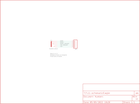

Contents
========

* [PRS10588 > Sparkfun](#prs10588--sparkfun)
	* [Schematic](#schematic)
	* [Interactive BOM](#interactive-bom)
	* [OOMP Parts](#oomp-parts)
	* [Images](#images)
	* [Tags](#tags)
  
![][im]
# PRS10588 > Sparkfun

- ID: PROJ-SPAR-10588-STAN-01
- Hex ID: PRS10588
- Name: Sparkfun
- Description: Sparkfun
- Long Link: [http://oom.lt/PROJ-SPAR-10588-STAN-01](http://oom.lt/PROJ-SPAR-10588-STAN-01)
- Short Link: [http://oom.lt/PRS10588](http://oom.lt/PRS10588)

## Schematic
  

## Interactive BOM

- Interactive BOM page: [ibom.html](https://htmlpreview.github.io/?https://github.com/oomlout/oomlout_OOMP_projects/blob/main/PROJ-SPAR-10588-STAN-01/kicad/bom/ibom.html)

## OOMP Parts
  

|OOMP Parts|
| :---: |
|JP1,HEAD-I01-X-PI05-01,JP1,,M05PTH,1X05,Header 5,,|
|U1,UNMATCHED-UNMATCHED-X-UNMATCHED-01,U$1,LOGO-SFESK,LOGO-SFESK,SFE-LOGO-FLAME,Spark Fun Electronics PCB Logo,,|

## Images
  
  

|kicadPcb3d|kicadPcb3dFront|kicadPcb3dBack|eagleImage|eagleSchemImage|
| :---: | :---: | :---: | :---: | :---: |
||||||

## Tags

- hexID: PRS10588
- oompType: PROJ
- oompSize: SPAR
- oompColor: 10588
- oompDesc: STAN
- oompIndex: 01
- oompName: Audio Jack Breakout
- sources: All source files from https://github.com/sparkfun/Audio_Jack_Breakout (source licence details in srcLicense.md)
- linkBuyPage: https://www.sparkfun.com/products/10588
- oompID: PROJ-SPAR-10588-STAN-01
- oompParts: JP1,HEAD-I01-X-PI05-01
- oompParts: U1,UNMATCHED-UNMATCHED-X-UNMATCHED-01
- rawParts: JP1,,M05PTH,1X05,Header 5,,
- rawParts: U$1,LOGO-SFESK,LOGO-SFESK,SFE-LOGO-FLAME,Spark Fun Electronics PCB Logo,,
- rawParts: U1,AUDIO-JACK,AUDIO-JACK2PTH,AUDIO-JACK,,,

[im]: kicadPcb3d_450.png
