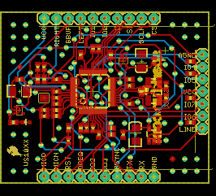
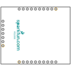
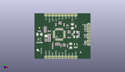
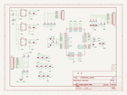
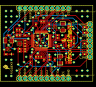
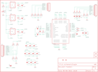
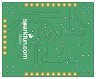

Contents
========

* [PRS10608 > MP3 Breakout-VS1033D](#prs10608--mp3-breakout-vs1033d)
	* [Schematic](#schematic)
	* [PCB](#pcb)
	* [Interactive BOM](#interactive-bom)
	* [OOMP Parts](#oomp-parts)
	* [Images](#images)
	* [Tags](#tags)
  
![][im]
# PRS10608 > MP3 Breakout-VS1033D

- ID: PROJ-SPAR-10608-STAN-01
- Hex ID: PRS10608
- Name: Sparkfun
- Description: Sparkfun
- Long Link: [http://oom.lt/PROJ-SPAR-10608-STAN-01](http://oom.lt/PROJ-SPAR-10608-STAN-01)
- Short Link: [http://oom.lt/PRS10608](http://oom.lt/PRS10608)

## Schematic
  

## PCB
  

## Interactive BOM

- Interactive BOM page: [ibom.html](https://htmlpreview.github.io/?https://github.com/oomlout/oomlout_OOMP_projects/blob/main/PROJ-SPAR-10608-STAN-01/kicad/bom/ibom.html)

## OOMP Parts
  

|OOMP ID|Name|Identifier|
| :---: | :---: | :---: |
|[CAPT-3216-X-UF10-V10](https://github.com/oomlout/oomlout_OOMP_parts/tree/main/CAPT-3216-X-UF10-V10/)|[SMD (3216) 10 uF Capacitor (Tantalum) 10v](https://github.com/oomlout/oomlout_OOMP_parts/tree/main/CAPT-3216-X-UF10-V10/)|[C1, C4, C6](https://github.com/oomlout/oomlout_OOMP_parts/tree/main/CAPT-3216-X-UF10-V10/)|
|[CAPC-0402-X-NF100-V10](https://github.com/oomlout/oomlout_OOMP_parts/tree/main/CAPC-0402-X-NF100-V10/)|[SMD (0402) 100 nF Capacitor (Ceramic) 10v](https://github.com/oomlout/oomlout_OOMP_parts/tree/main/CAPC-0402-X-NF100-V10/)|[C2, C5, C7, C9, C13, C14, C15, C16, C17, C18, C19, C20, C21, C22](https://github.com/oomlout/oomlout_OOMP_parts/tree/main/CAPC-0402-X-NF100-V10/)|
|[CAPC-0402-X-PF18-V50](https://github.com/oomlout/oomlout_OOMP_parts/tree/main/CAPC-0402-X-PF18-V50/)|[SMD (0402) 18 pF Capacitor (Ceramic) 50v](https://github.com/oomlout/oomlout_OOMP_parts/tree/main/CAPC-0402-X-PF18-V50/)|[C3, C8](https://github.com/oomlout/oomlout_OOMP_parts/tree/main/CAPC-0402-X-PF18-V50/)|
|[CAPC-0402-X-NF10-V50](https://github.com/oomlout/oomlout_OOMP_parts/tree/main/CAPC-0402-X-NF10-V50/)|[SMD (0402) 10 nF Capacitor (Ceramic) 50v](https://github.com/oomlout/oomlout_OOMP_parts/tree/main/CAPC-0402-X-NF10-V50/)|[C10, C12, C23, C24](https://github.com/oomlout/oomlout_OOMP_parts/tree/main/CAPC-0402-X-NF10-V50/)|
|[CAPC-0402-X-NF47-V25](https://github.com/oomlout/oomlout_OOMP_parts/tree/main/CAPC-0402-X-NF47-V25/)|[SMD (0402) 47 nF Capacitor (Ceramic) 25v](https://github.com/oomlout/oomlout_OOMP_parts/tree/main/CAPC-0402-X-NF47-V25/)|[C11](https://github.com/oomlout/oomlout_OOMP_parts/tree/main/CAPC-0402-X-NF47-V25/)|
|[HEAD-I01-X-PI10-01](https://github.com/oomlout/oomlout_OOMP_parts/tree/main/HEAD-I01-X-PI10-01/)|[2.54 mm 10 Pin Header](https://github.com/oomlout/oomlout_OOMP_parts/tree/main/HEAD-I01-X-PI10-01/)|[JP1, JP2](https://github.com/oomlout/oomlout_OOMP_parts/tree/main/HEAD-I01-X-PI10-01/)|
|[HEAD-I01-X-PI07-01](https://github.com/oomlout/oomlout_OOMP_parts/tree/main/HEAD-I01-X-PI07-01/)|[2.54 mm 7 Pin Header](https://github.com/oomlout/oomlout_OOMP_parts/tree/main/HEAD-I01-X-PI07-01/)|[JP3](https://github.com/oomlout/oomlout_OOMP_parts/tree/main/HEAD-I01-X-PI07-01/)|
|UNMATCHED-UNMATCHED-X-UNMATCHED-01||JP4, Q1, U$2, U$12, U2|
|[LEDS-0603-G-STAN-01](https://github.com/oomlout/oomlout_OOMP_parts/tree/main/LEDS-0603-G-STAN-01/)|[SMD (0603) Green LED](https://github.com/oomlout/oomlout_OOMP_parts/tree/main/LEDS-0603-G-STAN-01/)|[LED1](https://github.com/oomlout/oomlout_OOMP_parts/tree/main/LEDS-0603-G-STAN-01/)|
|[RESE-0402-X-O105-01](https://github.com/oomlout/oomlout_OOMP_parts/tree/main/RESE-0402-X-O105-01/)|[SMD (0402) 1M Ohm Resistor](https://github.com/oomlout/oomlout_OOMP_parts/tree/main/RESE-0402-X-O105-01/)|[R1](https://github.com/oomlout/oomlout_OOMP_parts/tree/main/RESE-0402-X-O105-01/)|
|RESE-0402-X-O1003-01||R2, R3, R4, R5, R10, R11, R14, R15, R16, R17|
|RESE-0402-X-O200-01||R6, R9|
|[RESE-0402-X-O100-01](https://github.com/oomlout/oomlout_OOMP_parts/tree/main/RESE-0402-X-O100-01/)|[SMD (0402) 10 Ohm Resistor](https://github.com/oomlout/oomlout_OOMP_parts/tree/main/RESE-0402-X-O100-01/)|[R7](https://github.com/oomlout/oomlout_OOMP_parts/tree/main/RESE-0402-X-O100-01/)|
|[RESE-0402-X-O331-01](https://github.com/oomlout/oomlout_OOMP_parts/tree/main/RESE-0402-X-O331-01/)|[SMD (0402) 330 Ohm Resistor](https://github.com/oomlout/oomlout_OOMP_parts/tree/main/RESE-0402-X-O331-01/)|[R8](https://github.com/oomlout/oomlout_OOMP_parts/tree/main/RESE-0402-X-O331-01/)|
|[RESE-0402-X-O471-01](https://github.com/oomlout/oomlout_OOMP_parts/tree/main/RESE-0402-X-O471-01/)|[SMD (0402) 470 Ohm Resistor](https://github.com/oomlout/oomlout_OOMP_parts/tree/main/RESE-0402-X-O471-01/)|[R12, R13](https://github.com/oomlout/oomlout_OOMP_parts/tree/main/RESE-0402-X-O471-01/)|
|UNMATCHED-SO235-X-UNMATCHED-01||U1|

## Images
  
  

|bominteractivefront|bominteractiveback|kicadPcb3d|kicadPcb3dFront|kicadPcb3dBack|kicadSchem|eagleImage|eagleSchemImage|pcbdraw|pcbdrawback|
| :---: | :---: | :---: | :---: | :---: | :---: | :---: | :---: | :---: | :---: |
|||||||||||

## Tags

- hexID: PRS10608
- oompType: PROJ
- oompSize: SPAR
- oompColor: 10608
- oompDesc: STAN
- oompIndex: 01
- oompName: MP3 Breakout-VS1033D
- sources: All source files from https://github.com/sparkfun/MP3_Breakout-VS1033D (source licence details in srcLicense.md)
- linkBuyPage: https://www.sparkfun.com/products/10608
- oompID: PROJ-SPAR-10608-STAN-01
- oompParts: C1,CAPT-3216-X-UF10-V10
- oompParts: C2,CAPC-0402-X-NF100-V10
- oompParts: C3,CAPC-0402-X-PF18-V50
- oompParts: C4,CAPT-3216-X-UF10-V10
- oompParts: C5,CAPC-0402-X-NF100-V10
- oompParts: C6,CAPT-3216-X-UF10-V10
- oompParts: C7,CAPC-0402-X-NF100-V10
- oompParts: C8,CAPC-0402-X-PF18-V50
- oompParts: C9,CAPC-0402-X-NF100-V10
- oompParts: C10,CAPC-0402-X-NF10-V50
- oompParts: C11,CAPC-0402-X-NF47-V25
- oompParts: C12,CAPC-0402-X-NF10-V50
- oompParts: C13,CAPC-0402-X-NF100-V10
- oompParts: C14,CAPC-0402-X-NF100-V10
- oompParts: C15,CAPC-0402-X-NF100-V10
- oompParts: C16,CAPC-0402-X-NF100-V10
- oompParts: C17,CAPC-0402-X-NF100-V10
- oompParts: C18,CAPC-0402-X-NF100-V10
- oompParts: C19,CAPC-0402-X-NF100-V10
- oompParts: C20,CAPC-0402-X-NF100-V10
- oompParts: C21,CAPC-0402-X-NF100-V10
- oompParts: C22,CAPC-0402-X-NF100-V10
- oompParts: C23,CAPC-0402-X-NF10-V50
- oompParts: C24,CAPC-0402-X-NF10-V50
- oompParts: JP1,HEAD-I01-X-PI10-01
- oompParts: JP2,HEAD-I01-X-PI10-01
- oompParts: JP3,HEAD-I01-X-PI07-01
- oompParts: JP4,UNMATCHED-UNMATCHED-X-UNMATCHED-01
- oompParts: LED1,LEDS-0603-G-STAN-01
- oompParts: Q1,UNMATCHED-UNMATCHED-X-UNMATCHED-01
- oompParts: R1,RESE-0402-X-O105-01
- oompParts: R2,RESE-0402-X-O1003-01
- oompParts: R3,RESE-0402-X-O1003-01
- oompParts: R4,RESE-0402-X-O1003-01
- oompParts: R5,RESE-0402-X-O1003-01
- oompParts: R6,RESE-0402-X-O200-01
- oompParts: R7,RESE-0402-X-O100-01
- oompParts: R8,RESE-0402-X-O331-01
- oompParts: R9,RESE-0402-X-O200-01
- oompParts: R10,RESE-0402-X-O1003-01
- oompParts: R11,RESE-0402-X-O1003-01
- oompParts: R12,RESE-0402-X-O471-01
- oompParts: R13,RESE-0402-X-O471-01
- oompParts: R14,RESE-0402-X-O1003-01
- oompParts: R15,RESE-0402-X-O1003-01
- oompParts: R16,RESE-0402-X-O1003-01
- oompParts: R17,RESE-0402-X-O1003-01
- oompParts: U$2,UNMATCHED-UNMATCHED-X-UNMATCHED-01
- oompParts: U$12,UNMATCHED-UNMATCHED-X-UNMATCHED-01
- oompParts: U1,UNMATCHED-SO235-X-UNMATCHED-01
- oompParts: U2,UNMATCHED-UNMATCHED-X-UNMATCHED-01
- rawParts: C1,10uF,CAP_POL1206,EIA3216,Capacitor Polarized,,
- rawParts: C2,0.1uF,CAP0402-CAP,0402-CAP,Capacitor,,
- rawParts: C3,18pF,CAP0402-CAP,0402-CAP,Capacitor,,
- rawParts: C4,10uF,CAP_POL1206,EIA3216,Capacitor Polarized,,
- rawParts: C5,0.1uF,CAP0402-CAP,0402-CAP,Capacitor,,
- rawParts: C6,10uF,CAP_POL1206,EIA3216,Capacitor Polarized,,
- rawParts: C7,0.1uF,CAP0402-CAP,0402-CAP,Capacitor,,
- rawParts: C8,18pF,CAP0402-CAP,0402-CAP,Capacitor,,
- rawParts: C9,0.1uF,CAP0402-CAP,0402-CAP,Capacitor,,
- rawParts: C10,10nF,CAP0402-CAP,0402-CAP,Capacitor,,
- rawParts: C11,47nF,CAP0402-CAP,0402-CAP,Capacitor,,
- rawParts: C12,10nF,CAP0402-CAP,0402-CAP,Capacitor,,
- rawParts: C13,100nF,CAP0402-CAP,0402-CAP,Capacitor,,
- rawParts: C14,100nF,CAP0402-CAP,0402-CAP,Capacitor,,
- rawParts: C15,100nF,CAP0402-CAP,0402-CAP,Capacitor,,
- rawParts: C16,100nF,CAP0402-CAP,0402-CAP,Capacitor,,
- rawParts: C17,100nF,CAP0402-CAP,0402-CAP,Capacitor,,
- rawParts: C18,100nF,CAP0402-CAP,0402-CAP,Capacitor,,
- rawParts: C19,100nF,CAP0402-CAP,0402-CAP,Capacitor,,
- rawParts: C20,100nF,CAP0402-CAP,0402-CAP,Capacitor,,
- rawParts: C21,100nF,CAP0402-CAP,0402-CAP,Capacitor,,
- rawParts: C22,100nF,CAP0402-CAP,0402-CAP,Capacitor,,
- rawParts: C23,10nF,CAP0402-CAP,0402-CAP,Capacitor,,
- rawParts: C24,10nF,CAP0402-CAP,0402-CAP,Capacitor,,
- rawParts: JP1,M10,M10,1X10,Header 10,,
- rawParts: JP2,M10,M10,1X10,Header 10,,
- rawParts: JP3,,M07,1X07,Header 7,,
- rawParts: JP4,,JUMPER-2SMD-NC,SJ_2S,Jumper,,
- rawParts: LED1,Power,LED0603,LED-0603,LEDs,,
- rawParts: Q1,12.288MHz,CRYSTAL5X3,CRYSTAL-SMD-5X3,Crystals,,
- rawParts: R1,1M,RESISTOR0402-RES,0402-RES,Resistor,,
- rawParts: R2,100k,RESISTOR0402-RES,0402-RES,Resistor,,
- rawParts: R3,100k,RESISTOR0402-RES,0402-RES,Resistor,,
- rawParts: R4,100k,RESISTOR0402-RES,0402-RES,Resistor,,
- rawParts: R5,100k,RESISTOR0402-RES,0402-RES,Resistor,,
- rawParts: R6,20,RESISTOR0402-RES,0402-RES,Resistor,,
- rawParts: R7,10,RESISTOR0402-RES,0402-RES,Resistor,,
- rawParts: R8,330,RESISTOR0402-RES,0402-RES,Resistor,,
- rawParts: R9,20,RESISTOR0402-RES,0402-RES,Resistor,,
- rawParts: R10,100k,RESISTOR0402-RES,0402-RES,Resistor,,
- rawParts: R11,100k,RESISTOR0402-RES,0402-RES,Resistor,,
- rawParts: R12,470,RESISTOR0402-RES,0402-RES,Resistor,,
- rawParts: R13,470,RESISTOR0402-RES,0402-RES,Resistor,,
- rawParts: R14,100k,RESISTOR0402-RES,0402-RES,Resistor,,
- rawParts: R15,100k,RESISTOR0402-RES,0402-RES,Resistor,,
- rawParts: R16,100k,RESISTOR0402-RES,0402-RES,Resistor,,
- rawParts: R17,100k,RESISTOR0402-RES,0402-RES,Resistor,,
- rawParts: U$2,2.8,V_REG_LDOSMD2,SC70,Voltage Regulator LDO,,
- rawParts: U$4,FIDUCIAL1X2,FIDUCIAL1X2,FIDUCIAL-1X2,Fiducial Alignment Points,,
- rawParts: U$5,FIDUCIAL1X2,FIDUCIAL1X2,FIDUCIAL-1X2,Fiducial Alignment Points,,
- rawParts: U$6,LOGO-SFESK,LOGO-SFESK,SFE-LOGO-FLAME,Spark Fun Electronics PCB Logo,,
- rawParts: U$7,LOGO-SFENEW,LOGO-SFENEW,SFE-NEW-WEBLOGO,Spark Fun Electronics PCB Logo,,
- rawParts: U$12,1.8,V_REG_LDOSMD2,SC70,Voltage Regulator LDO,,
- rawParts: U1,3.3V,V_REG_LDOSMD,SOT23-5,Voltage Regulator LDO,,
- rawParts: U2,VS1053,VS1033,LQFP-48,,,

[im]: kicadPcb3d_450.png
