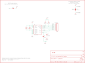

Contents
========

* [PRS10612 > Tri-Axis Gyro Breakout-L3G4200D](#prs10612--tri-axis-gyro-breakout-l3g4200d)
	* [Schematic](#schematic)
	* [PCB](#pcb)
	* [Interactive BOM](#interactive-bom)
	* [OOMP Parts](#oomp-parts)
	* [Images](#images)
	* [Tags](#tags)
  
![][im]
# PRS10612 > Tri-Axis Gyro Breakout-L3G4200D

- ID: PROJ-SPAR-10612-STAN-01
- Hex ID: PRS10612
- Name: Sparkfun
- Description: Sparkfun
- Long Link: [http://oom.lt/PROJ-SPAR-10612-STAN-01](http://oom.lt/PROJ-SPAR-10612-STAN-01)
- Short Link: [http://oom.lt/PRS10612](http://oom.lt/PRS10612)

## Schematic
  

## PCB
  

## Interactive BOM

- Interactive BOM page: [ibom.html](https://htmlpreview.github.io/?https://github.com/oomlout/oomlout_OOMP_projects/blob/main/PROJ-SPAR-10612-STAN-01/kicad/bom/ibom.html)

## OOMP Parts
  

|OOMP Parts|
| :---: |
|C1 C1,CAPC-0402-X-UF1D-01|
|C2 C2,CAPC-1206-X-UF10-01|
|C3 C3,CAPC-0402-X-NF10-01|
|C4 C4,CAPC-0402-X-NF470-01|
|[JP1 HEAD-I01-X-PI08-01 2.54 mm 8 Pin Header](https://github.com/oomlout/oomlout_OOMP_parts/tree/main/HEAD-I01-X-PI08-01/)|
|[R1 RESE-0402-X-O103-01 SMD (0402) 10k Ohm Resistor](https://github.com/oomlout/oomlout_OOMP_parts/tree/main/RESE-0402-X-O103-01/)|
|[R2 RESE-0402-X-O103-01 SMD (0402) 10k Ohm Resistor](https://github.com/oomlout/oomlout_OOMP_parts/tree/main/RESE-0402-X-O103-01/)|
|[R3 RESE-0402-X-O103-01 SMD (0402) 10k Ohm Resistor](https://github.com/oomlout/oomlout_OOMP_parts/tree/main/RESE-0402-X-O103-01/)|
|U1 U1,UNMATCHED-UNMATCHED-X-UNMATCHED-01|

## Images
  
  

|kicadPcb3d|kicadPcb3dFront|kicadPcb3dBack|eagleImage|eagleSchemImage|
| :---: | :---: | :---: | :---: | :---: |
||||||

## Tags

- hexID: PRS10612
- oompType: PROJ
- oompSize: SPAR
- oompColor: 10612
- oompDesc: STAN
- oompIndex: 01
- oompName: Tri-Axis Gyro Breakout-L3G4200D
- sources: All source files from https://github.com/sparkfun/Tri-Axis_Gyro_Breakout-L3G4200D (source licence details in srcLicense.md)
- linkBuyPage: https://www.sparkfun.com/products/10612
- oompID: PROJ-SPAR-10612-STAN-01
- oompParts: C1,CAPC-0402-X-UF1D-01
- oompParts: C2,CAPC-1206-X-UF10-01
- oompParts: C3,CAPC-0402-X-NF10-01
- oompParts: C4,CAPC-0402-X-NF470-01
- oompParts: JP1,HEAD-I01-X-PI08-01
- oompParts: R1,RESE-0402-X-O103-01
- oompParts: R2,RESE-0402-X-O103-01
- oompParts: R3,RESE-0402-X-O103-01
- oompParts: U1,UNMATCHED-UNMATCHED-X-UNMATCHED-01
- rawParts: C1,0.1uF,CAP0402-CAP,0402-CAP,Capacitor,,
- rawParts: C2,10uF,CAP1206,1206,Capacitor,,
- rawParts: C3,10nF,CAP0402-CAP,0402-CAP,Capacitor,,
- rawParts: C4,470nF,CAP0402-CAP,0402-CAP,Capacitor,,
- rawParts: JP1,OUTPUT,M08,1X08,Header 8,,
- rawParts: JP2,STAND-OFF,STAND-OFF,STAND-OFF,Stand Off,,
- rawParts: JP3,STAND-OFF,STAND-OFF,STAND-OFF,Stand Off,,
- rawParts: JP4,LOGO-SFESK,LOGO-SFESK,SFE-LOGO-FLAME,Spark Fun Electronics PCB Logo,,
- rawParts: JP5,FIDUCIAL1X2,FIDUCIAL1X2,FIDUCIAL-1X2,Fiducial Alignment Points,,
- rawParts: JP6,FIDUCIAL1X2,FIDUCIAL1X2,FIDUCIAL-1X2,Fiducial Alignment Points,,
- rawParts: R1,10k,RESISTOR0402-RES,0402-RES,Resistor,,
- rawParts: R2,10k,RESISTOR0402-RES,0402-RES,Resistor,,
- rawParts: R3,10k,RESISTOR0402-RES,0402-RES,Resistor,,
- rawParts: SJ1,I2C-Add,SOLDERJUMPER_2WAYS,SJ_3,Solder Jumper,,
- rawParts: SJ2,I2C-Mode,SOLDERJUMPERNO,SJ_2S-NO,Solder Jumper,,
- rawParts: U$1,CREATIVE_COMMONS,CREATIVE_COMMONS,CREATIVE_COMMONS,,,
- rawParts: U1,L3G4200D,L3G4200D,LGA16-4X4,L3G4200D Three-axis, digital output gyroscope,,

[im]: kicadPcb3d_450.png
