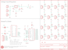

Contents
========

* [PRS10615 > PWM Shield](#prs10615--pwm-shield)
	* [Schematic](#schematic)
	* [PCB](#pcb)
	* [Interactive BOM](#interactive-bom)
	* [OOMP Parts](#oomp-parts)
	* [Images](#images)
	* [Tags](#tags)
  
![][im]
# PRS10615 > PWM Shield

- ID: PROJ-SPAR-10615-STAN-01
- Hex ID: PRS10615
- Name: Sparkfun
- Description: Sparkfun
- Long Link: [http://oom.lt/PROJ-SPAR-10615-STAN-01](http://oom.lt/PROJ-SPAR-10615-STAN-01)
- Short Link: [http://oom.lt/PRS10615](http://oom.lt/PRS10615)

## Schematic
  

## PCB
  

## Interactive BOM

- Interactive BOM page: [ibom.html](https://htmlpreview.github.io/?https://github.com/oomlout/oomlout_OOMP_projects/blob/main/PROJ-SPAR-10615-STAN-01/kicad/bom/ibom.html)

## OOMP Parts
  

|OOMP Parts|
| :---: |
|CAPX-3528-X-UF10-01 C1|
|CAPT-3216-X-UF10-01 C2|
|CAPC-0402-X-UF1D-01 C3|
|[HEAD-I01-X-PI03-01  2.54 mm 3 Pin Header  J9, JP0, JP1, JP2, JP3, JP4, JP5, JP6, JP7, JP8, JP10, JP11, JP12, JP13, JP14, JP15](https://github.com/oomlout/oomlout_OOMP_parts/tree/main/HEAD-I01-X-PI03-01/)|
|[HEAD-I01-X-PI07-01  2.54 mm 7 Pin Header  JP9](https://github.com/oomlout/oomlout_OOMP_parts/tree/main/HEAD-I01-X-PI07-01/)|
|[TERS-35D-L-PI02-01  3.5 mm 2 Pin Blue Screw Terminal  JP19](https://github.com/oomlout/oomlout_OOMP_parts/tree/main/TERS-35D-L-PI02-01/)|
|HEAD-I01-X-UNMATCHED-01 JP20|
|[HEAD-I01-X-PI02-01  2.54 mm 2 Pin Header  JP21](https://github.com/oomlout/oomlout_OOMP_parts/tree/main/HEAD-I01-X-PI02-01/)|
|[RESE-0402-X-O103-01  SMD (0402) 10k Ohm Resistor  R1](https://github.com/oomlout/oomlout_OOMP_parts/tree/main/RESE-0402-X-O103-01/)|
|RESE-UNMATCHED-X-UNMATCHED-01 R2|
|[RESE-0402-X-O222-01  SMD (0402) 2.2k Ohm Resistor  R3, R6, R7, R8, R9, R10, R11, R12, R13, R14, R15, R16, R17, R18, R19, R20, R21](https://github.com/oomlout/oomlout_OOMP_parts/tree/main/RESE-0402-X-O222-01/)|
|RESE-0402-X-O241-01 R4|
|RESE-0402-X-O711-01 R5|
|UNMATCHED-UNMATCHED-X-UNMATCHED-01 S1, U1, U2, U3|

## Images
  
  

|kicadPcb3d|kicadPcb3dFront|kicadPcb3dBack|eagleImage|eagleSchemImage|
| :---: | :---: | :---: | :---: | :---: |
||||||

## Tags

- hexID: PRS10615
- oompType: PROJ
- oompSize: SPAR
- oompColor: 10615
- oompDesc: STAN
- oompIndex: 01
- oompName: PWM Shield
- sources: All source files from https://github.com/sparkfun/PWM_Shield (source licence details in srcLicense.md)
- linkBuyPage: https://www.sparkfun.com/products/10615
- oompID: PROJ-SPAR-10615-STAN-01
- oompParts: C1,CAPX-3528-X-UF10-01
- oompParts: C2,CAPT-3216-X-UF10-01
- oompParts: C3,CAPC-0402-X-UF1D-01
- oompParts: J9,HEAD-I01-X-PI03-01
- oompParts: JP0,HEAD-I01-X-PI03-01
- oompParts: JP1,HEAD-I01-X-PI03-01
- oompParts: JP2,HEAD-I01-X-PI03-01
- oompParts: JP3,HEAD-I01-X-PI03-01
- oompParts: JP4,HEAD-I01-X-PI03-01
- oompParts: JP5,HEAD-I01-X-PI03-01
- oompParts: JP6,HEAD-I01-X-PI03-01
- oompParts: JP7,HEAD-I01-X-PI03-01
- oompParts: JP8,HEAD-I01-X-PI03-01
- oompParts: JP9,HEAD-I01-X-PI07-01
- oompParts: JP10,HEAD-I01-X-PI03-01
- oompParts: JP11,HEAD-I01-X-PI03-01
- oompParts: JP12,HEAD-I01-X-PI03-01
- oompParts: JP13,HEAD-I01-X-PI03-01
- oompParts: JP14,HEAD-I01-X-PI03-01
- oompParts: JP15,HEAD-I01-X-PI03-01
- oompParts: JP19,TERS-35D-L-PI02-01
- oompParts: JP20,HEAD-I01-X-UNMATCHED-01
- oompParts: JP21,HEAD-I01-X-PI02-01
- oompParts: R1,RESE-0402-X-O103-01
- oompParts: R2,RESE-UNMATCHED-X-UNMATCHED-01
- oompParts: R3,RESE-0402-X-O222-01
- oompParts: R4,RESE-0402-X-O241-01
- oompParts: R5,RESE-0402-X-O711-01
- oompParts: R6,RESE-0402-X-O222-01
- oompParts: R7,RESE-0402-X-O222-01
- oompParts: R8,RESE-0402-X-O222-01
- oompParts: R9,RESE-0402-X-O222-01
- oompParts: R10,RESE-0402-X-O222-01
- oompParts: R11,RESE-0402-X-O222-01
- oompParts: R12,RESE-0402-X-O222-01
- oompParts: R13,RESE-0402-X-O222-01
- oompParts: R14,RESE-0402-X-O222-01
- oompParts: R15,RESE-0402-X-O222-01
- oompParts: R16,RESE-0402-X-O222-01
- oompParts: R17,RESE-0402-X-O222-01
- oompParts: R18,RESE-0402-X-O222-01
- oompParts: R19,RESE-0402-X-O222-01
- oompParts: R20,RESE-0402-X-O222-01
- oompParts: R21,RESE-0402-X-O222-01
- oompParts: S1,UNMATCHED-UNMATCHED-X-UNMATCHED-01
- oompParts: U1,UNMATCHED-UNMATCHED-X-UNMATCHED-01
- oompParts: U2,UNMATCHED-UNMATCHED-X-UNMATCHED-01
- oompParts: U3,UNMATCHED-UNMATCHED-X-UNMATCHED-01
- rawParts: C1,10uF,CAP_POL3528,EIA3528,Capacitor Polarized,,
- rawParts: C2,10uF,CAP_POL1206,EIA3216,Capacitor Polarized,,
- rawParts: C3,0.1uF,CAP0402-CAP,0402-CAP,Capacitor,,
- rawParts: J9,OUT,M03PTH,1X03,Header 3,,
- rawParts: JP0,OUT,M03PTH,1X03,Header 3,,
- rawParts: JP1,OUT,M03PTH,1X03,Header 3,,
- rawParts: JP2,OUT,M03PTH,1X03,Header 3,,
- rawParts: JP3,OUT,M03PTH,1X03,Header 3,,
- rawParts: JP4,OUT,M03PTH,1X03,Header 3,,
- rawParts: JP5,OUT,M03PTH,1X03,Header 3,,
- rawParts: JP6,OUT,M03PTH,1X03,Header 3,,
- rawParts: JP7,OUT,M03PTH,1X03,Header 3,,
- rawParts: JP8,OUT,M03PTH,1X03,Header 3,,
- rawParts: JP9,,M07,1X07,Header 7,,
- rawParts: JP10,OUT,M03PTH,1X03,Header 3,,
- rawParts: JP11,OUT,M03PTH,1X03,Header 3,,
- rawParts: JP12,OUT,M03PTH,1X03,Header 3,,
- rawParts: JP13,OUT,M03PTH,1X03,Header 3,,
- rawParts: JP14,OUT,M03PTH,1X03,Header 3,,
- rawParts: JP15,OUT,M03PTH,1X03,Header 3,,
- rawParts: JP16,LOGO-SFENEW,LOGO-SFENEW,SFE-NEW-WEBLOGO,Spark Fun Electronics PCB Logo,,
- rawParts: JP17,LOGO-SFESK,LOGO-SFESK,SFE-LOGO-FLAME,Spark Fun Electronics PCB Logo,,
- rawParts: JP18,LOGO-SFENW2,LOGO-SFENW2,SFE-NEW-WEB,Spark Fun Electronics PCB Logo,,
- rawParts: JP19,SCREW,M023.5MM-NO_SILK,SCREWTERMINAL-3.5MM-2-NS,Header 2,,
- rawParts: JP20,JST,M02JST-PTH-2,JST-2-PTH,Header 2,,
- rawParts: JP21,PTH,M02PTH,1X02,Header 2,,
- rawParts: JP22,FIDUCIAL1X2,FIDUCIAL1X2,FIDUCIAL-1X2,Fiducial Alignment Points,,
- rawParts: JP23,FIDUCIAL1X2,FIDUCIAL1X2,FIDUCIAL-1X2,Fiducial Alignment Points,,
- rawParts: R1,10k,RESISTOR0402-RES,0402-RES,Resistor,,
- rawParts: R2,R2,RESISTORAXIAL-0.3,AXIAL-0.3,Resistor,,
- rawParts: R3,2.2k,RESISTOR0402-RES,0402-RES,Resistor,,
- rawParts: R4,240,RESISTOR0402-RES,0402-RES,Resistor,,
- rawParts: R5,715,RESISTOR0402-RES,0402-RES,Resistor,,
- rawParts: R6,2.2k,RESISTOR0402-RES,0402-RES,Resistor,,
- rawParts: R7,2.2k,RESISTOR0402-RES,0402-RES,Resistor,,
- rawParts: R8,2.2k,RESISTOR0402-RES,0402-RES,Resistor,,
- rawParts: R9,2.2k,RESISTOR0402-RES,0402-RES,Resistor,,
- rawParts: R10,2.2k,RESISTOR0402-RES,0402-RES,Resistor,,
- rawParts: R11,2.2k,RESISTOR0402-RES,0402-RES,Resistor,,
- rawParts: R12,2.2k,RESISTOR0402-RES,0402-RES,Resistor,,
- rawParts: R13,2.2k,RESISTOR0402-RES,0402-RES,Resistor,,
- rawParts: R14,2.2k,RESISTOR0402-RES,0402-RES,Resistor,,
- rawParts: R15,2.2k,RESISTOR0402-RES,0402-RES,Resistor,,
- rawParts: R16,2.2k,RESISTOR0402-RES,0402-RES,Resistor,,
- rawParts: R17,2.2k,RESISTOR0402-RES,0402-RES,Resistor,,
- rawParts: R18,2.2k,RESISTOR0402-RES,0402-RES,Resistor,,
- rawParts: R19,2.2k,RESISTOR0402-RES,0402-RES,Resistor,,
- rawParts: R20,2.2k,RESISTOR0402-RES,0402-RES,Resistor,,
- rawParts: R21,2.2k,RESISTOR0402-RES,0402-RES,Resistor,,
- rawParts: S1,DPDT,SWITCH-SPSTSMD,AYZ0202,SPST Switch,,
- rawParts: SJ1,XERR,SOLDERJUMPERNO,SJ_2S-NO,Solder Jumper,,
- rawParts: SJ2,VPRG,SOLDERJUMPER_2WAYS,SJ_3,Solder Jumper,,
- rawParts: U$1,OSHW-LOGOORB,OSHW-LOGOORB,OSHW-LOGO-GO,Open Source Hardware Logo This logo indicates the piece of hardware it is found on incorporates a OSHW license and/or adheres to the definition of open source hardware found here: http://freedomdefined.org/OSHW,,
- rawParts: U$2,CREATIVE_COMMONS,CREATIVE_COMMONS,CREATIVE_COMMONS,,,
- rawParts: U1,ARDUINO_SHIELDNOLABELS,ARDUINO_SHIELDNOLABELS,DUEMILANOVE_SHIELD_NOLABELS,,,
- rawParts: U2,V_REG_LD1085D2,V_REG_LD1085D2,D2PACK/A,LD1085 3A low-drop positive voltage regulator, adjustable,,
- rawParts: U3,TLC5940-RHB,TLC5940-RHB,QFN-32,TI TLC5940,,

[im]: kicadPcb3d_450.png
