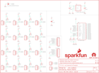

Contents
========

* [PRS10616 > Sparkfun](#prs10616--sparkfun)
	* [Schematic](#schematic)
	* [Interactive BOM](#interactive-bom)
	* [OOMP Parts](#oomp-parts)
	* [Images](#images)
	* [Tags](#tags)
  
![][im]
# PRS10616 > Sparkfun

- ID: PROJ-SPAR-10616-STAN-01
- Hex ID: PRS10616
- Name: Sparkfun
- Description: Sparkfun
- Long Link: [http://oom.lt/PROJ-SPAR-10616-STAN-01](http://oom.lt/PROJ-SPAR-10616-STAN-01)
- Short Link: [http://oom.lt/PRS10616](http://oom.lt/PRS10616)

## Schematic
  

## Interactive BOM

- Interactive BOM page: [ibom.html](https://htmlpreview.github.io/?https://github.com/oomlout/oomlout_OOMP_projects/blob/main/PROJ-SPAR-10616-STAN-01/kicad/bom/ibom.html)

## OOMP Parts
  

|OOMP Parts|
| :---: |
|C1,CAPX-UNMATCHED-X-UF10-01,C1,10uF,10UF-16V-10%(TANT),EIA3216,CAP-00811,CAP-00811,10uF,|
|C2,CAPX-UNMATCHED-X-UF10-01,C2,10uF,10UF-20V-10%(TANT),EIA3528,CAP-08063,CAP-08063,10uF,|
|C3,CAPC-0603-X-NF100-V50,C3,0.1uF,0.1UF-25V(+80/-20%)(0603),0603-CAP,CAP-00810,CAP-00810,0.1uF,|
|JP1,HEAD-I01-X-PI03-01,FRAME1,FRAME-LETTER,FRAME-LETTER,CREATIVE_COMMONS,Schematic Frame,,,|
|JP2,HEAD-I01-X-PI03-01,JP1,,M03PTH,1X03,Header 3,,,|
|JP3,HEAD-I01-X-PI03-01,JP2,,M03PTH,1X03,Header 3,,,|
|JP4,HEAD-I01-X-PI03-01,JP3,,M03PTH,1X03,Header 3,,,|
|JP5,HEAD-I01-X-PI03-01,JP4,,M03PTH,1X03,Header 3,,,|
|JP6,HEAD-I01-X-PI03-01,JP5,,M03PTH,1X03,Header 3,,,|
|JP7,HEAD-I01-X-PI03-01,JP6,,M03PTH,1X03,Header 3,,,|
|JP8,HEAD-I01-X-PI03-01,JP7,,M03PTH,1X03,Header 3,,,|
|JP9,HEAD-I01-X-PI03-01,JP8,,M03PTH,1X03,Header 3,,,|
|JP10,HEAD-I01-X-PI03-01,JP9,,M03PTH,1X03,Header 3,,,|
|JP11,HEAD-I01-X-PI03-01,JP10,,M03PTH,1X03,Header 3,,,|
|JP12,HEAD-I01-X-PI03-01,JP11,,M03PTH,1X03,Header 3,,,|
|JP13,HEAD-I01-X-PI03-01,JP12,,M03PTH,1X03,Header 3,,,|
|JP14,HEAD-I01-X-PI03-01,JP13,,M03PTH,1X03,Header 3,,,|
|JP15,HEAD-I01-X-PI03-01,JP14,,M03PTH,1X03,Header 3,,,|
|JP16,HEAD-I01-X-PI03-01,JP15,,M03PTH,1X03,Header 3,,,|
|JP19,HEAD-I01-X-PI02-01,JP16,,M03PTH,1X03,Header 3,,,|
|JP20,HEAD-I01-X-PI02-01,JP17,STAND-OFF,STAND-OFF,STAND-OFF,Stand Off,,,|
|JP22,HEAD-I01-X-PI07-01,JP18,STAND-OFF,STAND-OFF,STAND-OFF,Stand Off,,,|
|JP23,HEAD-I01-X-PI07-01,JP19,,M02PTH,1X02,Header 2,,,|
|R3,RESE-0603-X-UNMATCHED-01,JP20,,M02PTH,1X02,Header 2,,,|
|R4,RESE-0603-X-UNMATCHED-01,JP21,FIDUCIAL1X2,FIDUCIAL1X2,FIDUCIAL-1X2,Fiducial Alignment Points,,,|
|R5,RESE-0603-X-UNMATCHED-01,JP22,INPUT,M07,1X07,Header 7,,,|
|R6,RESE-0603-X-UNMATCHED-01,JP23,OUTPUT,M07,1X07,Header 7,,,|
|R7,RESE-0603-X-UNMATCHED-01,JP26,FIDUCIAL1X2,FIDUCIAL1X2,FIDUCIAL-1X2,Fiducial Alignment Points,,,|
|R8,RESE-0603-X-UNMATCHED-01,LOGO1,OSHW-LOGOS,OSHW-LOGOS,OSHW-LOGO-S,Open Source Hardware Logo This logo indicates the piece of hardware it is found on incorporates a OSHW license and/or adheres to the definition of open source hardware found here: http://freedomdefined.org/OSHW,,,|
|R9,RESE-0603-X-UNMATCHED-01,LOGO2,SFE_LOGO_NAME_FLAME.2_INCH,SFE_LOGO_NAME_FLAME.2_INCH,SFE_LOGO_NAME_FLAME_.2,SFE Logo, name and flame,,,|
|R10,RESE-0603-X-UNMATCHED-01,R3,2.2k,2.2KOHM-1/10W-1%(0603),0603-RES,RES-08272,RES-08272,2.2k,|
|R11,RESE-0603-X-UNMATCHED-01,R4,2.2k,2.2KOHM-1/10W-1%(0603),0603-RES,RES-08272,RES-08272,2.2k,|
|R12,RESE-0603-X-UNMATCHED-01,R5,2.2k,2.2KOHM-1/10W-1%(0603),0603-RES,RES-08272,RES-08272,2.2k,|
|R13,RESE-0603-X-UNMATCHED-01,R6,2.2k,2.2KOHM-1/10W-1%(0603),0603-RES,RES-08272,RES-08272,2.2k,|
|R14,RESE-0603-X-UNMATCHED-01,R7,2.2k,2.2KOHM-1/10W-1%(0603),0603-RES,RES-08272,RES-08272,2.2k,|
|R15,RESE-0603-X-UNMATCHED-01,R8,2.2k,2.2KOHM-1/10W-1%(0603),0603-RES,RES-08272,RES-08272,2.2k,|
|R16,RESE-0603-X-UNMATCHED-01,R9,2.2k,2.2KOHM-1/10W-1%(0603),0603-RES,RES-08272,RES-08272,2.2k,|
|R17,RESE-0603-X-UNMATCHED-01,R10,2.2k,2.2KOHM-1/10W-1%(0603),0603-RES,RES-08272,RES-08272,2.2k,|
|R18,RESE-0603-X-UNMATCHED-01,R11,2.2k,2.2KOHM-1/10W-1%(0603),0603-RES,RES-08272,RES-08272,2.2k,|
|R19,RESE-0603-X-UNMATCHED-01,R12,2.2k,2.2KOHM-1/10W-1%(0603),0603-RES,RES-08272,RES-08272,2.2k,|
|R20,RESE-UNMATCHED-X-UNMATCHED-01,R13,2.2k,2.2KOHM-1/10W-1%(0603),0603-RES,RES-08272,RES-08272,2.2k,|
|U2,UNMATCHED-SO235-X-UNMATCHED-01,R14,2.2k,2.2KOHM-1/10W-1%(0603),0603-RES,RES-08272,RES-08272,2.2k,|
|U3,UNMATCHED-UNMATCHED-X-UNMATCHED-01,R15,2.2k,2.2KOHM-1/10W-1%(0603),0603-RES,RES-08272,RES-08272,2.2k,|

## Images
  
  

|kicadPcb3d|kicadPcb3dFront|kicadPcb3dBack|eagleImage|eagleSchemImage|
| :---: | :---: | :---: | :---: | :---: |
||||||

## Tags

- hexID: PRS10616
- oompType: PROJ
- oompSize: SPAR
- oompColor: 10616
- oompDesc: STAN
- oompIndex: 01
- oompName: LED Driver Breakout-TLC5940
- sources: All source files from https://github.com/sparkfun/LED_Driver_Breakout-TLC5940 (source licence details in srcLicense.md)
- linkBuyPage: https://www.sparkfun.com/products/10616
- oompID: PROJ-SPAR-10616-STAN-01
- oompParts: C1,CAPX-UNMATCHED-X-UF10-01
- oompParts: C2,CAPX-UNMATCHED-X-UF10-01
- oompParts: C3,CAPC-0603-X-NF100-V50
- oompParts: JP1,HEAD-I01-X-PI03-01
- oompParts: JP2,HEAD-I01-X-PI03-01
- oompParts: JP3,HEAD-I01-X-PI03-01
- oompParts: JP4,HEAD-I01-X-PI03-01
- oompParts: JP5,HEAD-I01-X-PI03-01
- oompParts: JP6,HEAD-I01-X-PI03-01
- oompParts: JP7,HEAD-I01-X-PI03-01
- oompParts: JP8,HEAD-I01-X-PI03-01
- oompParts: JP9,HEAD-I01-X-PI03-01
- oompParts: JP10,HEAD-I01-X-PI03-01
- oompParts: JP11,HEAD-I01-X-PI03-01
- oompParts: JP12,HEAD-I01-X-PI03-01
- oompParts: JP13,HEAD-I01-X-PI03-01
- oompParts: JP14,HEAD-I01-X-PI03-01
- oompParts: JP15,HEAD-I01-X-PI03-01
- oompParts: JP16,HEAD-I01-X-PI03-01
- oompParts: JP19,HEAD-I01-X-PI02-01
- oompParts: JP20,HEAD-I01-X-PI02-01
- oompParts: JP22,HEAD-I01-X-PI07-01
- oompParts: JP23,HEAD-I01-X-PI07-01
- oompParts: R3,RESE-0603-X-UNMATCHED-01
- oompParts: R4,RESE-0603-X-UNMATCHED-01
- oompParts: R5,RESE-0603-X-UNMATCHED-01
- oompParts: R6,RESE-0603-X-UNMATCHED-01
- oompParts: R7,RESE-0603-X-UNMATCHED-01
- oompParts: R8,RESE-0603-X-UNMATCHED-01
- oompParts: R9,RESE-0603-X-UNMATCHED-01
- oompParts: R10,RESE-0603-X-UNMATCHED-01
- oompParts: R11,RESE-0603-X-UNMATCHED-01
- oompParts: R12,RESE-0603-X-UNMATCHED-01
- oompParts: R13,RESE-0603-X-UNMATCHED-01
- oompParts: R14,RESE-0603-X-UNMATCHED-01
- oompParts: R15,RESE-0603-X-UNMATCHED-01
- oompParts: R16,RESE-0603-X-UNMATCHED-01
- oompParts: R17,RESE-0603-X-UNMATCHED-01
- oompParts: R18,RESE-0603-X-UNMATCHED-01
- oompParts: R19,RESE-0603-X-UNMATCHED-01
- oompParts: R20,RESE-UNMATCHED-X-UNMATCHED-01
- oompParts: U2,UNMATCHED-SO235-X-UNMATCHED-01
- oompParts: U3,UNMATCHED-UNMATCHED-X-UNMATCHED-01
- rawParts: C1,10uF,10UF-16V-10%(TANT),EIA3216,CAP-00811,CAP-00811,10uF,
- rawParts: C2,10uF,10UF-20V-10%(TANT),EIA3528,CAP-08063,CAP-08063,10uF,
- rawParts: C3,0.1uF,0.1UF-25V(+80/-20%)(0603),0603-CAP,CAP-00810,CAP-00810,0.1uF,
- rawParts: FRAME1,FRAME-LETTER,FRAME-LETTER,CREATIVE_COMMONS,Schematic Frame,,,
- rawParts: JP1,,M03PTH,1X03,Header 3,,,
- rawParts: JP2,,M03PTH,1X03,Header 3,,,
- rawParts: JP3,,M03PTH,1X03,Header 3,,,
- rawParts: JP4,,M03PTH,1X03,Header 3,,,
- rawParts: JP5,,M03PTH,1X03,Header 3,,,
- rawParts: JP6,,M03PTH,1X03,Header 3,,,
- rawParts: JP7,,M03PTH,1X03,Header 3,,,
- rawParts: JP8,,M03PTH,1X03,Header 3,,,
- rawParts: JP9,,M03PTH,1X03,Header 3,,,
- rawParts: JP10,,M03PTH,1X03,Header 3,,,
- rawParts: JP11,,M03PTH,1X03,Header 3,,,
- rawParts: JP12,,M03PTH,1X03,Header 3,,,
- rawParts: JP13,,M03PTH,1X03,Header 3,,,
- rawParts: JP14,,M03PTH,1X03,Header 3,,,
- rawParts: JP15,,M03PTH,1X03,Header 3,,,
- rawParts: JP16,,M03PTH,1X03,Header 3,,,
- rawParts: JP17,STAND-OFF,STAND-OFF,STAND-OFF,Stand Off,,,
- rawParts: JP18,STAND-OFF,STAND-OFF,STAND-OFF,Stand Off,,,
- rawParts: JP19,,M02PTH,1X02,Header 2,,,
- rawParts: JP20,,M02PTH,1X02,Header 2,,,
- rawParts: JP21,FIDUCIAL1X2,FIDUCIAL1X2,FIDUCIAL-1X2,Fiducial Alignment Points,,,
- rawParts: JP22,INPUT,M07,1X07,Header 7,,,
- rawParts: JP23,OUTPUT,M07,1X07,Header 7,,,
- rawParts: JP26,FIDUCIAL1X2,FIDUCIAL1X2,FIDUCIAL-1X2,Fiducial Alignment Points,,,
- rawParts: LOGO1,OSHW-LOGOS,OSHW-LOGOS,OSHW-LOGO-S,Open Source Hardware Logo This logo indicates the piece of hardware it is found on incorporates a OSHW license and/or adheres to the definition of open source hardware found here: http://freedomdefined.org/OSHW,,,
- rawParts: LOGO2,SFE_LOGO_NAME_FLAME.2_INCH,SFE_LOGO_NAME_FLAME.2_INCH,SFE_LOGO_NAME_FLAME_.2,SFE Logo, name and flame,,,
- rawParts: R3,2.2k,2.2KOHM-1/10W-1%(0603),0603-RES,RES-08272,RES-08272,2.2k,
- rawParts: R4,2.2k,2.2KOHM-1/10W-1%(0603),0603-RES,RES-08272,RES-08272,2.2k,
- rawParts: R5,2.2k,2.2KOHM-1/10W-1%(0603),0603-RES,RES-08272,RES-08272,2.2k,
- rawParts: R6,2.2k,2.2KOHM-1/10W-1%(0603),0603-RES,RES-08272,RES-08272,2.2k,
- rawParts: R7,2.2k,2.2KOHM-1/10W-1%(0603),0603-RES,RES-08272,RES-08272,2.2k,
- rawParts: R8,2.2k,2.2KOHM-1/10W-1%(0603),0603-RES,RES-08272,RES-08272,2.2k,
- rawParts: R9,2.2k,2.2KOHM-1/10W-1%(0603),0603-RES,RES-08272,RES-08272,2.2k,
- rawParts: R10,2.2k,2.2KOHM-1/10W-1%(0603),0603-RES,RES-08272,RES-08272,2.2k,
- rawParts: R11,2.2k,2.2KOHM-1/10W-1%(0603),0603-RES,RES-08272,RES-08272,2.2k,
- rawParts: R12,2.2k,2.2KOHM-1/10W-1%(0603),0603-RES,RES-08272,RES-08272,2.2k,
- rawParts: R13,2.2k,2.2KOHM-1/10W-1%(0603),0603-RES,RES-08272,RES-08272,2.2k,
- rawParts: R14,2.2k,2.2KOHM-1/10W-1%(0603),0603-RES,RES-08272,RES-08272,2.2k,
- rawParts: R15,2.2k,2.2KOHM-1/10W-1%(0603),0603-RES,RES-08272,RES-08272,2.2k,
- rawParts: R16,2.2k,2.2KOHM-1/10W-1%(0603),0603-RES,RES-08272,RES-08272,2.2k,
- rawParts: R17,2.2k,2.2KOHM-1/10W-1%(0603),0603-RES,RES-08272,RES-08272,2.2k,
- rawParts: R18,2.2k,2.2KOHM-1/10W-1%(0603),0603-RES,RES-08272,RES-08272,2.2k,
- rawParts: R19,2.2k,2.2KOHM-1/10W-1%(0603),0603-RES,RES-08272,RES-08272,2.2k,
- rawParts: R20,R2,RESISTORKIT,AXIAL-0.3-KIT,Resistor,,,
- rawParts: SJ2,SOLDERJUMPERTRACE,SOLDERJUMPERTRACE,SJ_2S-TRACE,Solder Jumper,,,
- rawParts: U2,V_REG_MIC52055V,V_REG_MIC52055V,SOT23-5,V_REG MIC5219,VREG-00823,5V,
- rawParts: U3,TLC5940-RHB,TLC5940-RHB,QFN-32,16-channel LED Driver with Dot Correction and Grayscale PWM Control,IC-10398,,

[im]: kicadPcb3d_450.png
