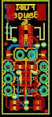

Contents
========

* [PRS10617 > Lipo Fuel Gauge](#prs10617--lipo-fuel-gauge)
	* [Schematic](#schematic)
	* [PCB](#pcb)
	* [Interactive BOM](#interactive-bom)
	* [OOMP Parts](#oomp-parts)
	* [Images](#images)
	* [Tags](#tags)
  
![][im]
# PRS10617 > Lipo Fuel Gauge

- ID: PROJ-SPAR-10617-STAN-01
- Hex ID: PRS10617
- Name: Sparkfun
- Description: Sparkfun
- Long Link: [http://oom.lt/PROJ-SPAR-10617-STAN-01](http://oom.lt/PROJ-SPAR-10617-STAN-01)
- Short Link: [http://oom.lt/PRS10617](http://oom.lt/PRS10617)

## Schematic
  

## PCB
  

## Interactive BOM

- Interactive BOM page: [ibom.html](https://htmlpreview.github.io/?https://github.com/oomlout/oomlout_OOMP_projects/blob/main/PROJ-SPAR-10617-STAN-01/kicad/bom/ibom.html)

## OOMP Parts
  

|OOMP Parts|
| :---: |
|[CAPC-0402-X-UF1-V63D  SMD (0402) 1 uF Capacitor (Ceramic) 6.3v  C1](https://github.com/oomlout/oomlout_OOMP_parts/tree/main/CAPC-0402-X-UF1-V63D/)|
|[CAPC-0402-X-NF10-V50  SMD (0402) 10 nF Capacitor (Ceramic) 50v  C2](https://github.com/oomlout/oomlout_OOMP_parts/tree/main/CAPC-0402-X-NF10-V50/)|
|HEAD-I01-X-UNMATCHED-01 JP1|
|[HEAD-I01-X-PI03-01  2.54 mm 3 Pin Header  JP2, JP4](https://github.com/oomlout/oomlout_OOMP_parts/tree/main/HEAD-I01-X-PI03-01/)|
|[HEAD-I01-X-PI02-01  2.54 mm 2 Pin Header  JP5](https://github.com/oomlout/oomlout_OOMP_parts/tree/main/HEAD-I01-X-PI02-01/)|
|[RESE-0402-X-O102-01  SMD (0402) 1k Ohm Resistor  R1](https://github.com/oomlout/oomlout_OOMP_parts/tree/main/RESE-0402-X-O102-01/)|
|[RESE-0402-X-O181-01  SMD (0402) 180 Ohm Resistor  R2](https://github.com/oomlout/oomlout_OOMP_parts/tree/main/RESE-0402-X-O181-01/)|
|[RESE-0402-X-O472-01  SMD (0402) 4.7k Ohm Resistor  R3, R4, R5, R6](https://github.com/oomlout/oomlout_OOMP_parts/tree/main/RESE-0402-X-O472-01/)|
|UNMATCHED-UNMATCHED-X-UNMATCHED-01 U2|

## Images
  
  

|kicadPcb3d|kicadPcb3dFront|kicadPcb3dBack|eagleImage|eagleSchemImage|
| :---: | :---: | :---: | :---: | :---: |
||||||

## Tags

- hexID: PRS10617
- oompType: PROJ
- oompSize: SPAR
- oompColor: 10617
- oompDesc: STAN
- oompIndex: 01
- oompName: Lipo Fuel Gauge
- sources: All source files from https://github.com/sparkfun/Lipo_Fuel_Gauge (source licence details in srcLicense.md)
- linkBuyPage: https://www.sparkfun.com/products/10617
- oompID: PROJ-SPAR-10617-STAN-01
- oompParts: C1,CAPC-0402-X-UF1-V63D
- oompParts: C2,CAPC-0402-X-NF10-V50
- oompParts: JP1,HEAD-I01-X-UNMATCHED-01
- oompParts: JP2,HEAD-I01-X-PI03-01
- oompParts: JP4,HEAD-I01-X-PI03-01
- oompParts: JP5,HEAD-I01-X-PI02-01
- oompParts: R1,RESE-0402-X-O102-01
- oompParts: R2,RESE-0402-X-O181-01
- oompParts: R3,RESE-0402-X-O472-01
- oompParts: R4,RESE-0402-X-O472-01
- oompParts: R5,RESE-0402-X-O472-01
- oompParts: R6,RESE-0402-X-O472-01
- oompParts: U2,UNMATCHED-UNMATCHED-X-UNMATCHED-01
- rawParts: C1,1uF,CAP0402-CAP,0402-CAP,Capacitor,,
- rawParts: C2,10nF,CAP0402-CAP,0402-CAP,Capacitor,,
- rawParts: JP1,input,M02-JST-2MM-SMT,JST-2-SMD,Header 2,,
- rawParts: JP2,,M03PTH,1X03,Header 3,,
- rawParts: JP3,LOGO-SFESK,LOGO-SFESK,SFE-LOGO-FLAME,Spark Fun Electronics PCB Logo,,
- rawParts: JP4,,M03PTH,1X03,Header 3,,
- rawParts: JP5,,M02PTH,1X02,Header 2,,
- rawParts: JP6,FIDUCIAL1X2.5,FIDUCIAL1X2.5,FIDUCIAL-1X2.5,Fiducial Alignment Points,,
- rawParts: JP7,FIDUCIAL1X2.5,FIDUCIAL1X2.5,FIDUCIAL-1X2.5,Fiducial Alignment Points,,
- rawParts: R1,1k,RESISTOR0402-RES,0402-RES,Resistor,,
- rawParts: R2,180,RESISTOR0402-RES,0402-RES,Resistor,,
- rawParts: R3,4.7k,RESISTOR0402-RES,0402-RES,Resistor,,
- rawParts: R4,4.7k,RESISTOR0402-RES,0402-RES,Resistor,,
- rawParts: R5,4.7k,RESISTOR0402-RES,0402-RES,Resistor,,
- rawParts: R6,4.7k,RESISTOR0402-RES,0402-RES,Resistor,,
- rawParts: U$1,OSHW-LOGOS,OSHW-LOGOS,OSHW-LOGO-S,Open Source Hardware Logo This logo indicates the piece of hardware it is found on incorporates a OSHW license and/or adheres to the definition of open source hardware found here: http://freedomdefined.org/OSHW,,
- rawParts: U2,MAX1704X,MAX1704X,TDFN-8,MAX17043/MAX17044: Battery Fuel Guage (43 is 1cell, 44 is 2cell),,

[im]: kicadPcb3d_450.png
