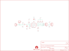

Contents
========

* [PRS10617 > Sparkfun](#prs10617--sparkfun)
	* [Schematic](#schematic)
	* [Interactive BOM](#interactive-bom)
	* [OOMP Parts](#oomp-parts)
	* [Images](#images)
	* [Tags](#tags)
  
![][im]
# PRS10617 > Sparkfun

- ID: PROJ-SPAR-10617-STAN-01
- Hex ID: PRS10617
- Name: Sparkfun
- Description: Sparkfun
- Long Link: [http://oom.lt/PROJ-SPAR-10617-STAN-01](http://oom.lt/PROJ-SPAR-10617-STAN-01)
- Short Link: [http://oom.lt/PRS10617](http://oom.lt/PRS10617)

## Schematic
  

## Interactive BOM

- Interactive BOM page: [ibom.html](https://htmlpreview.github.io/?https://github.com/oomlout/oomlout_OOMP_projects/blob/main/PROJ-SPAR-10617-STAN-01/kicad/bom/ibom.html)

## OOMP Parts
  

|OOMP Parts|
| :---: |
|C1,UNMATCHED-UNMATCHED-UNMATCHED-UNMATCHED-UNMATCHED,C1,1uF,CAP0402-CAP,0402-CAP,Capacitor,,|
|C2,UNMATCHED-UNMATCHED-UNMATCHED-UNMATCHED-UNMATCHED,C2,10nF,CAP0402-CAP,0402-CAP,Capacitor,,|
|JP1,UNMATCHED-UNMATCHED-UNMATCHED-UNMATCHED-UNMATCHED,JP1,input,M02-JST-2MM-SMT,JST-2-SMD,Header 2,,|
|JP2,UNMATCHED-UNMATCHED-UNMATCHED-UNMATCHED-UNMATCHED,JP2,,M03PTH,1X03,Header 3,,|
|JP3,UNMATCHED-UNMATCHED-UNMATCHED-UNMATCHED-UNMATCHED,JP3,LOGO-SFESK,LOGO-SFESK,SFE-LOGO-FLAME,Spark Fun Electronics PCB Logo,,|
|JP4,UNMATCHED-UNMATCHED-UNMATCHED-UNMATCHED-UNMATCHED,JP4,,M03PTH,1X03,Header 3,,|
|JP5,UNMATCHED-UNMATCHED-UNMATCHED-UNMATCHED-UNMATCHED,JP5,,M02PTH,1X02,Header 2,,|
|R1,UNMATCHED-UNMATCHED-UNMATCHED-UNMATCHED-UNMATCHED,JP6,FIDUCIAL1X2.5,FIDUCIAL1X2.5,FIDUCIAL-1X2.5,Fiducial Alignment Points,,|
|R2,UNMATCHED-UNMATCHED-UNMATCHED-UNMATCHED-UNMATCHED,JP7,FIDUCIAL1X2.5,FIDUCIAL1X2.5,FIDUCIAL-1X2.5,Fiducial Alignment Points,,|
|R3,UNMATCHED-UNMATCHED-UNMATCHED-UNMATCHED-UNMATCHED,R1,1k,RESISTOR0402-RES,0402-RES,Resistor,,|
|R4,UNMATCHED-UNMATCHED-UNMATCHED-UNMATCHED-UNMATCHED,R2,180,RESISTOR0402-RES,0402-RES,Resistor,,|
|R5,UNMATCHED-UNMATCHED-UNMATCHED-UNMATCHED-UNMATCHED,R3,4.7k,RESISTOR0402-RES,0402-RES,Resistor,,|
|R6,UNMATCHED-UNMATCHED-UNMATCHED-UNMATCHED-UNMATCHED,R4,4.7k,RESISTOR0402-RES,0402-RES,Resistor,,|
|U$1,UNMATCHED-UNMATCHED-UNMATCHED-UNMATCHED-UNMATCHED,R5,4.7k,RESISTOR0402-RES,0402-RES,Resistor,,|
|U2,UNMATCHED-UNMATCHED-UNMATCHED-UNMATCHED-UNMATCHED,R6,4.7k,RESISTOR0402-RES,0402-RES,Resistor,,|

## Images
  
  

|kicadPcb3d|kicadPcb3dFront|kicadPcb3dBack|eagleImage|eagleSchemImage|
| :---: | :---: | :---: | :---: | :---: |
||||||

## Tags

- hexID: PRS10617
- oompType: PROJ
- oompSize: SPAR
- oompColor: 10617
- oompDesc: STAN
- oompIndex: 01
- oompName: Lipo Fuel Gauge
- sources: All source files from https://github.com/sparkfun/Lipo_Fuel_Gauge (source licence details in srcLicense.md)
- linkBuyPage: https://www.sparkfun.com/products/10617
- oompID: PROJ-SPAR-10617-STAN-01
- oompParts: C1,UNMATCHED-UNMATCHED-UNMATCHED-UNMATCHED-UNMATCHED
- oompParts: C2,UNMATCHED-UNMATCHED-UNMATCHED-UNMATCHED-UNMATCHED
- oompParts: JP1,UNMATCHED-UNMATCHED-UNMATCHED-UNMATCHED-UNMATCHED
- oompParts: JP2,UNMATCHED-UNMATCHED-UNMATCHED-UNMATCHED-UNMATCHED
- oompParts: JP3,UNMATCHED-UNMATCHED-UNMATCHED-UNMATCHED-UNMATCHED
- oompParts: JP4,UNMATCHED-UNMATCHED-UNMATCHED-UNMATCHED-UNMATCHED
- oompParts: JP5,UNMATCHED-UNMATCHED-UNMATCHED-UNMATCHED-UNMATCHED
- oompParts: R1,UNMATCHED-UNMATCHED-UNMATCHED-UNMATCHED-UNMATCHED
- oompParts: R2,UNMATCHED-UNMATCHED-UNMATCHED-UNMATCHED-UNMATCHED
- oompParts: R3,UNMATCHED-UNMATCHED-UNMATCHED-UNMATCHED-UNMATCHED
- oompParts: R4,UNMATCHED-UNMATCHED-UNMATCHED-UNMATCHED-UNMATCHED
- oompParts: R5,UNMATCHED-UNMATCHED-UNMATCHED-UNMATCHED-UNMATCHED
- oompParts: R6,UNMATCHED-UNMATCHED-UNMATCHED-UNMATCHED-UNMATCHED
- oompParts: U$1,UNMATCHED-UNMATCHED-UNMATCHED-UNMATCHED-UNMATCHED
- oompParts: U2,UNMATCHED-UNMATCHED-UNMATCHED-UNMATCHED-UNMATCHED
- rawParts: C1,1uF,CAP0402-CAP,0402-CAP,Capacitor,,
- rawParts: C2,10nF,CAP0402-CAP,0402-CAP,Capacitor,,
- rawParts: JP1,input,M02-JST-2MM-SMT,JST-2-SMD,Header 2,,
- rawParts: JP2,,M03PTH,1X03,Header 3,,
- rawParts: JP3,LOGO-SFESK,LOGO-SFESK,SFE-LOGO-FLAME,Spark Fun Electronics PCB Logo,,
- rawParts: JP4,,M03PTH,1X03,Header 3,,
- rawParts: JP5,,M02PTH,1X02,Header 2,,
- rawParts: JP6,FIDUCIAL1X2.5,FIDUCIAL1X2.5,FIDUCIAL-1X2.5,Fiducial Alignment Points,,
- rawParts: JP7,FIDUCIAL1X2.5,FIDUCIAL1X2.5,FIDUCIAL-1X2.5,Fiducial Alignment Points,,
- rawParts: R1,1k,RESISTOR0402-RES,0402-RES,Resistor,,
- rawParts: R2,180,RESISTOR0402-RES,0402-RES,Resistor,,
- rawParts: R3,4.7k,RESISTOR0402-RES,0402-RES,Resistor,,
- rawParts: R4,4.7k,RESISTOR0402-RES,0402-RES,Resistor,,
- rawParts: R5,4.7k,RESISTOR0402-RES,0402-RES,Resistor,,
- rawParts: R6,4.7k,RESISTOR0402-RES,0402-RES,Resistor,,
- rawParts: U$1,OSHW-LOGOS,OSHW-LOGOS,OSHW-LOGO-S,Open Source Hardware Logo This logo indicates the piece of hardware it is found on incorporates a OSHW license and/or adheres to the definition of open source hardware found here: http://freedomdefined.org/OSHW,,
- rawParts: U2,MAX1704X,MAX1704X,TDFN-8,MAX17043/MAX17044: Battery Fuel Guage (43 is 1cell, 44 is 2cell),,

[im]: kicadPcb3d_450.png
