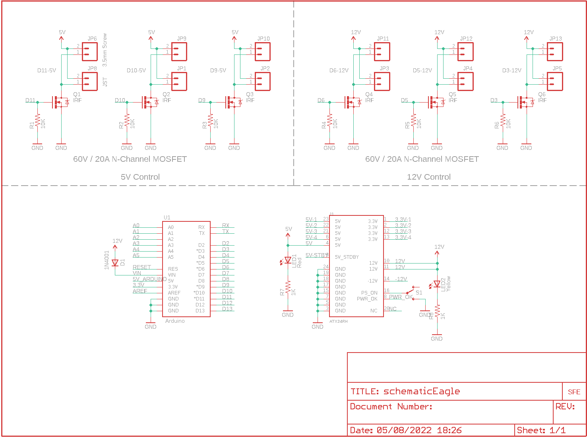
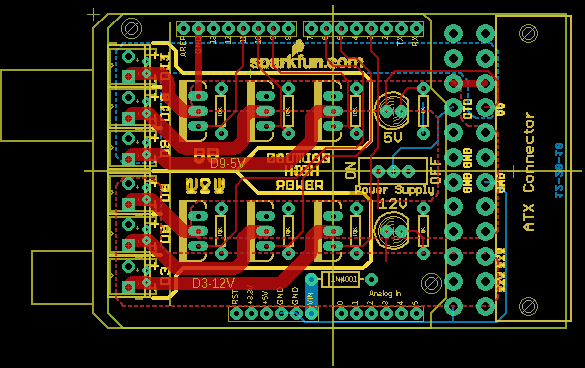

Contents
========

* [PRS10618 > Power Driver Shield Kit](#prs10618--power-driver-shield-kit)
	* [Schematic](#schematic)
	* [PCB](#pcb)
	* [OOMP Parts](#oomp-parts)
	* [Images](#images)
	* [Tags](#tags)
  
![][im]
# PRS10618 > Power Driver Shield Kit

- ID: PROJ-SPAR-10618-STAN-01
- Hex ID: PRS10618
- Name: Sparkfun
- Description: Sparkfun
- Long Link: [http://oom.lt/PROJ-SPAR-10618-STAN-01](http://oom.lt/PROJ-SPAR-10618-STAN-01)
- Short Link: [http://oom.lt/PRS10618](http://oom.lt/PRS10618)

## Schematic
  

## PCB
  

## OOMP Parts
  

|OOMP Parts|
| :---: |
|D1 D1,DIOD-UNMATCHED-X-UNMATCHED-01|
|J1 J1,UNMATCHED-UNMATCHED-X-UNMATCHED-01|
|JP1 JP1,UNMATCHED-UNMATCHED-X-UNMATCHED-01|
|JP2 JP2,UNMATCHED-UNMATCHED-X-UNMATCHED-01|
|JP3 JP3,UNMATCHED-UNMATCHED-X-UNMATCHED-01|
|JP4 JP4,UNMATCHED-UNMATCHED-X-UNMATCHED-01|
|JP5 JP5,UNMATCHED-UNMATCHED-X-UNMATCHED-01|
|[JP6 TERS-35D-L-PI02-01 3.5 mm 2 Pin Blue Screw Terminal](https://github.com/oomlout/oomlout_OOMP_parts/tree/main/TERS-35D-L-PI02-01/)|
|JP8 JP8,UNMATCHED-UNMATCHED-X-UNMATCHED-01|
|[JP9 TERS-35D-L-PI02-01 3.5 mm 2 Pin Blue Screw Terminal](https://github.com/oomlout/oomlout_OOMP_parts/tree/main/TERS-35D-L-PI02-01/)|
|[JP10 TERS-35D-L-PI02-01 3.5 mm 2 Pin Blue Screw Terminal](https://github.com/oomlout/oomlout_OOMP_parts/tree/main/TERS-35D-L-PI02-01/)|
|[JP11 TERS-35D-L-PI02-01 3.5 mm 2 Pin Blue Screw Terminal](https://github.com/oomlout/oomlout_OOMP_parts/tree/main/TERS-35D-L-PI02-01/)|
|[JP12 TERS-35D-L-PI02-01 3.5 mm 2 Pin Blue Screw Terminal](https://github.com/oomlout/oomlout_OOMP_parts/tree/main/TERS-35D-L-PI02-01/)|
|[JP13 TERS-35D-L-PI02-01 3.5 mm 2 Pin Blue Screw Terminal](https://github.com/oomlout/oomlout_OOMP_parts/tree/main/TERS-35D-L-PI02-01/)|
|LED1 LED1,LEDS-UNMATCHED-G-STAN-01|
|LED2 LED2,LEDS-UNMATCHED-G-STAN-01|
|Q1 Q1,UNMATCHED-UNMATCHED-X-UNMATCHED-01|
|Q2 Q2,UNMATCHED-UNMATCHED-X-UNMATCHED-01|
|Q3 Q3,UNMATCHED-UNMATCHED-X-UNMATCHED-01|
|Q4 Q4,UNMATCHED-UNMATCHED-X-UNMATCHED-01|
|Q5 Q5,UNMATCHED-UNMATCHED-X-UNMATCHED-01|
|Q6 Q6,UNMATCHED-UNMATCHED-X-UNMATCHED-01|
|R1 R1,RESE-UNMATCHED-X-O103-01|
|R2 R2,RESE-UNMATCHED-X-O103-01|
|R3 R3,RESE-UNMATCHED-X-O103-01|
|R4 R4,RESE-UNMATCHED-X-O103-01|
|R5 R5,RESE-UNMATCHED-X-O103-01|
|R6 R6,RESE-UNMATCHED-X-O103-01|
|R7 R7,RESE-UNMATCHED-X-O102-01|
|R8 R8,RESE-UNMATCHED-X-O102-01|
|S1 S1,UNMATCHED-UNMATCHED-X-UNMATCHED-01|
|U1 U1,UNMATCHED-UNMATCHED-X-UNMATCHED-01|

## Images
  
  

|kicadPcb3d|kicadPcb3dFront|kicadPcb3dBack|eagleImage|eagleSchemImage|
| :---: | :---: | :---: | :---: | :---: |
||||||

## Tags

- hexID: PRS10618
- oompType: PROJ
- oompSize: SPAR
- oompColor: 10618
- oompDesc: STAN
- oompIndex: 01
- oompName: Power Driver Shield Kit
- sources: All source files from https://github.com/sparkfun/Power_Driver_Shield_Kit (source licence details in srcLicense.md)
- linkBuyPage: https://www.sparkfun.com/products/10618
- oompID: PROJ-SPAR-10618-STAN-01
- oompParts: D1,DIOD-UNMATCHED-X-UNMATCHED-01
- oompParts: J1,UNMATCHED-UNMATCHED-X-UNMATCHED-01
- oompParts: JP1,UNMATCHED-UNMATCHED-X-UNMATCHED-01
- oompParts: JP2,UNMATCHED-UNMATCHED-X-UNMATCHED-01
- oompParts: JP3,UNMATCHED-UNMATCHED-X-UNMATCHED-01
- oompParts: JP4,UNMATCHED-UNMATCHED-X-UNMATCHED-01
- oompParts: JP5,UNMATCHED-UNMATCHED-X-UNMATCHED-01
- oompParts: JP6,TERS-35D-L-PI02-01
- oompParts: JP8,UNMATCHED-UNMATCHED-X-UNMATCHED-01
- oompParts: JP9,TERS-35D-L-PI02-01
- oompParts: JP10,TERS-35D-L-PI02-01
- oompParts: JP11,TERS-35D-L-PI02-01
- oompParts: JP12,TERS-35D-L-PI02-01
- oompParts: JP13,TERS-35D-L-PI02-01
- oompParts: LED1,LEDS-UNMATCHED-G-STAN-01
- oompParts: LED2,LEDS-UNMATCHED-G-STAN-01
- oompParts: Q1,UNMATCHED-UNMATCHED-X-UNMATCHED-01
- oompParts: Q2,UNMATCHED-UNMATCHED-X-UNMATCHED-01
- oompParts: Q3,UNMATCHED-UNMATCHED-X-UNMATCHED-01
- oompParts: Q4,UNMATCHED-UNMATCHED-X-UNMATCHED-01
- oompParts: Q5,UNMATCHED-UNMATCHED-X-UNMATCHED-01
- oompParts: Q6,UNMATCHED-UNMATCHED-X-UNMATCHED-01
- oompParts: R1,RESE-UNMATCHED-X-O103-01
- oompParts: R2,RESE-UNMATCHED-X-O103-01
- oompParts: R3,RESE-UNMATCHED-X-O103-01
- oompParts: R4,RESE-UNMATCHED-X-O103-01
- oompParts: R5,RESE-UNMATCHED-X-O103-01
- oompParts: R6,RESE-UNMATCHED-X-O103-01
- oompParts: R7,RESE-UNMATCHED-X-O102-01
- oompParts: R8,RESE-UNMATCHED-X-O102-01
- oompParts: S1,UNMATCHED-UNMATCHED-X-UNMATCHED-01
- oompParts: U1,UNMATCHED-UNMATCHED-X-UNMATCHED-01
- rawParts: D1,1N4001,DIODEPTH,DIODE-1N4001,Diode,,
- rawParts: J1,ATX24RH,ATX24RH,ATX24_RIGHT_ANGLE,,,
- rawParts: JP1,,M02JST-PTH-2-NS,JST-2-PTH-NOSILK,Header 2,,
- rawParts: JP2,,M02JST-PTH-2-NS,JST-2-PTH-NOSILK,Header 2,,
- rawParts: JP3,,M02JST-PTH-2-NS,JST-2-PTH-NOSILK,Header 2,,
- rawParts: JP4,,M02JST-PTH-2-NS,JST-2-PTH-NOSILK,Header 2,,
- rawParts: JP5,,M02JST-PTH-2-NS,JST-2-PTH-NOSILK,Header 2,,
- rawParts: JP6,,M023.5MM,SCREWTERMINAL-3.5MM-2,Header 2,,
- rawParts: JP7,LOGO-SFENEW,LOGO-SFENEW,SFE-NEW-WEBLOGO,Spark Fun Electronics PCB Logo,,
- rawParts: JP8,,M02JST-PTH-2-NS,JST-2-PTH-NOSILK,Header 2,,
- rawParts: JP9,,M023.5MM,SCREWTERMINAL-3.5MM-2,Header 2,,
- rawParts: JP10,,M023.5MM,SCREWTERMINAL-3.5MM-2,Header 2,,
- rawParts: JP11,,M023.5MM,SCREWTERMINAL-3.5MM-2,Header 2,,
- rawParts: JP12,,M023.5MM,SCREWTERMINAL-3.5MM-2,Header 2,,
- rawParts: JP13,,M023.5MM,SCREWTERMINAL-3.5MM-2,Header 2,,
- rawParts: LED1,Red,LED5MM,LED5MM,LEDs,,
- rawParts: LED2,Yellow,LED5MM,LED5MM,LEDs,,
- rawParts: Q1,IRF,MOSFET-NCHANNELPTH2,TO220V,,,
- rawParts: Q2,IRF,MOSFET-NCHANNELPTH2,TO220V,,,
- rawParts: Q3,IRF,MOSFET-NCHANNELPTH2,TO220V,,,
- rawParts: Q4,IRF,MOSFET-NCHANNELPTH2,TO220V,,,
- rawParts: Q5,IRF,MOSFET-NCHANNELPTH2,TO220V,,,
- rawParts: Q6,IRF,MOSFET-NCHANNELPTH2,TO220V,,,
- rawParts: R1,10K,RESISTORAXIAL-0.3,AXIAL-0.3,Resistor,,
- rawParts: R2,10K,RESISTORAXIAL-0.3,AXIAL-0.3,Resistor,,
- rawParts: R3,10K,RESISTORAXIAL-0.3,AXIAL-0.3,Resistor,,
- rawParts: R4,10K,RESISTORAXIAL-0.3,AXIAL-0.3,Resistor,,
- rawParts: R5,10K,RESISTORAXIAL-0.3,AXIAL-0.3,Resistor,,
- rawParts: R6,10K,RESISTORAXIAL-0.3,AXIAL-0.3,Resistor,,
- rawParts: R7,1K,RESISTORAXIAL-0.3,AXIAL-0.3,Resistor,,
- rawParts: R8,1K,RESISTORAXIAL-0.3,AXIAL-0.3,Resistor,,
- rawParts: S1,,SWITCH-SPSTPTH,SWITCH-SPDT,SPST Switch,,
- rawParts: U1,Arduino,ARDUINO_SHIELDLABEL,DUEMILANOVE_SHIELD,,,

[im]: kicadPcb3d_450.png
