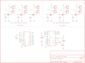

Contents
========

* [PRS10618 > Sparkfun](#prs10618--sparkfun)
	* [Schematic](#schematic)
	* [OOMP Parts](#oomp-parts)
	* [Images](#images)
	* [Tags](#tags)
  
![][im]
# PRS10618 > Sparkfun

- ID: PROJ-SPAR-10618-STAN-01
- Hex ID: PRS10618
- Name: Sparkfun
- Description: Sparkfun
- Long Link: [http://oom.lt/PROJ-SPAR-10618-STAN-01](http://oom.lt/PROJ-SPAR-10618-STAN-01)
- Long Link: [http://oom.lt/PRS10618](http://oom.lt/PRS10618)

## Schematic
  
![][schem]
## OOMP Parts
  

|OOMP Parts|
| :---: |
|D1,UNMATCHED-UNMATCHED-UNMATCHED-UNMATCHED-UNMATCHED,D1,1N4001,DIODEPTH,DIODE-1N4001,Diode,,|
|J1,UNMATCHED-UNMATCHED-UNMATCHED-UNMATCHED-UNMATCHED,J1,ATX24RH,ATX24RH,ATX24_RIGHT_ANGLE,,,|
|JP1,UNMATCHED-UNMATCHED-UNMATCHED-UNMATCHED-UNMATCHED,JP1,,M02JST-PTH-2-NS,JST-2-PTH-NOSILK,Header 2,,|
|JP2,UNMATCHED-UNMATCHED-UNMATCHED-UNMATCHED-UNMATCHED,JP2,,M02JST-PTH-2-NS,JST-2-PTH-NOSILK,Header 2,,|
|JP3,UNMATCHED-UNMATCHED-UNMATCHED-UNMATCHED-UNMATCHED,JP3,,M02JST-PTH-2-NS,JST-2-PTH-NOSILK,Header 2,,|
|JP4,UNMATCHED-UNMATCHED-UNMATCHED-UNMATCHED-UNMATCHED,JP4,,M02JST-PTH-2-NS,JST-2-PTH-NOSILK,Header 2,,|
|JP5,UNMATCHED-UNMATCHED-UNMATCHED-UNMATCHED-UNMATCHED,JP5,,M02JST-PTH-2-NS,JST-2-PTH-NOSILK,Header 2,,|
|JP6,UNMATCHED-UNMATCHED-UNMATCHED-UNMATCHED-UNMATCHED,JP6,,M023.5MM,SCREWTERMINAL-3.5MM-2,Header 2,,|
|JP7,UNMATCHED-UNMATCHED-UNMATCHED-UNMATCHED-UNMATCHED,JP7,LOGO-SFENEW,LOGO-SFENEW,SFE-NEW-WEBLOGO,Spark Fun Electronics PCB Logo,,|
|JP8,UNMATCHED-UNMATCHED-UNMATCHED-UNMATCHED-UNMATCHED,JP8,,M02JST-PTH-2-NS,JST-2-PTH-NOSILK,Header 2,,|
|JP9,UNMATCHED-UNMATCHED-UNMATCHED-UNMATCHED-UNMATCHED,JP9,,M023.5MM,SCREWTERMINAL-3.5MM-2,Header 2,,|
|JP10,UNMATCHED-UNMATCHED-UNMATCHED-UNMATCHED-UNMATCHED,JP10,,M023.5MM,SCREWTERMINAL-3.5MM-2,Header 2,,|
|JP11,UNMATCHED-UNMATCHED-UNMATCHED-UNMATCHED-UNMATCHED,JP11,,M023.5MM,SCREWTERMINAL-3.5MM-2,Header 2,,|
|JP12,UNMATCHED-UNMATCHED-UNMATCHED-UNMATCHED-UNMATCHED,JP12,,M023.5MM,SCREWTERMINAL-3.5MM-2,Header 2,,|
|JP13,UNMATCHED-UNMATCHED-UNMATCHED-UNMATCHED-UNMATCHED,JP13,,M023.5MM,SCREWTERMINAL-3.5MM-2,Header 2,,|
|LED1,UNMATCHED-UNMATCHED-UNMATCHED-UNMATCHED-UNMATCHED,LED1,Red,LED5MM,LED5MM,LEDs,,|
|LED2,UNMATCHED-UNMATCHED-UNMATCHED-UNMATCHED-UNMATCHED,LED2,Yellow,LED5MM,LED5MM,LEDs,,|
|Q1,UNMATCHED-UNMATCHED-UNMATCHED-UNMATCHED-UNMATCHED,Q1,IRF,MOSFET-NCHANNELPTH2,TO220V,,,|
|Q2,UNMATCHED-UNMATCHED-UNMATCHED-UNMATCHED-UNMATCHED,Q2,IRF,MOSFET-NCHANNELPTH2,TO220V,,,|
|Q3,UNMATCHED-UNMATCHED-UNMATCHED-UNMATCHED-UNMATCHED,Q3,IRF,MOSFET-NCHANNELPTH2,TO220V,,,|
|Q4,UNMATCHED-UNMATCHED-UNMATCHED-UNMATCHED-UNMATCHED,Q4,IRF,MOSFET-NCHANNELPTH2,TO220V,,,|
|Q5,UNMATCHED-UNMATCHED-UNMATCHED-UNMATCHED-UNMATCHED,Q5,IRF,MOSFET-NCHANNELPTH2,TO220V,,,|
|Q6,UNMATCHED-UNMATCHED-UNMATCHED-UNMATCHED-UNMATCHED,Q6,IRF,MOSFET-NCHANNELPTH2,TO220V,,,|
|R1,UNMATCHED-UNMATCHED-UNMATCHED-UNMATCHED-UNMATCHED,R1,10K,RESISTORAXIAL-0.3,AXIAL-0.3,Resistor,,|
|R2,UNMATCHED-UNMATCHED-UNMATCHED-UNMATCHED-UNMATCHED,R2,10K,RESISTORAXIAL-0.3,AXIAL-0.3,Resistor,,|
|R3,UNMATCHED-UNMATCHED-UNMATCHED-UNMATCHED-UNMATCHED,R3,10K,RESISTORAXIAL-0.3,AXIAL-0.3,Resistor,,|
|R4,UNMATCHED-UNMATCHED-UNMATCHED-UNMATCHED-UNMATCHED,R4,10K,RESISTORAXIAL-0.3,AXIAL-0.3,Resistor,,|
|R5,UNMATCHED-UNMATCHED-UNMATCHED-UNMATCHED-UNMATCHED,R5,10K,RESISTORAXIAL-0.3,AXIAL-0.3,Resistor,,|
|R6,UNMATCHED-UNMATCHED-UNMATCHED-UNMATCHED-UNMATCHED,R6,10K,RESISTORAXIAL-0.3,AXIAL-0.3,Resistor,,|
|R7,UNMATCHED-UNMATCHED-UNMATCHED-UNMATCHED-UNMATCHED,R7,1K,RESISTORAXIAL-0.3,AXIAL-0.3,Resistor,,|
|R8,UNMATCHED-UNMATCHED-UNMATCHED-UNMATCHED-UNMATCHED,R8,1K,RESISTORAXIAL-0.3,AXIAL-0.3,Resistor,,|
|S1,UNMATCHED-UNMATCHED-UNMATCHED-UNMATCHED-UNMATCHED,S1,,SWITCH-SPSTPTH,SWITCH-SPDT,SPST Switch,,|
|U1,UNMATCHED-UNMATCHED-UNMATCHED-UNMATCHED-UNMATCHED,U1,Arduino,ARDUINO_SHIELDLABEL,DUEMILANOVE_SHIELD,,,|

## Images
  
  

|kicadPcb3d|kicadPcb3dFront|kicadPcb3dBack|eagleImage|eagleSchemImage|
| :---: | :---: | :---: | :---: | :---: |
||||||

## Tags

- hexID: PRS10618
- oompType: PROJ
- oompSize: SPAR
- oompColor: 10618
- oompDesc: STAN
- oompIndex: 01
- oompName: Power Driver Shield Kit
- sources: All source files from https://github.com/sparkfun/Power_Driver_Shield_Kit (source licence details in srcLicense.md)
- linkBuyPage: https://www.sparkfun.com/products/10618
- oompID: PROJ-SPAR-10618-STAN-01
- oompParts: D1,UNMATCHED-UNMATCHED-UNMATCHED-UNMATCHED-UNMATCHED
- oompParts: J1,UNMATCHED-UNMATCHED-UNMATCHED-UNMATCHED-UNMATCHED
- oompParts: JP1,UNMATCHED-UNMATCHED-UNMATCHED-UNMATCHED-UNMATCHED
- oompParts: JP2,UNMATCHED-UNMATCHED-UNMATCHED-UNMATCHED-UNMATCHED
- oompParts: JP3,UNMATCHED-UNMATCHED-UNMATCHED-UNMATCHED-UNMATCHED
- oompParts: JP4,UNMATCHED-UNMATCHED-UNMATCHED-UNMATCHED-UNMATCHED
- oompParts: JP5,UNMATCHED-UNMATCHED-UNMATCHED-UNMATCHED-UNMATCHED
- oompParts: JP6,UNMATCHED-UNMATCHED-UNMATCHED-UNMATCHED-UNMATCHED
- oompParts: JP7,UNMATCHED-UNMATCHED-UNMATCHED-UNMATCHED-UNMATCHED
- oompParts: JP8,UNMATCHED-UNMATCHED-UNMATCHED-UNMATCHED-UNMATCHED
- oompParts: JP9,UNMATCHED-UNMATCHED-UNMATCHED-UNMATCHED-UNMATCHED
- oompParts: JP10,UNMATCHED-UNMATCHED-UNMATCHED-UNMATCHED-UNMATCHED
- oompParts: JP11,UNMATCHED-UNMATCHED-UNMATCHED-UNMATCHED-UNMATCHED
- oompParts: JP12,UNMATCHED-UNMATCHED-UNMATCHED-UNMATCHED-UNMATCHED
- oompParts: JP13,UNMATCHED-UNMATCHED-UNMATCHED-UNMATCHED-UNMATCHED
- oompParts: LED1,UNMATCHED-UNMATCHED-UNMATCHED-UNMATCHED-UNMATCHED
- oompParts: LED2,UNMATCHED-UNMATCHED-UNMATCHED-UNMATCHED-UNMATCHED
- oompParts: Q1,UNMATCHED-UNMATCHED-UNMATCHED-UNMATCHED-UNMATCHED
- oompParts: Q2,UNMATCHED-UNMATCHED-UNMATCHED-UNMATCHED-UNMATCHED
- oompParts: Q3,UNMATCHED-UNMATCHED-UNMATCHED-UNMATCHED-UNMATCHED
- oompParts: Q4,UNMATCHED-UNMATCHED-UNMATCHED-UNMATCHED-UNMATCHED
- oompParts: Q5,UNMATCHED-UNMATCHED-UNMATCHED-UNMATCHED-UNMATCHED
- oompParts: Q6,UNMATCHED-UNMATCHED-UNMATCHED-UNMATCHED-UNMATCHED
- oompParts: R1,UNMATCHED-UNMATCHED-UNMATCHED-UNMATCHED-UNMATCHED
- oompParts: R2,UNMATCHED-UNMATCHED-UNMATCHED-UNMATCHED-UNMATCHED
- oompParts: R3,UNMATCHED-UNMATCHED-UNMATCHED-UNMATCHED-UNMATCHED
- oompParts: R4,UNMATCHED-UNMATCHED-UNMATCHED-UNMATCHED-UNMATCHED
- oompParts: R5,UNMATCHED-UNMATCHED-UNMATCHED-UNMATCHED-UNMATCHED
- oompParts: R6,UNMATCHED-UNMATCHED-UNMATCHED-UNMATCHED-UNMATCHED
- oompParts: R7,UNMATCHED-UNMATCHED-UNMATCHED-UNMATCHED-UNMATCHED
- oompParts: R8,UNMATCHED-UNMATCHED-UNMATCHED-UNMATCHED-UNMATCHED
- oompParts: S1,UNMATCHED-UNMATCHED-UNMATCHED-UNMATCHED-UNMATCHED
- oompParts: U1,UNMATCHED-UNMATCHED-UNMATCHED-UNMATCHED-UNMATCHED
- rawParts: D1,1N4001,DIODEPTH,DIODE-1N4001,Diode,,
- rawParts: J1,ATX24RH,ATX24RH,ATX24_RIGHT_ANGLE,,,
- rawParts: JP1,,M02JST-PTH-2-NS,JST-2-PTH-NOSILK,Header 2,,
- rawParts: JP2,,M02JST-PTH-2-NS,JST-2-PTH-NOSILK,Header 2,,
- rawParts: JP3,,M02JST-PTH-2-NS,JST-2-PTH-NOSILK,Header 2,,
- rawParts: JP4,,M02JST-PTH-2-NS,JST-2-PTH-NOSILK,Header 2,,
- rawParts: JP5,,M02JST-PTH-2-NS,JST-2-PTH-NOSILK,Header 2,,
- rawParts: JP6,,M023.5MM,SCREWTERMINAL-3.5MM-2,Header 2,,
- rawParts: JP7,LOGO-SFENEW,LOGO-SFENEW,SFE-NEW-WEBLOGO,Spark Fun Electronics PCB Logo,,
- rawParts: JP8,,M02JST-PTH-2-NS,JST-2-PTH-NOSILK,Header 2,,
- rawParts: JP9,,M023.5MM,SCREWTERMINAL-3.5MM-2,Header 2,,
- rawParts: JP10,,M023.5MM,SCREWTERMINAL-3.5MM-2,Header 2,,
- rawParts: JP11,,M023.5MM,SCREWTERMINAL-3.5MM-2,Header 2,,
- rawParts: JP12,,M023.5MM,SCREWTERMINAL-3.5MM-2,Header 2,,
- rawParts: JP13,,M023.5MM,SCREWTERMINAL-3.5MM-2,Header 2,,
- rawParts: LED1,Red,LED5MM,LED5MM,LEDs,,
- rawParts: LED2,Yellow,LED5MM,LED5MM,LEDs,,
- rawParts: Q1,IRF,MOSFET-NCHANNELPTH2,TO220V,,,
- rawParts: Q2,IRF,MOSFET-NCHANNELPTH2,TO220V,,,
- rawParts: Q3,IRF,MOSFET-NCHANNELPTH2,TO220V,,,
- rawParts: Q4,IRF,MOSFET-NCHANNELPTH2,TO220V,,,
- rawParts: Q5,IRF,MOSFET-NCHANNELPTH2,TO220V,,,
- rawParts: Q6,IRF,MOSFET-NCHANNELPTH2,TO220V,,,
- rawParts: R1,10K,RESISTORAXIAL-0.3,AXIAL-0.3,Resistor,,
- rawParts: R2,10K,RESISTORAXIAL-0.3,AXIAL-0.3,Resistor,,
- rawParts: R3,10K,RESISTORAXIAL-0.3,AXIAL-0.3,Resistor,,
- rawParts: R4,10K,RESISTORAXIAL-0.3,AXIAL-0.3,Resistor,,
- rawParts: R5,10K,RESISTORAXIAL-0.3,AXIAL-0.3,Resistor,,
- rawParts: R6,10K,RESISTORAXIAL-0.3,AXIAL-0.3,Resistor,,
- rawParts: R7,1K,RESISTORAXIAL-0.3,AXIAL-0.3,Resistor,,
- rawParts: R8,1K,RESISTORAXIAL-0.3,AXIAL-0.3,Resistor,,
- rawParts: S1,,SWITCH-SPSTPTH,SWITCH-SPDT,SPST Switch,,
- rawParts: U1,Arduino,ARDUINO_SHIELDLABEL,DUEMILANOVE_SHIELD,,,

[im]: kicadPcb3d_450.png
[schem]: eagleSchemImage.png
