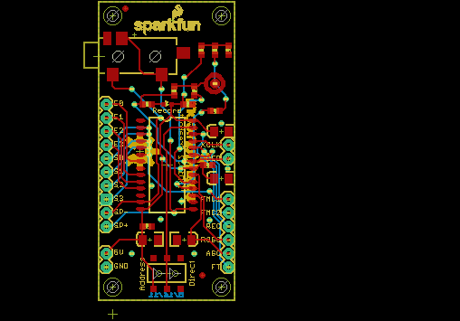
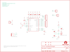

Contents
========

* [PRS10653 > Voice Recorder Breakout-ISD1932](#prs10653--voice-recorder-breakout-isd1932)
	* [Schematic](#schematic)
	* [PCB](#pcb)
	* [Interactive BOM](#interactive-bom)
	* [OOMP Parts](#oomp-parts)
	* [Images](#images)
	* [Tags](#tags)
  
![][im]
# PRS10653 > Voice Recorder Breakout-ISD1932

- ID: PROJ-SPAR-10653-STAN-01
- Hex ID: PRS10653
- Name: Sparkfun
- Description: Sparkfun
- Long Link: [http://oom.lt/PROJ-SPAR-10653-STAN-01](http://oom.lt/PROJ-SPAR-10653-STAN-01)
- Short Link: [http://oom.lt/PRS10653](http://oom.lt/PRS10653)

## Schematic
  

## PCB
  

## Interactive BOM

- Interactive BOM page: [ibom.html](https://htmlpreview.github.io/?https://github.com/oomlout/oomlout_OOMP_projects/blob/main/PROJ-SPAR-10653-STAN-01/kicad/bom/ibom.html)

## OOMP Parts
  

|OOMP Parts|
| :---: |
|C1 C1,CAPC-0603-X-UF1D-01|
|C2 C2,CAPC-0603-X-UF1D-01|
|C3 C3,CAPC-0603-X-UF1D-01|
|C4 C4,CAPX-UNMATCHED-X-UF10-01|
|C5 C5,CAPX-UNMATCHED-X-UF10-01|
|C6 C6,CAPX-UNMATCHED-X-UF10-01|
|C7 C7,CAPX-UNMATCHED-X-UF10-01|
|C8 C8,CAPC-0603-X-UF1D-01|
|C9 C9,CAPC-0603-X-UF1D-01|
|C10 C10,CAPC-0603-X-UF47D-01|
|[JP4 HEAD-I01-X-PI02-01 2.54 mm 2 Pin Header](https://github.com/oomlout/oomlout_OOMP_parts/tree/main/HEAD-I01-X-PI02-01/)|
|[JP5 HEAD-I01-X-PI02-01 2.54 mm 2 Pin Header](https://github.com/oomlout/oomlout_OOMP_parts/tree/main/HEAD-I01-X-PI02-01/)|
|[JP7 HEAD-I01-X-PI08-01 2.54 mm 8 Pin Header](https://github.com/oomlout/oomlout_OOMP_parts/tree/main/HEAD-I01-X-PI08-01/)|
|[JP8 HEAD-I01-X-PI02-01 2.54 mm 2 Pin Header](https://github.com/oomlout/oomlout_OOMP_parts/tree/main/HEAD-I01-X-PI02-01/)|
|[JP9 HEAD-I01-X-PI06-01 2.54 mm 6 Pin Header](https://github.com/oomlout/oomlout_OOMP_parts/tree/main/HEAD-I01-X-PI06-01/)|
|[LED1 LEDS-0603-G-STAN-01 SMD (0603) Green LED](https://github.com/oomlout/oomlout_OOMP_parts/tree/main/LEDS-0603-G-STAN-01/)|
|[R1 RESE-0603-X-O102-01 SMD (0603) 1k Ohm Resistor](https://github.com/oomlout/oomlout_OOMP_parts/tree/main/RESE-0603-X-O102-01/)|
|[R2 RESE-0603-X-O472-01 SMD (0603) 4.7k Ohm Resistor](https://github.com/oomlout/oomlout_OOMP_parts/tree/main/RESE-0603-X-O472-01/)|
|[R3 RESE-0603-X-O472-01 SMD (0603) 4.7k Ohm Resistor](https://github.com/oomlout/oomlout_OOMP_parts/tree/main/RESE-0603-X-O472-01/)|
|[R4 RESE-0603-X-O472-01 SMD (0603) 4.7k Ohm Resistor](https://github.com/oomlout/oomlout_OOMP_parts/tree/main/RESE-0603-X-O472-01/)|
|S1 S1,UNMATCHED-UNMATCHED-X-UNMATCHED-01|
|U1 U1,UNMATCHED-UNMATCHED-X-UNMATCHED-01|
|U2 U2,UNMATCHED-UNMATCHED-X-UNMATCHED-01|
|U3 U3,UNMATCHED-UNMATCHED-X-UNMATCHED-01|

## Images
  
  

|kicadPcb3d|kicadPcb3dFront|kicadPcb3dBack|eagleImage|eagleSchemImage|
| :---: | :---: | :---: | :---: | :---: |
||||||

## Tags

- hexID: PRS10653
- oompType: PROJ
- oompSize: SPAR
- oompColor: 10653
- oompDesc: STAN
- oompIndex: 01
- oompName: Voice Recorder Breakout-ISD1932
- sources: All source files from https://github.com/sparkfun/Voice_Recorder_Breakout-ISD1932 (source licence details in srcLicense.md)
- linkBuyPage: https://www.sparkfun.com/products/10653
- oompID: PROJ-SPAR-10653-STAN-01
- oompParts: C1,CAPC-0603-X-UF1D-01
- oompParts: C2,CAPC-0603-X-UF1D-01
- oompParts: C3,CAPC-0603-X-UF1D-01
- oompParts: C4,CAPX-UNMATCHED-X-UF10-01
- oompParts: C5,CAPX-UNMATCHED-X-UF10-01
- oompParts: C6,CAPX-UNMATCHED-X-UF10-01
- oompParts: C7,CAPX-UNMATCHED-X-UF10-01
- oompParts: C8,CAPC-0603-X-UF1D-01
- oompParts: C9,CAPC-0603-X-UF1D-01
- oompParts: C10,CAPC-0603-X-UF47D-01
- oompParts: JP4,HEAD-I01-X-PI02-01
- oompParts: JP5,HEAD-I01-X-PI02-01
- oompParts: JP7,HEAD-I01-X-PI08-01
- oompParts: JP8,HEAD-I01-X-PI02-01
- oompParts: JP9,HEAD-I01-X-PI06-01
- oompParts: LED1,LEDS-0603-G-STAN-01
- oompParts: R1,RESE-0603-X-O102-01
- oompParts: R2,RESE-0603-X-O472-01
- oompParts: R3,RESE-0603-X-O472-01
- oompParts: R4,RESE-0603-X-O472-01
- oompParts: S1,UNMATCHED-UNMATCHED-X-UNMATCHED-01
- oompParts: U1,UNMATCHED-UNMATCHED-X-UNMATCHED-01
- oompParts: U2,UNMATCHED-UNMATCHED-X-UNMATCHED-01
- oompParts: U3,UNMATCHED-UNMATCHED-X-UNMATCHED-01
- rawParts: C1,0.1uF,CAP0603-CAP,0603-CAP,Capacitor,,
- rawParts: C2,0.1uF,CAP0603-CAP,0603-CAP,Capacitor,,
- rawParts: C3,0.1uF,CAP0603-CAP,0603-CAP,Capacitor,,
- rawParts: C4,10uF,CAP_POL1206,EIA3216,Capacitor Polarized,,
- rawParts: C5,10uF,CAP_POL1206,EIA3216,Capacitor Polarized,,
- rawParts: C6,10uF,CAP_POL1206,EIA3216,Capacitor Polarized,,
- rawParts: C7,10uF,CAP_POL1206,EIA3216,Capacitor Polarized,,
- rawParts: C8,0.1uF,CAP0603-CAP,0603-CAP,Capacitor,,
- rawParts: C9,0.1uF,CAP0603-CAP,0603-CAP,Capacitor,,
- rawParts: C10,4.7uF,CAP0603-CAP,0603-CAP,Capacitor,,
- rawParts: JP1,LOGO-SFENEW,LOGO-SFENEW,SFE-NEW-WEBLOGO,Spark Fun Electronics PCB Logo,,
- rawParts: JP2,FIDUCIAL1X2,FIDUCIAL1X2,FIDUCIAL-1X2,Fiducial Alignment Points,,
- rawParts: JP3,FIDUCIAL1X2,FIDUCIAL1X2,FIDUCIAL-1X2,Fiducial Alignment Points,,
- rawParts: JP4,,M02PTH,1X02,Header 2,,
- rawParts: JP5,,M02PTH,1X02,Header 2,,
- rawParts: JP6,STAND-OFF,STAND-OFF,STAND-OFF,Stand Off,,
- rawParts: JP7,,M08,1X08,Header 8,,
- rawParts: JP8,,M02PTH,1X02,Header 2,,
- rawParts: JP9,,M06SIP,1X06,Header 6,,
- rawParts: JP10,STAND-OFF,STAND-OFF,STAND-OFF,Stand Off,,
- rawParts: JP11,STAND-OFF,STAND-OFF,STAND-OFF,Stand Off,,
- rawParts: JP12,STAND-OFF,STAND-OFF,STAND-OFF,Stand Off,,
- rawParts: JP13,LOGO-SFENW2,LOGO-SFENW2,SFE-NEW-WEB,Spark Fun Electronics PCB Logo,,
- rawParts: LED1,Red,LED0603,LED-0603,LEDs,,
- rawParts: R1,1k,RESISTOR0603-RES,0603-RES,Resistor,,
- rawParts: R2,4.7k,RESISTOR0603-RES,0603-RES,Resistor,,
- rawParts: R3,4.7k,RESISTOR0603-RES,0603-RES,Resistor,,
- rawParts: R4,4.7k,RESISTOR0603-RES,0603-RES,Resistor,,
- rawParts: S1,,SWITCH-SPSTSMD,AYZ0202,SPST Switch,,
- rawParts: U$10,CREATIVE_COMMONS,CREATIVE_COMMONS,CREATIVE_COMMONS,,,
- rawParts: U$14,OSHW-LOGOL,OSHW-LOGOL,OSHW-LOGO-L,Open Source Hardware Logo This logo indicates the piece of hardware it is found on incorporates a OSHW license and/or adheres to the definition of open source hardware found here: http://freedomdefined.org/OSHW,,
- rawParts: U1,ISD1900ISD1932,ISD1900ISD1932,SO-28W,,,
- rawParts: U2,MICELECTRET_SMD,MICELECTRET_SMD,MIC_ELECTRET_SMD,Microphone,,
- rawParts: U3,AUDIO-JACK2SMD,AUDIO-JACK2SMD,AUDIO-JACK-3.5MM-SMD,,,

[im]: kicadPcb3d_450.png
