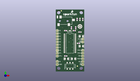
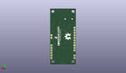
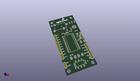

Contents
========

* [PROJ-SPAR-10653-STAN-01>Voice Recorder Breakout-ISD1932](#proj-spar-10653-stan-01voice-recorder-breakout-isd1932)
	* [Images](#images)
	* [Interactive BOM](#interactive-bom)
	* [Tags](#tags)
  
![][im]
# PROJ-SPAR-10653-STAN-01>Voice Recorder Breakout-ISD1932

- ID: PROJ-SPAR-10653-STAN-01
- Hex ID: PRS10653
- Name: Voice Recorder Breakout-ISD1932
- Description: 

## Images
  
  

|eagleImage|kicadPcb3dFront|kicadPcb3dBack|kicadPcb3d|
| :---: | :---: | :---: | :---: |
|||||

## Interactive BOM

- Interactive BOM page: [ibom.html](kicad/bom/ibom.html)

## Tags

- hexID: PRS10653
- oompType: PROJ
- oompSize: SPAR
- oompColor: 10653
- oompDesc: STAN
- oompIndex: 01
- oompName: Voice Recorder Breakout-ISD1932
- sources: All source files from https://github.com/sparkfun/Voice_Recorder_Breakout-ISD1932 (source licence details in srcLicense.md)
- linkBuyPage: https://www.sparkfun.com/products/10653
- oompID: PROJ-SPAR-10653-STAN-01
- oompParts: C1,UNMATCHED-UNMATCHED-UNMATCHED-UNMATCHED-UNMATCHED
- oompParts: C2,UNMATCHED-UNMATCHED-UNMATCHED-UNMATCHED-UNMATCHED
- oompParts: C3,UNMATCHED-UNMATCHED-UNMATCHED-UNMATCHED-UNMATCHED
- oompParts: C4,UNMATCHED-UNMATCHED-UNMATCHED-UNMATCHED-UNMATCHED
- oompParts: C5,UNMATCHED-UNMATCHED-UNMATCHED-UNMATCHED-UNMATCHED
- oompParts: C6,UNMATCHED-UNMATCHED-UNMATCHED-UNMATCHED-UNMATCHED
- oompParts: C7,UNMATCHED-UNMATCHED-UNMATCHED-UNMATCHED-UNMATCHED
- oompParts: C8,UNMATCHED-UNMATCHED-UNMATCHED-UNMATCHED-UNMATCHED
- oompParts: C9,UNMATCHED-UNMATCHED-UNMATCHED-UNMATCHED-UNMATCHED
- oompParts: C10,UNMATCHED-UNMATCHED-UNMATCHED-UNMATCHED-UNMATCHED
- oompParts: JP1,UNMATCHED-UNMATCHED-UNMATCHED-UNMATCHED-UNMATCHED
- oompParts: JP4,UNMATCHED-UNMATCHED-UNMATCHED-UNMATCHED-UNMATCHED
- oompParts: JP5,UNMATCHED-UNMATCHED-UNMATCHED-UNMATCHED-UNMATCHED
- oompParts: JP6,UNMATCHED-UNMATCHED-UNMATCHED-UNMATCHED-UNMATCHED
- oompParts: JP7,UNMATCHED-UNMATCHED-UNMATCHED-UNMATCHED-UNMATCHED
- oompParts: JP8,UNMATCHED-UNMATCHED-UNMATCHED-UNMATCHED-UNMATCHED
- oompParts: JP9,UNMATCHED-UNMATCHED-UNMATCHED-UNMATCHED-UNMATCHED
- oompParts: JP10,UNMATCHED-UNMATCHED-UNMATCHED-UNMATCHED-UNMATCHED
- oompParts: JP11,UNMATCHED-UNMATCHED-UNMATCHED-UNMATCHED-UNMATCHED
- oompParts: JP12,UNMATCHED-UNMATCHED-UNMATCHED-UNMATCHED-UNMATCHED
- oompParts: JP13,UNMATCHED-UNMATCHED-UNMATCHED-UNMATCHED-UNMATCHED
- oompParts: LED1,UNMATCHED-UNMATCHED-UNMATCHED-UNMATCHED-UNMATCHED
- oompParts: R1,UNMATCHED-UNMATCHED-UNMATCHED-UNMATCHED-UNMATCHED
- oompParts: R2,UNMATCHED-UNMATCHED-UNMATCHED-UNMATCHED-UNMATCHED
- oompParts: R3,UNMATCHED-UNMATCHED-UNMATCHED-UNMATCHED-UNMATCHED
- oompParts: R4,UNMATCHED-UNMATCHED-UNMATCHED-UNMATCHED-UNMATCHED
- oompParts: S1,UNMATCHED-UNMATCHED-UNMATCHED-UNMATCHED-UNMATCHED
- oompParts: U$10,UNMATCHED-UNMATCHED-UNMATCHED-UNMATCHED-UNMATCHED
- oompParts: U$14,UNMATCHED-UNMATCHED-UNMATCHED-UNMATCHED-UNMATCHED
- oompParts: U1,UNMATCHED-UNMATCHED-UNMATCHED-UNMATCHED-UNMATCHED
- oompParts: U2,UNMATCHED-UNMATCHED-UNMATCHED-UNMATCHED-UNMATCHED
- oompParts: U3,UNMATCHED-UNMATCHED-UNMATCHED-UNMATCHED-UNMATCHED
- rawParts: C1,0.1uF,CAP0603-CAP,0603-CAP,Capacitor,,
- rawParts: C2,0.1uF,CAP0603-CAP,0603-CAP,Capacitor,,
- rawParts: C3,0.1uF,CAP0603-CAP,0603-CAP,Capacitor,,
- rawParts: C4,10uF,CAP_POL1206,EIA3216,Capacitor Polarized,,
- rawParts: C5,10uF,CAP_POL1206,EIA3216,Capacitor Polarized,,
- rawParts: C6,10uF,CAP_POL1206,EIA3216,Capacitor Polarized,,
- rawParts: C7,10uF,CAP_POL1206,EIA3216,Capacitor Polarized,,
- rawParts: C8,0.1uF,CAP0603-CAP,0603-CAP,Capacitor,,
- rawParts: C9,0.1uF,CAP0603-CAP,0603-CAP,Capacitor,,
- rawParts: C10,4.7uF,CAP0603-CAP,0603-CAP,Capacitor,,
- rawParts: JP1,LOGO-SFENEW,LOGO-SFENEW,SFE-NEW-WEBLOGO,Spark Fun Electronics PCB Logo,,
- rawParts: JP2,FIDUCIAL1X2,FIDUCIAL1X2,FIDUCIAL-1X2,Fiducial Alignment Points,,
- rawParts: JP3,FIDUCIAL1X2,FIDUCIAL1X2,FIDUCIAL-1X2,Fiducial Alignment Points,,
- rawParts: JP4,,M02PTH,1X02,Header 2,,
- rawParts: JP5,,M02PTH,1X02,Header 2,,
- rawParts: JP6,STAND-OFF,STAND-OFF,STAND-OFF,Stand Off,,
- rawParts: JP7,,M08,1X08,Header 8,,
- rawParts: JP8,,M02PTH,1X02,Header 2,,
- rawParts: JP9,,M06SIP,1X06,Header 6,,
- rawParts: JP10,STAND-OFF,STAND-OFF,STAND-OFF,Stand Off,,
- rawParts: JP11,STAND-OFF,STAND-OFF,STAND-OFF,Stand Off,,
- rawParts: JP12,STAND-OFF,STAND-OFF,STAND-OFF,Stand Off,,
- rawParts: JP13,LOGO-SFENW2,LOGO-SFENW2,SFE-NEW-WEB,Spark Fun Electronics PCB Logo,,
- rawParts: LED1,Red,LED0603,LED-0603,LEDs,,
- rawParts: R1,1k,RESISTOR0603-RES,0603-RES,Resistor,,
- rawParts: R2,4.7k,RESISTOR0603-RES,0603-RES,Resistor,,
- rawParts: R3,4.7k,RESISTOR0603-RES,0603-RES,Resistor,,
- rawParts: R4,4.7k,RESISTOR0603-RES,0603-RES,Resistor,,
- rawParts: S1,,SWITCH-SPSTSMD,AYZ0202,SPST Switch,,
- rawParts: U$10,CREATIVE_COMMONS,CREATIVE_COMMONS,CREATIVE_COMMONS,,,
- rawParts: U$14,OSHW-LOGOL,OSHW-LOGOL,OSHW-LOGO-L,Open Source Hardware Logo This logo indicates the piece of hardware it is found on incorporates a OSHW license and/or adheres to the definition of open source hardware found here: http://freedomdefined.org/OSHW,,
- rawParts: U1,ISD1900ISD1932,ISD1900ISD1932,SO-28W,,,
- rawParts: U2,MICELECTRET_SMD,MICELECTRET_SMD,MIC_ELECTRET_SMD,Microphone,,
- rawParts: U3,AUDIO-JACK2SMD,AUDIO-JACK2SMD,AUDIO-JACK-3.5MM-SMD,,,

[im]: kicadPcb3d_450.png
