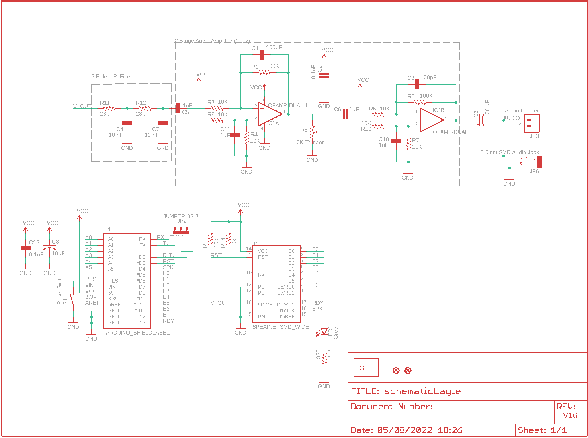
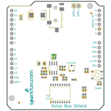
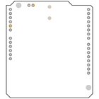
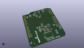
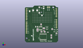
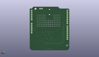
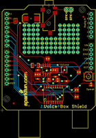
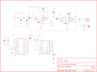
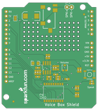
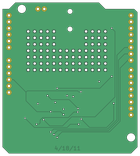

Contents
========

* [PRS10661 > VoiceBox Shield](#prs10661--voicebox-shield)
	* [Schematic](#schematic)
	* [PCB](#pcb)
	* [Interactive BOM](#interactive-bom)
	* [OOMP Parts](#oomp-parts)
	* [Images](#images)
	* [Tags](#tags)
  
![][im]
# PRS10661 > VoiceBox Shield

- ID: PROJ-SPAR-10661-STAN-01
- Hex ID: PRS10661
- Name: Sparkfun
- Description: Sparkfun
- Long Link: [http://oom.lt/PROJ-SPAR-10661-STAN-01](http://oom.lt/PROJ-SPAR-10661-STAN-01)
- Short Link: [http://oom.lt/PRS10661](http://oom.lt/PRS10661)

## Schematic
  

## PCB
  

## Interactive BOM

- Interactive BOM page: [ibom.html](https://htmlpreview.github.io/?https://github.com/oomlout/oomlout_OOMP_projects/blob/main/PROJ-SPAR-10661-STAN-01/kicad/bom/ibom.html)

## OOMP Parts
  

|OOMP ID|Name|Identifier|
| :---: | :---: | :---: |
|[CAPC-0603-X-PF100-V50](https://github.com/oomlout/oomlout_OOMP_parts/tree/main/CAPC-0603-X-PF100-V50/)|[SMD (0603) 100 pF Capacitor (Ceramic) 50v](https://github.com/oomlout/oomlout_OOMP_parts/tree/main/CAPC-0603-X-PF100-V50/)|[C1, C3](https://github.com/oomlout/oomlout_OOMP_parts/tree/main/CAPC-0603-X-PF100-V50/)|
|[CAPC-0603-X-NF100-V50](https://github.com/oomlout/oomlout_OOMP_parts/tree/main/CAPC-0603-X-NF100-V50/)|[SMD (0603) 100 nF Capacitor (Ceramic) 50v](https://github.com/oomlout/oomlout_OOMP_parts/tree/main/CAPC-0603-X-NF100-V50/)|[C2, C12](https://github.com/oomlout/oomlout_OOMP_parts/tree/main/CAPC-0603-X-NF100-V50/)|
|CAPC-0603-X-UNMATCHED-01||C4, C7|
|[CAPC-0603-X-UF1-V25](https://github.com/oomlout/oomlout_OOMP_parts/tree/main/CAPC-0603-X-UF1-V25/)|[SMD (0603) 1 uF Capacitor (Ceramic) 25v](https://github.com/oomlout/oomlout_OOMP_parts/tree/main/CAPC-0603-X-UF1-V25/)|[C5, C6, C10, C11](https://github.com/oomlout/oomlout_OOMP_parts/tree/main/CAPC-0603-X-UF1-V25/)|
|[CAPT-3216-X-UF10-V10](https://github.com/oomlout/oomlout_OOMP_parts/tree/main/CAPT-3216-X-UF10-V10/)|[SMD (3216) 10 uF Capacitor (Tantalum) 10v](https://github.com/oomlout/oomlout_OOMP_parts/tree/main/CAPT-3216-X-UF10-V10/)|[C8](https://github.com/oomlout/oomlout_OOMP_parts/tree/main/CAPT-3216-X-UF10-V10/)|
|CAPX-7343-X-UNMATCHED-01||C9|
|UNMATCHED-UNMATCHED-X-UNMATCHED-01||IC1, JP2, S1, U1, U2|
|[HEAD-I01-X-PI02-01](https://github.com/oomlout/oomlout_OOMP_parts/tree/main/HEAD-I01-X-PI02-01/)|[2.54 mm 2 Pin Header](https://github.com/oomlout/oomlout_OOMP_parts/tree/main/HEAD-I01-X-PI02-01/)|[JP3](https://github.com/oomlout/oomlout_OOMP_parts/tree/main/HEAD-I01-X-PI02-01/)|
|TERS-35D-L-UNMATCHED-01||JP6|
|[LEDS-0603-G-STAN-01](https://github.com/oomlout/oomlout_OOMP_parts/tree/main/LEDS-0603-G-STAN-01/)|[SMD (0603) Green LED](https://github.com/oomlout/oomlout_OOMP_parts/tree/main/LEDS-0603-G-STAN-01/)|[LED1](https://github.com/oomlout/oomlout_OOMP_parts/tree/main/LEDS-0603-G-STAN-01/)|
|[RESE-0603-X-O103-01](https://github.com/oomlout/oomlout_OOMP_parts/tree/main/RESE-0603-X-O103-01/)|[SMD (0603) 10k Ohm Resistor](https://github.com/oomlout/oomlout_OOMP_parts/tree/main/RESE-0603-X-O103-01/)|[R1, R3, R4, R6, R7, R9, R10, R14](https://github.com/oomlout/oomlout_OOMP_parts/tree/main/RESE-0603-X-O103-01/)|
|RESE-0603-X-O1003-01||R2, R5|
|RESE-UNMATCHED-X-UNMATCHED-01||R8|
|RESE-0603-X-O283-01||R11, R12|
|[RESE-0603-X-O331-01](https://github.com/oomlout/oomlout_OOMP_parts/tree/main/RESE-0603-X-O331-01/)|[SMD (0603) 330 Ohm Resistor](https://github.com/oomlout/oomlout_OOMP_parts/tree/main/RESE-0603-X-O331-01/)|[R13](https://github.com/oomlout/oomlout_OOMP_parts/tree/main/RESE-0603-X-O331-01/)|

## Images
  
  

|bominteractivefront|bominteractiveback|kicadPcb3d|kicadPcb3dFront|kicadPcb3dBack|eagleImage|eagleSchemImage|pcbdraw|pcbdrawback|
| :---: | :---: | :---: | :---: | :---: | :---: | :---: | :---: | :---: |
||||||||||

## Tags

- hexID: PRS10661
- oompType: PROJ
- oompSize: SPAR
- oompColor: 10661
- oompDesc: STAN
- oompIndex: 01
- oompName: VoiceBox Shield
- sources: All source files from https://github.com/sparkfun/VoiceBox_Shield (source licence details in srcLicense.md)
- linkBuyPage: https://www.sparkfun.com/products/10661
- oompID: PROJ-SPAR-10661-STAN-01
- oompParts: C1,CAPC-0603-X-PF100-V50
- oompParts: C2,CAPC-0603-X-NF100-V50
- oompParts: C3,CAPC-0603-X-PF100-V50
- oompParts: C4,CAPC-0603-X-UNMATCHED-01
- oompParts: C5,CAPC-0603-X-UF1-V25
- oompParts: C6,CAPC-0603-X-UF1-V25
- oompParts: C7,CAPC-0603-X-UNMATCHED-01
- oompParts: C8,CAPT-3216-X-UF10-V10
- oompParts: C9,CAPX-7343-X-UNMATCHED-01
- oompParts: C10,CAPC-0603-X-UF1-V25
- oompParts: C11,CAPC-0603-X-UF1-V25
- oompParts: C12,CAPC-0603-X-NF100-V50
- oompParts: IC1,UNMATCHED-UNMATCHED-X-UNMATCHED-01
- oompParts: JP2,UNMATCHED-UNMATCHED-X-UNMATCHED-01
- oompParts: JP3,HEAD-I01-X-PI02-01
- oompParts: JP6,TERS-35D-L-UNMATCHED-01
- oompParts: LED1,LEDS-0603-G-STAN-01
- oompParts: R1,RESE-0603-X-O103-01
- oompParts: R2,RESE-0603-X-O1003-01
- oompParts: R3,RESE-0603-X-O103-01
- oompParts: R4,RESE-0603-X-O103-01
- oompParts: R5,RESE-0603-X-O1003-01
- oompParts: R6,RESE-0603-X-O103-01
- oompParts: R7,RESE-0603-X-O103-01
- oompParts: R8,RESE-UNMATCHED-X-UNMATCHED-01
- oompParts: R9,RESE-0603-X-O103-01
- oompParts: R10,RESE-0603-X-O103-01
- oompParts: R11,RESE-0603-X-O283-01
- oompParts: R12,RESE-0603-X-O283-01
- oompParts: R13,RESE-0603-X-O331-01
- oompParts: R14,RESE-0603-X-O103-01
- oompParts: S1,UNMATCHED-UNMATCHED-X-UNMATCHED-01
- oompParts: U1,UNMATCHED-UNMATCHED-X-UNMATCHED-01
- oompParts: U2,UNMATCHED-UNMATCHED-X-UNMATCHED-01
- rawParts: C1,100pF,CAP0603-CAP,0603-CAP,Capacitor,,
- rawParts: C2,0.1uF,CAP0603-CAP,0603-CAP,Capacitor,,
- rawParts: C3,100pF,CAP0603-CAP,0603-CAP,Capacitor,,
- rawParts: C4,10 nF,CAP0603-CAP,0603-CAP,Capacitor,,
- rawParts: C5,1uF,CAP0603-CAP,0603-CAP,Capacitor,,
- rawParts: C6,1uF,CAP0603-CAP,0603-CAP,Capacitor,,
- rawParts: C7,10 nF,CAP0603-CAP,0603-CAP,Capacitor,,
- rawParts: C8,10uF,CAP_POL1206,EIA3216,Capacitor Polarized,,
- rawParts: C9,100 uF,CAP_POL7343,EIA7343,Capacitor Polarized,,
- rawParts: C10,1uF,CAP0603-CAP,0603-CAP,Capacitor,,
- rawParts: C11,1uF,CAP0603-CAP,0603-CAP,Capacitor,,
- rawParts: C12,0.1uF,CAP0603-CAP,0603-CAP,Capacitor,,
- rawParts: IC1,OPAMP-DUALU,OPAMP-DUALU,SO08,Operational Amplifier,,
- rawParts: JP1,LOGO-SFENEW,LOGO-SFENEW,SFE-NEW-WEBLOGO,Spark Fun Electronics PCB Logo,,
- rawParts: JP2,JUMPER-32-3,JUMPER-32-3,SJ_3_PASTE2&3,,,
- rawParts: JP3,Audio Header,M02PTH,1X02,Header 2,,
- rawParts: JP4,FIDUCIAL1X2,FIDUCIAL1X2,FIDUCIAL-1X2,Fiducial Alignment Points,,
- rawParts: JP5,FIDUCIAL1X2,FIDUCIAL1X2,FIDUCIAL-1X2,Fiducial Alignment Points,,
- rawParts: JP6,3.5mm SMD Audio Jack,AUDIO-JACKSMD2,AUDIO-JACK-3.5MM-SMD,3.5mm Audio Jack,,
- rawParts: LED1,Green,LED0603,LED-0603,LEDs,,
- rawParts: R1,10k,RESISTOR0603-RES,0603-RES,Resistor,,
- rawParts: R2,100K,RESISTOR0603-RES,0603-RES,Resistor,,
- rawParts: R3,10K,RESISTOR0603-RES,0603-RES,Resistor,,
- rawParts: R4,10K,RESISTOR0603-RES,0603-RES,Resistor,,
- rawParts: R5,100K,RESISTOR0603-RES,0603-RES,Resistor,,
- rawParts: R6,10K,RESISTOR0603-RES,0603-RES,Resistor,,
- rawParts: R7,10K,RESISTOR0603-RES,0603-RES,Resistor,,
- rawParts: R8,10K Trimpot,TRIMPOTSMD,TRIMPOT-3MM,,,
- rawParts: R9,10K,RESISTOR0603,0603,Resistor,,
- rawParts: R10,10K,RESISTOR0603,0603,Resistor,,
- rawParts: R11,28k,RESISTOR0603-RES,0603-RES,Resistor,,
- rawParts: R12,28k,RESISTOR0603-RES,0603-RES,Resistor,,
- rawParts: R13,330,RESISTOR0603-RES,0603-RES,Resistor,,
- rawParts: R14,10k,RESISTOR0603-RES,0603-RES,Resistor,,
- rawParts: S1,Reset Switch,SWITCH-MOMENTARY-2SMD,TACTILE_SWITCH_SMD,,,
- rawParts: U1,ARDUINO_SHIELDLABEL,ARDUINO_SHIELDLABEL,DUEMILANOVE_SHIELD,,,
- rawParts: U2,SPEAKJETSMD_WIDE,SPEAKJETSMD_WIDE,SO-18W,,,

[im]: kicadPcb3d_450.png
