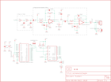

Contents
========

* [PRS10661 > Sparkfun](#prs10661--sparkfun)
	* [Schematic](#schematic)
	* [Interactive BOM](#interactive-bom)
	* [OOMP Parts](#oomp-parts)
	* [Images](#images)
	* [Tags](#tags)
  
![][im]
# PRS10661 > Sparkfun

- ID: PROJ-SPAR-10661-STAN-01
- Hex ID: PRS10661
- Name: Sparkfun
- Description: Sparkfun
- Long Link: [http://oom.lt/PROJ-SPAR-10661-STAN-01](http://oom.lt/PROJ-SPAR-10661-STAN-01)
- Short Link: [http://oom.lt/PRS10661](http://oom.lt/PRS10661)

## Schematic
  

## Interactive BOM

- Interactive BOM page: [ibom.html](https://htmlpreview.github.io/?https://github.com/oomlout/oomlout_OOMP_projects/blob/main/PROJ-SPAR-10661-STAN-01/kicad/bom/ibom.html)

## OOMP Parts
  

|OOMP Parts|
| :---: |
|C1,UNMATCHED-UNMATCHED-UNMATCHED-UNMATCHED-UNMATCHED,C1,100pF,CAP0603-CAP,0603-CAP,Capacitor,,|
|C2,UNMATCHED-UNMATCHED-UNMATCHED-UNMATCHED-UNMATCHED,C2,0.1uF,CAP0603-CAP,0603-CAP,Capacitor,,|
|C3,UNMATCHED-UNMATCHED-UNMATCHED-UNMATCHED-UNMATCHED,C3,100pF,CAP0603-CAP,0603-CAP,Capacitor,,|
|C4,UNMATCHED-UNMATCHED-UNMATCHED-UNMATCHED-UNMATCHED,C4,10 nF,CAP0603-CAP,0603-CAP,Capacitor,,|
|C5,UNMATCHED-UNMATCHED-UNMATCHED-UNMATCHED-UNMATCHED,C5,1uF,CAP0603-CAP,0603-CAP,Capacitor,,|
|C6,UNMATCHED-UNMATCHED-UNMATCHED-UNMATCHED-UNMATCHED,C6,1uF,CAP0603-CAP,0603-CAP,Capacitor,,|
|C7,UNMATCHED-UNMATCHED-UNMATCHED-UNMATCHED-UNMATCHED,C7,10 nF,CAP0603-CAP,0603-CAP,Capacitor,,|
|C8,UNMATCHED-UNMATCHED-UNMATCHED-UNMATCHED-UNMATCHED,C8,10uF,CAP_POL1206,EIA3216,Capacitor Polarized,,|
|C9,UNMATCHED-UNMATCHED-UNMATCHED-UNMATCHED-UNMATCHED,C9,100 uF,CAP_POL7343,EIA7343,Capacitor Polarized,,|
|C10,UNMATCHED-UNMATCHED-UNMATCHED-UNMATCHED-UNMATCHED,C10,1uF,CAP0603-CAP,0603-CAP,Capacitor,,|
|C11,UNMATCHED-UNMATCHED-UNMATCHED-UNMATCHED-UNMATCHED,C11,1uF,CAP0603-CAP,0603-CAP,Capacitor,,|
|C12,UNMATCHED-UNMATCHED-UNMATCHED-UNMATCHED-UNMATCHED,C12,0.1uF,CAP0603-CAP,0603-CAP,Capacitor,,|
|IC1,UNMATCHED-UNMATCHED-UNMATCHED-UNMATCHED-UNMATCHED,IC1,OPAMP-DUALU,OPAMP-DUALU,SO08,Operational Amplifier,,|
|JP1,UNMATCHED-UNMATCHED-UNMATCHED-UNMATCHED-UNMATCHED,JP1,LOGO-SFENEW,LOGO-SFENEW,SFE-NEW-WEBLOGO,Spark Fun Electronics PCB Logo,,|
|JP2,UNMATCHED-UNMATCHED-UNMATCHED-UNMATCHED-UNMATCHED,JP2,JUMPER-32-3,JUMPER-32-3,SJ_3_PASTE2&3,,,|
|JP3,UNMATCHED-UNMATCHED-UNMATCHED-UNMATCHED-UNMATCHED,JP3,Audio Header,M02PTH,1X02,Header 2,,|
|JP6,UNMATCHED-UNMATCHED-UNMATCHED-UNMATCHED-UNMATCHED,JP4,FIDUCIAL1X2,FIDUCIAL1X2,FIDUCIAL-1X2,Fiducial Alignment Points,,|
|LED1,UNMATCHED-UNMATCHED-UNMATCHED-UNMATCHED-UNMATCHED,JP5,FIDUCIAL1X2,FIDUCIAL1X2,FIDUCIAL-1X2,Fiducial Alignment Points,,|
|R1,UNMATCHED-UNMATCHED-UNMATCHED-UNMATCHED-UNMATCHED,JP6,3.5mm SMD Audio Jack,AUDIO-JACKSMD2,AUDIO-JACK-3.5MM-SMD,3.5mm Audio Jack,,|
|R2,UNMATCHED-UNMATCHED-UNMATCHED-UNMATCHED-UNMATCHED,LED1,Green,LED0603,LED-0603,LEDs,,|
|R3,UNMATCHED-UNMATCHED-UNMATCHED-UNMATCHED-UNMATCHED,R1,10k,RESISTOR0603-RES,0603-RES,Resistor,,|
|R4,UNMATCHED-UNMATCHED-UNMATCHED-UNMATCHED-UNMATCHED,R2,100K,RESISTOR0603-RES,0603-RES,Resistor,,|
|R5,UNMATCHED-UNMATCHED-UNMATCHED-UNMATCHED-UNMATCHED,R3,10K,RESISTOR0603-RES,0603-RES,Resistor,,|
|R6,UNMATCHED-UNMATCHED-UNMATCHED-UNMATCHED-UNMATCHED,R4,10K,RESISTOR0603-RES,0603-RES,Resistor,,|
|R7,UNMATCHED-UNMATCHED-UNMATCHED-UNMATCHED-UNMATCHED,R5,100K,RESISTOR0603-RES,0603-RES,Resistor,,|
|R8,UNMATCHED-UNMATCHED-UNMATCHED-UNMATCHED-UNMATCHED,R6,10K,RESISTOR0603-RES,0603-RES,Resistor,,|
|R9,UNMATCHED-UNMATCHED-UNMATCHED-UNMATCHED-UNMATCHED,R7,10K,RESISTOR0603-RES,0603-RES,Resistor,,|
|R10,UNMATCHED-UNMATCHED-UNMATCHED-UNMATCHED-UNMATCHED,R8,10K Trimpot,TRIMPOTSMD,TRIMPOT-3MM,,,|
|R11,UNMATCHED-UNMATCHED-UNMATCHED-UNMATCHED-UNMATCHED,R9,10K,RESISTOR0603,0603,Resistor,,|
|R12,UNMATCHED-UNMATCHED-UNMATCHED-UNMATCHED-UNMATCHED,R10,10K,RESISTOR0603,0603,Resistor,,|
|R13,UNMATCHED-UNMATCHED-UNMATCHED-UNMATCHED-UNMATCHED,R11,28k,RESISTOR0603-RES,0603-RES,Resistor,,|
|R14,UNMATCHED-UNMATCHED-UNMATCHED-UNMATCHED-UNMATCHED,R12,28k,RESISTOR0603-RES,0603-RES,Resistor,,|
|S1,UNMATCHED-UNMATCHED-UNMATCHED-UNMATCHED-UNMATCHED,R13,330,RESISTOR0603-RES,0603-RES,Resistor,,|
|U1,UNMATCHED-UNMATCHED-UNMATCHED-UNMATCHED-UNMATCHED,R14,10k,RESISTOR0603-RES,0603-RES,Resistor,,|
|U2,UNMATCHED-UNMATCHED-UNMATCHED-UNMATCHED-UNMATCHED,S1,Reset Switch,SWITCH-MOMENTARY-2SMD,TACTILE_SWITCH_SMD,,,|

## Images
  
  

|kicadPcb3d|kicadPcb3dFront|kicadPcb3dBack|eagleImage|eagleSchemImage|
| :---: | :---: | :---: | :---: | :---: |
||||||

## Tags

- hexID: PRS10661
- oompType: PROJ
- oompSize: SPAR
- oompColor: 10661
- oompDesc: STAN
- oompIndex: 01
- oompName: VoiceBox Shield
- sources: All source files from https://github.com/sparkfun/VoiceBox_Shield (source licence details in srcLicense.md)
- linkBuyPage: https://www.sparkfun.com/products/10661
- oompID: PROJ-SPAR-10661-STAN-01
- oompParts: C1,UNMATCHED-UNMATCHED-UNMATCHED-UNMATCHED-UNMATCHED
- oompParts: C2,UNMATCHED-UNMATCHED-UNMATCHED-UNMATCHED-UNMATCHED
- oompParts: C3,UNMATCHED-UNMATCHED-UNMATCHED-UNMATCHED-UNMATCHED
- oompParts: C4,UNMATCHED-UNMATCHED-UNMATCHED-UNMATCHED-UNMATCHED
- oompParts: C5,UNMATCHED-UNMATCHED-UNMATCHED-UNMATCHED-UNMATCHED
- oompParts: C6,UNMATCHED-UNMATCHED-UNMATCHED-UNMATCHED-UNMATCHED
- oompParts: C7,UNMATCHED-UNMATCHED-UNMATCHED-UNMATCHED-UNMATCHED
- oompParts: C8,UNMATCHED-UNMATCHED-UNMATCHED-UNMATCHED-UNMATCHED
- oompParts: C9,UNMATCHED-UNMATCHED-UNMATCHED-UNMATCHED-UNMATCHED
- oompParts: C10,UNMATCHED-UNMATCHED-UNMATCHED-UNMATCHED-UNMATCHED
- oompParts: C11,UNMATCHED-UNMATCHED-UNMATCHED-UNMATCHED-UNMATCHED
- oompParts: C12,UNMATCHED-UNMATCHED-UNMATCHED-UNMATCHED-UNMATCHED
- oompParts: IC1,UNMATCHED-UNMATCHED-UNMATCHED-UNMATCHED-UNMATCHED
- oompParts: JP1,UNMATCHED-UNMATCHED-UNMATCHED-UNMATCHED-UNMATCHED
- oompParts: JP2,UNMATCHED-UNMATCHED-UNMATCHED-UNMATCHED-UNMATCHED
- oompParts: JP3,UNMATCHED-UNMATCHED-UNMATCHED-UNMATCHED-UNMATCHED
- oompParts: JP6,UNMATCHED-UNMATCHED-UNMATCHED-UNMATCHED-UNMATCHED
- oompParts: LED1,UNMATCHED-UNMATCHED-UNMATCHED-UNMATCHED-UNMATCHED
- oompParts: R1,UNMATCHED-UNMATCHED-UNMATCHED-UNMATCHED-UNMATCHED
- oompParts: R2,UNMATCHED-UNMATCHED-UNMATCHED-UNMATCHED-UNMATCHED
- oompParts: R3,UNMATCHED-UNMATCHED-UNMATCHED-UNMATCHED-UNMATCHED
- oompParts: R4,UNMATCHED-UNMATCHED-UNMATCHED-UNMATCHED-UNMATCHED
- oompParts: R5,UNMATCHED-UNMATCHED-UNMATCHED-UNMATCHED-UNMATCHED
- oompParts: R6,UNMATCHED-UNMATCHED-UNMATCHED-UNMATCHED-UNMATCHED
- oompParts: R7,UNMATCHED-UNMATCHED-UNMATCHED-UNMATCHED-UNMATCHED
- oompParts: R8,UNMATCHED-UNMATCHED-UNMATCHED-UNMATCHED-UNMATCHED
- oompParts: R9,UNMATCHED-UNMATCHED-UNMATCHED-UNMATCHED-UNMATCHED
- oompParts: R10,UNMATCHED-UNMATCHED-UNMATCHED-UNMATCHED-UNMATCHED
- oompParts: R11,UNMATCHED-UNMATCHED-UNMATCHED-UNMATCHED-UNMATCHED
- oompParts: R12,UNMATCHED-UNMATCHED-UNMATCHED-UNMATCHED-UNMATCHED
- oompParts: R13,UNMATCHED-UNMATCHED-UNMATCHED-UNMATCHED-UNMATCHED
- oompParts: R14,UNMATCHED-UNMATCHED-UNMATCHED-UNMATCHED-UNMATCHED
- oompParts: S1,UNMATCHED-UNMATCHED-UNMATCHED-UNMATCHED-UNMATCHED
- oompParts: U1,UNMATCHED-UNMATCHED-UNMATCHED-UNMATCHED-UNMATCHED
- oompParts: U2,UNMATCHED-UNMATCHED-UNMATCHED-UNMATCHED-UNMATCHED
- rawParts: C1,100pF,CAP0603-CAP,0603-CAP,Capacitor,,
- rawParts: C2,0.1uF,CAP0603-CAP,0603-CAP,Capacitor,,
- rawParts: C3,100pF,CAP0603-CAP,0603-CAP,Capacitor,,
- rawParts: C4,10 nF,CAP0603-CAP,0603-CAP,Capacitor,,
- rawParts: C5,1uF,CAP0603-CAP,0603-CAP,Capacitor,,
- rawParts: C6,1uF,CAP0603-CAP,0603-CAP,Capacitor,,
- rawParts: C7,10 nF,CAP0603-CAP,0603-CAP,Capacitor,,
- rawParts: C8,10uF,CAP_POL1206,EIA3216,Capacitor Polarized,,
- rawParts: C9,100 uF,CAP_POL7343,EIA7343,Capacitor Polarized,,
- rawParts: C10,1uF,CAP0603-CAP,0603-CAP,Capacitor,,
- rawParts: C11,1uF,CAP0603-CAP,0603-CAP,Capacitor,,
- rawParts: C12,0.1uF,CAP0603-CAP,0603-CAP,Capacitor,,
- rawParts: IC1,OPAMP-DUALU,OPAMP-DUALU,SO08,Operational Amplifier,,
- rawParts: JP1,LOGO-SFENEW,LOGO-SFENEW,SFE-NEW-WEBLOGO,Spark Fun Electronics PCB Logo,,
- rawParts: JP2,JUMPER-32-3,JUMPER-32-3,SJ_3_PASTE2&3,,,
- rawParts: JP3,Audio Header,M02PTH,1X02,Header 2,,
- rawParts: JP4,FIDUCIAL1X2,FIDUCIAL1X2,FIDUCIAL-1X2,Fiducial Alignment Points,,
- rawParts: JP5,FIDUCIAL1X2,FIDUCIAL1X2,FIDUCIAL-1X2,Fiducial Alignment Points,,
- rawParts: JP6,3.5mm SMD Audio Jack,AUDIO-JACKSMD2,AUDIO-JACK-3.5MM-SMD,3.5mm Audio Jack,,
- rawParts: LED1,Green,LED0603,LED-0603,LEDs,,
- rawParts: R1,10k,RESISTOR0603-RES,0603-RES,Resistor,,
- rawParts: R2,100K,RESISTOR0603-RES,0603-RES,Resistor,,
- rawParts: R3,10K,RESISTOR0603-RES,0603-RES,Resistor,,
- rawParts: R4,10K,RESISTOR0603-RES,0603-RES,Resistor,,
- rawParts: R5,100K,RESISTOR0603-RES,0603-RES,Resistor,,
- rawParts: R6,10K,RESISTOR0603-RES,0603-RES,Resistor,,
- rawParts: R7,10K,RESISTOR0603-RES,0603-RES,Resistor,,
- rawParts: R8,10K Trimpot,TRIMPOTSMD,TRIMPOT-3MM,,,
- rawParts: R9,10K,RESISTOR0603,0603,Resistor,,
- rawParts: R10,10K,RESISTOR0603,0603,Resistor,,
- rawParts: R11,28k,RESISTOR0603-RES,0603-RES,Resistor,,
- rawParts: R12,28k,RESISTOR0603-RES,0603-RES,Resistor,,
- rawParts: R13,330,RESISTOR0603-RES,0603-RES,Resistor,,
- rawParts: R14,10k,RESISTOR0603-RES,0603-RES,Resistor,,
- rawParts: S1,Reset Switch,SWITCH-MOMENTARY-2SMD,TACTILE_SWITCH_SMD,,,
- rawParts: U1,ARDUINO_SHIELDLABEL,ARDUINO_SHIELDLABEL,DUEMILANOVE_SHIELD,,,
- rawParts: U2,SPEAKJETSMD_WIDE,SPEAKJETSMD_WIDE,SO-18W,,,

[im]: kicadPcb3d_450.png
