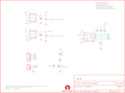

Contents
========

* [PRS10701 > Color Light Sensor Evaluation Board](#prs10701--color-light-sensor-evaluation-board)
	* [Schematic](#schematic)
	* [PCB](#pcb)
	* [OOMP Parts](#oomp-parts)
	* [Images](#images)
	* [Tags](#tags)
  
![][im]
# PRS10701 > Color Light Sensor Evaluation Board

- ID: PROJ-SPAR-10701-STAN-01
- Hex ID: PRS10701
- Name: Sparkfun
- Description: Sparkfun
- Long Link: [http://oom.lt/PROJ-SPAR-10701-STAN-01](http://oom.lt/PROJ-SPAR-10701-STAN-01)
- Short Link: [http://oom.lt/PRS10701](http://oom.lt/PRS10701)

## Schematic
  

## PCB
  

## OOMP Parts
  

|OOMP Parts|
| :---: |
|C1 C1,CAPC-0402-X-UF47D-01|
|C3 C3,CAPC-0402-X-UF47D-01|
|[JP3 HEAD-I01-X-PI03-01 2.54 mm 3 Pin Header](https://github.com/oomlout/oomlout_OOMP_parts/tree/main/HEAD-I01-X-PI03-01/)|
|[JP4 HEAD-I01-X-PI05-01 2.54 mm 5 Pin Header](https://github.com/oomlout/oomlout_OOMP_parts/tree/main/HEAD-I01-X-PI05-01/)|
|[LED1 LEDS-0603-G-STAN-01 SMD (0603) Green LED](https://github.com/oomlout/oomlout_OOMP_parts/tree/main/LEDS-0603-G-STAN-01/)|
|Q2 Q2,UNMATCHED-SO23-X-UNMATCHED-01|
|[R1 RESE-0402-X-O103-01 SMD (0402) 10k Ohm Resistor](https://github.com/oomlout/oomlout_OOMP_parts/tree/main/RESE-0402-X-O103-01/)|
|[R2 RESE-0402-X-O103-01 SMD (0402) 10k Ohm Resistor](https://github.com/oomlout/oomlout_OOMP_parts/tree/main/RESE-0402-X-O103-01/)|
|[R3 RESE-0402-X-O103-01 SMD (0402) 10k Ohm Resistor](https://github.com/oomlout/oomlout_OOMP_parts/tree/main/RESE-0402-X-O103-01/)|
|R4 R4,RESE-0402-X-O331-01|
|[R5 RESE-0402-X-O101-01 SMD (0402) 100 Ohm Resistor](https://github.com/oomlout/oomlout_OOMP_parts/tree/main/RESE-0402-X-O101-01/)|
|[R6 RESE-0402-X-O103-01 SMD (0402) 10k Ohm Resistor](https://github.com/oomlout/oomlout_OOMP_parts/tree/main/RESE-0402-X-O103-01/)|
|R7 R7,RESE-0402-X-O301-01|
|R8 R8,RESE-0402-X-O301-01|
|U1 U1,UNMATCHED-UNMATCHED-X-UNMATCHED-01|
|U2 U2,UNMATCHED-SO235-X-UNMATCHED-01|
|U3 U3,UNMATCHED-SO235-X-UNMATCHED-01|

## Images
  
  

|kicadPcb3d|kicadPcb3dFront|kicadPcb3dBack|eagleImage|eagleSchemImage|
| :---: | :---: | :---: | :---: | :---: |
||||||

## Tags

- hexID: PRS10701
- oompType: PROJ
- oompSize: SPAR
- oompColor: 10701
- oompDesc: STAN
- oompIndex: 01
- oompName: Color Light Sensor Evaluation Board
- sources: All source files from https://github.com/sparkfun/Color_Light_Sensor_Evaluation_Board (source licence details in srcLicense.md)
- linkBuyPage: https://www.sparkfun.com/products/10701
- oompID: PROJ-SPAR-10701-STAN-01
- oompParts: C1,CAPC-0402-X-UF47D-01
- oompParts: C3,CAPC-0402-X-UF47D-01
- oompParts: JP3,HEAD-I01-X-PI03-01
- oompParts: JP4,HEAD-I01-X-PI05-01
- oompParts: LED1,LEDS-0603-G-STAN-01
- oompParts: Q2,UNMATCHED-SO23-X-UNMATCHED-01
- oompParts: R1,RESE-0402-X-O103-01
- oompParts: R2,RESE-0402-X-O103-01
- oompParts: R3,RESE-0402-X-O103-01
- oompParts: R4,RESE-0402-X-O331-01
- oompParts: R5,RESE-0402-X-O101-01
- oompParts: R6,RESE-0402-X-O103-01
- oompParts: R7,RESE-0402-X-O301-01
- oompParts: R8,RESE-0402-X-O301-01
- oompParts: U1,UNMATCHED-UNMATCHED-X-UNMATCHED-01
- oompParts: U2,UNMATCHED-SO235-X-UNMATCHED-01
- oompParts: U3,UNMATCHED-SO235-X-UNMATCHED-01
- rawParts: C1,4.7uF,CAP0402-CAP,0402-CAP,Capacitor,,
- rawParts: C3,4.7uF,CAP0402-CAP,0402-CAP,Capacitor,,
- rawParts: JP1,LOGO-SFESK,LOGO-SFESK,SFE-LOGO-FLAME,Spark Fun Electronics PCB Logo,,
- rawParts: JP2,LOGO-SFESK,LOGO-SFESK,SFE-LOGO-FLAME,Spark Fun Electronics PCB Logo,,
- rawParts: JP3,,M03PTH,1X03,Header 3,,
- rawParts: JP4,,M05PTH,1X05,Header 5,,
- rawParts: JP5,FIDUCIAL1X2.5,FIDUCIAL1X2.5,FIDUCIAL-1X2.5,Fiducial Alignment Points,,
- rawParts: JP6,FIDUCIAL1X2.5,FIDUCIAL1X2.5,FIDUCIAL-1X2.5,Fiducial Alignment Points,,
- rawParts: LED1,WHITE,LED0603,LED-0603,LEDs,,
- rawParts: Q2,MMBT2222,TRANSISTOR_NPNSOT23-3,SOT23-3,Transistor NPN,,
- rawParts: R1,10k,RESISTOR0402-RES,0402-RES,Resistor,,
- rawParts: R2,10k,RESISTOR0402-RES,0402-RES,Resistor,,
- rawParts: R3,10k,RESISTOR0402-RES,0402-RES,Resistor,,
- rawParts: R4,330,RESISTOR0402-RES,0402-RES,Resistor,,
- rawParts: R5,100,RESISTOR0402-RES,0402-RES,Resistor,,
- rawParts: R6,10k,RESISTOR0402-RES,0402-RES,Resistor,,
- rawParts: R7,300,RESISTOR0402-RES,0402-RES,Resistor,,
- rawParts: R8,300,RESISTOR0402-RES,0402-RES,Resistor,,
- rawParts: U$1,CREATIVE_COMMONS,CREATIVE_COMMONS,CREATIVE_COMMONS,,,
- rawParts: U$4,OSHW-LOGOS,OSHW-LOGOS,OSHW-LOGO-S,Open Source Hardware Logo This logo indicates the piece of hardware it is found on incorporates a OSHW license and/or adheres to the definition of open source hardware found here: http://freedomdefined.org/OSHW,,
- rawParts: U1,ADJD-S311-CR999,ADJD-S311-CR999,CSP-9,,,
- rawParts: U2,2.8V,V_REG_LDOSMD,SOT23-5,Voltage Regulator LDO,,
- rawParts: U3,2.8V,V_REG_LDOSMD,SOT23-5,Voltage Regulator LDO,,

[im]: kicadPcb3d_450.png
