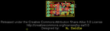

Contents
========

* [PROJ-SPAR-10701-STAN-01>Color Light Sensor Evaluation Board](#proj-spar-10701-stan-01color-light-sensor-evaluation-board)
	* [Images](#images)
	* [Tags](#tags)
  
![][im]
# PROJ-SPAR-10701-STAN-01>Color Light Sensor Evaluation Board

- ID: PROJ-SPAR-10701-STAN-01
- Hex ID: PRS10701
- Name: Color Light Sensor Evaluation Board
- Description: 

## Images
  
  

|eagleImage|
| :---: |
||

## Tags

- hexID: PRS10701
- oompType: PROJ
- oompSize: SPAR
- oompColor: 10701
- oompDesc: STAN
- oompIndex: 01
- oompName: Color Light Sensor Evaluation Board
- sources: All source files from https://github.com/sparkfun/Color_Light_Sensor_Evaluation_Board (source licence details in srcLicense.md)
- linkBuyPage: https://www.sparkfun.com/products/10701
- oompPart: CAPC-0402-X-UNMATCHED-01, C1, 8.889999999999999, 7.619999999999999, 180
- oompPart: CAPC-0402-X-UNMATCHED-01, C3, 8.889999999999999, 3.8099999999999996, 0
- oompPart: UNMATCHED-UNMATCHED-X-UNMATCHED-01, JP3, 20.32, 8.889999999999999, 270
- oompPart: UNMATCHED-UNMATCHED-X-UNMATCHED-01, JP4, 1.27, 11.43, 270
- oompPart: UNMATCHED-UNMATCHED-X-UNMATCHED-01, JP5, 3.8099999999999996, 1.27, 0
- oompPart: UNMATCHED-UNMATCHED-X-UNMATCHED-01, JP6, 20.32, 11.43, 0
- oompPart: UNMATCHED-0603-X-UNMATCHED-01, LED1, 15.239999999999998, 6.35, 0
- oompPart: UNMATCHED-UNMATCHED-X-UNMATCHED-01, Q2, 15.239999999999998, 10.16, 0
- oompPart: RESE-0402-X-UNMATCHED-01, R1, 8.889999999999999, 10.16, 180
- oompPart: RESE-0402-X-UNMATCHED-01, R2, 8.889999999999999, 5.08, 180
- oompPart: RESE-0402-X-UNMATCHED-01, R3, 8.889999999999999, 6.35, 180
- oompPart: RESE-0402-X-O331-01, R4, 12.7, 10.16, 270
- oompPart: RESE-0402-X-UNMATCHED-01, R5, 17.779999999999998, 10.16, 270
- oompPart: RESE-0402-X-UNMATCHED-01, R6, 16.509999999999998, 6.35, 90
- oompPart: RESE-0402-X-UNMATCHED-01, R7, 8.889999999999999, 8.889999999999999, 180
- oompPart: RESE-0402-X-UNMATCHED-01, R8, 8.889999999999999, 2.54, 0
- oompPart: UNMATCHED-UNMATCHED-X-UNMATCHED-01, U1, 12.7, 6.35, 180
- oompPart: UNMATCHED-UNMATCHED-X-UNMATCHED-01, U2, 5.08, 8.889999999999999, 270
- oompPart: UNMATCHED-UNMATCHED-X-UNMATCHED-01, U3, 5.08, 3.8099999999999996, 270
- rawPart: 

[im]: eagleImage_450.png
