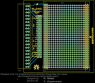
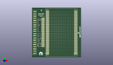
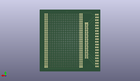
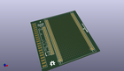

Contents
========

* [PROJ-SPAR-10705-STAN-01>MyDAQ Protoboard Kit](#proj-spar-10705-stan-01mydaq-protoboard-kit)
	* [Images](#images)
	* [Interactive BOM](#interactive-bom)
	* [OOMP Parts](#oomp-parts)
	* [Tags](#tags)
  
![][im]
# PROJ-SPAR-10705-STAN-01>MyDAQ Protoboard Kit

- ID: PROJ-SPAR-10705-STAN-01
- Hex ID: PRS10705
- Name: MyDAQ Protoboard Kit
- Description: 

## Images
  
  

|eagleImage|kicadPcb3dFront|kicadPcb3dBack|kicadPcb3d|
| :---: | :---: | :---: | :---: |
|||||

## Interactive BOM

- Interactive BOM page: [ibom.html](kicad/bom/ibom.html)

## OOMP Parts
  

|OOMP Parts|
| :---: |
|ERROR, JP2 MYDAQ 3.81MM_TERMINAL_BLOCK_FEMALE_LOCKING, 0, 0, 0,JP2, MYDAQ, 3.81MM_TERMINAL_BLOCK_FEMALE_LOCKING, Local, Lirary, (0.05, 1.7), R0|
|ERROR, JP3 M20_LOCKINGFEMALE_LOCK.009 1X20_LOCK, 0, 0, 0,JP3, M20_LOCKINGFEMALE_LOCK.009, 1X20_LOCK, Local, Library, (0.7, 2.65), R270|
|ERROR, JP4 M20 1X20, 0, 0, 0,JP4, M20, 1X20, Local, Lirary, (0.8, 2.65), R270|
|ERROR, JP5 M30 1X30, 0, 0, 0,JP5, M30, 1X30, Local, Library, (1, 0.25), R90|
|ERROR, JP6 M30 1X30, 0, 0, 0,JP6, M30, 1X30, Local, Library, (1.1, 0.25), R90|
|ERROR, JP7 M30 1X30, 0, 0, 0,JP7, M30, 1X30, Local, Library, (2.9, 0.25), R90|
|ERROR, JP8 M30 1X30, 0, 0, 0,JP8, M30, 1X30, Local, Library, (3, 0.25), R90|

## Tags

- hexID: PRS10705
- oompType: PROJ
- oompSize: SPAR
- oompColor: 10705
- oompDesc: STAN
- oompIndex: 01
- oompName: MyDAQ Protoboard Kit
- sources: All source files from https://github.com/sparkfun/MyDAQ_Protoboard_Kit (source licence details in srcLicense.md)
- linkBuyPage: https://www.sparkfun.com/products/10705
- oompPart: ERROR, JP2 MYDAQ 3.81MM_TERMINAL_BLOCK_FEMALE_LOCKING, 0, 0, 0
- oompPart: ERROR, JP3 M20_LOCKINGFEMALE_LOCK.009 1X20_LOCK, 0, 0, 0
- oompPart: ERROR, JP4 M20 1X20, 0, 0, 0
- oompPart: ERROR, JP5 M30 1X30, 0, 0, 0
- oompPart: ERROR, JP6 M30 1X30, 0, 0, 0
- oompPart: ERROR, JP7 M30 1X30, 0, 0, 0
- oompPart: ERROR, JP8 M30 1X30, 0, 0, 0
- rawPart: JP2, MYDAQ, 3.81MM_TERMINAL_BLOCK_FEMALE_LOCKING, Local, Lirary, (0.05, 1.7), R0
- rawPart: JP3, M20_LOCKINGFEMALE_LOCK.009, 1X20_LOCK, Local, Library, (0.7, 2.65), R270
- rawPart: JP4, M20, 1X20, Local, Lirary, (0.8, 2.65), R270
- rawPart: JP5, M30, 1X30, Local, Library, (1, 0.25), R90
- rawPart: JP6, M30, 1X30, Local, Library, (1.1, 0.25), R90
- rawPart: JP7, M30, 1X30, Local, Library, (2.9, 0.25), R90
- rawPart: JP8, M30, 1X30, Local, Library, (3, 0.25), R90

[im]: kicadPcb3d_450.png
