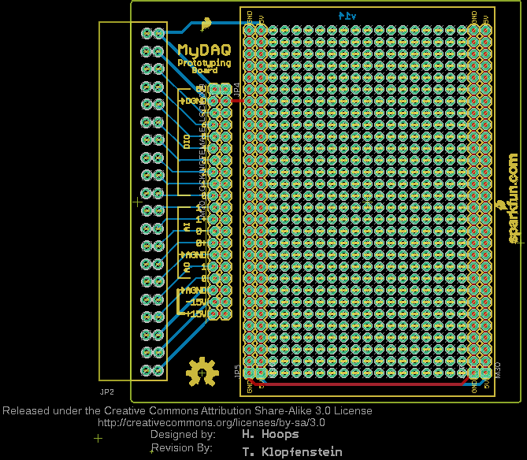

Contents
========

* [PRS10705 > MyDAQ Protoboard Kit](#prs10705--mydaq-protoboard-kit)
	* [Schematic](#schematic)
	* [PCB](#pcb)
	* [Interactive BOM](#interactive-bom)
	* [OOMP Parts](#oomp-parts)
	* [Images](#images)
	* [Tags](#tags)
  
![][im]
# PRS10705 > MyDAQ Protoboard Kit

- ID: PROJ-SPAR-10705-STAN-01
- Hex ID: PRS10705
- Name: Sparkfun
- Description: Sparkfun
- Long Link: [http://oom.lt/PROJ-SPAR-10705-STAN-01](http://oom.lt/PROJ-SPAR-10705-STAN-01)
- Short Link: [http://oom.lt/PRS10705](http://oom.lt/PRS10705)

## Schematic
  

## PCB
  

## Interactive BOM

- Interactive BOM page: [ibom.html](https://htmlpreview.github.io/?https://github.com/oomlout/oomlout_OOMP_projects/blob/main/PROJ-SPAR-10705-STAN-01/kicad/bom/ibom.html)

## OOMP Parts
  

|OOMP Parts|
| :---: |
|UNMATCHED-UNMATCHED-X-UNMATCHED-01 JP2, U1|
|[HEAD-I01-X-PI20-01  2.54 mm 20 Pin Header  JP3, JP4](https://github.com/oomlout/oomlout_OOMP_parts/tree/main/HEAD-I01-X-PI20-01/)|
|HEAD-I01-X-PI30-01 JP5, JP6, JP7, JP8|

## Images
  
  

|kicadPcb3d|kicadPcb3dFront|kicadPcb3dBack|eagleImage|eagleSchemImage|
| :---: | :---: | :---: | :---: | :---: |
||||||

## Tags

- hexID: PRS10705
- oompType: PROJ
- oompSize: SPAR
- oompColor: 10705
- oompDesc: STAN
- oompIndex: 01
- oompName: MyDAQ Protoboard Kit
- sources: All source files from https://github.com/sparkfun/MyDAQ_Protoboard_Kit (source licence details in srcLicense.md)
- linkBuyPage: https://www.sparkfun.com/products/10705
- oompID: PROJ-SPAR-10705-STAN-01
- oompParts: JP2,UNMATCHED-UNMATCHED-X-UNMATCHED-01
- oompParts: JP3,HEAD-I01-X-PI20-01
- oompParts: JP4,HEAD-I01-X-PI20-01
- oompParts: JP5,HEAD-I01-X-PI30-01
- oompParts: JP6,HEAD-I01-X-PI30-01
- oompParts: JP7,HEAD-I01-X-PI30-01
- oompParts: JP8,HEAD-I01-X-PI30-01
- oompParts: U1,UNMATCHED-UNMATCHED-X-UNMATCHED-01
- rawParts: FRAME2,FRAME-LETTER,FRAME-LETTER,CREATIVE_COMMONS,Schematic Frame,,
- rawParts: JP1,LOGO-SFENEW,LOGO-SFENEW,SFE-NEW-WEBLOGO,Spark Fun Electronics PCB Logo,,
- rawParts: JP2,MYDAQ,MYDAQ,3.81MM_TERMINAL_BLOCK_FEMALE_LOCKING,,,
- rawParts: JP3,M20_LOCKINGFEMALE_LOCK.009,M20_LOCKINGLOCK,1X20_LOCK,This is just like the LOCK variant in that the holes are staggared by 5 mil, but except for the last two holes.  They are not altered from the standard footprint layout.  This is used for a special purpose on the layout of our Graphic LCD Backpack.  Make sure you want to use this device before selecting it for you project!,,
- rawParts: JP4,M20,M20,1X20,This is just like the LOCK variant in that the holes are staggared by 5 mil, but except for the last two holes.  They are not altered from the standard footprint layout.  This is used for a special purpose on the layout of our Graphic LCD Backpack.  Make sure you want to use this device before selecting it for you project!,,
- rawParts: JP5,M30,M30,1X30,,,
- rawParts: JP6,M30,M30,1X30,,,
- rawParts: JP7,M30,M30,1X30,,,
- rawParts: JP8,M30,M30,1X30,,,
- rawParts: LOGO1,OSHW-LOGOL,OSHW-LOGOL,OSHW-LOGO-L,Open Source Hardware Logo This logo indicates the piece of hardware it is found on incorporates a OSHW license and/or adheres to the definition of open source hardware found here: http://freedomdefined.org/OSHW,,
- rawParts: LOGO2,LOGO-SFESK,LOGO-SFESK,SFE-LOGO-FLAME,Spark Fun Electronics PCB Logo,,
- rawParts: U$3,REVISION,REVISION,REVISION,,,
- rawParts: U1,BREADBOARDCLEAR,BREADBOARDCLEAR,BREADBOARD_CLEAR,Breadboard Mini Self Adhesive,,

[im]: kicadPcb3d_450.png
