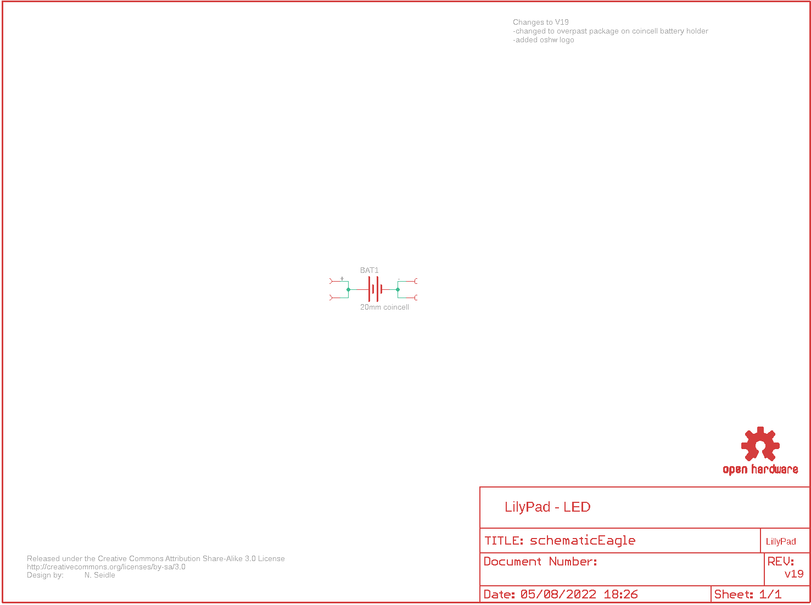
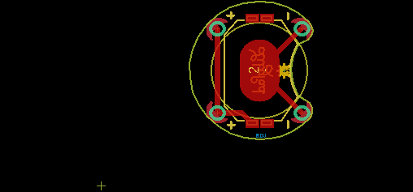
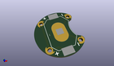
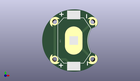
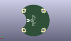
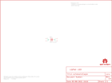

Contents
========

* [PRS10730 > LilyPad Coin Cell Battery Holder-20mm](#prs10730--lilypad-coin-cell-battery-holder-20mm)
	* [Schematic](#schematic)
	* [PCB](#pcb)
	* [Interactive BOM](#interactive-bom)
	* [OOMP Parts](#oomp-parts)
	* [Images](#images)
	* [Tags](#tags)
  
![][im]
# PRS10730 > LilyPad Coin Cell Battery Holder-20mm

- ID: PROJ-SPAR-10730-STAN-01
- Hex ID: PRS10730
- Name: Sparkfun
- Description: Sparkfun
- Long Link: [http://oom.lt/PROJ-SPAR-10730-STAN-01](http://oom.lt/PROJ-SPAR-10730-STAN-01)
- Short Link: [http://oom.lt/PRS10730](http://oom.lt/PRS10730)

## Schematic
  

## PCB
  

## Interactive BOM

- Interactive BOM page: [ibom.html](https://htmlpreview.github.io/?https://github.com/oomlout/oomlout_OOMP_projects/blob/main/PROJ-SPAR-10730-STAN-01/kicad/bom/ibom.html)

## OOMP Parts
  

|OOMP Parts|
| :---: |
|BAT1 BAT1,UNMATCHED-UNMATCHED-X-UNMATCHED-01|

## Images
  
  

|kicadPcb3d|kicadPcb3dFront|kicadPcb3dBack|eagleImage|eagleSchemImage|
| :---: | :---: | :---: | :---: | :---: |
||||||

## Tags

- hexID: PRS10730
- oompType: PROJ
- oompSize: SPAR
- oompColor: 10730
- oompDesc: STAN
- oompIndex: 01
- oompName: LilyPad Coin Cell Battery Holder-20mm
- sources: All source files from https://github.com/sparkfun/LilyPad_Coin_Cell_Battery_Holder-20mm (source licence details in srcLicense.md)
- linkBuyPage: https://www.sparkfun.com/products/10730
- oompID: PROJ-SPAR-10730-STAN-01
- oompParts: BAT1,UNMATCHED-UNMATCHED-X-UNMATCHED-01
- rawParts: BAT1,20mm coincell,BATTERY20MM_4LEGS_OVERPASTE,BATTCON_20MM_4LEGS_OVERPASTE,Battery Holders,,
- rawParts: U$1,SEWTAP6,SEWTAP6,PETAL-SMALL-2SIDE,,,
- rawParts: U$2,SEWTAP6,SEWTAP6,PETAL-SMALL-2SIDE,,,
- rawParts: U$3,SEWTAP6,SEWTAP6,PETAL-SMALL-2SIDE,,,
- rawParts: U$4,SEWTAP6,SEWTAP6,PETAL-SMALL-2SIDE,,,
- rawParts: U$5,LOGO-LPLP,LOGO-LPLP,LOGO-LILYPAD,,,
- rawParts: U$6,CREATIVE_COMMONS,CREATIVE_COMMONS,CREATIVE_COMMONS,,,
- rawParts: U$7,OSHW-LOGOS,OSHW-LOGOS,OSHW-LOGO-S,Open Source Hardware Logo This logo indicates the piece of hardware it is found on incorporates a OSHW license and/or adheres to the definition of open source hardware found here: http://freedomdefined.org/OSHW,,

[im]: kicadPcb3d_450.png
