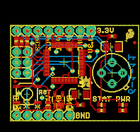
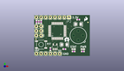
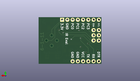
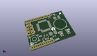

Contents
========

* [PROJ-SPAR-10740-STAN-01>IR Thermometer Evaluation Board-MLX90614](#proj-spar-10740-stan-01ir-thermometer-evaluation-board-mlx90614)
	* [Images](#images)
	* [Interactive BOM](#interactive-bom)
	* [OOMP Parts](#oomp-parts)
	* [Tags](#tags)
  
![][im]
# PROJ-SPAR-10740-STAN-01>IR Thermometer Evaluation Board-MLX90614

- ID: PROJ-SPAR-10740-STAN-01
- Hex ID: PRS10740
- Name: IR Thermometer Evaluation Board-MLX90614
- Description: 

## Images
  
  

|eagleImage|kicadPcb3dFront|kicadPcb3dBack|kicadPcb3d|
| :---: | :---: | :---: | :---: |
|||||

## Interactive BOM

- Interactive BOM page: [ibom.html](kicad/bom/ibom.html)

## OOMP Parts
  

|OOMP Parts|
| :---: |
|CAPE-0402-X-NF100-01, C1, 24.13, 20.32, 0,C1, 0.1uF, 0402-CAP, SparkFun, (0.95, 0.8), R0|
|CAPE-UNMATCHED-X-UNMATCHED-01, C2, 24.13, 17.779999999999998, 180,C2, 10uF, EIA3216, SparkFun, (0.95, 0.7), R180|
|CAPE-0402-X-NF100-01, C3, 16.509999999999998, 3.8099999999999996, 0,C3, 0.1uF, 0402-CAP, SparkFun, (0.65, 0.15), R0|
|CAPE-UNMATCHED-X-UNMATCHED-01, C4, 16.509999999999998, 6.35, 180,C4, 10uF, EIA3216, SparkFun, (0.65, 0.25), R180|
|CAPE-0402-X-NF100-01, C5, 8.889999999999999, 3.8099999999999996, 270,C5, 0.1uF, 0402-CAP, SparkFun, (0.35, 0.15), R270|
|UNMATCHED-UNMATCHED-X-UNMATCHED-01, J1, 3.8099999999999996, 11.43, 90,J1, AVR_SPI_PRG_6PTH, 2X3, SparkFun, (0.15, 0.45), R90|
|UNMATCHED-UNMATCHED-X-UNMATCHED-01, JP1, 1.27, 1.27, 0,JP1, FTDI, 1X06, SparkFun, (0.05, 0.05), R0|
|UNMATCHED-UNMATCHED-X-UNMATCHED-01, JP2, 19.049999999999997, 21.59, 180,JP2, PORTC, 1X08, SparkFun, (0.75, 0.85), R180|
|UNMATCHED-UNMATCHED-X-UNMATCHED-01, JP3, 1.016, 9.398, 0,JP3, FIDUCIAL1X2.5, FIDUCIAL-1X2.5, abes, (0.04, 0.37), R0|
|UNMATCHED-UNMATCHED-X-UNMATCHED-01, JP5, 29.463999999999995, 18.796, 0,JP5, FIDUCIAL1X2.5, FIDUCIAL-1X2.5, abes, (1.16, 0.74), R0|
|UNMATCHED-0603-X-UNMATCHED-01, LED1, 26.669999999999998, 3.8099999999999996, 270,LED1, red, LED-0603, SparkFun, (1.05, 0.15), R270|
|UNMATCHED-0603-X-UNMATCHED-01, LED2, 21.59, 3.8099999999999996, 270,LED2, green, LED-0603, SparkFun, (0.85, 0.15), R270|
|<table><tr><td></td><td> R1</td><td>[RESE-0402-X-O103-01 SMD (0402) 10k Ohm Resistor](https://github.com/oomlout/oomlout_OOMP_parts/tree/main/RESE-0402-X-O103-01/)</td><td>[R42103](https://github.com/oomlout/oomlout_OOMP_parts/tree/main/RESE-0402-X-O103-01/)</td></tr></table>|
|<table><tr><td></td><td> R2</td><td>[RESE-0402-X-O103-01 SMD (0402) 10k Ohm Resistor](https://github.com/oomlout/oomlout_OOMP_parts/tree/main/RESE-0402-X-O103-01/)</td><td>[R42103](https://github.com/oomlout/oomlout_OOMP_parts/tree/main/RESE-0402-X-O103-01/)</td></tr></table>|
|RESE-0402-X-O331-01, R3, 26.669999999999998, 2.54, 0,R3, 330, 0402-RES, SparkFun, (1.05, 0.1), R0|
|RESE-0402-X-O331-01, R4, 21.59, 2.54, 0,R4, 330, 0402-RES, SparkFun, (0.85, 0.1), R0|
|<table><tr><td></td><td> R5</td><td>[RESE-0402-X-O103-01 SMD (0402) 10k Ohm Resistor](https://github.com/oomlout/oomlout_OOMP_parts/tree/main/RESE-0402-X-O103-01/)</td><td>[R42103](https://github.com/oomlout/oomlout_OOMP_parts/tree/main/RESE-0402-X-O103-01/)</td></tr></table>|
|UNMATCHED-UNMATCHED-X-UNMATCHED-01, S1, 3.8099999999999996, 6.35, 180,S1, Reset, TACTILE_SWITCH_SMD, SparkFun, (0.15, 0.25), R180|
|UNMATCHED-UNMATCHED-X-UNMATCHED-01, U1, 24.13, 11.43, 0,U1, MLX90614_, TO-39, SparkFun, (0.95, 0.45), R0|
|UNMATCHED-UNMATCHED-X-UNMATCHED-01, U2, 12.7, 13.97, 90,U2, ATMEGA328, TQFP32-08, SparkFun, (0.5, 0.55), R90|
|UNMATCHED-UNMATCHED-X-UNMATCHED-01, U3, 11.43, 5.08, 0,U3, 3.3V_REG, SOT23-5, SparkFun, (0.45, 0.2), R0|

## Tags

- hexID: PRS10740
- oompType: PROJ
- oompSize: SPAR
- oompColor: 10740
- oompDesc: STAN
- oompIndex: 01
- oompName: IR Thermometer Evaluation Board-MLX90614
- sources: All source files from https://github.com/sparkfun/IR_Thermometer_Evaluation_Board-MLX90614 (source licence details in srcLicense.md)
- linkBuyPage: https://www.sparkfun.com/products/10740
- oompPart: CAPE-0402-X-NF100-01, C1, 24.13, 20.32, 0
- oompPart: CAPE-UNMATCHED-X-UNMATCHED-01, C2, 24.13, 17.779999999999998, 180
- oompPart: CAPE-0402-X-NF100-01, C3, 16.509999999999998, 3.8099999999999996, 0
- oompPart: CAPE-UNMATCHED-X-UNMATCHED-01, C4, 16.509999999999998, 6.35, 180
- oompPart: CAPE-0402-X-NF100-01, C5, 8.889999999999999, 3.8099999999999996, 270
- oompPart: UNMATCHED-UNMATCHED-X-UNMATCHED-01, J1, 3.8099999999999996, 11.43, 90
- oompPart: UNMATCHED-UNMATCHED-X-UNMATCHED-01, JP1, 1.27, 1.27, 0
- oompPart: UNMATCHED-UNMATCHED-X-UNMATCHED-01, JP2, 19.049999999999997, 21.59, 180
- oompPart: UNMATCHED-UNMATCHED-X-UNMATCHED-01, JP3, 1.016, 9.398, 0
- oompPart: UNMATCHED-UNMATCHED-X-UNMATCHED-01, JP5, 29.463999999999995, 18.796, 0
- oompPart: UNMATCHED-0603-X-UNMATCHED-01, LED1, 26.669999999999998, 3.8099999999999996, 270
- oompPart: UNMATCHED-0603-X-UNMATCHED-01, LED2, 21.59, 3.8099999999999996, 270
- oompPart: RESE-0402-X-O103-01, R1, 2.54, 19.049999999999997, 90
- oompPart: RESE-0402-X-O103-01, R2, 1.27, 19.049999999999997, 270
- oompPart: RESE-0402-X-O331-01, R3, 26.669999999999998, 2.54, 0
- oompPart: RESE-0402-X-O331-01, R4, 21.59, 2.54, 0
- oompPart: RESE-0402-X-O103-01, R5, 3.8099999999999996, 19.049999999999997, 270
- oompPart: UNMATCHED-UNMATCHED-X-UNMATCHED-01, S1, 3.8099999999999996, 6.35, 180
- oompPart: UNMATCHED-UNMATCHED-X-UNMATCHED-01, U1, 24.13, 11.43, 0
- oompPart: UNMATCHED-UNMATCHED-X-UNMATCHED-01, U2, 12.7, 13.97, 90
- oompPart: UNMATCHED-UNMATCHED-X-UNMATCHED-01, U3, 11.43, 5.08, 0
- rawPart: C1, 0.1uF, 0402-CAP, SparkFun, (0.95, 0.8), R0
- rawPart: C2, 10uF, EIA3216, SparkFun, (0.95, 0.7), R180
- rawPart: C3, 0.1uF, 0402-CAP, SparkFun, (0.65, 0.15), R0
- rawPart: C4, 10uF, EIA3216, SparkFun, (0.65, 0.25), R180
- rawPart: C5, 0.1uF, 0402-CAP, SparkFun, (0.35, 0.15), R270
- rawPart: J1, AVR_SPI_PRG_6PTH, 2X3, SparkFun, (0.15, 0.45), R90
- rawPart: JP1, FTDI, 1X06, SparkFun, (0.05, 0.05), R0
- rawPart: JP2, PORTC, 1X08, SparkFun, (0.75, 0.85), R180
- rawPart: JP3, FIDUCIAL1X2.5, FIDUCIAL-1X2.5, abes, (0.04, 0.37), R0
- rawPart: JP5, FIDUCIAL1X2.5, FIDUCIAL-1X2.5, abes, (1.16, 0.74), R0
- rawPart: LED1, red, LED-0603, SparkFun, (1.05, 0.15), R270
- rawPart: LED2, green, LED-0603, SparkFun, (0.85, 0.15), R270
- rawPart: R1, 10k, 0402-RES, SparkFun, (0.1, 0.75), R90
- rawPart: R2, 10k, 0402-RES, SparkFun, (0.05, 0.75), R270
- rawPart: R3, 330, 0402-RES, SparkFun, (1.05, 0.1), R0
- rawPart: R4, 330, 0402-RES, SparkFun, (0.85, 0.1), R0
- rawPart: R5, 10k, 0402-RES, SparkFun, (0.15, 0.75), R270
- rawPart: S1, Reset, TACTILE_SWITCH_SMD, SparkFun, (0.15, 0.25), R180
- rawPart: U1, MLX90614_, TO-39, SparkFun, (0.95, 0.45), R0
- rawPart: U2, ATMEGA328, TQFP32-08, SparkFun, (0.5, 0.55), R90
- rawPart: U3, 3.3V_REG, SOT23-5, SparkFun, (0.45, 0.2), R0

[im]: kicadPcb3d_450.png
