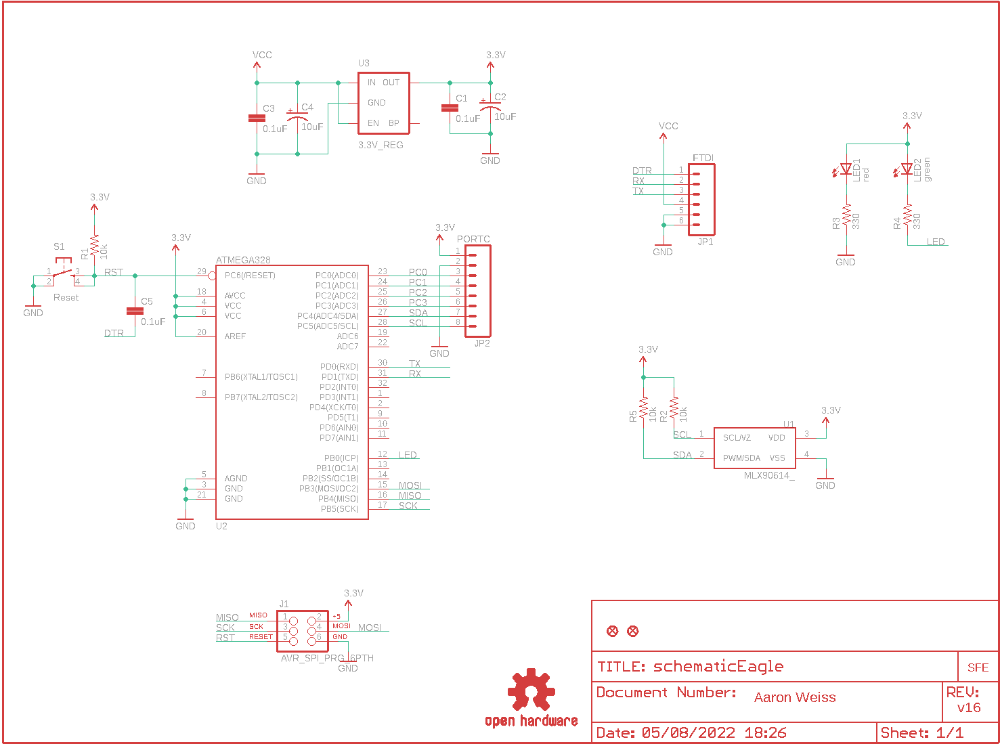

Contents
========

* [PRS10740 > Sparkfun](#prs10740--sparkfun)
	* [Schematic](#schematic)
	* [Interactive BOM](#interactive-bom)
	* [OOMP Parts](#oomp-parts)
	* [Images](#images)
	* [Tags](#tags)
  
![][im]
# PRS10740 > Sparkfun

- ID: PROJ-SPAR-10740-STAN-01
- Hex ID: PRS10740
- Name: Sparkfun
- Description: Sparkfun
- Long Link: [http://oom.lt/PROJ-SPAR-10740-STAN-01](http://oom.lt/PROJ-SPAR-10740-STAN-01)
- Short Link: [http://oom.lt/PRS10740](http://oom.lt/PRS10740)

## Schematic
  

## Interactive BOM

- Interactive BOM page: [ibom.html](https://htmlpreview.github.io/?https://github.com/oomlout/oomlout_OOMP_projects/blob/main/PROJ-SPAR-10740-STAN-01/kicad/bom/ibom.html)

## OOMP Parts
  

|OOMP Parts|
| :---: |
|C1,CAPC-0402-X-NF100-01,C1,0.1uF,CAP0402-CAP,0402-CAP,Capacitor,,|
|C2,CAPX-UNMATCHED-X-UF10-01,C2,10uF,CAP_POL1206,EIA3216,Capacitor Polarized,,|
|C3,CAPC-0402-X-NF100-01,C3,0.1uF,CAP0402-CAP,0402-CAP,Capacitor,,|
|C4,CAPX-UNMATCHED-X-UF10-01,C4,10uF,CAP_POL1206,EIA3216,Capacitor Polarized,,|
|C5,CAPC-0402-X-NF100-01,C5,0.1uF,CAP0402-CAP,0402-CAP,Capacitor,,|
|J1,UNMATCHED-UNMATCHED-X-UNMATCHED-01,J1,AVR_SPI_PRG_6PTH,AVR_SPI_PRG_6PTH,2X3,AVR ISP 6 Pin,,|
|JP1,HEAD-I01-X-PI06-01,JP1,FTDI,M06SIP,1X06,Header 6,,|
|JP2,HEAD-I01-X-PI08-01,JP2,PORTC,M08,1X08,Header 8,,|
|LED1,LEDS-0603-G-STAN-01,JP3,FIDUCIAL1X2.5,FIDUCIAL1X2.5,FIDUCIAL-1X2.5,Fiducial Alignment Points,,|
|LED2,LEDS-0603-G-STAN-01,JP4,LOGO-SFESK,LOGO-SFESK,SFE-LOGO-FLAME,Spark Fun Electronics PCB Logo,,|
|R1,RESE-0402-X-O103-01,JP5,FIDUCIAL1X2.5,FIDUCIAL1X2.5,FIDUCIAL-1X2.5,Fiducial Alignment Points,,|
|R2,RESE-0402-X-O103-01,LED1,red,LED0603,LED-0603,LEDs,,|
|R3,RESE-0402-X-O331-01,LED2,green,LED0603,LED-0603,LEDs,,|
|R4,RESE-0402-X-O331-01,R1,10k,RESISTOR0402-RES,0402-RES,Resistor,,|
|R5,RESE-0402-X-O103-01,R2,10k,RESISTOR0402-RES,0402-RES,Resistor,,|
|S1,UNMATCHED-UNMATCHED-X-UNMATCHED-01,R3,330,RESISTOR0402-RES,0402-RES,Resistor,,|
|U1,UNMATCHED-UNMATCHED-X-UNMATCHED-01,R4,330,RESISTOR0402-RES,0402-RES,Resistor,,|
|U2,UNMATCHED-UNMATCHED-X-UNMATCHED-01,R5,10k,RESISTOR0402-RES,0402-RES,Resistor,,|
|U3,UNMATCHED-SO235-X-UNMATCHED-01,S1,Reset,TAC_SWITCHSMD,TACTILE_SWITCH_SMD,Momentary Switch,,|

## Images
  
  

|kicadPcb3d|kicadPcb3dFront|kicadPcb3dBack|eagleImage|eagleSchemImage|
| :---: | :---: | :---: | :---: | :---: |
||||||

## Tags

- hexID: PRS10740
- oompType: PROJ
- oompSize: SPAR
- oompColor: 10740
- oompDesc: STAN
- oompIndex: 01
- oompName: IR Thermometer Evaluation Board-MLX90614
- sources: All source files from https://github.com/sparkfun/IR_Thermometer_Evaluation_Board-MLX90614 (source licence details in srcLicense.md)
- linkBuyPage: https://www.sparkfun.com/products/10740
- oompID: PROJ-SPAR-10740-STAN-01
- oompParts: C1,CAPC-0402-X-NF100-01
- oompParts: C2,CAPX-UNMATCHED-X-UF10-01
- oompParts: C3,CAPC-0402-X-NF100-01
- oompParts: C4,CAPX-UNMATCHED-X-UF10-01
- oompParts: C5,CAPC-0402-X-NF100-01
- oompParts: J1,UNMATCHED-UNMATCHED-X-UNMATCHED-01
- oompParts: JP1,HEAD-I01-X-PI06-01
- oompParts: JP2,HEAD-I01-X-PI08-01
- oompParts: LED1,LEDS-0603-G-STAN-01
- oompParts: LED2,LEDS-0603-G-STAN-01
- oompParts: R1,RESE-0402-X-O103-01
- oompParts: R2,RESE-0402-X-O103-01
- oompParts: R3,RESE-0402-X-O331-01
- oompParts: R4,RESE-0402-X-O331-01
- oompParts: R5,RESE-0402-X-O103-01
- oompParts: S1,UNMATCHED-UNMATCHED-X-UNMATCHED-01
- oompParts: U1,UNMATCHED-UNMATCHED-X-UNMATCHED-01
- oompParts: U2,UNMATCHED-UNMATCHED-X-UNMATCHED-01
- oompParts: U3,UNMATCHED-SO235-X-UNMATCHED-01
- rawParts: C1,0.1uF,CAP0402-CAP,0402-CAP,Capacitor,,
- rawParts: C2,10uF,CAP_POL1206,EIA3216,Capacitor Polarized,,
- rawParts: C3,0.1uF,CAP0402-CAP,0402-CAP,Capacitor,,
- rawParts: C4,10uF,CAP_POL1206,EIA3216,Capacitor Polarized,,
- rawParts: C5,0.1uF,CAP0402-CAP,0402-CAP,Capacitor,,
- rawParts: J1,AVR_SPI_PRG_6PTH,AVR_SPI_PRG_6PTH,2X3,AVR ISP 6 Pin,,
- rawParts: JP1,FTDI,M06SIP,1X06,Header 6,,
- rawParts: JP2,PORTC,M08,1X08,Header 8,,
- rawParts: JP3,FIDUCIAL1X2.5,FIDUCIAL1X2.5,FIDUCIAL-1X2.5,Fiducial Alignment Points,,
- rawParts: JP4,LOGO-SFESK,LOGO-SFESK,SFE-LOGO-FLAME,Spark Fun Electronics PCB Logo,,
- rawParts: JP5,FIDUCIAL1X2.5,FIDUCIAL1X2.5,FIDUCIAL-1X2.5,Fiducial Alignment Points,,
- rawParts: LED1,red,LED0603,LED-0603,LEDs,,
- rawParts: LED2,green,LED0603,LED-0603,LEDs,,
- rawParts: R1,10k,RESISTOR0402-RES,0402-RES,Resistor,,
- rawParts: R2,10k,RESISTOR0402-RES,0402-RES,Resistor,,
- rawParts: R3,330,RESISTOR0402-RES,0402-RES,Resistor,,
- rawParts: R4,330,RESISTOR0402-RES,0402-RES,Resistor,,
- rawParts: R5,10k,RESISTOR0402-RES,0402-RES,Resistor,,
- rawParts: S1,Reset,TAC_SWITCHSMD,TACTILE_SWITCH_SMD,Momentary Switch,,
- rawParts: U$1,OSHW-LOGOS,OSHW-LOGOS,OSHW-LOGO-S,Open Source Hardware Logo This logo indicates the piece of hardware it is found on incorporates a OSHW license and/or adheres to the definition of open source hardware found here: http://freedomdefined.org/OSHW,,
- rawParts: U1,MLX90614_,MLX90614_,TO-39,Melexis IR Thermometer,,
- rawParts: U2,ATMEGA328,ATMEGA168,TQFP32-08,,,
- rawParts: U3,3.3V_REG,V_REG_LDOSMD,SOT23-5,Voltage Regulator LDO,,

[im]: kicadPcb3d_450.png
