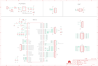

Contents
========

* [PRS10743 > Mega Pro Mini](#prs10743--mega-pro-mini)
	* [Schematic](#schematic)
	* [PCB](#pcb)
	* [Interactive BOM](#interactive-bom)
	* [OOMP Parts](#oomp-parts)
	* [Images](#images)
	* [Tags](#tags)
  
![][im]
# PRS10743 > Mega Pro Mini

- ID: PROJ-SPAR-10743-STAN-01
- Hex ID: PRS10743
- Name: Sparkfun
- Description: Sparkfun
- Long Link: [http://oom.lt/PROJ-SPAR-10743-STAN-01](http://oom.lt/PROJ-SPAR-10743-STAN-01)
- Short Link: [http://oom.lt/PRS10743](http://oom.lt/PRS10743)

## Schematic
  

## PCB
  

## Interactive BOM

- Interactive BOM page: [ibom.html](https://htmlpreview.github.io/?https://github.com/oomlout/oomlout_OOMP_projects/blob/main/PROJ-SPAR-10743-STAN-01/kicad/bom/ibom.html)

## OOMP Parts
  

|OOMP Parts|
| :---: |
|CAPC-0402-X-UF1D-01 C2, C3, C4, C5, C6, C9, C10|
|CAPT-3216-X-UF10-01 C7, C8|
|REFU-1206-X-UNMATCHED-01 F1|
|UNMATCHED-UNMATCHED-X-UNMATCHED-01 J1, S1, U1, Y1|
|HEAD-I01-X-UNMATCHED-01 JP1, JP2, JP3, JP4, JP5, JP6, JP7, JP8, JP9, JP10, JP12|
|[HEAD-I01-X-PI02-01  2.54 mm 2 Pin Header  JP18](https://github.com/oomlout/oomlout_OOMP_parts/tree/main/HEAD-I01-X-PI02-01/)|
|[HEAD-I01-X-PI06-01  2.54 mm 6 Pin Header  JP19](https://github.com/oomlout/oomlout_OOMP_parts/tree/main/HEAD-I01-X-PI06-01/)|
|[LEDS-0603-Y-STAN-01  SMD (0603) Yellow LED  LED1](https://github.com/oomlout/oomlout_OOMP_parts/tree/main/LEDS-0603-Y-STAN-01/)|
|[LEDS-0603-G-STAN-01  SMD (0603) Green LED  LED2](https://github.com/oomlout/oomlout_OOMP_parts/tree/main/LEDS-0603-G-STAN-01/)|
|[RESE-0402-X-O102-01  SMD (0402) 1k Ohm Resistor  R1, R7](https://github.com/oomlout/oomlout_OOMP_parts/tree/main/RESE-0402-X-O102-01/)|
|[RESE-0402-X-O103-01  SMD (0402) 10k Ohm Resistor  R2, R3, R4](https://github.com/oomlout/oomlout_OOMP_parts/tree/main/RESE-0402-X-O103-01/)|
|UNMATCHED-SO235-X-UNMATCHED-01 U2|

## Images
  
  

|kicadPcb3d|kicadPcb3dFront|kicadPcb3dBack|eagleImage|eagleSchemImage|
| :---: | :---: | :---: | :---: | :---: |
||||||

## Tags

- hexID: PRS10743
- oompType: PROJ
- oompSize: SPAR
- oompColor: 10743
- oompDesc: STAN
- oompIndex: 01
- oompName: Mega Pro Mini
- sources: All source files from https://github.com/sparkfun/Mega_Pro_Mini (source licence details in srcLicense.md)
- linkBuyPage: https://www.sparkfun.com/products/10743
- oompID: PROJ-SPAR-10743-STAN-01
- oompParts: C2,CAPC-0402-X-UF1D-01
- oompParts: C3,CAPC-0402-X-UF1D-01
- oompParts: C4,CAPC-0402-X-UF1D-01
- oompParts: C5,CAPC-0402-X-UF1D-01
- oompParts: C6,CAPC-0402-X-UF1D-01
- oompParts: C7,CAPT-3216-X-UF10-01
- oompParts: C8,CAPT-3216-X-UF10-01
- oompParts: C9,CAPC-0402-X-UF1D-01
- oompParts: C10,CAPC-0402-X-UF1D-01
- oompParts: F1,REFU-1206-X-UNMATCHED-01
- oompParts: J1,UNMATCHED-UNMATCHED-X-UNMATCHED-01
- oompParts: JP1,HEAD-I01-X-UNMATCHED-01
- oompParts: JP2,HEAD-I01-X-UNMATCHED-01
- oompParts: JP3,HEAD-I01-X-UNMATCHED-01
- oompParts: JP4,HEAD-I01-X-UNMATCHED-01
- oompParts: JP5,HEAD-I01-X-UNMATCHED-01
- oompParts: JP6,HEAD-I01-X-UNMATCHED-01
- oompParts: JP7,HEAD-I01-X-UNMATCHED-01
- oompParts: JP8,HEAD-I01-X-UNMATCHED-01
- oompParts: JP9,HEAD-I01-X-UNMATCHED-01
- oompParts: JP10,HEAD-I01-X-UNMATCHED-01
- oompParts: JP12,HEAD-I01-X-UNMATCHED-01
- oompParts: JP18,HEAD-I01-X-PI02-01
- oompParts: JP19,HEAD-I01-X-PI06-01
- oompParts: LED1,LEDS-0603-Y-STAN-01
- oompParts: LED2,LEDS-0603-G-STAN-01
- oompParts: R1,RESE-0402-X-O102-01
- oompParts: R2,RESE-0402-X-O103-01
- oompParts: R3,RESE-0402-X-O103-01
- oompParts: R4,RESE-0402-X-O103-01
- oompParts: R7,RESE-0402-X-O102-01
- oompParts: S1,UNMATCHED-UNMATCHED-X-UNMATCHED-01
- oompParts: U1,UNMATCHED-UNMATCHED-X-UNMATCHED-01
- oompParts: U2,UNMATCHED-SO235-X-UNMATCHED-01
- oompParts: Y1,UNMATCHED-UNMATCHED-X-UNMATCHED-01
- rawParts: C2,0.1uF,CAP0402-CAP,0402-CAP,Capacitor,,
- rawParts: C3,0.1uF,CAP0402-CAP,0402-CAP,Capacitor,,
- rawParts: C4,0.1uF,CAP0402-CAP,0402-CAP,Capacitor,,
- rawParts: C5,0.1uF,CAP0402-CAP,0402-CAP,Capacitor,,
- rawParts: C6,0.1uF,CAP0402-CAP,0402-CAP,Capacitor,,
- rawParts: C7,10uF,CAP_POL1206,EIA3216,Capacitor Polarized,,
- rawParts: C8,10uF,CAP_POL1206,EIA3216,Capacitor Polarized,,
- rawParts: C9,0.1uF,CAP0402-CAP,0402-CAP,Capacitor,,
- rawParts: C10,0.1uF,CAP0402-CAP,0402-CAP,Capacitor,,
- rawParts: F1,PTCSMD,PTCSMD,PTC-1206,Resettable Fuse PTC,,
- rawParts: J1,ISP,AVR_SPI_PRG_6PTH,2X3,AVR ISP 6 Pin,,
- rawParts: JP1,LiPo,M02-JST-2MM-SMT,JST-2-SMD,Header 2,,
- rawParts: JP2,PWMH,M08BM08B-SRSS-TB,BM08B-SRSS-TB,Header 8,,
- rawParts: JP3,ADCH,M08BM08B-SRSS-TB,BM08B-SRSS-TB,Header 8,,
- rawParts: JP4,ADCL,M08BM08B-SRSS-TB,BM08B-SRSS-TB,Header 8,,
- rawParts: JP5,XIOH1,M08BM08B-SRSS-TB,BM08B-SRSS-TB,Header 8,,
- rawParts: JP6,XIOH2,M08BM08B-SRSS-TB,BM08B-SRSS-TB,Header 8,,
- rawParts: JP7,COMM,M08BM08B-SRSS-TB,BM08B-SRSS-TB,Header 8,,
- rawParts: JP8,PWML,M08BM08B-SRSS-TB,BM08B-SRSS-TB,Header 8,,
- rawParts: JP9,XIOL2,M08BM08B-SRSS-TB,BM08B-SRSS-TB,Header 8,,
- rawParts: JP10,XIOL1,M08BM08B-SRSS-TB,BM08B-SRSS-TB,Header 8,,
- rawParts: JP11,STAND-OFF,STAND-OFF,STAND-OFF,Stand Off,,
- rawParts: JP12,POWER,M08BM08B-SRSS-TB,BM08B-SRSS-TB,Header 8,,
- rawParts: JP13,STAND-OFF,STAND-OFF,STAND-OFF,Stand Off,,
- rawParts: JP14,STAND-OFF,STAND-OFF,STAND-OFF,Stand Off,,
- rawParts: JP15,STAND-OFF,STAND-OFF,STAND-OFF,Stand Off,,
- rawParts: JP16,LOGO-SFENEW,LOGO-SFENEW,SFE-NEW-WEBLOGO,Spark Fun Electronics PCB Logo,,
- rawParts: JP17,LOGO-SFESK,LOGO-SFESK,SFE-LOGO-FLAME,Spark Fun Electronics PCB Logo,,
- rawParts: JP18,RAW,M02PTH,1X02,Header 2,,
- rawParts: JP19,FTDI,ARDUINO_SERIAL_PROGRAMSMD,1X06-SMD,,,
- rawParts: JP20,FIDUCIAL1X2.5,FIDUCIAL1X2.5,FIDUCIAL-1X2.5,Fiducial Alignment Points,,
- rawParts: JP21,FIDUCIAL1X2.5,FIDUCIAL1X2.5,FIDUCIAL-1X2.5,Fiducial Alignment Points,,
- rawParts: LED1,yellow,LED0603,LED-0603,LEDs,,
- rawParts: LED2,green,LED0603,LED-0603,LEDs,,
- rawParts: R1,1k,RESISTOR0402-RES,0402-RES,Resistor,,
- rawParts: R2,10k,RESISTOR0402-RES,0402-RES,Resistor,,
- rawParts: R3,10k,RESISTOR0402-RES,0402-RES,Resistor,,
- rawParts: R4,10k,RESISTOR0402-RES,0402-RES,Resistor,,
- rawParts: R7,1k,RESISTOR0402-RES,0402-RES,Resistor,,
- rawParts: S1,SWITCH-MOMENTARY-2SMD,SWITCH-MOMENTARY-2SMD,TACTILE_SWITCH_SMD,,,
- rawParts: SJ1,RESET-EN,SOLDERJUMPERNC,SJ_2S,Solder Jumper,,
- rawParts: U$9,OSHW-LOGOL,OSHW-LOGOL,OSHW-LOGO-L,Open Source Hardware Logo This logo indicates the piece of hardware it is found on incorporates a OSHW license and/or adheres to the definition of open source hardware found here: http://freedomdefined.org/OSHW,,
- rawParts: U1,ATMEGA2560AU,ATMEGA2560AU,TQFP100,MICROCONTROLLER,,
- rawParts: U2,V_REG_3.3V,V_REG_LDOSMD,SOT23-5,Voltage Regulator LDO,,
- rawParts: Y1,RESONATORSMD,RESONATORSMD,RESONATOR-SMD,Resonator,,

[im]: kicadPcb3d_450.png
