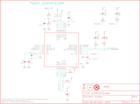

Contents
========

* [PRS10769 > OBD-II UART](#prs10769--obd-ii-uart)
	* [Schematic](#schematic)
	* [PCB](#pcb)
	* [Interactive BOM](#interactive-bom)
	* [Images](#images)
	* [Tags](#tags)
  
![][im]
# PRS10769 > OBD-II UART

- ID: PROJ-SPAR-10769-STAN-01
- Hex ID: PRS10769
- Name: Sparkfun
- Description: Sparkfun
- Long Link: [http://oom.lt/PROJ-SPAR-10769-STAN-01](http://oom.lt/PROJ-SPAR-10769-STAN-01)
- Short Link: [http://oom.lt/PRS10769](http://oom.lt/PRS10769)

## Schematic
  

## PCB
  

## Interactive BOM

- Interactive BOM page: [ibom.html](https://htmlpreview.github.io/?https://github.com/oomlout/oomlout_OOMP_projects/blob/main/PROJ-SPAR-10769-STAN-01/kicad/bom/ibom.html)

## Images
  
  

|bominteractivefront|bominteractiveback|kicadPcb3d|kicadPcb3dFront|kicadPcb3dBack|eagleImage|eagleSchemImage|pcbdraw|pcbdrawback|
| :---: | :---: | :---: | :---: | :---: | :---: | :---: | :---: | :---: |
||||||||||

## Tags

- hexID: PRS10769
- oompType: PROJ
- oompSize: SPAR
- oompColor: 10769
- oompDesc: STAN
- oompIndex: 01
- oompName: OBD-II UART
- sources: All source files from https://github.com/sparkfun/OBD-II_UART (source licence details in srcLicense.md)
- linkBuyPage: https://www.sparkfun.com/products/10769
- oompID: PROJ-SPAR-10769-STAN-01
- rawParts: C1,1uF,CAP0402-CAP,0402-CAP,Capacitor,,,,,,
- rawParts: C2,27pF,CAP0402-CAP,0402-CAP,Capacitor,,,,,,
- rawParts: C3,27pF,CAP0402-CAP,0402-CAP,Capacitor,,,,,,
- rawParts: C4,10uF ESR<=5,CAP_POL1206,EIA3216,Capacitor Polarized,,,,,,
- rawParts: C5,1uF,CAP0402-CAP,0402-CAP,Capacitor,,,,,,
- rawParts: C6,1uF,CAP0402-CAP,0402-CAP,Capacitor,,,,,,
- rawParts: C7,0.1uF,CAP0402-CAP,0402-CAP,Capacitor,,,,,,
- rawParts: C8,4.7uF,CAP0402-CAP,0402-CAP,Capacitor,,,,,,
- rawParts: C9,10uF,CAP_POL1206,EIA3216,Capacitor Polarized,,,,,,
- rawParts: C10,0.1uF,CAP0402-CAP,0402-CAP,Capacitor,,,,,,
- rawParts: C11,1uF,CAP0402-CAP,0402-CAP,Capacitor,,,,,,
- rawParts: C12,560pF,CAP0402-CAP,0402-CAP,Capacitor,,,,,,
- rawParts: C13,560pF,CAP0402-CAP,0402-CAP,Capacitor,,,,,,
- rawParts: C14,0.1uF,CAP0402-CAP,0402-CAP,Capacitor,,,,,,
- rawParts: C15,2.2uF,CAP0402-CAP,0402-CAP,Capacitor,,,,,,
- rawParts: C16,470pF,CAP0402-CAP,0402-CAP,Capacitor,,,,,,
- rawParts: C17,1uF,CAP0402-CAP,0402-CAP,Capacitor,,,,,,
- rawParts: C18,10uF,CAP_POL1206,EIA3216,Capacitor Polarized,,,,,,
- rawParts: D1,BAS16,DIODESOD,SOD-323,Diode,,,,,,
- rawParts: D2,BAS16,DIODESOD,SOD-323,Diode,,,,,,
- rawParts: D3,BAS16,DIODESOD,SOD-323,Diode,,,,,,
- rawParts: D4,MBRA140,DIODESMA,SMA-DIODE,Diode,,,,,,
- rawParts: IC1,SCANTOOL,SCANTOOL,_STN_SCANTOOL_QFN-28-S,STN1110 - Multiprotocol OBD II to UART Interpreter, QFN Package,,,,,,
- rawParts: IC3,LM339PWR,LM339PWR,TSSOP-14,Quad Differential Comparators,IC, Quad Comparator,Texas Instruments,LM339PWR,Digikey:296-6607-1-ND,PARTNUM,
- rawParts: IC4,MCP2551,MCP2551-I/SN,SO-8,CAN Driver,IC, CAN Transceiver,Microchip Technology,MCP2551-I/SN,Digikey:MCP2551-I/SN-ND,PARTNUM,
- rawParts: JP1,,M08,1X08,Header 8,,,,,,
- rawParts: JP2,FIDUCIAL1X2,FIDUCIAL1X2,FIDUCIAL-1X2,Fiducial Alignment Points,,,,,,
- rawParts: JP3,LOGO-SFENEW,LOGO-SFENEW,SFE-NEW-WEBLOGO,Spark Fun Electronics PCB Logo,,,,,,
- rawParts: JP4,STAND-OFF,STAND-OFF,STAND-OFF,Stand Off,,,,,,
- rawParts: JP5,STAND-OFF,STAND-OFF,STAND-OFF,Stand Off,,,,,,
- rawParts: JP6,STAND-OFF,STAND-OFF,STAND-OFF,Stand Off,,,,,,
- rawParts: JP7,STAND-OFF,STAND-OFF,STAND-OFF,Stand Off,,,,,,
- rawParts: JP8,DNP,FTDI_BASICPTH,FTDI_BASIC,FTDI Basic: 3.3V and 5V,,,,,,
- rawParts: JP9,DNP,M02PTH,1X02,Header 2,,,,,,
- rawParts: JP10,FIDUCIAL1X2,FIDUCIAL1X2,FIDUCIAL-1X2,Fiducial Alignment Points,,,,,,
- rawParts: LED1,YELLOW,LED0603,LED-0603,LEDs,,,,,,
- rawParts: LED2,RED,LED0603,LED-0603,LEDs,,,,,,
- rawParts: LED3,YELLOW,LED0603,LED-0603,LEDs,,,,,,
- rawParts: LED4,RED,LED0603,LED-0603,LEDs,,,,,,
- rawParts: LED5,RED,LED0603,LED-0603,LEDs,,,,,,
- rawParts: Q3,MMBT2222,TRANSISTOR_NPNSOT23-3,SOT23-3,Transistor NPN,,,,,,
- rawParts: Q4,MMBT2222,TRANSISTOR_NPNSOT23-3,SOT23-3,Transistor NPN,,,,,,
- rawParts: Q7,ZXMP6A13FTA,MOSFET-PCHANNEL,SOT23,,,,,,,
- rawParts: Q8,MMBT2222,TRANSISTOR_NPNSOT23-3,SOT23-3,Transistor NPN,,,,,,
- rawParts: Q9,BSS138,MOSFET-NCHANNELSMD,SOT23-3,,,,,,,
- rawParts: Q10,BSS138,MOSFET-NCHANNELSMD,SOT23-3,,,,,,,
- rawParts: R1,10k,RESISTOR0402-RES,0402-RES,Resistor,,,,,,
- rawParts: R2,1k,RESISTOR0402-RES,0402-RES,Resistor,,,,,,
- rawParts: R3,62K,RESISTOR0402-RES,0402-RES,Resistor,,,,,,
- rawParts: R4,330,RESISTOR0402-RES,0402-RES,Resistor,,,,,,
- rawParts: R5,330,RESISTOR0402-RES,0402-RES,Resistor,,,,,,
- rawParts: R6,10K,RESISTOR0402-RES,0402-RES,Resistor,,,,,,
- rawParts: R7,1k,RESISTOR0402-RES,0402-RES,Resistor,,,,,,
- rawParts: R8,510 0.5W,R-US_2010,2010,Resistor, US Symbol,Resistor,,,,VAL,
- rawParts: R9,10k,RESISTOR0402-RES,0402-RES,Resistor,,,,,,
- rawParts: R10,10k,RESISTOR0402-RES,0402-RES,Resistor,,,,,,
- rawParts: R11,510 0.5W,R-US_2010,2010,Resistor, US Symbol,Resistor,,,,VAL,
- rawParts: R12,10k,RESISTOR0402-RES,0402-RES,Resistor,,,,,,
- rawParts: R13,1k,RESISTOR0402-RES,0402-RES,Resistor,,,,,,
- rawParts: R14,100,RESISTOR0402-RES,0402-RES,Resistor,,,,,,
- rawParts: R15,100,RESISTOR0402-RES,0402-RES,Resistor,,,,,,
- rawParts: R16,4.7k,RESISTOR0402-RES,0402-RES,Resistor,,,,,,
- rawParts: R17,1.2k,RESISTOR0402-RES,0402-RES,Resistor,,,,,,
- rawParts: R18,10k,RESISTOR0402-RES,0402-RES,Resistor,,,,,,
- rawParts: R19,866,RESISTOR0402-RES,0402-RES,Resistor,,,,,,
- rawParts: R20,240,RESISTOR0402-RES,0402-RES,Resistor,,,,,,
- rawParts: R21,10k,RESISTOR0402-RES,0402-RES,Resistor,,,,,,
- rawParts: R22,374,RESISTOR0402-RES,0402-RES,Resistor,,,,,,
- rawParts: R23,4.7k,RESISTOR0402-RES,0402-RES,Resistor,,,,,,
- rawParts: R24,1.5k,RESISTOR0402-RES,0402-RES,Resistor,,,,,,
- rawParts: R25,4.7k,RESISTOR0402-RES,0402-RES,Resistor,,,,,,
- rawParts: R27,10k,RESISTOR0402-RES,0402-RES,Resistor,,,,,,
- rawParts: R28,10k,RESISTOR0402-RES,0402-RES,Resistor,,,,,,
- rawParts: R29,10k,RESISTOR0402-RES,0402-RES,Resistor,,,,,,
- rawParts: R30,10k,RESISTOR0402-RES,0402-RES,Resistor,,,,,,
- rawParts: R31,10k,RESISTOR0402-RES,0402-RES,Resistor,,,,,,
- rawParts: R32,1k,RESISTOR0402-RES,0402-RES,Resistor,,,,,,
- rawParts: R33,10k,RESISTOR0402-RES,0402-RES,Resistor,,,,,,
- rawParts: R34,1.5k,RESISTOR0402-RES,0402-RES,Resistor,,,,,,
- rawParts: R35,330,RESISTOR0402-RES,0402-RES,Resistor,,,,,,
- rawParts: R37,330,RESISTOR0402-RES,0402-RES,Resistor,,,,,,
- rawParts: U$1,CREATIVE_COMMONS,CREATIVE_COMMONS,CREATIVE_COMMONS,,,,,,,
- rawParts: U$14,OSHW-LOGO,OSHW-LOGO,OSHW-LOGO,,,,,,,
- rawParts: U1,3.3V,V_REG_LDOSMD,SOT23-5,Voltage Regulator LDO,,,,,,
- rawParts: U2,V_REG_317DPACK,V_REG_317DPACK,V-REG_DPACK,Voltage Regulator,,,,,,
- rawParts: U3,5V Reg.,V_REG_LDOSMD,SOT23-5,Voltage Regulator LDO,,,,,,
- rawParts: X2,Male DB9,DB9MALE,DB9_MALE,DB9 Connector,,,,,,
- rawParts: Y1,16MHz,CRYSTAL5X3,CRYSTAL-SMD-5X3,Crystals,,,,,,

[im]: kicadPcb3d_450.png
