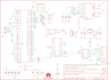

Contents
========

* [PRS10864 > PoEthernet Shield](#prs10864--poethernet-shield)
	* [Schematic](#schematic)
	* [PCB](#pcb)
	* [OOMP Parts](#oomp-parts)
	* [Images](#images)
	* [Tags](#tags)
  
![][im]
# PRS10864 > PoEthernet Shield

- ID: PROJ-SPAR-10864-STAN-01
- Hex ID: PRS10864
- Name: Sparkfun
- Description: Sparkfun
- Long Link: [http://oom.lt/PROJ-SPAR-10864-STAN-01](http://oom.lt/PROJ-SPAR-10864-STAN-01)
- Short Link: [http://oom.lt/PRS10864](http://oom.lt/PRS10864)

## Schematic
  

## PCB
  

## OOMP Parts
  

|OOMP ID|Name|Identifier|
| :---: | :---: | :---: |
|[CAPC-0402-X-NF100-V10](https://github.com/oomlout/oomlout_OOMP_parts/tree/main/CAPC-0402-X-NF100-V10/)|[SMD (0402) 100 nF Capacitor (Ceramic) 10v](https://github.com/oomlout/oomlout_OOMP_parts/tree/main/CAPC-0402-X-NF100-V10/)|[C1, C7, C8, C9, C10, C11, C12, C13, C15, C17, C21](https://github.com/oomlout/oomlout_OOMP_parts/tree/main/CAPC-0402-X-NF100-V10/)|
|[CAPC-0402-X-PF18-V50](https://github.com/oomlout/oomlout_OOMP_parts/tree/main/CAPC-0402-X-PF18-V50/)|[SMD (0402) 18 pF Capacitor (Ceramic) 50v](https://github.com/oomlout/oomlout_OOMP_parts/tree/main/CAPC-0402-X-PF18-V50/)|[C3, C4](https://github.com/oomlout/oomlout_OOMP_parts/tree/main/CAPC-0402-X-PF18-V50/)|
|[CAPC-1206-X-UF10-V25](https://github.com/oomlout/oomlout_OOMP_parts/tree/main/CAPC-1206-X-UF10-V25/)|[SMD (1206) 10 uF Capacitor (Ceramic) 25v](https://github.com/oomlout/oomlout_OOMP_parts/tree/main/CAPC-1206-X-UF10-V25/)|[C5, C14](https://github.com/oomlout/oomlout_OOMP_parts/tree/main/CAPC-1206-X-UF10-V25/)|
|CAPT-3216-X-UF10-01||C19, C20|
|FERB-0805-X-UNMATCHED-01||FB1, FB2, FB3|
|UNMATCHED-UNMATCHED-X-UNMATCHED-01||IC2, S2, U1, U2, U3, U4, U5, U6, U7, Y1|
|[HEAD-I01-X-PI04-01](https://github.com/oomlout/oomlout_OOMP_parts/tree/main/HEAD-I01-X-PI04-01/)|[2.54 mm 4 Pin Header](https://github.com/oomlout/oomlout_OOMP_parts/tree/main/HEAD-I01-X-PI04-01/)|[JP1](https://github.com/oomlout/oomlout_OOMP_parts/tree/main/HEAD-I01-X-PI04-01/)|
|[LEDS-0603-L-STAN-01](https://github.com/oomlout/oomlout_OOMP_parts/tree/main/LEDS-0603-L-STAN-01/)|[SMD (0603) Blue LED](https://github.com/oomlout/oomlout_OOMP_parts/tree/main/LEDS-0603-L-STAN-01/)|[LED1](https://github.com/oomlout/oomlout_OOMP_parts/tree/main/LEDS-0603-L-STAN-01/)|
|[LEDS-0603-G-STAN-01](https://github.com/oomlout/oomlout_OOMP_parts/tree/main/LEDS-0603-G-STAN-01/)|[SMD (0603) Green LED](https://github.com/oomlout/oomlout_OOMP_parts/tree/main/LEDS-0603-G-STAN-01/)|[LED2, LED5](https://github.com/oomlout/oomlout_OOMP_parts/tree/main/LEDS-0603-G-STAN-01/)|
|[LEDS-0603-Y-STAN-01](https://github.com/oomlout/oomlout_OOMP_parts/tree/main/LEDS-0603-Y-STAN-01/)|[SMD (0603) Yellow LED](https://github.com/oomlout/oomlout_OOMP_parts/tree/main/LEDS-0603-Y-STAN-01/)|[LED3](https://github.com/oomlout/oomlout_OOMP_parts/tree/main/LEDS-0603-Y-STAN-01/)|
|[LEDS-0603-R-STAN-01](https://github.com/oomlout/oomlout_OOMP_parts/tree/main/LEDS-0603-R-STAN-01/)|[SMD (0603) Red LED](https://github.com/oomlout/oomlout_OOMP_parts/tree/main/LEDS-0603-R-STAN-01/)|[LED4](https://github.com/oomlout/oomlout_OOMP_parts/tree/main/LEDS-0603-R-STAN-01/)|
|[RESE-0402-X-O102-01](https://github.com/oomlout/oomlout_OOMP_parts/tree/main/RESE-0402-X-O102-01/)|[SMD (0402) 1k Ohm Resistor](https://github.com/oomlout/oomlout_OOMP_parts/tree/main/RESE-0402-X-O102-01/)|[R1, R2, R3, R4, R5, R6, R7, R8, R11](https://github.com/oomlout/oomlout_OOMP_parts/tree/main/RESE-0402-X-O102-01/)|
|[RESE-0402-X-O105-01](https://github.com/oomlout/oomlout_OOMP_parts/tree/main/RESE-0402-X-O105-01/)|[SMD (0402) 1M Ohm Resistor](https://github.com/oomlout/oomlout_OOMP_parts/tree/main/RESE-0402-X-O105-01/)|[R9](https://github.com/oomlout/oomlout_OOMP_parts/tree/main/RESE-0402-X-O105-01/)|
|RESE-0402-X-O301-01||R10|
|[RESE-0402-X-O123-01](https://github.com/oomlout/oomlout_OOMP_parts/tree/main/RESE-0402-X-O123-01/)|[SMD (0402) 12k Ohm Resistor](https://github.com/oomlout/oomlout_OOMP_parts/tree/main/RESE-0402-X-O123-01/)|[R12](https://github.com/oomlout/oomlout_OOMP_parts/tree/main/RESE-0402-X-O123-01/)|
|RESE-0402-X-UNMATCHED-01||R13, R14, R15, R16|
|[RESE-0402-X-O103-01](https://github.com/oomlout/oomlout_OOMP_parts/tree/main/RESE-0402-X-O103-01/)|[SMD (0402) 10k Ohm Resistor](https://github.com/oomlout/oomlout_OOMP_parts/tree/main/RESE-0402-X-O103-01/)|[R17](https://github.com/oomlout/oomlout_OOMP_parts/tree/main/RESE-0402-X-O103-01/)|
|RESE-0402-X-O241-01||R20|
|RESE-0402-X-O391-01||R21|

## Images
  
  

|kicadPcb3d|kicadPcb3dFront|kicadPcb3dBack|eagleImage|eagleSchemImage|
| :---: | :---: | :---: | :---: | :---: |
||||||

## Tags

- hexID: PRS10864
- oompType: PROJ
- oompSize: SPAR
- oompColor: 10864
- oompDesc: STAN
- oompIndex: 01
- oompName: PoEthernet Shield
- sources: All source files from https://github.com/sparkfun/PoEthernet_Shield (source licence details in srcLicense.md)
- linkBuyPage: https://www.sparkfun.com/products/10864
- oompID: PROJ-SPAR-10864-STAN-01
- oompParts: C1,CAPC-0402-X-NF100-V10
- oompParts: C3,CAPC-0402-X-PF18-V50
- oompParts: C4,CAPC-0402-X-PF18-V50
- oompParts: C5,CAPC-1206-X-UF10-V25
- oompParts: C7,CAPC-0402-X-NF100-V10
- oompParts: C8,CAPC-0402-X-NF100-V10
- oompParts: C9,CAPC-0402-X-NF100-V10
- oompParts: C10,CAPC-0402-X-NF100-V10
- oompParts: C11,CAPC-0402-X-NF100-V10
- oompParts: C12,CAPC-0402-X-NF100-V10
- oompParts: C13,CAPC-0402-X-NF100-V10
- oompParts: C14,CAPC-1206-X-UF10-V25
- oompParts: C15,CAPC-0402-X-NF100-V10
- oompParts: C17,CAPC-0402-X-NF100-V10
- oompParts: C19,CAPT-3216-X-UF10-01
- oompParts: C20,CAPT-3216-X-UF10-01
- oompParts: C21,CAPC-0402-X-NF100-V10
- oompParts: FB1,FERB-0805-X-UNMATCHED-01
- oompParts: FB2,FERB-0805-X-UNMATCHED-01
- oompParts: FB3,FERB-0805-X-UNMATCHED-01
- oompParts: IC2,UNMATCHED-UNMATCHED-X-UNMATCHED-01
- oompParts: JP1,HEAD-I01-X-PI04-01
- oompParts: LED1,LEDS-0603-L-STAN-01
- oompParts: LED2,LEDS-0603-G-STAN-01
- oompParts: LED3,LEDS-0603-Y-STAN-01
- oompParts: LED4,LEDS-0603-R-STAN-01
- oompParts: LED5,LEDS-0603-G-STAN-01
- oompParts: R1,RESE-0402-X-O102-01
- oompParts: R2,RESE-0402-X-O102-01
- oompParts: R3,RESE-0402-X-O102-01
- oompParts: R4,RESE-0402-X-O102-01
- oompParts: R5,RESE-0402-X-O102-01
- oompParts: R6,RESE-0402-X-O102-01
- oompParts: R7,RESE-0402-X-O102-01
- oompParts: R8,RESE-0402-X-O102-01
- oompParts: R9,RESE-0402-X-O105-01
- oompParts: R10,RESE-0402-X-O301-01
- oompParts: R11,RESE-0402-X-O102-01
- oompParts: R12,RESE-0402-X-O123-01
- oompParts: R13,RESE-0402-X-UNMATCHED-01
- oompParts: R14,RESE-0402-X-UNMATCHED-01
- oompParts: R15,RESE-0402-X-UNMATCHED-01
- oompParts: R16,RESE-0402-X-UNMATCHED-01
- oompParts: R17,RESE-0402-X-O103-01
- oompParts: R20,RESE-0402-X-O241-01
- oompParts: R21,RESE-0402-X-O391-01
- oompParts: S2,UNMATCHED-UNMATCHED-X-UNMATCHED-01
- oompParts: U1,UNMATCHED-UNMATCHED-X-UNMATCHED-01
- oompParts: U2,UNMATCHED-UNMATCHED-X-UNMATCHED-01
- oompParts: U3,UNMATCHED-UNMATCHED-X-UNMATCHED-01
- oompParts: U4,UNMATCHED-UNMATCHED-X-UNMATCHED-01
- oompParts: U5,UNMATCHED-UNMATCHED-X-UNMATCHED-01
- oompParts: U6,UNMATCHED-UNMATCHED-X-UNMATCHED-01
- oompParts: U7,UNMATCHED-UNMATCHED-X-UNMATCHED-01
- oompParts: Y1,UNMATCHED-UNMATCHED-X-UNMATCHED-01
- rawParts: C1,0.1uF,CAP0402-CAP,0402-CAP,Capacitor,,
- rawParts: C3,18pF,CAP0402-CAP,0402-CAP,Capacitor,,
- rawParts: C4,18pF,CAP0402-CAP,0402-CAP,Capacitor,,
- rawParts: C5,10uF,CAP1206,1206,Capacitor,,
- rawParts: C7,0.1uF,CAP0402-CAP,0402-CAP,Capacitor,,
- rawParts: C8,0.1uF,CAP0402-CAP,0402-CAP,Capacitor,,
- rawParts: C9,0.1uF,CAP0402-CAP,0402-CAP,Capacitor,,
- rawParts: C10,0.1uF,CAP0402-CAP,0402-CAP,Capacitor,,
- rawParts: C11,0.1uF,CAP0402-CAP,0402-CAP,Capacitor,,
- rawParts: C12,0.1uF,CAP0402-CAP,0402-CAP,Capacitor,,
- rawParts: C13,0.1uF,CAP0402-CAP,0402-CAP,Capacitor,,
- rawParts: C14,10uF,CAP1206,1206,Capacitor,,
- rawParts: C15,0.1uF,CAP0402-CAP,0402-CAP,Capacitor,,
- rawParts: C17,0.1uF,CAP0402-CAP,0402-CAP,Capacitor,,
- rawParts: C19,10uF,CAP_POL1206,EIA3216,Capacitor Polarized,,
- rawParts: C20,10uF,CAP_POL1206,EIA3216,Capacitor Polarized,,
- rawParts: C21,0.1uF,CAP0402-CAP,0402-CAP,Capacitor,,
- rawParts: FB1,1uH,INDUCTOR0805,0805,Inductors,,
- rawParts: FB2,1uH,INDUCTOR0805,0805,Inductors,,
- rawParts: FB3,1uH,INDUCTOR0805,0805,Inductors,,
- rawParts: IC2,LM1117,V_REG_LM1117SOT223,SOT223,Voltage Regulator LM1117,,
- rawParts: JP1,,M04PTH,1X04,Header 4,,
- rawParts: JP2,LOGO-SFENW2,LOGO-SFENW2,SFE-NEW-WEB,Spark Fun Electronics PCB Logo,,
- rawParts: JP3,FIDUCIALUFIDUCIAL,FIDUCIALUFIDUCIAL,MICRO-FIDUCIAL,Fiducial Alignment Points,,
- rawParts: JP4,FIDUCIALUFIDUCIAL,FIDUCIALUFIDUCIAL,MICRO-FIDUCIAL,Fiducial Alignment Points,,
- rawParts: LED1,BLUE,LED0603,LED-0603,LEDs,,
- rawParts: LED2,GREEN,LED0603,LED-0603,LEDs,,
- rawParts: LED3,YELLOW,LED0603,LED-0603,LEDs,,
- rawParts: LED4,RED,LED0603,LED-0603,LEDs,,
- rawParts: LED5,GREEN,LED0603,LED-0603,LEDs,,
- rawParts: R1,1k,RESISTOR0402-RES,0402-RES,Resistor,,
- rawParts: R2,1k,RESISTOR0402-RES,0402-RES,Resistor,,
- rawParts: R3,1k,RESISTOR0402-RES,0402-RES,Resistor,,
- rawParts: R4,1k,RESISTOR0402-RES,0402-RES,Resistor,,
- rawParts: R5,1k,RESISTOR0402-RES,0402-RES,Resistor,,
- rawParts: R6,1k,RESISTOR0402-RES,0402-RES,Resistor,,
- rawParts: R7,1k,RESISTOR0402-RES,0402-RES,Resistor,,
- rawParts: R8,1k,RESISTOR0402-RES,0402-RES,Resistor,,
- rawParts: R9,1M,RESISTOR0402-RES,0402-RES,Resistor,,
- rawParts: R10,300,RESISTOR0402-RES,0402-RES,Resistor,,
- rawParts: R11,1k,RESISTOR0402-RES,0402-RES,Resistor,,
- rawParts: R12,12k,RESISTOR0402-RES,0402-RES,Resistor,,
- rawParts: R13,49.9,RESISTOR0402-RES,0402-RES,Resistor,,
- rawParts: R14,49.9,RESISTOR0402-RES,0402-RES,Resistor,,
- rawParts: R15,49.9,RESISTOR0402-RES,0402-RES,Resistor,,
- rawParts: R16,49.9,RESISTOR0402-RES,0402-RES,Resistor,,
- rawParts: R17,10k,RESISTOR0402-RES,0402-RES,Resistor,,
- rawParts: R20,240,RESISTOR0402-RES,0402-RES,Resistor,,
- rawParts: R21,390,RESISTOR0402-RES,0402-RES,Resistor,,
- rawParts: S2,RESET,SWITCH-MOMENTARY-2SMD,TACTILE_SWITCH_SMD,,,
- rawParts: SJ2,NO,SOLDERJUMPERNO,SJ_2S-NO,Solder Jumper,,
- rawParts: U$1,CREATIVE_COMMONS,CREATIVE_COMMONS,CREATIVE_COMMONS,,,
- rawParts: U$5,OSHW-LOGOM,OSHW-LOGOM,OSHW-LOGO-M,Open Source Hardware Logo This logo indicates the piece of hardware it is found on incorporates a OSHW license and/or adheres to the definition of open source hardware found here: http://freedomdefined.org/OSHW,,
- rawParts: U1,W5100,W5100,LQFP-80,WIZnet W5100,,
- rawParts: U2,USD-SOCKETNEW,USD-SOCKETNEW,MICRO-SD-SOCKET-PP,microSD Socket,,
- rawParts: U3,ARDUINO_SHIELDNOLABELS,ARDUINO_SHIELDNOLABELS,DUEMILANOVE_SHIELD_NOLABELS,,,
- rawParts: U4,74HC4050,HEX_CONVERTER,SO016,,,
- rawParts: U5,NC7SPU04P5X,INVERTER,SC70,Single inverter, SOT23-5,,
- rawParts: U6,MAGJACK-POE,MAGJACK-POE,MAGJACK-POE,,,
- rawParts: U7,STM811,STM811,SOT143,,,
- rawParts: Y1,25MHz,CRYSTAL5X3,CRYSTAL-SMD-5X3,Crystals,,

[im]: kicadPcb3d_450.png
