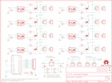

Contents
========

* [PRS10878 > Sparkfun](#prs10878--sparkfun)
	* [Schematic](#schematic)
	* [Interactive BOM](#interactive-bom)
	* [OOMP Parts](#oomp-parts)
	* [Images](#images)
	* [Tags](#tags)
  
![][im]
# PRS10878 > Sparkfun

- ID: PROJ-SPAR-10878-STAN-01
- Hex ID: PRS10878
- Name: Sparkfun
- Description: Sparkfun
- Long Link: [http://oom.lt/PROJ-SPAR-10878-STAN-01](http://oom.lt/PROJ-SPAR-10878-STAN-01)
- Short Link: [http://oom.lt/PRS10878](http://oom.lt/PRS10878)

## Schematic
  

## Interactive BOM

- Interactive BOM page: [ibom.html](https://htmlpreview.github.io/?https://github.com/oomlout/oomlout_OOMP_projects/blob/main/PROJ-SPAR-10878-STAN-01/kicad/bom/ibom.html)

## OOMP Parts
  

|OOMP Parts|
| :---: |
|C1,CAPC-0603-X-NF100-V50,C1,0.1uF,CAP0603-CAP,0603-CAP,Capacitor,,|
|C2,CAPX-UNMATCHED-X-UF10-01,C2,10uF,CAP_POL1206,EIA3216,Capacitor Polarized,,|
|CHAN_A,UNMATCHED-UNMATCHED-X-UNMATCHED-01,CHAN_A,,M02-JST-2MM-SMT,JST-2-SMD,Header 2,,|
|CHAN_B,UNMATCHED-UNMATCHED-X-UNMATCHED-01,CHAN_B,,M02-JST-2MM-SMT,JST-2-SMD,Header 2,,|
|CHAN_C,UNMATCHED-UNMATCHED-X-UNMATCHED-01,CHAN_C,,M02-JST-2MM-SMT,JST-2-SMD,Header 2,,|
|CHAN_D,UNMATCHED-UNMATCHED-X-UNMATCHED-01,CHAN_D,,M02-JST-2MM-SMT,JST-2-SMD,Header 2,,|
|CHAN_E,UNMATCHED-UNMATCHED-X-UNMATCHED-01,CHAN_E,,M02-JST-2MM-SMT,JST-2-SMD,Header 2,,|
|CHAN_F,UNMATCHED-UNMATCHED-X-UNMATCHED-01,CHAN_F,,M02-JST-2MM-SMT,JST-2-SMD,Header 2,,|
|CHAN_G,UNMATCHED-UNMATCHED-X-UNMATCHED-01,CHAN_G,,M02-JST-2MM-SMT,JST-2-SMD,Header 2,,|
|CHAN_H,UNMATCHED-UNMATCHED-X-UNMATCHED-01,CHAN_H,,M02-JST-2MM-SMT,JST-2-SMD,Header 2,,|
|D1,LEDS-0603-G-STAN-01,D1,Status,LED0603,LED-0603,LEDs,,|
|JP1,HEAD-I01-X-PI02-01,JP1,,M02PTH,1X02,Header 2,,|
|JP2,HEAD-I01-X-PI02-01,JP2,,M02PTH,1X02,Header 2,,|
|JP3,HEAD-I01-X-PI02-01,JP3,,M02PTH,1X02,Header 2,,|
|JP4,HEAD-I01-X-PI02-01,JP4,,M02PTH,1X02,Header 2,,|
|JP5,HEAD-I01-X-PI02-01,JP5,,M02PTH,1X02,Header 2,,|
|JP6,HEAD-I01-X-PI02-01,JP6,,M02PTH,1X02,Header 2,,|
|JP7,HEAD-I01-X-PI02-01,JP7,,M02PTH,1X02,Header 2,,|
|JP8,HEAD-I01-X-PI02-01,JP8,,M02PTH,1X02,Header 2,,|
|JP10,HEAD-I01-X-PI08-01,JP9,LOGO-SFENEW,LOGO-SFENEW,SFE-NEW-WEBLOGO,Spark Fun Electronics PCB Logo,,|
|JP11,UNMATCHED-UNMATCHED-X-UNMATCHED-01,JP10,,M081X08,1X08,Header 8,,|
|JP12,HEAD-I01-X-PI02-01,JP11,,M02-JST-2MM-SMT,JST-2-SMD,Header 2,,|
|JP13,HEAD-I01-X-PI02-01,JP12,,M02PTH,1X02,Header 2,,|
|JP14,UNMATCHED-UNMATCHED-X-UNMATCHED-01,JP13,,M02PTH,1X02,Header 2,,|
|R1,RESE-0603-X-O331-01,JP14,,M02-JST-2MM-SMT,JST-2-SMD,Header 2,,|
|R2,RESE-0603-X-O391-01,JP15,LOGO-SFENEW,LOGO-SFENEW,SFE-NEW-WEBLOGO,Spark Fun Electronics PCB Logo,,|
|R3,RESE-0603-X-O331-01,JP16,FIDUCIALUFIDUCIAL,FIDUCIALUFIDUCIAL,MICRO-FIDUCIAL,Fiducial Alignment Points,,|
|R4,RESE-0603-X-O331-01,JP17,FIDUCIALUFIDUCIAL,FIDUCIALUFIDUCIAL,MICRO-FIDUCIAL,Fiducial Alignment Points,,|
|R5,RESE-0603-X-O391-01,R1,330,RESISTOR0603-RES,0603-RES,Resistor,,|
|R6,RESE-0603-X-O331-01,R2,390,RESISTOR0603-RES,0603-RES,Resistor,,|
|R7,RESE-0603-X-O331-01,R3,330,RESISTOR0603-RES,0603-RES,Resistor,,|
|R8,RESE-0603-X-O391-01,R4,330,RESISTOR0603-RES,0603-RES,Resistor,,|
|R9,RESE-0603-X-O331-01,R5,390,RESISTOR0603-RES,0603-RES,Resistor,,|
|R10,RESE-0603-X-O331-01,R6,330,RESISTOR0603-RES,0603-RES,Resistor,,|
|R11,RESE-0603-X-O391-01,R7,330,RESISTOR0603-RES,0603-RES,Resistor,,|
|R12,RESE-0603-X-O331-01,R8,390,RESISTOR0603-RES,0603-RES,Resistor,,|
|R13,RESE-0603-X-O331-01,R9,330,RESISTOR0603-RES,0603-RES,Resistor,,|
|R14,RESE-0603-X-O391-01,R10,330,RESISTOR0603-RES,0603-RES,Resistor,,|
|R15,RESE-0603-X-O331-01,R11,390,RESISTOR0603-RES,0603-RES,Resistor,,|
|R16,RESE-0603-X-O331-01,R12,330,RESISTOR0603-RES,0603-RES,Resistor,,|
|R17,RESE-0603-X-O391-01,R13,330,RESISTOR0603-RES,0603-RES,Resistor,,|
|R18,RESE-0603-X-O331-01,R14,390,RESISTOR0603-RES,0603-RES,Resistor,,|
|R19,RESE-0603-X-O331-01,R15,330,RESISTOR0603-RES,0603-RES,Resistor,,|
|R20,RESE-0603-X-O391-01,R16,330,RESISTOR0603-RES,0603-RES,Resistor,,|
|R21,RESE-0603-X-O331-01,R17,390,RESISTOR0603-RES,0603-RES,Resistor,,|
|R22,RESE-0603-X-O331-01,R18,330,RESISTOR0603-RES,0603-RES,Resistor,,|
|R23,RESE-0603-X-O391-01,R19,330,RESISTOR0603-RES,0603-RES,Resistor,,|
|R24,RESE-0603-X-O331-01,R20,390,RESISTOR0603-RES,0603-RES,Resistor,,|
|R25,RESE-0603-X-O331-01,R21,330,RESISTOR0603-RES,0603-RES,Resistor,,|
|R26,RESE-0603-X-O391-01,R22,330,RESISTOR0603-RES,0603-RES,Resistor,,|
|R27,RESE-0603-X-O241-01,R23,390,RESISTOR0603-RES,0603-RES,Resistor,,|
|R28,RESE-UNMATCHED-X-UNMATCHED-01,R24,330,RESISTOR0603-RES,0603-RES,Resistor,,|
|R29,RESE-UNMATCHED-X-UNMATCHED-01,R25,330,RESISTOR0603-RES,0603-RES,Resistor,,|
|U$4,UNMATCHED-UNMATCHED-X-UNMATCHED-01,R26,390,RESISTOR0603-RES,0603-RES,Resistor,,|
|U1,UNMATCHED-UNMATCHED-X-UNMATCHED-01,R27,240,RESISTOR0603-RES,0603-RES,Resistor,,|
|U2,UNMATCHED-UNMATCHED-X-UNMATCHED-01,R28,B,RESISTORPTH-1/4W,AXIAL-0.4,Resistor,,|
|U3,UNMATCHED-UNMATCHED-X-UNMATCHED-01,R29,A,RESISTORPTH-1/4W,AXIAL-0.4,Resistor,,|
|U4,UNMATCHED-UNMATCHED-X-UNMATCHED-01,SJ1,,SOLDERJUMPERNO,SJ_2S-NO,Solder Jumper,,|
|U5,UNMATCHED-UNMATCHED-X-UNMATCHED-01,U$4,CREATIVE_COMMONS,CREATIVE_COMMONS,CREATIVE_COMMONS,,,|
|U6,UNMATCHED-UNMATCHED-X-UNMATCHED-01,U$5,OSHW-LOGOS,OSHW-LOGOS,OSHW-LOGO-S,Open Source Hardware Logo This logo indicates the piece of hardware it is found on incorporates a OSHW license and/or adheres to the definition of open source hardware found here: http://freedomdefined.org/OSHW,,|
|U7,UNMATCHED-UNMATCHED-X-UNMATCHED-01,U1,MOC3063S,MOC3063S,DIP8SMD,Optotriac in DIP and SMD,,|
|U8,UNMATCHED-UNMATCHED-X-UNMATCHED-01,U2,Z0103MN,TRIACSMD,SOT223,,,|
|U9,UNMATCHED-UNMATCHED-X-UNMATCHED-01,U3,MOC3063S,MOC3063S,DIP8SMD,Optotriac in DIP and SMD,,|
|U10,UNMATCHED-UNMATCHED-X-UNMATCHED-01,U4,Z0103MN,TRIACSMD,SOT223,,,|
|U11,UNMATCHED-UNMATCHED-X-UNMATCHED-01,U5,MOC3063S,MOC3063S,DIP8SMD,Optotriac in DIP and SMD,,|
|U12,UNMATCHED-UNMATCHED-X-UNMATCHED-01,U6,Z0103MN,TRIACSMD,SOT223,,,|
|U13,UNMATCHED-UNMATCHED-X-UNMATCHED-01,U7,MOC3063S,MOC3063S,DIP8SMD,Optotriac in DIP and SMD,,|
|U14,UNMATCHED-UNMATCHED-X-UNMATCHED-01,U8,Z0103MN,TRIACSMD,SOT223,,,|
|U15,UNMATCHED-UNMATCHED-X-UNMATCHED-01,U9,MOC3063S,MOC3063S,DIP8SMD,Optotriac in DIP and SMD,,|
|U16,UNMATCHED-UNMATCHED-X-UNMATCHED-01,U10,Z0103MN,TRIACSMD,SOT223,,,|
|U17,UNMATCHED-UNMATCHED-X-UNMATCHED-01,U11,MOC3063S,MOC3063S,DIP8SMD,Optotriac in DIP and SMD,,|
|U18,UNMATCHED-UNMATCHED-X-UNMATCHED-01,U12,Z0103MN,TRIACSMD,SOT223,,,|

## Images
  
  

|kicadPcb3d|kicadPcb3dFront|kicadPcb3dBack|eagleImage|eagleSchemImage|
| :---: | :---: | :---: | :---: | :---: |
||||||

## Tags

- hexID: PRS10878
- oompType: PROJ
- oompSize: SPAR
- oompColor: 10878
- oompDesc: STAN
- oompIndex: 01
- oompName: EL Escudo Dos
- sources: All source files from https://github.com/sparkfun/EL_Escudo_Dos (source licence details in srcLicense.md)
- linkBuyPage: https://www.sparkfun.com/products/10878
- oompID: PROJ-SPAR-10878-STAN-01
- oompParts: C1,CAPC-0603-X-NF100-V50
- oompParts: C2,CAPX-UNMATCHED-X-UF10-01
- oompParts: CHAN_A,UNMATCHED-UNMATCHED-X-UNMATCHED-01
- oompParts: CHAN_B,UNMATCHED-UNMATCHED-X-UNMATCHED-01
- oompParts: CHAN_C,UNMATCHED-UNMATCHED-X-UNMATCHED-01
- oompParts: CHAN_D,UNMATCHED-UNMATCHED-X-UNMATCHED-01
- oompParts: CHAN_E,UNMATCHED-UNMATCHED-X-UNMATCHED-01
- oompParts: CHAN_F,UNMATCHED-UNMATCHED-X-UNMATCHED-01
- oompParts: CHAN_G,UNMATCHED-UNMATCHED-X-UNMATCHED-01
- oompParts: CHAN_H,UNMATCHED-UNMATCHED-X-UNMATCHED-01
- oompParts: D1,LEDS-0603-G-STAN-01
- oompParts: JP1,HEAD-I01-X-PI02-01
- oompParts: JP2,HEAD-I01-X-PI02-01
- oompParts: JP3,HEAD-I01-X-PI02-01
- oompParts: JP4,HEAD-I01-X-PI02-01
- oompParts: JP5,HEAD-I01-X-PI02-01
- oompParts: JP6,HEAD-I01-X-PI02-01
- oompParts: JP7,HEAD-I01-X-PI02-01
- oompParts: JP8,HEAD-I01-X-PI02-01
- oompParts: JP10,HEAD-I01-X-PI08-01
- oompParts: JP11,UNMATCHED-UNMATCHED-X-UNMATCHED-01
- oompParts: JP12,HEAD-I01-X-PI02-01
- oompParts: JP13,HEAD-I01-X-PI02-01
- oompParts: JP14,UNMATCHED-UNMATCHED-X-UNMATCHED-01
- oompParts: R1,RESE-0603-X-O331-01
- oompParts: R2,RESE-0603-X-O391-01
- oompParts: R3,RESE-0603-X-O331-01
- oompParts: R4,RESE-0603-X-O331-01
- oompParts: R5,RESE-0603-X-O391-01
- oompParts: R6,RESE-0603-X-O331-01
- oompParts: R7,RESE-0603-X-O331-01
- oompParts: R8,RESE-0603-X-O391-01
- oompParts: R9,RESE-0603-X-O331-01
- oompParts: R10,RESE-0603-X-O331-01
- oompParts: R11,RESE-0603-X-O391-01
- oompParts: R12,RESE-0603-X-O331-01
- oompParts: R13,RESE-0603-X-O331-01
- oompParts: R14,RESE-0603-X-O391-01
- oompParts: R15,RESE-0603-X-O331-01
- oompParts: R16,RESE-0603-X-O331-01
- oompParts: R17,RESE-0603-X-O391-01
- oompParts: R18,RESE-0603-X-O331-01
- oompParts: R19,RESE-0603-X-O331-01
- oompParts: R20,RESE-0603-X-O391-01
- oompParts: R21,RESE-0603-X-O331-01
- oompParts: R22,RESE-0603-X-O331-01
- oompParts: R23,RESE-0603-X-O391-01
- oompParts: R24,RESE-0603-X-O331-01
- oompParts: R25,RESE-0603-X-O331-01
- oompParts: R26,RESE-0603-X-O391-01
- oompParts: R27,RESE-0603-X-O241-01
- oompParts: R28,RESE-UNMATCHED-X-UNMATCHED-01
- oompParts: R29,RESE-UNMATCHED-X-UNMATCHED-01
- oompParts: U$4,UNMATCHED-UNMATCHED-X-UNMATCHED-01
- oompParts: U1,UNMATCHED-UNMATCHED-X-UNMATCHED-01
- oompParts: U2,UNMATCHED-UNMATCHED-X-UNMATCHED-01
- oompParts: U3,UNMATCHED-UNMATCHED-X-UNMATCHED-01
- oompParts: U4,UNMATCHED-UNMATCHED-X-UNMATCHED-01
- oompParts: U5,UNMATCHED-UNMATCHED-X-UNMATCHED-01
- oompParts: U6,UNMATCHED-UNMATCHED-X-UNMATCHED-01
- oompParts: U7,UNMATCHED-UNMATCHED-X-UNMATCHED-01
- oompParts: U8,UNMATCHED-UNMATCHED-X-UNMATCHED-01
- oompParts: U9,UNMATCHED-UNMATCHED-X-UNMATCHED-01
- oompParts: U10,UNMATCHED-UNMATCHED-X-UNMATCHED-01
- oompParts: U11,UNMATCHED-UNMATCHED-X-UNMATCHED-01
- oompParts: U12,UNMATCHED-UNMATCHED-X-UNMATCHED-01
- oompParts: U13,UNMATCHED-UNMATCHED-X-UNMATCHED-01
- oompParts: U14,UNMATCHED-UNMATCHED-X-UNMATCHED-01
- oompParts: U15,UNMATCHED-UNMATCHED-X-UNMATCHED-01
- oompParts: U16,UNMATCHED-UNMATCHED-X-UNMATCHED-01
- oompParts: U17,UNMATCHED-UNMATCHED-X-UNMATCHED-01
- oompParts: U18,UNMATCHED-UNMATCHED-X-UNMATCHED-01
- rawParts: C1,0.1uF,CAP0603-CAP,0603-CAP,Capacitor,,
- rawParts: C2,10uF,CAP_POL1206,EIA3216,Capacitor Polarized,,
- rawParts: CHAN_A,,M02-JST-2MM-SMT,JST-2-SMD,Header 2,,
- rawParts: CHAN_B,,M02-JST-2MM-SMT,JST-2-SMD,Header 2,,
- rawParts: CHAN_C,,M02-JST-2MM-SMT,JST-2-SMD,Header 2,,
- rawParts: CHAN_D,,M02-JST-2MM-SMT,JST-2-SMD,Header 2,,
- rawParts: CHAN_E,,M02-JST-2MM-SMT,JST-2-SMD,Header 2,,
- rawParts: CHAN_F,,M02-JST-2MM-SMT,JST-2-SMD,Header 2,,
- rawParts: CHAN_G,,M02-JST-2MM-SMT,JST-2-SMD,Header 2,,
- rawParts: CHAN_H,,M02-JST-2MM-SMT,JST-2-SMD,Header 2,,
- rawParts: D1,Status,LED0603,LED-0603,LEDs,,
- rawParts: JP1,,M02PTH,1X02,Header 2,,
- rawParts: JP2,,M02PTH,1X02,Header 2,,
- rawParts: JP3,,M02PTH,1X02,Header 2,,
- rawParts: JP4,,M02PTH,1X02,Header 2,,
- rawParts: JP5,,M02PTH,1X02,Header 2,,
- rawParts: JP6,,M02PTH,1X02,Header 2,,
- rawParts: JP7,,M02PTH,1X02,Header 2,,
- rawParts: JP8,,M02PTH,1X02,Header 2,,
- rawParts: JP9,LOGO-SFENEW,LOGO-SFENEW,SFE-NEW-WEBLOGO,Spark Fun Electronics PCB Logo,,
- rawParts: JP10,,M081X08,1X08,Header 8,,
- rawParts: JP11,,M02-JST-2MM-SMT,JST-2-SMD,Header 2,,
- rawParts: JP12,,M02PTH,1X02,Header 2,,
- rawParts: JP13,,M02PTH,1X02,Header 2,,
- rawParts: JP14,,M02-JST-2MM-SMT,JST-2-SMD,Header 2,,
- rawParts: JP15,LOGO-SFENEW,LOGO-SFENEW,SFE-NEW-WEBLOGO,Spark Fun Electronics PCB Logo,,
- rawParts: JP16,FIDUCIALUFIDUCIAL,FIDUCIALUFIDUCIAL,MICRO-FIDUCIAL,Fiducial Alignment Points,,
- rawParts: JP17,FIDUCIALUFIDUCIAL,FIDUCIALUFIDUCIAL,MICRO-FIDUCIAL,Fiducial Alignment Points,,
- rawParts: R1,330,RESISTOR0603-RES,0603-RES,Resistor,,
- rawParts: R2,390,RESISTOR0603-RES,0603-RES,Resistor,,
- rawParts: R3,330,RESISTOR0603-RES,0603-RES,Resistor,,
- rawParts: R4,330,RESISTOR0603-RES,0603-RES,Resistor,,
- rawParts: R5,390,RESISTOR0603-RES,0603-RES,Resistor,,
- rawParts: R6,330,RESISTOR0603-RES,0603-RES,Resistor,,
- rawParts: R7,330,RESISTOR0603-RES,0603-RES,Resistor,,
- rawParts: R8,390,RESISTOR0603-RES,0603-RES,Resistor,,
- rawParts: R9,330,RESISTOR0603-RES,0603-RES,Resistor,,
- rawParts: R10,330,RESISTOR0603-RES,0603-RES,Resistor,,
- rawParts: R11,390,RESISTOR0603-RES,0603-RES,Resistor,,
- rawParts: R12,330,RESISTOR0603-RES,0603-RES,Resistor,,
- rawParts: R13,330,RESISTOR0603-RES,0603-RES,Resistor,,
- rawParts: R14,390,RESISTOR0603-RES,0603-RES,Resistor,,
- rawParts: R15,330,RESISTOR0603-RES,0603-RES,Resistor,,
- rawParts: R16,330,RESISTOR0603-RES,0603-RES,Resistor,,
- rawParts: R17,390,RESISTOR0603-RES,0603-RES,Resistor,,
- rawParts: R18,330,RESISTOR0603-RES,0603-RES,Resistor,,
- rawParts: R19,330,RESISTOR0603-RES,0603-RES,Resistor,,
- rawParts: R20,390,RESISTOR0603-RES,0603-RES,Resistor,,
- rawParts: R21,330,RESISTOR0603-RES,0603-RES,Resistor,,
- rawParts: R22,330,RESISTOR0603-RES,0603-RES,Resistor,,
- rawParts: R23,390,RESISTOR0603-RES,0603-RES,Resistor,,
- rawParts: R24,330,RESISTOR0603-RES,0603-RES,Resistor,,
- rawParts: R25,330,RESISTOR0603-RES,0603-RES,Resistor,,
- rawParts: R26,390,RESISTOR0603-RES,0603-RES,Resistor,,
- rawParts: R27,240,RESISTOR0603-RES,0603-RES,Resistor,,
- rawParts: R28,B,RESISTORPTH-1/4W,AXIAL-0.4,Resistor,,
- rawParts: R29,A,RESISTORPTH-1/4W,AXIAL-0.4,Resistor,,
- rawParts: SJ1,,SOLDERJUMPERNO,SJ_2S-NO,Solder Jumper,,
- rawParts: U$4,CREATIVE_COMMONS,CREATIVE_COMMONS,CREATIVE_COMMONS,,,
- rawParts: U$5,OSHW-LOGOS,OSHW-LOGOS,OSHW-LOGO-S,Open Source Hardware Logo This logo indicates the piece of hardware it is found on incorporates a OSHW license and/or adheres to the definition of open source hardware found here: http://freedomdefined.org/OSHW,,
- rawParts: U1,MOC3063S,MOC3063S,DIP8SMD,Optotriac in DIP and SMD,,
- rawParts: U2,Z0103MN,TRIACSMD,SOT223,,,
- rawParts: U3,MOC3063S,MOC3063S,DIP8SMD,Optotriac in DIP and SMD,,
- rawParts: U4,Z0103MN,TRIACSMD,SOT223,,,
- rawParts: U5,MOC3063S,MOC3063S,DIP8SMD,Optotriac in DIP and SMD,,
- rawParts: U6,Z0103MN,TRIACSMD,SOT223,,,
- rawParts: U7,MOC3063S,MOC3063S,DIP8SMD,Optotriac in DIP and SMD,,
- rawParts: U8,Z0103MN,TRIACSMD,SOT223,,,
- rawParts: U9,MOC3063S,MOC3063S,DIP8SMD,Optotriac in DIP and SMD,,
- rawParts: U10,Z0103MN,TRIACSMD,SOT223,,,
- rawParts: U11,MOC3063S,MOC3063S,DIP8SMD,Optotriac in DIP and SMD,,
- rawParts: U12,Z0103MN,TRIACSMD,SOT223,,,
- rawParts: U13,MOC3063S,MOC3063S,DIP8SMD,Optotriac in DIP and SMD,,
- rawParts: U14,Z0103MN,TRIACSMD,SOT223,,,
- rawParts: U15,MOC3063S,MOC3063S,DIP8SMD,Optotriac in DIP and SMD,,
- rawParts: U16,Z0103MN,TRIACSMD,SOT223,,,
- rawParts: U17,LM317,V_REG_317DPACK,V-REG_DPACK,Voltage Regulator,,
- rawParts: U18,ARDUINO_SHIELD,ARDUINO_SHIELDNOLABELS,DUEMILANOVE_SHIELD_NOLABELS,,,

[im]: kicadPcb3d_450.png
