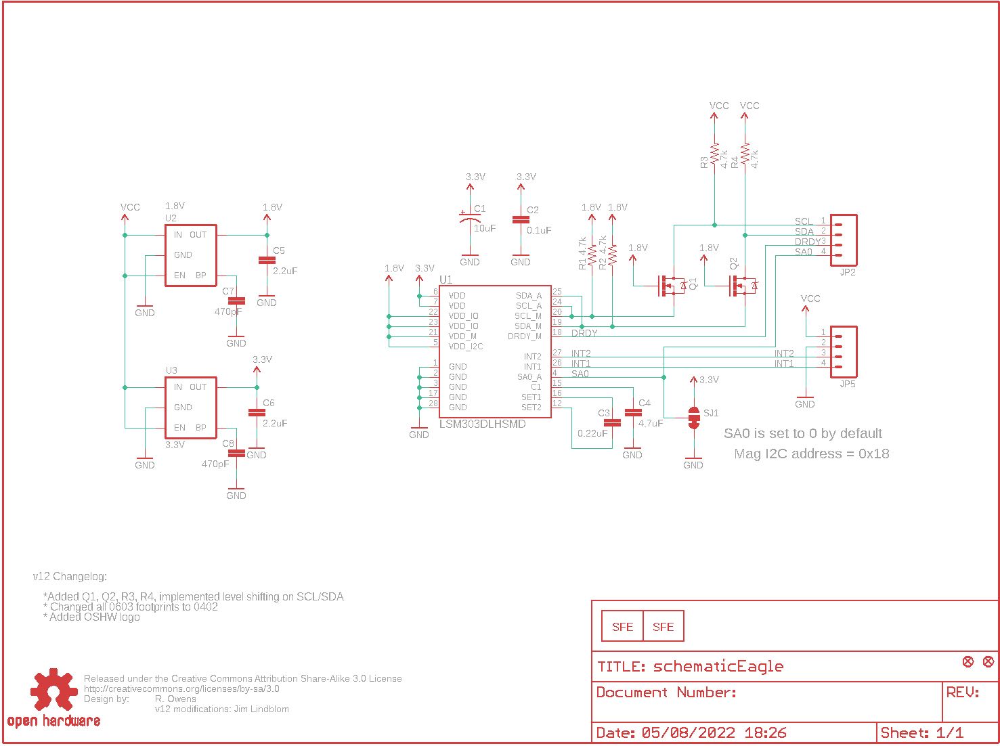
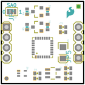
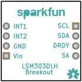
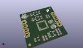
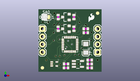
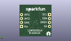
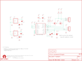

Contents
========

* [PRS10888 > LSM303 Breakout](#prs10888--lsm303-breakout)
	* [Schematic](#schematic)
	* [PCB](#pcb)
	* [Interactive BOM](#interactive-bom)
	* [OOMP Parts](#oomp-parts)
	* [Images](#images)
	* [Tags](#tags)
  
![][im]
# PRS10888 > LSM303 Breakout

- ID: PROJ-SPAR-10888-STAN-01
- Hex ID: PRS10888
- Name: Sparkfun
- Description: Sparkfun
- Long Link: [http://oom.lt/PROJ-SPAR-10888-STAN-01](http://oom.lt/PROJ-SPAR-10888-STAN-01)
- Short Link: [http://oom.lt/PRS10888](http://oom.lt/PRS10888)

## Schematic
  

## PCB
  

## Interactive BOM

- Interactive BOM page: [ibom.html](https://htmlpreview.github.io/?https://github.com/oomlout/oomlout_OOMP_projects/blob/main/PROJ-SPAR-10888-STAN-01/kicad/bom/ibom.html)

## OOMP Parts
  

|OOMP Parts|
| :---: |
|CAPT-3216-X-UF10-01 C1|
|[CAPC-0402-X-NF100-V10  SMD (0402) 100 nF Capacitor (Ceramic) 10v  C2](https://github.com/oomlout/oomlout_OOMP_parts/tree/main/CAPC-0402-X-NF100-V10/)|
|[CAPC-0402-X-NF220-V16  SMD (0402) 220 nF Capacitor (Ceramic) 16v  C3](https://github.com/oomlout/oomlout_OOMP_parts/tree/main/CAPC-0402-X-NF220-V16/)|
|[CAPC-0402-X-UF47D-V63D  SMD (0402) 4.7 uF Capacitor (Ceramic) 6.3v  C4](https://github.com/oomlout/oomlout_OOMP_parts/tree/main/CAPC-0402-X-UF47D-V63D/)|
|CAPC-0402-X-UF22D-01 C5, C6|
|CAPC-0402-X-PF470-01 C7, C8|
|[HEAD-I01-X-PI04-01  2.54 mm 4 Pin Header  JP2, JP5](https://github.com/oomlout/oomlout_OOMP_parts/tree/main/HEAD-I01-X-PI04-01/)|
|UNMATCHED-SO23-X-UNMATCHED-01 Q1, Q2|
|[RESE-0402-X-O472-01  SMD (0402) 4.7k Ohm Resistor  R1, R2, R3, R4](https://github.com/oomlout/oomlout_OOMP_parts/tree/main/RESE-0402-X-O472-01/)|
|UNMATCHED-UNMATCHED-X-UNMATCHED-01 U1, U2|
|UNMATCHED-SO235-X-UNMATCHED-01 U3|

## Images
  
  

|bominteractivefront|bominteractiveback|kicadPcb3d|kicadPcb3dFront|kicadPcb3dBack|eagleImage|eagleSchemImage|
| :---: | :---: | :---: | :---: | :---: | :---: | :---: |
||||||||

## Tags

- hexID: PRS10888
- oompType: PROJ
- oompSize: SPAR
- oompColor: 10888
- oompDesc: STAN
- oompIndex: 01
- oompName: LSM303 Breakout
- sources: All source files from https://github.com/sparkfun/LSM303_Breakout (source licence details in srcLicense.md)
- linkBuyPage: https://www.sparkfun.com/products/10888
- oompID: PROJ-SPAR-10888-STAN-01
- oompParts: C1,CAPT-3216-X-UF10-01
- oompParts: C2,CAPC-0402-X-NF100-V10
- oompParts: C3,CAPC-0402-X-NF220-V16
- oompParts: C4,CAPC-0402-X-UF47D-V63D
- oompParts: C5,CAPC-0402-X-UF22D-01
- oompParts: C6,CAPC-0402-X-UF22D-01
- oompParts: C7,CAPC-0402-X-PF470-01
- oompParts: C8,CAPC-0402-X-PF470-01
- oompParts: JP2,HEAD-I01-X-PI04-01
- oompParts: JP5,HEAD-I01-X-PI04-01
- oompParts: Q1,UNMATCHED-SO23-X-UNMATCHED-01
- oompParts: Q2,UNMATCHED-SO23-X-UNMATCHED-01
- oompParts: R1,RESE-0402-X-O472-01
- oompParts: R2,RESE-0402-X-O472-01
- oompParts: R3,RESE-0402-X-O472-01
- oompParts: R4,RESE-0402-X-O472-01
- oompParts: U1,UNMATCHED-UNMATCHED-X-UNMATCHED-01
- oompParts: U2,UNMATCHED-UNMATCHED-X-UNMATCHED-01
- oompParts: U3,UNMATCHED-SO235-X-UNMATCHED-01
- rawParts: C1,10uF,CAP_POL1206,EIA3216,Capacitor Polarized,,
- rawParts: C2,0.1uF,CAP0402-CAP,0402-CAP,Capacitor,,
- rawParts: C3,0.22uF,CAP0402-CAP,0402-CAP,Capacitor,,
- rawParts: C4,4.7uF,CAP0402-CAP,0402-CAP,Capacitor,,
- rawParts: C5,2.2uF,CAP0402-CAP,0402-CAP,Capacitor,,
- rawParts: C6,2.2uF,CAP0402-CAP,0402-CAP,Capacitor,,
- rawParts: C7,470pF,CAP0402-CAP,0402-CAP,Capacitor,,
- rawParts: C8,470pF,CAP0402-CAP,0402-CAP,Capacitor,,
- rawParts: JP1,LOGO-SFENW2,LOGO-SFENW2,SFE-NEW-WEB,Spark Fun Electronics PCB Logo,,
- rawParts: JP2,,M04PTH,1X04,Header 4,,
- rawParts: JP3,FIDUCIAL1X2,FIDUCIAL1X2,FIDUCIAL-1X2,Fiducial Alignment Points,,
- rawParts: JP4,FIDUCIAL1X2,FIDUCIAL1X2,FIDUCIAL-1X2,Fiducial Alignment Points,,
- rawParts: JP5,,M04PTH,1X04,Header 4,,
- rawParts: JP6,LOGO-SFESK,LOGO-SFESK,SFE-LOGO-FLAME,Spark Fun Electronics PCB Logo,,
- rawParts: Q1,MOSFET-N-CH,MOSFET-NCHANNELSMD,SOT23-3,,,
- rawParts: Q2,MOSFET-N-CH,MOSFET-NCHANNELSMD,SOT23-3,,,
- rawParts: R1,4.7k,RESISTOR0402-RES,0402-RES,Resistor,,
- rawParts: R2,4.7k,RESISTOR0402-RES,0402-RES,Resistor,,
- rawParts: R3,4.7k,RESISTOR0402-RES,0402-RES,Resistor,,
- rawParts: R4,4.7k,RESISTOR0402-RES,0402-RES,Resistor,,
- rawParts: SJ1,,SOLDERJUMPER_2WAYPASTE2&3,SJ_3_PASTE2&3,Solder Jumper,,
- rawParts: U$5,CREATIVE_COMMONS,CREATIVE_COMMONS,CREATIVE_COMMONS,,,
- rawParts: U$8,OSHW-LOGOS,OSHW-LOGOS,OSHW-LOGO-S,Open Source Hardware Logo This logo indicates the piece of hardware it is found on incorporates a OSHW license and/or adheres to the definition of open source hardware found here: http://freedomdefined.org/OSHW,,
- rawParts: U1,LSM303DLHSMD,LSM303DLHSMD,LGA28-5X5,,,
- rawParts: U2,1.8V,V_REG_LDOSMD2,SC70,Voltage Regulator LDO,,
- rawParts: U3,3.3V,V_REG_LDOSMD,SOT23-5,Voltage Regulator LDO,,

[im]: kicadPcb3d_450.png
