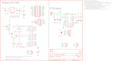

Contents
========

* [PRS10889 > ProtoSnap-Pro Mini](#prs10889--protosnap-pro-mini)
	* [Schematic](#schematic)
	* [PCB](#pcb)
	* [OOMP Parts](#oomp-parts)
	* [Images](#images)
	* [Tags](#tags)
  
![][im]
# PRS10889 > ProtoSnap-Pro Mini

- ID: PROJ-SPAR-10889-STAN-01
- Hex ID: PRS10889
- Name: Sparkfun
- Description: Sparkfun
- Long Link: [http://oom.lt/PROJ-SPAR-10889-STAN-01](http://oom.lt/PROJ-SPAR-10889-STAN-01)
- Short Link: [http://oom.lt/PRS10889](http://oom.lt/PRS10889)

## Schematic
  

## PCB
  

## OOMP Parts
  

|OOMP ID|Name|Identifier|
| :---: | :---: | :---: |
|[CAPC-0402-X-NF100-V10](https://github.com/oomlout/oomlout_OOMP_parts/tree/main/CAPC-0402-X-NF100-V10/)|[SMD (0402) 100 nF Capacitor (Ceramic) 10v](https://github.com/oomlout/oomlout_OOMP_parts/tree/main/CAPC-0402-X-NF100-V10/)|[C1, C2, C3, C4, C6, C10](https://github.com/oomlout/oomlout_OOMP_parts/tree/main/CAPC-0402-X-NF100-V10/)|
|CAPT-3216-X-UF10-01||C5, C13, C19|
|[LEDS-0603-G-STAN-01](https://github.com/oomlout/oomlout_OOMP_parts/tree/main/LEDS-0603-G-STAN-01/)|[SMD (0603) Green LED](https://github.com/oomlout/oomlout_OOMP_parts/tree/main/LEDS-0603-G-STAN-01/)|[D3, LED3](https://github.com/oomlout/oomlout_OOMP_parts/tree/main/LEDS-0603-G-STAN-01/)|
|[HEAD-I01-X-PI06-01](https://github.com/oomlout/oomlout_OOMP_parts/tree/main/HEAD-I01-X-PI06-01/)|[2.54 mm 6 Pin Header](https://github.com/oomlout/oomlout_OOMP_parts/tree/main/HEAD-I01-X-PI06-01/)|[JP1, JP3](https://github.com/oomlout/oomlout_OOMP_parts/tree/main/HEAD-I01-X-PI06-01/)|
|[HEAD-I01-X-PI02-01](https://github.com/oomlout/oomlout_OOMP_parts/tree/main/HEAD-I01-X-PI02-01/)|[2.54 mm 2 Pin Header](https://github.com/oomlout/oomlout_OOMP_parts/tree/main/HEAD-I01-X-PI02-01/)|[JP2, JP9](https://github.com/oomlout/oomlout_OOMP_parts/tree/main/HEAD-I01-X-PI02-01/)|
|[HEAD-I01-X-PI12-01](https://github.com/oomlout/oomlout_OOMP_parts/tree/main/HEAD-I01-X-PI12-01/)|[2.54 mm 12 Pin Header](https://github.com/oomlout/oomlout_OOMP_parts/tree/main/HEAD-I01-X-PI12-01/)|[JP6, JP7](https://github.com/oomlout/oomlout_OOMP_parts/tree/main/HEAD-I01-X-PI12-01/)|
|[HEAD-I01-X-PI04-01](https://github.com/oomlout/oomlout_OOMP_parts/tree/main/HEAD-I01-X-PI04-01/)|[2.54 mm 4 Pin Header](https://github.com/oomlout/oomlout_OOMP_parts/tree/main/HEAD-I01-X-PI04-01/)|[JP8](https://github.com/oomlout/oomlout_OOMP_parts/tree/main/HEAD-I01-X-PI04-01/)|
|[HEAD-I01-X-PI03-01](https://github.com/oomlout/oomlout_OOMP_parts/tree/main/HEAD-I01-X-PI03-01/)|[2.54 mm 3 Pin Header](https://github.com/oomlout/oomlout_OOMP_parts/tree/main/HEAD-I01-X-PI03-01/)|[JP10, JP21](https://github.com/oomlout/oomlout_OOMP_parts/tree/main/HEAD-I01-X-PI03-01/)|
|[LEDS-0603-R-STAN-01](https://github.com/oomlout/oomlout_OOMP_parts/tree/main/LEDS-0603-R-STAN-01/)|[SMD (0603) Red LED](https://github.com/oomlout/oomlout_OOMP_parts/tree/main/LEDS-0603-R-STAN-01/)|[LED1, LED2](https://github.com/oomlout/oomlout_OOMP_parts/tree/main/LEDS-0603-R-STAN-01/)|
|LEDS-UNMATCHED-G-STAN-01||LED4|
|UNMATCHED-UNMATCHED-X-UNMATCHED-01||Q1, S1, S2, SG1, U1, U3, U4, X2|
|[RESE-0402-X-O102-01](https://github.com/oomlout/oomlout_OOMP_parts/tree/main/RESE-0402-X-O102-01/)|[SMD (0402) 1k Ohm Resistor](https://github.com/oomlout/oomlout_OOMP_parts/tree/main/RESE-0402-X-O102-01/)|[R1, R3](https://github.com/oomlout/oomlout_OOMP_parts/tree/main/RESE-0402-X-O102-01/)|
|[RESE-0402-X-O103-01](https://github.com/oomlout/oomlout_OOMP_parts/tree/main/RESE-0402-X-O103-01/)|[SMD (0402) 10k Ohm Resistor](https://github.com/oomlout/oomlout_OOMP_parts/tree/main/RESE-0402-X-O103-01/)|[R2, R8, R11](https://github.com/oomlout/oomlout_OOMP_parts/tree/main/RESE-0402-X-O103-01/)|
|RESE-0402-X-O201-01||R4|
|[RESE-0402-X-O101-01](https://github.com/oomlout/oomlout_OOMP_parts/tree/main/RESE-0402-X-O101-01/)|[SMD (0402) 100 Ohm Resistor](https://github.com/oomlout/oomlout_OOMP_parts/tree/main/RESE-0402-X-O101-01/)|[R5, R7](https://github.com/oomlout/oomlout_OOMP_parts/tree/main/RESE-0402-X-O101-01/)|
|RESE-0402-X-O331-01||R6|
|[RESE-0603-X-O103-01](https://github.com/oomlout/oomlout_OOMP_parts/tree/main/RESE-0603-X-O103-01/)|[SMD (0603) 10k Ohm Resistor](https://github.com/oomlout/oomlout_OOMP_parts/tree/main/RESE-0603-X-O103-01/)|[R9](https://github.com/oomlout/oomlout_OOMP_parts/tree/main/RESE-0603-X-O103-01/)|
|VREG-SO235-X-KMIC5205-01||U2|

## Images
  
  

|kicadPcb3d|kicadPcb3dFront|kicadPcb3dBack|eagleImage|eagleSchemImage|
| :---: | :---: | :---: | :---: | :---: |
||||||

## Tags

- hexID: PRS10889
- oompType: PROJ
- oompSize: SPAR
- oompColor: 10889
- oompDesc: STAN
- oompIndex: 01
- oompName: ProtoSnap-Pro Mini
- sources: All source files from https://github.com/sparkfun/ProtoSnap-Pro_Mini (source licence details in srcLicense.md)
- linkBuyPage: https://www.sparkfun.com/products/10889
- oompID: PROJ-SPAR-10889-STAN-01
- oompParts: C1,CAPC-0402-X-NF100-V10
- oompParts: C2,CAPC-0402-X-NF100-V10
- oompParts: C3,CAPC-0402-X-NF100-V10
- oompParts: C4,CAPC-0402-X-NF100-V10
- oompParts: C5,CAPT-3216-X-UF10-01
- oompParts: C6,CAPC-0402-X-NF100-V10
- oompParts: C10,CAPC-0402-X-NF100-V10
- oompParts: C13,CAPT-3216-X-UF10-01
- oompParts: C19,CAPT-3216-X-UF10-01
- oompParts: D3,LEDS-0603-G-STAN-01
- oompParts: JP1,HEAD-I01-X-PI06-01
- oompParts: JP2,HEAD-I01-X-PI02-01
- oompParts: JP3,HEAD-I01-X-PI06-01
- oompParts: JP6,HEAD-I01-X-PI12-01
- oompParts: JP7,HEAD-I01-X-PI12-01
- oompParts: JP8,HEAD-I01-X-PI04-01
- oompParts: JP9,HEAD-I01-X-PI02-01
- oompParts: JP10,HEAD-I01-X-PI03-01
- oompParts: JP21,HEAD-I01-X-PI03-01
- oompParts: LED1,LEDS-0603-R-STAN-01
- oompParts: LED2,LEDS-0603-R-STAN-01
- oompParts: LED3,LEDS-0603-G-STAN-01
- oompParts: LED4,LEDS-UNMATCHED-G-STAN-01
- oompParts: Q1,UNMATCHED-UNMATCHED-X-UNMATCHED-01
- oompParts: R1,RESE-0402-X-O102-01
- oompParts: R2,RESE-0402-X-O103-01
- oompParts: R3,RESE-0402-X-O102-01
- oompParts: R4,RESE-0402-X-O201-01
- oompParts: R5,RESE-0402-X-O101-01
- oompParts: R6,RESE-0402-X-O331-01
- oompParts: R7,RESE-0402-X-O101-01
- oompParts: R8,RESE-0402-X-O103-01
- oompParts: R9,RESE-0603-X-O103-01
- oompParts: R11,RESE-0402-X-O103-01
- oompParts: S1,UNMATCHED-UNMATCHED-X-UNMATCHED-01
- oompParts: S2,UNMATCHED-UNMATCHED-X-UNMATCHED-01
- oompParts: SG1,UNMATCHED-UNMATCHED-X-UNMATCHED-01
- oompParts: U1,UNMATCHED-UNMATCHED-X-UNMATCHED-01
- oompParts: U2,VREG-SO235-X-KMIC5205-01
- oompParts: U3,UNMATCHED-UNMATCHED-X-UNMATCHED-01
- oompParts: U4,UNMATCHED-UNMATCHED-X-UNMATCHED-01
- oompParts: X2,UNMATCHED-UNMATCHED-X-UNMATCHED-01
- rawParts: C1,0.1uF,CAP0402-CAP,0402-CAP,Capacitor,,
- rawParts: C2,0.1uF,CAP0402-CAP,0402-CAP,Capacitor,,
- rawParts: C3,0.1uF,CAP0402-CAP,0402-CAP,Capacitor,,
- rawParts: C4,0.1uF,CAP0402-CAP,0402-CAP,Capacitor,,
- rawParts: C5,10uF,CAP_POL1206,EIA3216,Capacitor Polarized,,
- rawParts: C6,0.1uF,CAP0402-CAP,0402-CAP,Capacitor,,
- rawParts: C10,0.1uF,CAP0402-CAP,0402-CAP,Capacitor,,
- rawParts: C13,10uF,CAP_POL1206,EIA3216,Capacitor Polarized,,
- rawParts: C19,10uF,CAP_POL1206,EIA3216,Capacitor Polarized,,
- rawParts: D3,Green,LED0603,LED-0603,LEDs,,
- rawParts: JP1,FTDI Basic,ARDUINO_SERIAL_PROGRAMPTH,1X06,,,
- rawParts: JP2,,M02PTH,1X02,Header 2,,
- rawParts: JP3,,M06SIP,1X06,Header 6,,
- rawParts: JP4,LOGO-SFENW2,LOGO-SFENW2,SFE-NEW-WEB,Spark Fun Electronics PCB Logo,,
- rawParts: JP6,,M12PTH,1X12,Header 12,,
- rawParts: JP7,,M12PTH,1X12,Header 12,,
- rawParts: JP8,,M04PTH,1X04,Header 4,,
- rawParts: JP9,,M02PTH,1X02,Header 2,,
- rawParts: JP10,,M03PTH,1X03,Header 3,,
- rawParts: JP15,LOGO-SFESK,LOGO-SFESK,SFE-LOGO-FLAME,Spark Fun Electronics PCB Logo,,
- rawParts: JP16,FIDUCIAL1X2.5,FIDUCIAL1X2.5,FIDUCIAL-1X2.5,Fiducial Alignment Points,,
- rawParts: JP18,LOGO-SFENEW,LOGO-SFENEW,SFE-NEW-WEBLOGO,Spark Fun Electronics PCB Logo,,
- rawParts: JP19,FIDUCIAL1X2.5,FIDUCIAL1X2.5,FIDUCIAL-1X2.5,Fiducial Alignment Points,,
- rawParts: JP20,FIDUCIAL1X2.5,FIDUCIAL1X2.5,FIDUCIAL-1X2.5,Fiducial Alignment Points,,
- rawParts: JP21,,M03PTH,1X03,Header 3,,
- rawParts: JP22,FIDUCIAL1X2.5,FIDUCIAL1X2.5,FIDUCIAL-1X2.5,Fiducial Alignment Points,,
- rawParts: LED1,Red,LED0603,LED-0603,LEDs,,
- rawParts: LED2,Red,LED0603,LED-0603,LEDs,,
- rawParts: LED3,Green,LED0603,LED-0603,LEDs,,
- rawParts: LED4,LED-TRICOLOR,LED-TRICOLOR,LED-TRICOLOR-SMD,Tri-Color LED SMD,,
- rawParts: Q1,16MHz,RESONATORSMD,RESONATOR-SMD,Resonator,,
- rawParts: R1,1K,RESISTOR0402-RES,0402-RES,Resistor,,
- rawParts: R2,10K,RESISTOR0402-RES,0402-RES,Resistor,,
- rawParts: R3,1K,RESISTOR0402-RES,0402-RES,Resistor,,
- rawParts: R4,200,RESISTOR0402-RES,0402-RES,Resistor,,
- rawParts: R5,100,RESISTOR0402-RES,0402-RES,Resistor,,
- rawParts: R6,330,RESISTOR0402-RES,0402-RES,Resistor,,
- rawParts: R7,100,RESISTOR0402-RES,0402-RES,Resistor,,
- rawParts: R8,10k,RESISTOR0402-RES,0402-RES,Resistor,,
- rawParts: R9,10K,RESISTOR0603-RES,0603-RES,Resistor,,
- rawParts: R11,10K,RESISTOR0402-RES,0402-RES,Resistor,,
- rawParts: S1,Reset,TAC_SWITCHSMD,TACTILE_SWITCH_SMD,Momentary Switch,,
- rawParts: S2,SWITCH-MOMENTARY-2SMD,SWITCH-MOMENTARY-2SMD,TACTILE_SWITCH_SMD,,,
- rawParts: SG1,BUZZERSMD2,BUZZERSMD2,BUZZER-CCV,Buzzer 12mm,,
- rawParts: SJ2,,SOLDERJUMPER_2WAYS,SJ_3,Solder Jumper,,
- rawParts: U$2,MOUSE-BITE-3,MOUSE-BITE-3,MOUSE-BITE-3,,,
- rawParts: U$4,MOUSE-BITE-5,MOUSE-BITE-5,MOUSE-BITE-5,,,
- rawParts: U$7,MOUSE-BITE-2,MOUSE-BITE-2,MOUSE-BITE-2,,,
- rawParts: U$8,MOUSE-BITE-4,MOUSE-BITE-4,MOUSE-BITE-4,,,
- rawParts: U$9,MOUSE-BITE-3,MOUSE-BITE-3,MOUSE-BITE-3,,,
- rawParts: U$13,MOUSE-BITE-4,MOUSE-BITE-4,MOUSE-BITE-4,,,
- rawParts: U$14,MOUSE-BITE-4,MOUSE-BITE-4,MOUSE-BITE-4,,,
- rawParts: U$22,MOUSE-BITE-5,MOUSE-BITE-5,MOUSE-BITE-5,,,
- rawParts: U$23,MOUSE-BITE-5,MOUSE-BITE-5,MOUSE-BITE-5,,,
- rawParts: U1,ATMEGA328,ATMEGA168,TQFP32-08,,,
- rawParts: U2,MIC5205,V_REG_LDOSMD,SOT23-5,Voltage Regulator LDO,,
- rawParts: U3,FT232RLSSOP,FT232RLSSOP,SSOP28DB,USB UART,,
- rawParts: U4,TEMT6000,TEMT6000,TEMT6000-SEN,Ambient Light Sensor,,
- rawParts: X2,USB-SMD-NS,USB-SMD-NS,USB-MINIB-NOSTOP,USB Connectors,,

[im]: kicadPcb3d_450.png
