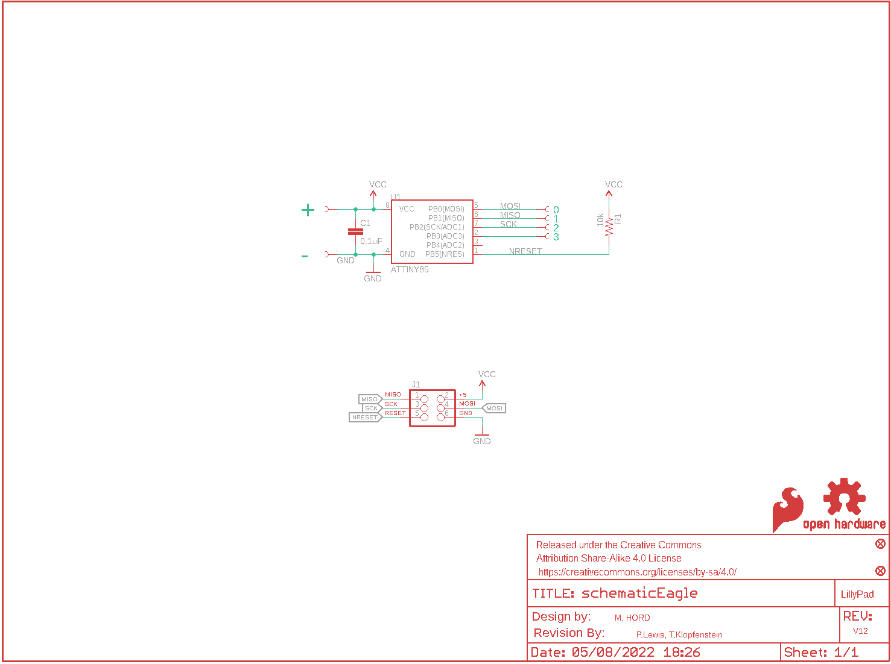
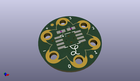
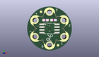
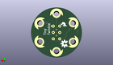

Contents
========

* [PRS10899 > Sparkfun](#prs10899--sparkfun)
	* [Schematic](#schematic)
	* [Interactive BOM](#interactive-bom)
	* [OOMP Parts](#oomp-parts)
	* [Images](#images)
	* [Tags](#tags)
  
![][im]
# PRS10899 > Sparkfun

- ID: PROJ-SPAR-10899-STAN-01
- Hex ID: PRS10899
- Name: Sparkfun
- Description: Sparkfun
- Long Link: [http://oom.lt/PROJ-SPAR-10899-STAN-01](http://oom.lt/PROJ-SPAR-10899-STAN-01)
- Short Link: [http://oom.lt/PRS10899](http://oom.lt/PRS10899)

## Schematic
  

## Interactive BOM

- Interactive BOM page: [ibom.html](https://htmlpreview.github.io/?https://github.com/oomlout/oomlout_OOMP_projects/blob/main/PROJ-SPAR-10899-STAN-01/kicad/bom/ibom.html)

## OOMP Parts
  

|OOMP Parts|
| :---: |
|C1,CAPC-0603-X-NF100-V50,C1,0.1uF,CAP0603-CAP,0603-CAP,Capacitor,,|
|J1,UNMATCHED-UNMATCHED-X-UNMATCHED-01,FID1,FIDUCIAL1X2,FIDUCIAL1X2,FIDUCIAL-1X2,Fiducial Alignment Points,,|
|R1,RESE-0603-X-O103-01,FID2,FIDUCIAL1X2,FIDUCIAL1X2,FIDUCIAL-1X2,Fiducial Alignment Points,,|
|U$1,UNMATCHED-UNMATCHED-X-UNMATCHED-01,FRAME2,FRAME-LETTER,FRAME-LETTER,CREATIVE_COMMONS,Schematic Frame,,|
|U$2,UNMATCHED-UNMATCHED-X-UNMATCHED-01,J1,,AVR_SPI_PRG_6TESTPOINTS,2X3_TEST_POINTS,AVR ISP 6 Pin,,|
|U$3,UNMATCHED-UNMATCHED-X-UNMATCHED-01,LOGO1,OSHW-LOGOS,OSHW-LOGOS,OSHW-LOGO-S,Open Source Hardware Logo This logo indicates the piece of hardware it is found on incorporates a OSHW license and/or adheres to the definition of open source hardware found here: http://freedomdefined.org/OSHW,,|
|U$4,UNMATCHED-UNMATCHED-X-UNMATCHED-01,LOGO2,SFE_LOGO_FLAME.1_INCH,SFE_LOGO_FLAME.1_INCH,SFE_LOGO_FLAME_.1,SFE Logo, flame only,,|
|U$5,UNMATCHED-UNMATCHED-X-UNMATCHED-01,R1,10k,RESISTOR0603-RES,0603-RES,Resistor,,|
|U$6,UNMATCHED-UNMATCHED-X-UNMATCHED-01,U$1,REVISION,REVISION,REVISION,,,|
|U$7,UNMATCHED-UNMATCHED-X-UNMATCHED-01,U$2,SEWTAP6,SEWTAP6,PETAL-SMALL-2SIDE,,,|
|U1,UNMATCHED-UNMATCHED-X-UNMATCHED-01,U$3,SEWTAP6,SEWTAP6,PETAL-SMALL-2SIDE,,,|

## Images
  
  

|kicadPcb3d|kicadPcb3dFront|kicadPcb3dBack|eagleImage|eagleSchemImage|
| :---: | :---: | :---: | :---: | :---: |
||||||

## Tags

- hexID: PRS10899
- oompType: PROJ
- oompSize: SPAR
- oompColor: 10899
- oompDesc: STAN
- oompIndex: 01
- oompName: LilyTiny LilyTwinkle
- sources: All source files from https://github.com/sparkfun/LilyTiny_LilyTwinkle (source licence details in srcLicense.md)
- linkBuyPage: https://www.sparkfun.com/products/10899
- oompID: PROJ-SPAR-10899-STAN-01
- oompParts: C1,CAPC-0603-X-NF100-V50
- oompParts: J1,UNMATCHED-UNMATCHED-X-UNMATCHED-01
- oompParts: R1,RESE-0603-X-O103-01
- oompParts: U$1,UNMATCHED-UNMATCHED-X-UNMATCHED-01
- oompParts: U$2,UNMATCHED-UNMATCHED-X-UNMATCHED-01
- oompParts: U$3,UNMATCHED-UNMATCHED-X-UNMATCHED-01
- oompParts: U$4,UNMATCHED-UNMATCHED-X-UNMATCHED-01
- oompParts: U$5,UNMATCHED-UNMATCHED-X-UNMATCHED-01
- oompParts: U$6,UNMATCHED-UNMATCHED-X-UNMATCHED-01
- oompParts: U$7,UNMATCHED-UNMATCHED-X-UNMATCHED-01
- oompParts: U1,UNMATCHED-UNMATCHED-X-UNMATCHED-01
- rawParts: C1,0.1uF,CAP0603-CAP,0603-CAP,Capacitor,,
- rawParts: FID1,FIDUCIAL1X2,FIDUCIAL1X2,FIDUCIAL-1X2,Fiducial Alignment Points,,
- rawParts: FID2,FIDUCIAL1X2,FIDUCIAL1X2,FIDUCIAL-1X2,Fiducial Alignment Points,,
- rawParts: FRAME2,FRAME-LETTER,FRAME-LETTER,CREATIVE_COMMONS,Schematic Frame,,
- rawParts: J1,,AVR_SPI_PRG_6TESTPOINTS,2X3_TEST_POINTS,AVR ISP 6 Pin,,
- rawParts: LOGO1,OSHW-LOGOS,OSHW-LOGOS,OSHW-LOGO-S,Open Source Hardware Logo This logo indicates the piece of hardware it is found on incorporates a OSHW license and/or adheres to the definition of open source hardware found here: http://freedomdefined.org/OSHW,,
- rawParts: LOGO2,SFE_LOGO_FLAME.1_INCH,SFE_LOGO_FLAME.1_INCH,SFE_LOGO_FLAME_.1,SFE Logo, flame only,,
- rawParts: R1,10k,RESISTOR0603-RES,0603-RES,Resistor,,
- rawParts: U$1,REVISION,REVISION,REVISION,,,
- rawParts: U$2,SEWTAP6,SEWTAP6,PETAL-SMALL-2SIDE,,,
- rawParts: U$3,SEWTAP6,SEWTAP6,PETAL-SMALL-2SIDE,,,
- rawParts: U$4,SEWTAP6,SEWTAP6,PETAL-SMALL-2SIDE,,,
- rawParts: U$5,SEWTAP6,SEWTAP6,PETAL-SMALL-2SIDE,,,
- rawParts: U$6,SEWTAP6,SEWTAP6,PETAL-SMALL-2SIDE,,,
- rawParts: U$7,SEWTAP6,SEWTAP6,PETAL-SMALL-2SIDE,,,
- rawParts: U$8,LOGO-LPL,LOGO-LPL,LOGO-L,,,
- rawParts: U1,ATTINY85,ATTINY45,SO08-EIAJ,Atmel ATTiny45,,

[im]: kicadPcb3d_450.png
