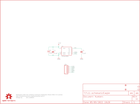

Contents
========

* [PRS10901 > Sparkfun](#prs10901--sparkfun)
	* [Schematic](#schematic)
	* [Interactive BOM](#interactive-bom)
	* [OOMP Parts](#oomp-parts)
	* [Images](#images)
	* [Tags](#tags)
  
![][im]
# PRS10901 > Sparkfun

- ID: PROJ-SPAR-10901-STAN-01
- Hex ID: PRS10901
- Name: Sparkfun
- Description: Sparkfun
- Long Link: [http://oom.lt/PROJ-SPAR-10901-STAN-01](http://oom.lt/PROJ-SPAR-10901-STAN-01)
- Short Link: [http://oom.lt/PRS10901](http://oom.lt/PRS10901)

## Schematic
  

## Interactive BOM

- Interactive BOM page: [ibom.html](https://htmlpreview.github.io/?https://github.com/oomlout/oomlout_OOMP_projects/blob/main/PROJ-SPAR-10901-STAN-01/kicad/bom/ibom.html)

## OOMP Parts
  

|OOMP Parts|
| :---: |
|C1,CAPC-0402-X-NF100-01,C1,0.1uF,CAP0402-CAP,0402-CAP,Capacitor,,|
|C2,CAPC-0402-X-NF100-01,C2,0.1uF,CAP0402-CAP,0402-CAP,Capacitor,,|
|C3,CAPX-UNMATCHED-X-UF10-01,C3,10uF,CAP_POL1206,EIA3216,Capacitor Polarized,,|
|JP1,HEAD-I01-X-PI05-01,JP1,,M05PTH,1X05,Header 5,,|
|U$2,UNMATCHED-UNMATCHED-X-UNMATCHED-01,JP2,LOGO-SFENW2,LOGO-SFENW2,SFE-NEW-WEB,Spark Fun Electronics PCB Logo,,|
|U1,UNMATCHED-UNMATCHED-X-UNMATCHED-01,JP3,STAND-OFF,STAND-OFF,STAND-OFF,Stand Off,,|

## Images
  
  

|kicadPcb3d|kicadPcb3dFront|kicadPcb3dBack|eagleImage|eagleSchemImage|
| :---: | :---: | :---: | :---: | :---: |
||||||

## Tags

- hexID: PRS10901
- oompType: PROJ
- oompSize: SPAR
- oompColor: 10901
- oompDesc: STAN
- oompIndex: 01
- oompName: Infrared Proximity Breakout-VCNL4000
- sources: All source files from https://github.com/sparkfun/Infrared_Proximity_Breakout-VCNL4000 (source licence details in srcLicense.md)
- linkBuyPage: https://www.sparkfun.com/products/10901
- oompID: PROJ-SPAR-10901-STAN-01
- oompParts: C1,CAPC-0402-X-NF100-01
- oompParts: C2,CAPC-0402-X-NF100-01
- oompParts: C3,CAPX-UNMATCHED-X-UF10-01
- oompParts: JP1,HEAD-I01-X-PI05-01
- oompParts: U$2,UNMATCHED-UNMATCHED-X-UNMATCHED-01
- oompParts: U1,UNMATCHED-UNMATCHED-X-UNMATCHED-01
- rawParts: C1,0.1uF,CAP0402-CAP,0402-CAP,Capacitor,,
- rawParts: C2,0.1uF,CAP0402-CAP,0402-CAP,Capacitor,,
- rawParts: C3,10uF,CAP_POL1206,EIA3216,Capacitor Polarized,,
- rawParts: JP1,,M05PTH,1X05,Header 5,,
- rawParts: JP2,LOGO-SFENW2,LOGO-SFENW2,SFE-NEW-WEB,Spark Fun Electronics PCB Logo,,
- rawParts: JP3,STAND-OFF,STAND-OFF,STAND-OFF,Stand Off,,
- rawParts: JP4,STAND-OFF,STAND-OFF,STAND-OFF,Stand Off,,
- rawParts: JP5,LOGO-SFESK,LOGO-SFESK,SFE-LOGO-FLAME,Spark Fun Electronics PCB Logo,,
- rawParts: JP6,FIDUCIALUFIDUCIAL,FIDUCIALUFIDUCIAL,MICRO-FIDUCIAL,Fiducial Alignment Points,,
- rawParts: JP7,FIDUCIALUFIDUCIAL,FIDUCIALUFIDUCIAL,MICRO-FIDUCIAL,Fiducial Alignment Points,,
- rawParts: U$1,OSHW-LOGOS,OSHW-LOGOS,OSHW-LOGO-S,Open Source Hardware Logo This logo indicates the piece of hardware it is found on incorporates a OSHW license and/or adheres to the definition of open source hardware found here: http://freedomdefined.org/OSHW,,
- rawParts: U$2,CREATIVE_COMMONS,CREATIVE_COMMONS,CREATIVE_COMMONS,,,
- rawParts: U1,VCNL4000,VCNL4000,VCNL4000,VNCL4000,,

[im]: kicadPcb3d_450.png
