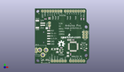
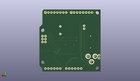
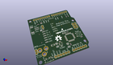

Contents
========

* [PROJ-SPAR-10914-STAN-01>Arduino Pro 328](#proj-spar-10914-stan-01arduino-pro-328)
	* [Images](#images)
	* [Interactive BOM](#interactive-bom)
	* [OOMP Parts](#oomp-parts)
	* [Tags](#tags)
  
![][im]
# PROJ-SPAR-10914-STAN-01>Arduino Pro 328

- ID: PROJ-SPAR-10914-STAN-01
- Hex ID: PRS10914
- Name: Arduino Pro 328
- Description: 

## Images
  
  

|eagleImage|kicadPcb3dFront|kicadPcb3dBack|kicadPcb3d|
| :---: | :---: | :---: | :---: |
|||||

## Interactive BOM

- Interactive BOM page: [ibom.html](kicad/bom/ibom.html)

## OOMP Parts
  

|OOMP Parts|
| :---: |
|UNMATCHED-UNMATCHED-X-UNMATCHED-01, B1, 34.29, 35.559999999999995, 90,B1, BUZZER, BUZZER-12MM-NS-KIT, SparkFun, (1.35, 1.4), R90|
|CAPC-0402-X-NF100-V50, C1, 10.16, 43.18, 180,C1, 0.1uF, 0402-CAP, SparkFun, (0.4, 1.7), R180|
|CAPC-0402-X-NF100-V50, C2, 13.97, 34.29, 270,C2, 0.1uF, 0402-CAP, SparkFun, (0.55, 1.35), R270|
|CAPC-0402-X-NF100-V50, C3, 36.83, 22.86, 0,C3, 0.1uF, 0402-CAP, SparkFun, (1.45, 0.9), R0|
|CAPC-0402-X-NF100-V50, C10, 34.29, 8.889999999999999, 270,C10, 0.1uF, 0402-CAP, SparkFun, (1.35, 0.35), R270|
|CAPC-UNMATCHED-X-UNMATCHED-01, C13, 31.75, 8.889999999999999, 90,C13, 10uF, EIA3216, SparkFun, (1.25, 0.35), R90|
|CAPC-UNMATCHED-X-UNMATCHED-01, C19, 21.59, 12.7, 90,C19, 10uF, EIA3216, SparkFun, (0.85, 0.5), R90|
|UNMATCHED-0603-X-UNMATCHED-01, D3, 13.97, 43.18, 90,D3, Green, LED-0603, SparkFun, (0.55, 1.7), R90|
|UNMATCHED-UNMATCHED-X-UNMATCHED-01, F1, 17.779999999999998, 13.97, 0,F1, 500mA-PTC, PTC-1206, SparkFun, (0.7, 0.55), R0|
|UNMATCHED-UNMATCHED-X-UNMATCHED-01, J1, 46.99, 50.8, 180,J1, Digital, 1X08, SparkFun, (1.85, 2), R180|
|UNMATCHED-UNMATCHED-X-UNMATCHED-01, J2, 34.29, 2.54, 0,J2, Analog, 1X06, SparkFun, (1.35, 0.1), R0|
|UNMATCHED-UNMATCHED-X-UNMATCHED-01, J3, 25.019, 50.8, 180,J3, 1X08, SparkFun, (0.985, 2), R180|
|UNMATCHED-UNMATCHED-X-UNMATCHED-01, J4, 16.509999999999998, 2.54, 0,J4, POWER, 1X06, SparkFun, (0.65, 0.1), R0|
|UNMATCHED-UNMATCHED-X-UNMATCHED-01, JP1, 3.8099999999999996, 38.099999999999994, 90,JP1, LiPo, JST-2-SMD, SparkFun, (0.15, 1.5), R90|
|HEAD-I01-X-PI2.5-01, JP2, 49.529999999999994, 5.08, 0,JP2, FIDUCIAL1X2.5, FIDUCIAL-1X2.5, abes, (1.95, 0.2), R0|
|UNMATCHED-UNMATCHED-X-UNMATCHED-01, JP3, 46.99, 30.479999999999997, 270,JP3, ISP, 2X3, SparkFun, (1.85, 1.2), R270|
|UNMATCHED-UNMATCHED-X-UNMATCHED-01, JP4, -3.0479999999999996, 13.081, 270,JP4, POWER_JACKPTH, POWER_JACK_PTH, SparkFun, (-0.12, 0.515), R270|
|HEAD-I01-X-PI2.5-01, JP5, 3.8099999999999996, 48.26, 0,JP5, FIDUCIAL1X2.5, FIDUCIAL-1X2.5, abes, (0.15, 1.9), R0|
|<table><tr><td></td><td> JP6</td><td>[HEAD-I01-X-PI02-01 2.54 mm 2 Pin Header](https://github.com/oomlout/oomlout_OOMP_parts/tree/main/HEAD-I01-X-PI02-01/)</td><td>[H02](https://github.com/oomlout/oomlout_OOMP_parts/tree/main/HEAD-I01-X-PI02-01/)</td></tr></table>|
|<table><tr><td></td><td> JP7</td><td>[HEAD-I01-X-PI02-01 2.54 mm 2 Pin Header](https://github.com/oomlout/oomlout_OOMP_parts/tree/main/HEAD-I01-X-PI02-01/)</td><td>[H02](https://github.com/oomlout/oomlout_OOMP_parts/tree/main/HEAD-I01-X-PI02-01/)</td></tr></table>|
|<table><tr><td></td><td> JP9</td><td>[HEAD-I01-X-PI06-01 2.54 mm 6 Pin Header](https://github.com/oomlout/oomlout_OOMP_parts/tree/main/HEAD-I01-X-PI06-01/)</td><td>[H06](https://github.com/oomlout/oomlout_OOMP_parts/tree/main/HEAD-I01-X-PI06-01/)</td></tr></table>|
|UNMATCHED-0603-X-UNMATCHED-01, LED1, 25.4, 10.16, 270,LED1, Red, LED-0603, SparkFun, (1, 0.4), R270|
|UNMATCHED-UNMATCHED-X-UNMATCHED-01, Q1, 33.019999999999996, 22.86, 0,Q1, RESONATORSMD, RESONATOR-SMD, SparkFun, (1.3, 0.9), R0|
|RESE-0402-X-UNMATCHED-01, R1, 44.449999999999996, 43.18, 270,R1, 1K, 0402-RES, SparkFun, (1.75, 1.7), R270|
|<table><tr><td></td><td> R2</td><td>[RESE-0402-X-O103-01 SMD (0402) 10k Ohm Resistor](https://github.com/oomlout/oomlout_OOMP_parts/tree/main/RESE-0402-X-O103-01/)</td><td>[R42103](https://github.com/oomlout/oomlout_OOMP_parts/tree/main/RESE-0402-X-O103-01/)</td></tr></table>|
|RESE-0402-X-UNMATCHED-01, R3, 46.99, 43.18, 270,R3, 1K, 0402-RES, SparkFun, (1.85, 1.7), R270|
|RESE-0402-X-UNMATCHED-01, R6, 13.97, 44.449999999999996, 180,R6, 1K, 0402-RES, SparkFun, (0.55, 1.75), R180|
|RESE-0402-X-UNMATCHED-01, R11, 25.4, 15.239999999999998, 0,R11, 4.7K, 0402-RES, SparkFun, (1, 0.6), R0|
|UNMATCHED-UNMATCHED-X-UNMATCHED-01, S1, 10.16, 1.778, 180,S1, Select, SWITCH-SPST-SMD-A, SparkFun, (0.4, 0.07), R180|
|UNMATCHED-UNMATCHED-X-UNMATCHED-01, S2, 46.99, 16.509999999999998, 0,S2, Reset, TACTILE_SWITCH_SMD, SparkFun, (1.85, 0.65), R0|
|UNMATCHED-UNMATCHED-X-UNMATCHED-01, U1, 36.83, 16.509999999999998, 270,U1, ATMEGA328, TQFP32-08, SparkFun, (1.45, 0.65), R270|
|UNMATCHED-UNMATCHED-X-UNMATCHED-01, U2, 25.4, 12.7, 270,U2, 3.3V, SOT23-5, SparkFun, (1, 0.5), R270|

## Tags

- hexID: PRS10914
- oompType: PROJ
- oompSize: SPAR
- oompColor: 10914
- oompDesc: STAN
- oompIndex: 01
- oompName: Arduino Pro 328
- sources: All source files from https://github.com/sparkfun/Arduino_Pro_328 (source licence details in srcLicense.md)
- linkBuyPage: https://www.sparkfun.com/products/10914
- oompPart: UNMATCHED-UNMATCHED-X-UNMATCHED-01, B1, 34.29, 35.559999999999995, 90
- oompPart: CAPC-0402-X-NF100-V50, C1, 10.16, 43.18, 180
- oompPart: CAPC-0402-X-NF100-V50, C2, 13.97, 34.29, 270
- oompPart: CAPC-0402-X-NF100-V50, C3, 36.83, 22.86, 0
- oompPart: CAPC-0402-X-NF100-V50, C10, 34.29, 8.889999999999999, 270
- oompPart: CAPC-UNMATCHED-X-UNMATCHED-01, C13, 31.75, 8.889999999999999, 90
- oompPart: CAPC-UNMATCHED-X-UNMATCHED-01, C19, 21.59, 12.7, 90
- oompPart: UNMATCHED-0603-X-UNMATCHED-01, D3, 13.97, 43.18, 90
- oompPart: UNMATCHED-UNMATCHED-X-UNMATCHED-01, F1, 17.779999999999998, 13.97, 0
- oompPart: UNMATCHED-UNMATCHED-X-UNMATCHED-01, J1, 46.99, 50.8, 180
- oompPart: UNMATCHED-UNMATCHED-X-UNMATCHED-01, J2, 34.29, 2.54, 0
- oompPart: UNMATCHED-UNMATCHED-X-UNMATCHED-01, J3, 25.019, 50.8, 180
- oompPart: UNMATCHED-UNMATCHED-X-UNMATCHED-01, J4, 16.509999999999998, 2.54, 0
- oompPart: UNMATCHED-UNMATCHED-X-UNMATCHED-01, JP1, 3.8099999999999996, 38.099999999999994, 90
- oompPart: HEAD-I01-X-PI2.5-01, JP2, 49.529999999999994, 5.08, 0
- oompPart: UNMATCHED-UNMATCHED-X-UNMATCHED-01, JP3, 46.99, 30.479999999999997, 270
- oompPart: UNMATCHED-UNMATCHED-X-UNMATCHED-01, JP4, -3.0479999999999996, 13.081, 270
- oompPart: HEAD-I01-X-PI2.5-01, JP5, 3.8099999999999996, 48.26, 0
- oompPart: HEAD-I01-X-PI02-01, JP6, 13.97, 36.83, 90
- oompPart: HEAD-I01-X-PI02-01, JP7, 1.27, 11.43, 90
- oompPart: HEAD-I01-X-PI06-01, JP9, 8.254999999999999, 25.4, 270
- oompPart: UNMATCHED-0603-X-UNMATCHED-01, LED1, 25.4, 10.16, 270
- oompPart: UNMATCHED-UNMATCHED-X-UNMATCHED-01, Q1, 33.019999999999996, 22.86, 0
- oompPart: RESE-0402-X-UNMATCHED-01, R1, 44.449999999999996, 43.18, 270
- oompPart: RESE-0402-X-O103-01, R2, 48.26, 12.7, 0
- oompPart: RESE-0402-X-UNMATCHED-01, R3, 46.99, 43.18, 270
- oompPart: RESE-0402-X-UNMATCHED-01, R6, 13.97, 44.449999999999996, 180
- oompPart: RESE-0402-X-UNMATCHED-01, R11, 25.4, 15.239999999999998, 0
- oompPart: UNMATCHED-UNMATCHED-X-UNMATCHED-01, S1, 10.16, 1.778, 180
- oompPart: UNMATCHED-UNMATCHED-X-UNMATCHED-01, S2, 46.99, 16.509999999999998, 0
- oompPart: SKIP-UNMATCHED-X-UNMATCHED-01, SJ1, 11.43, 34.29, 90
- oompPart: UNMATCHED-UNMATCHED-X-UNMATCHED-01, U1, 36.83, 16.509999999999998, 270
- oompPart: UNMATCHED-UNMATCHED-X-UNMATCHED-01, U2, 25.4, 12.7, 270
- rawPart: B1, BUZZER, BUZZER-12MM-NS-KIT, SparkFun, (1.35, 1.4), R90
- rawPart: C1, 0.1uF, 0402-CAP, SparkFun, (0.4, 1.7), R180
- rawPart: C2, 0.1uF, 0402-CAP, SparkFun, (0.55, 1.35), R270
- rawPart: C3, 0.1uF, 0402-CAP, SparkFun, (1.45, 0.9), R0
- rawPart: C10, 0.1uF, 0402-CAP, SparkFun, (1.35, 0.35), R270
- rawPart: C13, 10uF, EIA3216, SparkFun, (1.25, 0.35), R90
- rawPart: C19, 10uF, EIA3216, SparkFun, (0.85, 0.5), R90
- rawPart: D3, Green, LED-0603, SparkFun, (0.55, 1.7), R90
- rawPart: F1, 500mA-PTC, PTC-1206, SparkFun, (0.7, 0.55), R0
- rawPart: J1, Digital, 1X08, SparkFun, (1.85, 2), R180
- rawPart: J2, Analog, 1X06, SparkFun, (1.35, 0.1), R0
- rawPart: J3, 1X08, SparkFun, (0.985, 2), R180
- rawPart: J4, POWER, 1X06, SparkFun, (0.65, 0.1), R0
- rawPart: JP1, LiPo, JST-2-SMD, SparkFun, (0.15, 1.5), R90
- rawPart: JP2, FIDUCIAL1X2.5, FIDUCIAL-1X2.5, abes, (1.95, 0.2), R0
- rawPart: JP3, ISP, 2X3, SparkFun, (1.85, 1.2), R270
- rawPart: JP4, POWER_JACKPTH, POWER_JACK_PTH, SparkFun, (-0.12, 0.515), R270
- rawPart: JP5, FIDUCIAL1X2.5, FIDUCIAL-1X2.5, abes, (0.15, 1.9), R0
- rawPart: JP6, External, 1X02, SparkFun, (0.55, 1.45), R90
- rawPart: JP7, External, 1X02, SparkFun, (0.05, 0.45), R90
- rawPart: JP9, Program, 1X06-SMD, SparkFun, (0.325, 1), R270
- rawPart: LED1, Red, LED-0603, SparkFun, (1, 0.4), R270
- rawPart: Q1, RESONATORSMD, RESONATOR-SMD, SparkFun, (1.3, 0.9), R0
- rawPart: R1, 1K, 0402-RES, SparkFun, (1.75, 1.7), R270
- rawPart: R2, 10K, 0402-RES, SparkFun, (1.9, 0.5), R0
- rawPart: R3, 1K, 0402-RES, SparkFun, (1.85, 1.7), R270
- rawPart: R6, 1K, 0402-RES, SparkFun, (0.55, 1.75), R180
- rawPart: R11, 4.7K, 0402-RES, SparkFun, (1, 0.6), R0
- rawPart: S1, Select, SWITCH-SPST-SMD-A, SparkFun, (0.4, 0.07), R180
- rawPart: S2, Reset, TACTILE_SWITCH_SMD, SparkFun, (1.85, 0.65), R0
- rawPart: SJ1, SOLDERJUMPERNC3, SJ_2S-NOTRACE, SparkFun, (0.45, 1.35), R90
- rawPart: U1, ATMEGA328, TQFP32-08, SparkFun, (1.45, 0.65), R270
- rawPart: U2, 3.3V, SOT23-5, SparkFun, (1, 0.5), R270
- oompID: PROJ-SPAR-10914-STAN-01

[im]: kicadPcb3d_450.png
