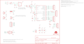

Contents
========

* [PRS10914 > Arduino Pro 328](#prs10914--arduino-pro-328)
	* [Schematic](#schematic)
	* [PCB](#pcb)
	* [Interactive BOM](#interactive-bom)
	* [OOMP Parts](#oomp-parts)
	* [Images](#images)
	* [Tags](#tags)
  
![][im]
# PRS10914 > Arduino Pro 328

- ID: PROJ-SPAR-10914-STAN-01
- Hex ID: PRS10914
- Name: Sparkfun
- Description: Sparkfun
- Long Link: [http://oom.lt/PROJ-SPAR-10914-STAN-01](http://oom.lt/PROJ-SPAR-10914-STAN-01)
- Short Link: [http://oom.lt/PRS10914](http://oom.lt/PRS10914)

## Schematic
  

## PCB
  

## Interactive BOM

- Interactive BOM page: [ibom.html](https://htmlpreview.github.io/?https://github.com/oomlout/oomlout_OOMP_projects/blob/main/PROJ-SPAR-10914-STAN-01/kicad/bom/ibom.html)

## OOMP Parts
  

|OOMP ID|Name|Identifier|
| :---: | :---: | :---: |
|UNMATCHED-UNMATCHED-X-UNMATCHED-01||B1, JP3, Q1, S1, S2, U1|
|[CAPC-0402-X-NF100-V10](https://github.com/oomlout/oomlout_OOMP_parts/tree/main/CAPC-0402-X-NF100-V10/)|[SMD (0402) 100 nF Capacitor (Ceramic) 10v](https://github.com/oomlout/oomlout_OOMP_parts/tree/main/CAPC-0402-X-NF100-V10/)|[C1, C2, C3, C10](https://github.com/oomlout/oomlout_OOMP_parts/tree/main/CAPC-0402-X-NF100-V10/)|
|CAPT-3216-X-UF10-01||C13, C19|
|[LEDS-0603-G-STAN-01](https://github.com/oomlout/oomlout_OOMP_parts/tree/main/LEDS-0603-G-STAN-01/)|[SMD (0603) Green LED](https://github.com/oomlout/oomlout_OOMP_parts/tree/main/LEDS-0603-G-STAN-01/)|[D3](https://github.com/oomlout/oomlout_OOMP_parts/tree/main/LEDS-0603-G-STAN-01/)|
|REFU-1206-X-UNMATCHED-01||F1|
|[HEAD-I01-X-PI08-01](https://github.com/oomlout/oomlout_OOMP_parts/tree/main/HEAD-I01-X-PI08-01/)|[2.54 mm 8 Pin Header](https://github.com/oomlout/oomlout_OOMP_parts/tree/main/HEAD-I01-X-PI08-01/)|[J1, J3](https://github.com/oomlout/oomlout_OOMP_parts/tree/main/HEAD-I01-X-PI08-01/)|
|[HEAD-I01-X-PI06-01](https://github.com/oomlout/oomlout_OOMP_parts/tree/main/HEAD-I01-X-PI06-01/)|[2.54 mm 6 Pin Header](https://github.com/oomlout/oomlout_OOMP_parts/tree/main/HEAD-I01-X-PI06-01/)|[J2, J4, JP9](https://github.com/oomlout/oomlout_OOMP_parts/tree/main/HEAD-I01-X-PI06-01/)|
|HEAD-I01-X-UNMATCHED-01||JP1|
|[DCJP-21D-X-STAN-01](https://github.com/oomlout/oomlout_OOMP_parts/tree/main/DCJP-21D-X-STAN-01/)|[2.1 mm DC Jack](https://github.com/oomlout/oomlout_OOMP_parts/tree/main/DCJP-21D-X-STAN-01/)|[JP4](https://github.com/oomlout/oomlout_OOMP_parts/tree/main/DCJP-21D-X-STAN-01/)|
|[HEAD-I01-X-PI02-01](https://github.com/oomlout/oomlout_OOMP_parts/tree/main/HEAD-I01-X-PI02-01/)|[2.54 mm 2 Pin Header](https://github.com/oomlout/oomlout_OOMP_parts/tree/main/HEAD-I01-X-PI02-01/)|[JP6, JP7](https://github.com/oomlout/oomlout_OOMP_parts/tree/main/HEAD-I01-X-PI02-01/)|
|[LEDS-0603-R-STAN-01](https://github.com/oomlout/oomlout_OOMP_parts/tree/main/LEDS-0603-R-STAN-01/)|[SMD (0603) Red LED](https://github.com/oomlout/oomlout_OOMP_parts/tree/main/LEDS-0603-R-STAN-01/)|[LED1](https://github.com/oomlout/oomlout_OOMP_parts/tree/main/LEDS-0603-R-STAN-01/)|
|[RESE-0402-X-O102-01](https://github.com/oomlout/oomlout_OOMP_parts/tree/main/RESE-0402-X-O102-01/)|[SMD (0402) 1k Ohm Resistor](https://github.com/oomlout/oomlout_OOMP_parts/tree/main/RESE-0402-X-O102-01/)|[R1, R3, R6](https://github.com/oomlout/oomlout_OOMP_parts/tree/main/RESE-0402-X-O102-01/)|
|[RESE-0402-X-O103-01](https://github.com/oomlout/oomlout_OOMP_parts/tree/main/RESE-0402-X-O103-01/)|[SMD (0402) 10k Ohm Resistor](https://github.com/oomlout/oomlout_OOMP_parts/tree/main/RESE-0402-X-O103-01/)|[R2](https://github.com/oomlout/oomlout_OOMP_parts/tree/main/RESE-0402-X-O103-01/)|
|[RESE-0402-X-O472-01](https://github.com/oomlout/oomlout_OOMP_parts/tree/main/RESE-0402-X-O472-01/)|[SMD (0402) 4.7k Ohm Resistor](https://github.com/oomlout/oomlout_OOMP_parts/tree/main/RESE-0402-X-O472-01/)|[R11](https://github.com/oomlout/oomlout_OOMP_parts/tree/main/RESE-0402-X-O472-01/)|
|UNMATCHED-SO235-X-UNMATCHED-01||U2|

## Images
  
  

|bominteractivefront|bominteractiveback|kicadPcb3d|kicadPcb3dFront|kicadPcb3dBack|eagleImage|eagleSchemImage|pcbdraw|pcbdrawback|
| :---: | :---: | :---: | :---: | :---: | :---: | :---: | :---: | :---: |
||||||||||

## Tags

- hexID: PRS10914
- oompType: PROJ
- oompSize: SPAR
- oompColor: 10914
- oompDesc: STAN
- oompIndex: 01
- oompName: Arduino Pro 328
- sources: All source files from https://github.com/sparkfun/Arduino_Pro_328 (source licence details in srcLicense.md)
- linkBuyPage: https://www.sparkfun.com/products/10914
- oompID: PROJ-SPAR-10914-STAN-01
- oompParts: B1,UNMATCHED-UNMATCHED-X-UNMATCHED-01
- oompParts: C1,CAPC-0402-X-NF100-V10
- oompParts: C2,CAPC-0402-X-NF100-V10
- oompParts: C3,CAPC-0402-X-NF100-V10
- oompParts: C10,CAPC-0402-X-NF100-V10
- oompParts: C13,CAPT-3216-X-UF10-01
- oompParts: C19,CAPT-3216-X-UF10-01
- oompParts: D3,LEDS-0603-G-STAN-01
- oompParts: F1,REFU-1206-X-UNMATCHED-01
- oompParts: J1,HEAD-I01-X-PI08-01
- oompParts: J2,HEAD-I01-X-PI06-01
- oompParts: J3,HEAD-I01-X-PI08-01
- oompParts: J4,HEAD-I01-X-PI06-01
- oompParts: JP1,HEAD-I01-X-UNMATCHED-01
- oompParts: JP3,UNMATCHED-UNMATCHED-X-UNMATCHED-01
- oompParts: JP4,DCJP-21D-X-STAN-01
- oompParts: JP6,HEAD-I01-X-PI02-01
- oompParts: JP7,HEAD-I01-X-PI02-01
- oompParts: JP9,HEAD-I01-X-PI06-01
- oompParts: LED1,LEDS-0603-R-STAN-01
- oompParts: Q1,UNMATCHED-UNMATCHED-X-UNMATCHED-01
- oompParts: R1,RESE-0402-X-O102-01
- oompParts: R2,RESE-0402-X-O103-01
- oompParts: R3,RESE-0402-X-O102-01
- oompParts: R6,RESE-0402-X-O102-01
- oompParts: R11,RESE-0402-X-O472-01
- oompParts: S1,UNMATCHED-UNMATCHED-X-UNMATCHED-01
- oompParts: S2,UNMATCHED-UNMATCHED-X-UNMATCHED-01
- oompParts: U1,UNMATCHED-UNMATCHED-X-UNMATCHED-01
- oompParts: U2,UNMATCHED-SO235-X-UNMATCHED-01
- rawParts: B1,BUZZER,BUZZERPTH-NS-KIT,BUZZER-12MM-NS-KIT,Buzzer 12mm,,
- rawParts: C1,0.1uF,CAP0402-CAP,0402-CAP,Capacitor,,
- rawParts: C2,0.1uF,CAP0402-CAP,0402-CAP,Capacitor,,
- rawParts: C3,0.1uF,CAP0402-CAP,0402-CAP,Capacitor,,
- rawParts: C10,0.1uF,CAP0402-CAP,0402-CAP,Capacitor,,
- rawParts: C13,10uF,CAP_POL1206,EIA3216,Capacitor Polarized,,
- rawParts: C19,10uF,CAP_POL1206,EIA3216,Capacitor Polarized,,
- rawParts: D3,Green,LED0603,LED-0603,LEDs,,
- rawParts: F1,500mA-PTC,PTCSMD,PTC-1206,Resettable Fuse PTC,,
- rawParts: J1,Digital,M081X08,1X08,Header 8,,
- rawParts: J2,Analog,M06SIP,1X06,Header 6,,
- rawParts: J3,,M081X08,1X08,Header 8,,
- rawParts: J4,POWER,M06SIP,1X06,Header 6,,
- rawParts: JP1,LiPo,M02-JST-2MM-SMT,JST-2-SMD,Header 2,,
- rawParts: JP2,FIDUCIAL1X2.5,FIDUCIAL1X2.5,FIDUCIAL-1X2.5,Fiducial Alignment Points,,
- rawParts: JP3,ISP,AVR_SPI_PRG_6PTH,2X3,AVR ISP 6 Pin,,
- rawParts: JP4,POWER_JACKPTH,POWER_JACKPTH,POWER_JACK_PTH,Power Jack,,
- rawParts: JP5,FIDUCIAL1X2.5,FIDUCIAL1X2.5,FIDUCIAL-1X2.5,Fiducial Alignment Points,,
- rawParts: JP6,External,M02PTH,1X02,Header 2,,
- rawParts: JP7,External,M02PTH,1X02,Header 2,,
- rawParts: JP9,Program,ARDUINO_SERIAL_PROGRAMSMD,1X06-SMD,,,
- rawParts: LED1,Red,LED0603,LED-0603,LEDs,,
- rawParts: Q1,RESONATORSMD,RESONATORSMD,RESONATOR-SMD,Resonator,,
- rawParts: R1,1K,RESISTOR0402-RES,0402-RES,Resistor,,
- rawParts: R2,10K,RESISTOR0402-RES,0402-RES,Resistor,,
- rawParts: R3,1K,RESISTOR0402-RES,0402-RES,Resistor,,
- rawParts: R6,1K,RESISTOR0402-RES,0402-RES,Resistor,,
- rawParts: R11,4.7K,RESISTOR0402-RES,0402-RES,Resistor,,
- rawParts: S1,Select,SWITCH-SPST-SMD-A,SWITCH-SPST-SMD-A,SPST Switch,,
- rawParts: S2,Reset,TAC_SWITCHSMD,TACTILE_SWITCH_SMD,Momentary Switch,,
- rawParts: SJ1,SOLDERJUMPERNC3,SOLDERJUMPERNC2,SJ_2S-NOTRACE,Solder Jumper,,
- rawParts: U$1,STAND-OFF,STAND-OFF,STAND-OFF,Stand Off,,
- rawParts: U$2,OSHW-LOGOL,OSHW-LOGOL,OSHW-LOGO-L,Open Source Hardware Logo This logo indicates the piece of hardware it is found on incorporates a OSHW license and/or adheres to the definition of open source hardware found here: http://freedomdefined.org/OSHW,,
- rawParts: U$3,STAND-OFF,STAND-OFF,STAND-OFF,Stand Off,,
- rawParts: U$9,STAND-OFF,STAND-OFF,STAND-OFF,Stand Off,,
- rawParts: U$10,STAND-OFF,STAND-OFF,STAND-OFF,Stand Off,,
- rawParts: U$11,LOGO-SFENEW,LOGO-SFENEW,SFE-NEW-WEBLOGO,Spark Fun Electronics PCB Logo,,
- rawParts: U1,ATMEGA328,ATMEGA168,TQFP32-08,,,
- rawParts: U2,3.3V,V_REG_LDOSMD,SOT23-5,Voltage Regulator LDO,,

[im]: kicadPcb3d_450.png
