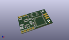
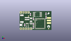
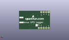
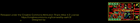
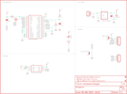

Contents
========

* [PRS10920 > Sparkfun](#prs10920--sparkfun)
	* [Schematic](#schematic)
	* [Interactive BOM](#interactive-bom)
	* [OOMP Parts](#oomp-parts)
	* [Images](#images)
	* [Tags](#tags)
  
![][im]
# PRS10920 > Sparkfun

- ID: PROJ-SPAR-10920-STAN-01
- Hex ID: PRS10920
- Name: Sparkfun
- Description: Sparkfun
- Long Link: [http://oom.lt/PROJ-SPAR-10920-STAN-01](http://oom.lt/PROJ-SPAR-10920-STAN-01)
- Short Link: [http://oom.lt/PRS10920](http://oom.lt/PRS10920)

## Schematic
  

## Interactive BOM

- Interactive BOM page: [ibom.html](https://htmlpreview.github.io/?https://github.com/oomlout/oomlout_OOMP_projects/blob/main/PROJ-SPAR-10920-STAN-01/kicad/bom/ibom.html)

## OOMP Parts
  

|OOMP Parts|
| :---: |
|C1,UNMATCHED-UNMATCHED-UNMATCHED-UNMATCHED-UNMATCHED,C1,0.1uF,0.1UF-25V(+80/-20%)(0603),0603-CAP,CAP-00810,CAP-00810,0.1uF,|
|C2,UNMATCHED-UNMATCHED-UNMATCHED-UNMATCHED-UNMATCHED,C2,10uF,CAP_POL1206,EIA3216,Capacitor Polarized,,,|
|C3,UNMATCHED-UNMATCHED-UNMATCHED-UNMATCHED-UNMATCHED,C3,1uF,1.0UF-16V-10%(0603),0603-CAP,CAP-00868,CAP-00868,1.0uF,|
|C4,UNMATCHED-UNMATCHED-UNMATCHED-UNMATCHED-UNMATCHED,C4,22pF,22PF-50V-5%(0603),0603-CAP,CAP-07876,CAP-07876,22pF,|
|FRAME1,UNMATCHED-UNMATCHED-UNMATCHED-UNMATCHED-UNMATCHED,FID1,FIDUCIAL1X2,FIDUCIAL1X2,FIDUCIAL-1X2,Fiducial Alignment Points,,,|
|J$1,UNMATCHED-UNMATCHED-UNMATCHED-UNMATCHED-UNMATCHED,FID2,FIDUCIAL1X2,FIDUCIAL1X2,FIDUCIAL-1X2,Fiducial Alignment Points,,,|
|JP1,UNMATCHED-UNMATCHED-UNMATCHED-UNMATCHED-UNMATCHED,FRAME1,FRAME-LETTER,FRAME-LETTER,CREATIVE_COMMONS,Schematic Frame,,,|
|JP2,UNMATCHED-UNMATCHED-UNMATCHED-UNMATCHED-UNMATCHED,J$1,SMA_EDGE,SMA_EDGE,SMA-EDGE,SMA Antenna Connector,,,|
|JP3,UNMATCHED-UNMATCHED-UNMATCHED-UNMATCHED-UNMATCHED,JP1,UART,M04PTH,1X04,Header 4,,,|
|JP4,UNMATCHED-UNMATCHED-UNMATCHED-UNMATCHED-UNMATCHED,JP2,Battery,M02-JST-2MM-SMT,S2B-PH,Header 2,,,|
|JP5,UNMATCHED-UNMATCHED-UNMATCHED-UNMATCHED-UNMATCHED,JP3,General,M05PTH,1X05,Header 5,,,|
|LED3,UNMATCHED-UNMATCHED-UNMATCHED-UNMATCHED-UNMATCHED,JP4,Low Power Mode,JUMPER-2SMD-NC,SJ_2S,Jumper,,,|
|R1,UNMATCHED-UNMATCHED-UNMATCHED-UNMATCHED-UNMATCHED,JP5,VBAT Select,JUMPER-2SMD-NC,SJ_2S,Jumper,,,|
|R2,UNMATCHED-UNMATCHED-UNMATCHED-UNMATCHED-UNMATCHED,LED3,Green,LED-GREEN0603,LED-0603,Various green LEDs,DIO-00821,GREEN,|
|R6,UNMATCHED-UNMATCHED-UNMATCHED-UNMATCHED-UNMATCHED,R1,33k,33KOHM1/10W1%(0603),0603-RES,RES-08416,,,|
|U$1,UNMATCHED-UNMATCHED-UNMATCHED-UNMATCHED-UNMATCHED,R2,10k,10KOHM1/10W1%(0603)0603,0603-RES,RES-00824,RES-00824,10K,|
|U1,UNMATCHED-UNMATCHED-UNMATCHED-UNMATCHED-UNMATCHED,R6,330,330OHM1/10W1%(0603),0603-RES,RES-00818,RES-00818,330,|
|U2,UNMATCHED-UNMATCHED-UNMATCHED-UNMATCHED-UNMATCHED,U$1,LOGO-SFESK,LOGO-SFESK,SFE-LOGO-FLAME,Spark Fun Electronics PCB Logo,,,|
|U3,UNMATCHED-UNMATCHED-UNMATCHED-UNMATCHED-UNMATCHED,U1,VENUS634SMD,VENUS634SMD,LGA44,Venus634 from SkyTraq,,,|
|U4,UNMATCHED-UNMATCHED-UNMATCHED-UNMATCHED-UNMATCHED,U2,33nH,33NH,0603-RES,,NDUC-07874,,|

## Images
  
  

|kicadPcb3d|kicadPcb3dFront|kicadPcb3dBack|eagleImage|eagleSchemImage|
| :---: | :---: | :---: | :---: | :---: |
||||||

## Tags

- hexID: PRS10920
- oompType: PROJ
- oompSize: SPAR
- oompColor: 10920
- oompDesc: STAN
- oompIndex: 01
- oompName: Venus GPS Logger SMA
- sources: All source files from https://github.com/sparkfun/Venus_GPS_Logger_SMA (source licence details in srcLicense.md)
- linkBuyPage: https://www.sparkfun.com/products/10920
- oompID: PROJ-SPAR-10920-STAN-01
- oompParts: C1,UNMATCHED-UNMATCHED-UNMATCHED-UNMATCHED-UNMATCHED
- oompParts: C2,UNMATCHED-UNMATCHED-UNMATCHED-UNMATCHED-UNMATCHED
- oompParts: C3,UNMATCHED-UNMATCHED-UNMATCHED-UNMATCHED-UNMATCHED
- oompParts: C4,UNMATCHED-UNMATCHED-UNMATCHED-UNMATCHED-UNMATCHED
- oompParts: FRAME1,UNMATCHED-UNMATCHED-UNMATCHED-UNMATCHED-UNMATCHED
- oompParts: J$1,UNMATCHED-UNMATCHED-UNMATCHED-UNMATCHED-UNMATCHED
- oompParts: JP1,UNMATCHED-UNMATCHED-UNMATCHED-UNMATCHED-UNMATCHED
- oompParts: JP2,UNMATCHED-UNMATCHED-UNMATCHED-UNMATCHED-UNMATCHED
- oompParts: JP3,UNMATCHED-UNMATCHED-UNMATCHED-UNMATCHED-UNMATCHED
- oompParts: JP4,UNMATCHED-UNMATCHED-UNMATCHED-UNMATCHED-UNMATCHED
- oompParts: JP5,UNMATCHED-UNMATCHED-UNMATCHED-UNMATCHED-UNMATCHED
- oompParts: LED3,UNMATCHED-UNMATCHED-UNMATCHED-UNMATCHED-UNMATCHED
- oompParts: R1,UNMATCHED-UNMATCHED-UNMATCHED-UNMATCHED-UNMATCHED
- oompParts: R2,UNMATCHED-UNMATCHED-UNMATCHED-UNMATCHED-UNMATCHED
- oompParts: R6,UNMATCHED-UNMATCHED-UNMATCHED-UNMATCHED-UNMATCHED
- oompParts: U$1,UNMATCHED-UNMATCHED-UNMATCHED-UNMATCHED-UNMATCHED
- oompParts: U1,UNMATCHED-UNMATCHED-UNMATCHED-UNMATCHED-UNMATCHED
- oompParts: U2,UNMATCHED-UNMATCHED-UNMATCHED-UNMATCHED-UNMATCHED
- oompParts: U3,UNMATCHED-UNMATCHED-UNMATCHED-UNMATCHED-UNMATCHED
- oompParts: U4,UNMATCHED-UNMATCHED-UNMATCHED-UNMATCHED-UNMATCHED
- rawParts: C1,0.1uF,0.1UF-25V(+80/-20%)(0603),0603-CAP,CAP-00810,CAP-00810,0.1uF,
- rawParts: C2,10uF,CAP_POL1206,EIA3216,Capacitor Polarized,,,
- rawParts: C3,1uF,1.0UF-16V-10%(0603),0603-CAP,CAP-00868,CAP-00868,1.0uF,
- rawParts: C4,22pF,22PF-50V-5%(0603),0603-CAP,CAP-07876,CAP-07876,22pF,
- rawParts: FID1,FIDUCIAL1X2,FIDUCIAL1X2,FIDUCIAL-1X2,Fiducial Alignment Points,,,
- rawParts: FID2,FIDUCIAL1X2,FIDUCIAL1X2,FIDUCIAL-1X2,Fiducial Alignment Points,,,
- rawParts: FRAME1,FRAME-LETTER,FRAME-LETTER,CREATIVE_COMMONS,Schematic Frame,,,
- rawParts: J$1,SMA_EDGE,SMA_EDGE,SMA-EDGE,SMA Antenna Connector,,,
- rawParts: JP1,UART,M04PTH,1X04,Header 4,,,
- rawParts: JP2,Battery,M02-JST-2MM-SMT,S2B-PH,Header 2,,,
- rawParts: JP3,General,M05PTH,1X05,Header 5,,,
- rawParts: JP4,Low Power Mode,JUMPER-2SMD-NC,SJ_2S,Jumper,,,
- rawParts: JP5,VBAT Select,JUMPER-2SMD-NC,SJ_2S,Jumper,,,
- rawParts: LED3,Green,LED-GREEN0603,LED-0603,Various green LEDs,DIO-00821,GREEN,
- rawParts: R1,33k,33KOHM1/10W1%(0603),0603-RES,RES-08416,,,
- rawParts: R2,10k,10KOHM1/10W1%(0603)0603,0603-RES,RES-00824,RES-00824,10K,
- rawParts: R6,330,330OHM1/10W1%(0603),0603-RES,RES-00818,RES-00818,330,
- rawParts: U$1,LOGO-SFESK,LOGO-SFESK,SFE-LOGO-FLAME,Spark Fun Electronics PCB Logo,,,
- rawParts: U1,VENUS634SMD,VENUS634SMD,LGA44,Venus634 from SkyTraq,,,
- rawParts: U2,33nH,33NH,0603-RES,,NDUC-07874,,
- rawParts: U3,V_REG_LDOSMD,V_REG_LDOSMD,SOT23-5,Voltage Regulator LDO,,,
- rawParts: U4,SPI_FLASH-X25XXSMD1,SPI_FLASH-X25XXSMD1,SO08-EIAJ,8pin SPI Flash series x25xx. Works with devices like W25X32 and BR25L32,,,

[im]: kicadPcb3d_450.png
