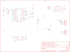

Contents
========

* [PRS10920 > Venus GPS Logger SMA](#prs10920--venus-gps-logger-sma)
	* [Schematic](#schematic)
	* [PCB](#pcb)
	* [Interactive BOM](#interactive-bom)
	* [OOMP Parts](#oomp-parts)
	* [Images](#images)
	* [Tags](#tags)
  
![][im]
# PRS10920 > Venus GPS Logger SMA

- ID: PROJ-SPAR-10920-STAN-01
- Hex ID: PRS10920
- Name: Sparkfun
- Description: Sparkfun
- Long Link: [http://oom.lt/PROJ-SPAR-10920-STAN-01](http://oom.lt/PROJ-SPAR-10920-STAN-01)
- Short Link: [http://oom.lt/PRS10920](http://oom.lt/PRS10920)

## Schematic
  

## PCB
  

## Interactive BOM

- Interactive BOM page: [ibom.html](https://htmlpreview.github.io/?https://github.com/oomlout/oomlout_OOMP_projects/blob/main/PROJ-SPAR-10920-STAN-01/kicad/bom/ibom.html)

## OOMP Parts
  

|OOMP ID|Name|Identifier|
| :---: | :---: | :---: |
|[CAPC-0603-X-NF100-V50](https://github.com/oomlout/oomlout_OOMP_parts/tree/main/CAPC-0603-X-NF100-V50/)|[SMD (0603) 100 nF Capacitor (Ceramic) 50v](https://github.com/oomlout/oomlout_OOMP_parts/tree/main/CAPC-0603-X-NF100-V50/)|[C1](https://github.com/oomlout/oomlout_OOMP_parts/tree/main/CAPC-0603-X-NF100-V50/)|
|[CAPT-3216-X-UF10-V10](https://github.com/oomlout/oomlout_OOMP_parts/tree/main/CAPT-3216-X-UF10-V10/)|[SMD (3216) 10 uF Capacitor (Tantalum) 10v](https://github.com/oomlout/oomlout_OOMP_parts/tree/main/CAPT-3216-X-UF10-V10/)|[C2](https://github.com/oomlout/oomlout_OOMP_parts/tree/main/CAPT-3216-X-UF10-V10/)|
|[CAPC-0603-X-UF1-V25](https://github.com/oomlout/oomlout_OOMP_parts/tree/main/CAPC-0603-X-UF1-V25/)|[SMD (0603) 1 uF Capacitor (Ceramic) 25v](https://github.com/oomlout/oomlout_OOMP_parts/tree/main/CAPC-0603-X-UF1-V25/)|[C3](https://github.com/oomlout/oomlout_OOMP_parts/tree/main/CAPC-0603-X-UF1-V25/)|
|[CAPC-0603-X-PF22-V50](https://github.com/oomlout/oomlout_OOMP_parts/tree/main/CAPC-0603-X-PF22-V50/)|[SMD (0603) 22 pF Capacitor (Ceramic) 50v](https://github.com/oomlout/oomlout_OOMP_parts/tree/main/CAPC-0603-X-PF22-V50/)|[C4](https://github.com/oomlout/oomlout_OOMP_parts/tree/main/CAPC-0603-X-PF22-V50/)|
|UNMATCHED-UNMATCHED-X-UNMATCHED-01||J$1, JP4, JP5, U1, U4|
|[HEAD-I01-X-PI04-01](https://github.com/oomlout/oomlout_OOMP_parts/tree/main/HEAD-I01-X-PI04-01/)|[2.54 mm 4 Pin Header](https://github.com/oomlout/oomlout_OOMP_parts/tree/main/HEAD-I01-X-PI04-01/)|[JP1](https://github.com/oomlout/oomlout_OOMP_parts/tree/main/HEAD-I01-X-PI04-01/)|
|HEAD-I01-X-UNMATCHED-01||JP2|
|[HEAD-I01-X-PI05-01](https://github.com/oomlout/oomlout_OOMP_parts/tree/main/HEAD-I01-X-PI05-01/)|[2.54 mm 5 Pin Header](https://github.com/oomlout/oomlout_OOMP_parts/tree/main/HEAD-I01-X-PI05-01/)|[JP3](https://github.com/oomlout/oomlout_OOMP_parts/tree/main/HEAD-I01-X-PI05-01/)|
|[LEDS-0603-G-STAN-01](https://github.com/oomlout/oomlout_OOMP_parts/tree/main/LEDS-0603-G-STAN-01/)|[SMD (0603) Green LED](https://github.com/oomlout/oomlout_OOMP_parts/tree/main/LEDS-0603-G-STAN-01/)|[LED3](https://github.com/oomlout/oomlout_OOMP_parts/tree/main/LEDS-0603-G-STAN-01/)|
|RESE-0603-X-O333-01||R1|
|[RESE-0603-X-O103-01](https://github.com/oomlout/oomlout_OOMP_parts/tree/main/RESE-0603-X-O103-01/)|[SMD (0603) 10k Ohm Resistor](https://github.com/oomlout/oomlout_OOMP_parts/tree/main/RESE-0603-X-O103-01/)|[R2](https://github.com/oomlout/oomlout_OOMP_parts/tree/main/RESE-0603-X-O103-01/)|
|[RESE-0603-X-O331-01](https://github.com/oomlout/oomlout_OOMP_parts/tree/main/RESE-0603-X-O331-01/)|[SMD (0603) 330 Ohm Resistor](https://github.com/oomlout/oomlout_OOMP_parts/tree/main/RESE-0603-X-O331-01/)|[R6](https://github.com/oomlout/oomlout_OOMP_parts/tree/main/RESE-0603-X-O331-01/)|
|UNMATCHED-0603-X-UNMATCHED-01||U2|
|UNMATCHED-SO235-X-UNMATCHED-01||U3|

## Images
  
  

|bominteractivefront|bominteractiveback|kicadPcb3d|kicadPcb3dFront|kicadPcb3dBack|eagleImage|eagleSchemImage|pcbdraw|pcbdrawback|
| :---: | :---: | :---: | :---: | :---: | :---: | :---: | :---: | :---: |
||||||||||

## Tags

- hexID: PRS10920
- oompType: PROJ
- oompSize: SPAR
- oompColor: 10920
- oompDesc: STAN
- oompIndex: 01
- oompName: Venus GPS Logger SMA
- sources: All source files from https://github.com/sparkfun/Venus_GPS_Logger_SMA (source licence details in srcLicense.md)
- linkBuyPage: https://www.sparkfun.com/products/10920
- oompID: PROJ-SPAR-10920-STAN-01
- oompParts: C1,CAPC-0603-X-NF100-V50
- oompParts: C2,CAPT-3216-X-UF10-V10
- oompParts: C3,CAPC-0603-X-UF1-V25
- oompParts: C4,CAPC-0603-X-PF22-V50
- oompParts: J$1,UNMATCHED-UNMATCHED-X-UNMATCHED-01
- oompParts: JP1,HEAD-I01-X-PI04-01
- oompParts: JP2,HEAD-I01-X-UNMATCHED-01
- oompParts: JP3,HEAD-I01-X-PI05-01
- oompParts: JP4,UNMATCHED-UNMATCHED-X-UNMATCHED-01
- oompParts: JP5,UNMATCHED-UNMATCHED-X-UNMATCHED-01
- oompParts: LED3,LEDS-0603-G-STAN-01
- oompParts: R1,RESE-0603-X-O333-01
- oompParts: R2,RESE-0603-X-O103-01
- oompParts: R6,RESE-0603-X-O331-01
- oompParts: U1,UNMATCHED-UNMATCHED-X-UNMATCHED-01
- oompParts: U2,UNMATCHED-0603-X-UNMATCHED-01
- oompParts: U3,UNMATCHED-SO235-X-UNMATCHED-01
- oompParts: U4,UNMATCHED-UNMATCHED-X-UNMATCHED-01
- rawParts: C1,0.1uF,0.1UF-25V(+80/-20%)(0603),0603-CAP,CAP-00810,CAP-00810,0.1uF,
- rawParts: C2,10uF,CAP_POL1206,EIA3216,Capacitor Polarized,,,
- rawParts: C3,1uF,1.0UF-16V-10%(0603),0603-CAP,CAP-00868,CAP-00868,1.0uF,
- rawParts: C4,22pF,22PF-50V-5%(0603),0603-CAP,CAP-07876,CAP-07876,22pF,
- rawParts: FID1,FIDUCIAL1X2,FIDUCIAL1X2,FIDUCIAL-1X2,Fiducial Alignment Points,,,
- rawParts: FID2,FIDUCIAL1X2,FIDUCIAL1X2,FIDUCIAL-1X2,Fiducial Alignment Points,,,
- rawParts: FRAME1,FRAME-LETTER,FRAME-LETTER,CREATIVE_COMMONS,Schematic Frame,,,
- rawParts: J$1,SMA_EDGE,SMA_EDGE,SMA-EDGE,SMA Antenna Connector,,,
- rawParts: JP1,UART,M04PTH,1X04,Header 4,,,
- rawParts: JP2,Battery,M02-JST-2MM-SMT,S2B-PH,Header 2,,,
- rawParts: JP3,General,M05PTH,1X05,Header 5,,,
- rawParts: JP4,Low Power Mode,JUMPER-2SMD-NC,SJ_2S,Jumper,,,
- rawParts: JP5,VBAT Select,JUMPER-2SMD-NC,SJ_2S,Jumper,,,
- rawParts: LED3,Green,LED-GREEN0603,LED-0603,Various green LEDs,DIO-00821,GREEN,
- rawParts: R1,33k,33KOHM1/10W1%(0603),0603-RES,RES-08416,,,
- rawParts: R2,10k,10KOHM1/10W1%(0603)0603,0603-RES,RES-00824,RES-00824,10K,
- rawParts: R6,330,330OHM1/10W1%(0603),0603-RES,RES-00818,RES-00818,330,
- rawParts: U$1,LOGO-SFESK,LOGO-SFESK,SFE-LOGO-FLAME,Spark Fun Electronics PCB Logo,,,
- rawParts: U1,VENUS634SMD,VENUS634SMD,LGA44,Venus634 from SkyTraq,,,
- rawParts: U2,33nH,33NH,0603-RES,,NDUC-07874,,
- rawParts: U3,V_REG_LDOSMD,V_REG_LDOSMD,SOT23-5,Voltage Regulator LDO,,,
- rawParts: U4,SPI_FLASH-X25XXSMD1,SPI_FLASH-X25XXSMD1,SO08-EIAJ,8pin SPI Flash series x25xx. Works with devices like W25X32 and BR25L32,,,

[im]: kicadPcb3d_450.png
