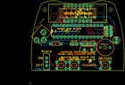

Contents
========

* [PROJ-SPAR-10930-STAN-01>ClockIt](#proj-spar-10930-stan-01clockit)
	* [Images](#images)
	* [OOMP Parts](#oomp-parts)
	* [Tags](#tags)
  
![][im]
# PROJ-SPAR-10930-STAN-01>ClockIt

- ID: PROJ-SPAR-10930-STAN-01
- Hex ID: PRS10930
- Name: ClockIt
- Description: 

## Images
  
  

|eagleImage|kicadPcb3dFront|kicadPcb3dBack|kicadPcb3d|
| :---: | :---: | :---: | :---: |
|||||

## OOMP Parts
  

|OOMP Parts|
| :---: |
|UNMATCHED-UNMATCHED-X-UNMATCHED-01, C1, 3.0479999999999996, 19.049999999999997, 0,C1, CAP-PTH-SMALL-KIT, SparkFun, (0.12, 0.75), R0|
|UNMATCHED-UNMATCHED-X-UNMATCHED-01, C2, 11.43, 19.049999999999997, 180,C2, CAP-PTH-SMALL-KIT, SparkFun, (0.45, 0.75), R180|
|CAPE-UNMATCHED-X-UNMATCHED-01, C5, 26.669999999999998, 21.59, 90,C5, 10uF, CPOL-RADIAL-10UF-25V-KIT, Testing, (1.05, 0.85), R90|
|CAPE-UNMATCHED-X-NF100-01, C6, -3.8099999999999996, 19.049999999999997, 0,C6, 0.1uF, CAP-PTH-SMALL-KIT, SparkFun, (-0.15, 0.75), R0|
|UNMATCHED-UNMATCHED-X-UNMATCHED-01, J1, -19.702999964, 32.241599982000004, M220,J1, POWER_JACKKIT, POWER-BARRELJACK-PTH-LOCK-KIT, Testing, (-0.77570866, 1.26935433), MR220|
|UNMATCHED-UNMATCHED-X-UNMATCHED-01, JP2, 20.32, 30.479999999999997, 270,JP2, AVR_SPI_PRG_6PTH, 2X3, SparkFun, (0.8, 1.2), R270|
|UNMATCHED-UNMATCHED-X-UNMATCHED-01, LED1, 0.0, 40.64, 0,LED1, 7-SEGMENT-4DIGIT-YOUNGSUNKIT, 7-SEGMENT-4DIGIT-YOUNGSUN-KIT, Testing, (0, 1.6), R0|
|UNMATCHED-UNMATCHED-X-UNMATCHED-01, Q1, 7.112, 14.985999999999999, 180,Q1, 16MHz, HC49US-KIT, Testing, (0.28, 0.59), R180|
|RESE-UNMATCHED-X-O103-01, R1, -15.239999999999998, 19.049999999999997, 180,R1, 10K, AXIAL-0.3-KIT, SparkFun, (-0.6, 0.75), R180|
|UNMATCHED-UNMATCHED-X-UNMATCHED-01, S1, -2.54, 3.8099999999999996, 0,S1, SWITCH-MOMENTARY-2TACTILE-PTH-KIT, TACTILE-PTH-KIT, Testing, (-0.1, 0.15), R0|
|UNMATCHED-UNMATCHED-X-UNMATCHED-01, S2, -11.43, 3.8099999999999996, 0,S2, SWITCH-MOMENTARY-2TACTILE-PTH-KIT, TACTILE-PTH-KIT, Testing, (-0.45, 0.15), R0|
|UNMATCHED-UNMATCHED-X-UNMATCHED-01, S3, -21.59, 6.35, 0,S3, SWITCH-SPDT_KIT, SparkFun, (-0.85, 0.25), R0|
|UNMATCHED-UNMATCHED-X-UNMATCHED-01, S4, 19.049999999999997, 3.8099999999999996, 0,S4, SWITCH-MOMENTARY-2TACTILE-PTH-KIT, TACTILE-PTH-KIT, Testing, (0.75, 0.15), R0|
|UNMATCHED-UNMATCHED-X-UNMATCHED-01, SG2, 19.049999999999997, 16.509999999999998, 0,SG2, BUZZERKIT, BUZZER-12MM-KIT, SparkFun, (0.75, 0.65), R0|
|UNMATCHED-UNMATCHED-X-UNMATCHED-01, U1, 0.0, 27.94, 0,U1, AVR-MEGA8-PKIT, DIL28-3-KIT, Testing, (0, 1.1), R0|

## Tags

- hexID: PRS10930
- oompType: PROJ
- oompSize: SPAR
- oompColor: 10930
- oompDesc: STAN
- oompIndex: 01
- oompName: ClockIt
- sources: All source files from https://github.com/sparkfun/ClockIt (source licence details in srcLicense.md)
- linkBuyPage: https://www.sparkfun.com/products/10930
- oompPart: UNMATCHED-UNMATCHED-X-UNMATCHED-01, C1, 3.0479999999999996, 19.049999999999997, 0
- oompPart: UNMATCHED-UNMATCHED-X-UNMATCHED-01, C2, 11.43, 19.049999999999997, 180
- oompPart: CAPE-UNMATCHED-X-UNMATCHED-01, C5, 26.669999999999998, 21.59, 90
- oompPart: CAPE-UNMATCHED-X-NF100-01, C6, -3.8099999999999996, 19.049999999999997, 0
- oompPart: UNMATCHED-UNMATCHED-X-UNMATCHED-01, J1, -19.702999964, 32.241599982000004, M220
- oompPart: UNMATCHED-UNMATCHED-X-UNMATCHED-01, JP2, 20.32, 30.479999999999997, 270
- oompPart: UNMATCHED-UNMATCHED-X-UNMATCHED-01, LED1, 0.0, 40.64, 0
- oompPart: UNMATCHED-UNMATCHED-X-UNMATCHED-01, Q1, 7.112, 14.985999999999999, 180
- oompPart: RESE-UNMATCHED-X-O103-01, R1, -15.239999999999998, 19.049999999999997, 180
- oompPart: UNMATCHED-UNMATCHED-X-UNMATCHED-01, S1, -2.54, 3.8099999999999996, 0
- oompPart: UNMATCHED-UNMATCHED-X-UNMATCHED-01, S2, -11.43, 3.8099999999999996, 0
- oompPart: UNMATCHED-UNMATCHED-X-UNMATCHED-01, S3, -21.59, 6.35, 0
- oompPart: UNMATCHED-UNMATCHED-X-UNMATCHED-01, S4, 19.049999999999997, 3.8099999999999996, 0
- oompPart: UNMATCHED-UNMATCHED-X-UNMATCHED-01, SG2, 19.049999999999997, 16.509999999999998, 0
- oompPart: UNMATCHED-UNMATCHED-X-UNMATCHED-01, U1, 0.0, 27.94, 0
- rawPart: C1, CAP-PTH-SMALL-KIT, SparkFun, (0.12, 0.75), R0
- rawPart: C2, CAP-PTH-SMALL-KIT, SparkFun, (0.45, 0.75), R180
- rawPart: C5, 10uF, CPOL-RADIAL-10UF-25V-KIT, Testing, (1.05, 0.85), R90
- rawPart: C6, 0.1uF, CAP-PTH-SMALL-KIT, SparkFun, (-0.15, 0.75), R0
- rawPart: J1, POWER_JACKKIT, POWER-BARRELJACK-PTH-LOCK-KIT, Testing, (-0.77570866, 1.26935433), MR220
- rawPart: JP2, AVR_SPI_PRG_6PTH, 2X3, SparkFun, (0.8, 1.2), R270
- rawPart: LED1, 7-SEGMENT-4DIGIT-YOUNGSUNKIT, 7-SEGMENT-4DIGIT-YOUNGSUN-KIT, Testing, (0, 1.6), R0
- rawPart: Q1, 16MHz, HC49US-KIT, Testing, (0.28, 0.59), R180
- rawPart: R1, 10K, AXIAL-0.3-KIT, SparkFun, (-0.6, 0.75), R180
- rawPart: S1, SWITCH-MOMENTARY-2TACTILE-PTH-KIT, TACTILE-PTH-KIT, Testing, (-0.1, 0.15), R0
- rawPart: S2, SWITCH-MOMENTARY-2TACTILE-PTH-KIT, TACTILE-PTH-KIT, Testing, (-0.45, 0.15), R0
- rawPart: S3, SWITCH-SPDT_KIT, SparkFun, (-0.85, 0.25), R0
- rawPart: S4, SWITCH-MOMENTARY-2TACTILE-PTH-KIT, TACTILE-PTH-KIT, Testing, (0.75, 0.15), R0
- rawPart: SG2, BUZZERKIT, BUZZER-12MM-KIT, SparkFun, (0.75, 0.65), R0
- rawPart: U1, AVR-MEGA8-PKIT, DIL28-3-KIT, Testing, (0, 1.1), R0

[im]: kicadPcb3d_450.png
