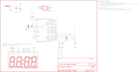

Contents
========

* [PRS10930 > Sparkfun](#prs10930--sparkfun)
	* [Schematic](#schematic)
	* [OOMP Parts](#oomp-parts)
	* [Images](#images)
	* [Tags](#tags)
  
![][im]
# PRS10930 > Sparkfun

- ID: PROJ-SPAR-10930-STAN-01
- Hex ID: PRS10930
- Name: Sparkfun
- Description: Sparkfun
- Long Link: [http://oom.lt/PROJ-SPAR-10930-STAN-01](http://oom.lt/PROJ-SPAR-10930-STAN-01)
- Long Link: [http://oom.lt/PRS10930](http://oom.lt/PRS10930)

## Schematic
  
![][schem]
## OOMP Parts
  

|OOMP Parts|
| :---: |
|C1,UNMATCHED-UNMATCHED-UNMATCHED-UNMATCHED-UNMATCHED,C1,,CAPCAP-PTH-SMALL-KIT,CAP-PTH-SMALL-KIT,Capacitor,,|
|C2,UNMATCHED-UNMATCHED-UNMATCHED-UNMATCHED-UNMATCHED,C2,,CAPCAP-PTH-SMALL-KIT,CAP-PTH-SMALL-KIT,Capacitor,,|
|C5,UNMATCHED-UNMATCHED-UNMATCHED-UNMATCHED-UNMATCHED,C5,10uF,CAP_POLCPOL-RADIAL-10UF-25V-KIT,CPOL-RADIAL-10UF-25V-KIT,Capacitor Polarized,,|
|C6,UNMATCHED-UNMATCHED-UNMATCHED-UNMATCHED-UNMATCHED,C6,0.1uF,CAPCAP-PTH-SMALL-KIT,CAP-PTH-SMALL-KIT,Capacitor,,|
|J1,UNMATCHED-UNMATCHED-UNMATCHED-UNMATCHED-UNMATCHED,J1,POWER_JACKKIT,POWER_JACKKIT,POWER-BARRELJACK-PTH-LOCK-KIT,Power Jack,,|
|JP2,UNMATCHED-UNMATCHED-UNMATCHED-UNMATCHED-UNMATCHED,JP2,AVR_SPI_PRG_6PTH,AVR_SPI_PRG_6PTH,2X3,AVR ISP 6 Pin,,|
|LED1,UNMATCHED-UNMATCHED-UNMATCHED-UNMATCHED-UNMATCHED,LED1,7-SEGMENT-4DIGIT-YOUNGSUNKIT,7-SEGMENT-4DIGIT-YOUNGSUNKIT,7-SEGMENT-4DIGIT-YOUNGSUN-KIT,This is a part for the 4-Digit 7-segment LEDs from Young Sun.  Different from the Digikey LEDs, all 16 pins are used.,,|
|Q1,UNMATCHED-UNMATCHED-UNMATCHED-UNMATCHED-UNMATCHED,Q1,16MHz,CRYSTALHC49US-KIT,HC49US-KIT,Crystals,,|
|R1,UNMATCHED-UNMATCHED-UNMATCHED-UNMATCHED-UNMATCHED,R1,10K,RESISTORAXIAL-0.3-KIT,AXIAL-0.3-KIT,Resistor,,|
|S1,UNMATCHED-UNMATCHED-UNMATCHED-UNMATCHED-UNMATCHED,S1,SWITCH-MOMENTARY-2TACTILE-PTH-KIT,SWITCH-MOMENTARY-2TACTILE-PTH-KIT,TACTILE-PTH-KIT,,,|
|S2,UNMATCHED-UNMATCHED-UNMATCHED-UNMATCHED-UNMATCHED,S2,SWITCH-MOMENTARY-2TACTILE-PTH-KIT,SWITCH-MOMENTARY-2TACTILE-PTH-KIT,TACTILE-PTH-KIT,,,|
|S3,UNMATCHED-UNMATCHED-UNMATCHED-UNMATCHED-UNMATCHED,S3,,SWITCH-SPSTKIT,SWITCH-SPDT_KIT,SPST Switch,,|
|S4,UNMATCHED-UNMATCHED-UNMATCHED-UNMATCHED-UNMATCHED,S4,SWITCH-MOMENTARY-2TACTILE-PTH-KIT,SWITCH-MOMENTARY-2TACTILE-PTH-KIT,TACTILE-PTH-KIT,,,|
|SG2,UNMATCHED-UNMATCHED-UNMATCHED-UNMATCHED-UNMATCHED,SG2,BUZZERKIT,BUZZERKIT,BUZZER-12MM-KIT,Buzzer 12mm,,|
|U$1,UNMATCHED-UNMATCHED-UNMATCHED-UNMATCHED-UNMATCHED,U$1,LOGO-SFESK,LOGO-SFESK,SFE-LOGO-FLAME,Spark Fun Electronics PCB Logo,,|
|U$2,UNMATCHED-UNMATCHED-UNMATCHED-UNMATCHED-UNMATCHED,U$2,CREATIVE_COMMONS,CREATIVE_COMMONS,CREATIVE_COMMONS,,,|
|U$3,UNMATCHED-UNMATCHED-UNMATCHED-UNMATCHED-UNMATCHED,U$3,LOGO-SFENEW,LOGO-SFENEW,SFE-NEW-WEBLOGO,Spark Fun Electronics PCB Logo,,|
|U$8,UNMATCHED-UNMATCHED-UNMATCHED-UNMATCHED-UNMATCHED,U$8,STAND-OFF,STAND-OFF,STAND-OFF,Stand Off,,|
|U$9,UNMATCHED-UNMATCHED-UNMATCHED-UNMATCHED-UNMATCHED,U$9,STAND-OFF,STAND-OFF,STAND-OFF,Stand Off,,|
|U1,UNMATCHED-UNMATCHED-UNMATCHED-UNMATCHED-UNMATCHED,U1,AVR-MEGA8-PKIT,AVR-MEGA8-PKIT,DIL28-3-KIT,MICROCONTROLLER,,|

## Images
  
  

|kicadPcb3d|kicadPcb3dFront|kicadPcb3dBack|eagleImage|eagleSchemImage|
| :---: | :---: | :---: | :---: | :---: |
||||||

## Tags

- hexID: PRS10930
- oompType: PROJ
- oompSize: SPAR
- oompColor: 10930
- oompDesc: STAN
- oompIndex: 01
- oompName: ClockIt
- sources: All source files from https://github.com/sparkfun/ClockIt (source licence details in srcLicense.md)
- linkBuyPage: https://www.sparkfun.com/products/10930
- oompID: PROJ-SPAR-10930-STAN-01
- oompParts: C1,UNMATCHED-UNMATCHED-UNMATCHED-UNMATCHED-UNMATCHED
- oompParts: C2,UNMATCHED-UNMATCHED-UNMATCHED-UNMATCHED-UNMATCHED
- oompParts: C5,UNMATCHED-UNMATCHED-UNMATCHED-UNMATCHED-UNMATCHED
- oompParts: C6,UNMATCHED-UNMATCHED-UNMATCHED-UNMATCHED-UNMATCHED
- oompParts: J1,UNMATCHED-UNMATCHED-UNMATCHED-UNMATCHED-UNMATCHED
- oompParts: JP2,UNMATCHED-UNMATCHED-UNMATCHED-UNMATCHED-UNMATCHED
- oompParts: LED1,UNMATCHED-UNMATCHED-UNMATCHED-UNMATCHED-UNMATCHED
- oompParts: Q1,UNMATCHED-UNMATCHED-UNMATCHED-UNMATCHED-UNMATCHED
- oompParts: R1,UNMATCHED-UNMATCHED-UNMATCHED-UNMATCHED-UNMATCHED
- oompParts: S1,UNMATCHED-UNMATCHED-UNMATCHED-UNMATCHED-UNMATCHED
- oompParts: S2,UNMATCHED-UNMATCHED-UNMATCHED-UNMATCHED-UNMATCHED
- oompParts: S3,UNMATCHED-UNMATCHED-UNMATCHED-UNMATCHED-UNMATCHED
- oompParts: S4,UNMATCHED-UNMATCHED-UNMATCHED-UNMATCHED-UNMATCHED
- oompParts: SG2,UNMATCHED-UNMATCHED-UNMATCHED-UNMATCHED-UNMATCHED
- oompParts: U$1,UNMATCHED-UNMATCHED-UNMATCHED-UNMATCHED-UNMATCHED
- oompParts: U$2,UNMATCHED-UNMATCHED-UNMATCHED-UNMATCHED-UNMATCHED
- oompParts: U$3,UNMATCHED-UNMATCHED-UNMATCHED-UNMATCHED-UNMATCHED
- oompParts: U$8,UNMATCHED-UNMATCHED-UNMATCHED-UNMATCHED-UNMATCHED
- oompParts: U$9,UNMATCHED-UNMATCHED-UNMATCHED-UNMATCHED-UNMATCHED
- oompParts: U1,UNMATCHED-UNMATCHED-UNMATCHED-UNMATCHED-UNMATCHED
- rawParts: C1,,CAPCAP-PTH-SMALL-KIT,CAP-PTH-SMALL-KIT,Capacitor,,
- rawParts: C2,,CAPCAP-PTH-SMALL-KIT,CAP-PTH-SMALL-KIT,Capacitor,,
- rawParts: C5,10uF,CAP_POLCPOL-RADIAL-10UF-25V-KIT,CPOL-RADIAL-10UF-25V-KIT,Capacitor Polarized,,
- rawParts: C6,0.1uF,CAPCAP-PTH-SMALL-KIT,CAP-PTH-SMALL-KIT,Capacitor,,
- rawParts: J1,POWER_JACKKIT,POWER_JACKKIT,POWER-BARRELJACK-PTH-LOCK-KIT,Power Jack,,
- rawParts: JP2,AVR_SPI_PRG_6PTH,AVR_SPI_PRG_6PTH,2X3,AVR ISP 6 Pin,,
- rawParts: LED1,7-SEGMENT-4DIGIT-YOUNGSUNKIT,7-SEGMENT-4DIGIT-YOUNGSUNKIT,7-SEGMENT-4DIGIT-YOUNGSUN-KIT,This is a part for the 4-Digit 7-segment LEDs from Young Sun.  Different from the Digikey LEDs, all 16 pins are used.,,
- rawParts: Q1,16MHz,CRYSTALHC49US-KIT,HC49US-KIT,Crystals,,
- rawParts: R1,10K,RESISTORAXIAL-0.3-KIT,AXIAL-0.3-KIT,Resistor,,
- rawParts: S1,SWITCH-MOMENTARY-2TACTILE-PTH-KIT,SWITCH-MOMENTARY-2TACTILE-PTH-KIT,TACTILE-PTH-KIT,,,
- rawParts: S2,SWITCH-MOMENTARY-2TACTILE-PTH-KIT,SWITCH-MOMENTARY-2TACTILE-PTH-KIT,TACTILE-PTH-KIT,,,
- rawParts: S3,,SWITCH-SPSTKIT,SWITCH-SPDT_KIT,SPST Switch,,
- rawParts: S4,SWITCH-MOMENTARY-2TACTILE-PTH-KIT,SWITCH-MOMENTARY-2TACTILE-PTH-KIT,TACTILE-PTH-KIT,,,
- rawParts: SG2,BUZZERKIT,BUZZERKIT,BUZZER-12MM-KIT,Buzzer 12mm,,
- rawParts: U$1,LOGO-SFESK,LOGO-SFESK,SFE-LOGO-FLAME,Spark Fun Electronics PCB Logo,,
- rawParts: U$2,CREATIVE_COMMONS,CREATIVE_COMMONS,CREATIVE_COMMONS,,,
- rawParts: U$3,LOGO-SFENEW,LOGO-SFENEW,SFE-NEW-WEBLOGO,Spark Fun Electronics PCB Logo,,
- rawParts: U$8,STAND-OFF,STAND-OFF,STAND-OFF,Stand Off,,
- rawParts: U$9,STAND-OFF,STAND-OFF,STAND-OFF,Stand Off,,
- rawParts: U1,AVR-MEGA8-PKIT,AVR-MEGA8-PKIT,DIL28-3-KIT,MICROCONTROLLER,,

[im]: kicadPcb3d_450.png
[schem]: eagleSchemImage.png
