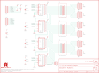

Contents
========

* [PRS10936 > Bar Graph Breakout Kit](#prs10936--bar-graph-breakout-kit)
	* [Schematic](#schematic)
	* [PCB](#pcb)
	* [Interactive BOM](#interactive-bom)
	* [OOMP Parts](#oomp-parts)
	* [Images](#images)
	* [Tags](#tags)
  
![][im]
# PRS10936 > Bar Graph Breakout Kit

- ID: PROJ-SPAR-10936-STAN-01
- Hex ID: PRS10936
- Name: Sparkfun
- Description: Sparkfun
- Long Link: [http://oom.lt/PROJ-SPAR-10936-STAN-01](http://oom.lt/PROJ-SPAR-10936-STAN-01)
- Short Link: [http://oom.lt/PRS10936](http://oom.lt/PRS10936)

## Schematic
  

## PCB
  

## Interactive BOM

- Interactive BOM page: [ibom.html](https://htmlpreview.github.io/?https://github.com/oomlout/oomlout_OOMP_projects/blob/main/PROJ-SPAR-10936-STAN-01/kicad/bom/ibom.html)

## OOMP Parts
  

|OOMP Parts|
| :---: |
|C1 C1,CAPX-UNMATCHED-X-UF1D-01|
|C2 C2,CAPX-UNMATCHED-X-UF1D-01|
|C3 C3,CAPX-UNMATCHED-X-UF1D-01|
|C4 C4,CAPX-UNMATCHED-X-UF1D-01|
|C5 C5,CAPX-UNMATCHED-X-UF10-01|
|D1 D1,LEDS-UNMATCHED-G-STAN-01|
|D2 D2,LEDS-UNMATCHED-G-STAN-01|
|D3 D3,LEDS-UNMATCHED-G-STAN-01|
|IC1 IC1,UNMATCHED-UNMATCHED-X-UNMATCHED-01|
|IC2 IC2,UNMATCHED-UNMATCHED-X-UNMATCHED-01|
|IC3 IC3,UNMATCHED-UNMATCHED-X-UNMATCHED-01|
|IC4 IC4,UNMATCHED-UNMATCHED-X-UNMATCHED-01|
|[JP1 HEAD-I01-X-PI06-01 2.54 mm 6 Pin Header](https://github.com/oomlout/oomlout_OOMP_parts/tree/main/HEAD-I01-X-PI06-01/)|
|[JP2 HEAD-I01-X-PI06-01 2.54 mm 6 Pin Header](https://github.com/oomlout/oomlout_OOMP_parts/tree/main/HEAD-I01-X-PI06-01/)|
|[JP3 HEAD-I01-X-PI02-01 2.54 mm 2 Pin Header](https://github.com/oomlout/oomlout_OOMP_parts/tree/main/HEAD-I01-X-PI02-01/)|
|R1 R1,RESE-UNMATCHED-X-O102-01|
|R2 R2,RESE-UNMATCHED-X-O331-01|
|R3 R3,RESE-UNMATCHED-X-O331-01|
|R4 R4,RESE-UNMATCHED-X-O331-01|
|R5 R5,RESE-UNMATCHED-X-O331-01|
|R6 R6,RESE-UNMATCHED-X-O331-01|
|R7 R7,RESE-UNMATCHED-X-O331-01|

## Images
  
  

|kicadPcb3d|kicadPcb3dFront|kicadPcb3dBack|eagleImage|eagleSchemImage|
| :---: | :---: | :---: | :---: | :---: |
||||||

## Tags

- hexID: PRS10936
- oompType: PROJ
- oompSize: SPAR
- oompColor: 10936
- oompDesc: STAN
- oompIndex: 01
- oompName: Bar Graph Breakout Kit
- sources: All source files from https://github.com/sparkfun/Bar_Graph_Breakout_Kit (source licence details in srcLicense.md)
- linkBuyPage: https://www.sparkfun.com/products/10936
- oompID: PROJ-SPAR-10936-STAN-01
- oompParts: C1,CAPX-UNMATCHED-X-UF1D-01
- oompParts: C2,CAPX-UNMATCHED-X-UF1D-01
- oompParts: C3,CAPX-UNMATCHED-X-UF1D-01
- oompParts: C4,CAPX-UNMATCHED-X-UF1D-01
- oompParts: C5,CAPX-UNMATCHED-X-UF10-01
- oompParts: D1,LEDS-UNMATCHED-G-STAN-01
- oompParts: D2,LEDS-UNMATCHED-G-STAN-01
- oompParts: D3,LEDS-UNMATCHED-G-STAN-01
- oompParts: IC1,UNMATCHED-UNMATCHED-X-UNMATCHED-01
- oompParts: IC2,UNMATCHED-UNMATCHED-X-UNMATCHED-01
- oompParts: IC3,UNMATCHED-UNMATCHED-X-UNMATCHED-01
- oompParts: IC4,UNMATCHED-UNMATCHED-X-UNMATCHED-01
- oompParts: JP1,HEAD-I01-X-PI06-01
- oompParts: JP2,HEAD-I01-X-PI06-01
- oompParts: JP3,HEAD-I01-X-PI02-01
- oompParts: R1,RESE-UNMATCHED-X-O102-01
- oompParts: R2,RESE-UNMATCHED-X-O331-01
- oompParts: R3,RESE-UNMATCHED-X-O331-01
- oompParts: R4,RESE-UNMATCHED-X-O331-01
- oompParts: R5,RESE-UNMATCHED-X-O331-01
- oompParts: R6,RESE-UNMATCHED-X-O331-01
- oompParts: R7,RESE-UNMATCHED-X-O331-01
- rawParts: C1,0.1uF,CAPPTH2,CAP-PTH-SMALL2,Capacitor,,
- rawParts: C2,0.1uF,CAPPTH2,CAP-PTH-SMALL2,Capacitor,,
- rawParts: C3,0.1uF,CAPPTH2,CAP-PTH-SMALL2,Capacitor,,
- rawParts: C4,0.1uF,CAPPTH2,CAP-PTH-SMALL2,Capacitor,,
- rawParts: C5,10uF,CAP_POLPTH2,CPOL-RADIAL-10UF-25V,Capacitor Polarized,,
- rawParts: D1,,LED_BARGRAPH_10,LED_BARGAPH_10,10-Segment LED Bar Graph,,
- rawParts: D2,,LED_BARGRAPH_10,LED_BARGAPH_10,10-Segment LED Bar Graph,,
- rawParts: D3,,LED_BARGRAPH_10,LED_BARGAPH_10,10-Segment LED Bar Graph,,
- rawParts: IC1,74LS595N,74LS595N,DIL16,8-bit SHIFT REGISTER, output latch,,
- rawParts: IC2,74LS595N,74LS595N,DIL16,8-bit SHIFT REGISTER, output latch,,
- rawParts: IC3,74LS595N,74LS595N,DIL16,8-bit SHIFT REGISTER, output latch,,
- rawParts: IC4,74LS595N,74LS595N,DIL16,8-bit SHIFT REGISTER, output latch,,
- rawParts: JP1,IN,M06SIP,1X06,Header 6,,
- rawParts: JP2,OUT,M06SIP,1X06,Header 6,,
- rawParts: JP3,,M02PTH,1X02,Header 2,,
- rawParts: LOGO1,LOGO-SFENW2,LOGO-SFENW2,SFE-NEW-WEB,Spark Fun Electronics PCB Logo,,
- rawParts: LOGO2,LOGO-SFESK,LOGO-SFESK,SFE-LOGO-FLAME,Spark Fun Electronics PCB Logo,,
- rawParts: R1,1K,RESISTORAXIAL-0.3,AXIAL-0.3,Resistor,,
- rawParts: R2,330,RPACK-BUSSED-SIP-PTH-5,RPACK-SIP-PTH-5,BOURNS 4600X series thick-film SIP resistor packs,,
- rawParts: R3,330,RPACK-BUSSED-SIP-PTH-5,RPACK-SIP-PTH-5,BOURNS 4600X series thick-film SIP resistor packs,,
- rawParts: R4,330,RPACK-BUSSED-SIP-PTH-5,RPACK-SIP-PTH-5,BOURNS 4600X series thick-film SIP resistor packs,,
- rawParts: R5,330,RPACK-BUSSED-SIP-PTH-5,RPACK-SIP-PTH-5,BOURNS 4600X series thick-film SIP resistor packs,,
- rawParts: R6,330,RPACK-BUSSED-SIP-PTH-5,RPACK-SIP-PTH-5,BOURNS 4600X series thick-film SIP resistor packs,,
- rawParts: R7,330,RPACK-BUSSED-SIP-PTH-5,RPACK-SIP-PTH-5,BOURNS 4600X series thick-film SIP resistor packs,,
- rawParts: SO1,STAND-OFF,STAND-OFF,STAND-OFF,Stand Off,,
- rawParts: SO2,STAND-OFF,STAND-OFF,STAND-OFF,Stand Off,,
- rawParts: SO3,STAND-OFF,STAND-OFF,STAND-OFF,Stand Off,,
- rawParts: SO4,STAND-OFF,STAND-OFF,STAND-OFF,Stand Off,,
- rawParts: U$5,OSHW-LOGOM,OSHW-LOGOM,OSHW-LOGO-M,Open Source Hardware Logo This logo indicates the piece of hardware it is found on incorporates a OSHW license and/or adheres to the definition of open source hardware found here: http://freedomdefined.org/OSHW,,
- rawParts: U$6,CREATIVE_COMMONS,CREATIVE_COMMONS,CREATIVE_COMMONS,,,

[im]: kicadPcb3d_450.png
