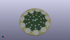
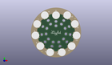
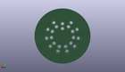
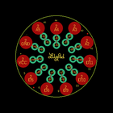
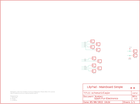

Contents
========

* [PRS10940 > Sparkfun](#prs10940--sparkfun)
	* [Schematic](#schematic)
	* [Interactive BOM](#interactive-bom)
	* [OOMP Parts](#oomp-parts)
	* [Images](#images)
	* [Tags](#tags)
  
![][im]
# PRS10940 > Sparkfun

- ID: PROJ-SPAR-10940-STAN-01
- Hex ID: PRS10940
- Name: Sparkfun
- Description: Sparkfun
- Long Link: [http://oom.lt/PROJ-SPAR-10940-STAN-01](http://oom.lt/PROJ-SPAR-10940-STAN-01)
- Long Link: [http://oom.lt/PRS10940](http://oom.lt/PRS10940)

## Schematic
  
![][schem]
## Interactive BOM

- Interactive BOM page: [ibom.html](https://htmlpreview.github.io/?https://github.com/oomlout/oomlout_OOMP_projects/blob/main/PROJ-SPAR-10940-STAN-01/kicad/bom/ibom.html)

## OOMP Parts
  

|OOMP Parts|
| :---: |
|JP3,UNMATCHED-UNMATCHED-UNMATCHED-UNMATCHED-UNMATCHED,JP1,FIDUCIALUFIDUCIAL,FIDUCIALUFIDUCIAL,MICRO-FIDUCIAL,Fiducial Alignment Points,,|
|JP4,UNMATCHED-UNMATCHED-UNMATCHED-UNMATCHED-UNMATCHED,JP2,FIDUCIALUFIDUCIAL,FIDUCIALUFIDUCIAL,MICRO-FIDUCIAL,Fiducial Alignment Points,,|
|JP5,UNMATCHED-UNMATCHED-UNMATCHED-UNMATCHED-UNMATCHED,JP3,M01SNAP-MALE_LARGE,M01SNAP-MALE_LARGE,SNAP-MALE_LARGE,Header 1,,|
|JP6,UNMATCHED-UNMATCHED-UNMATCHED-UNMATCHED-UNMATCHED,JP4,M01SNAP-MALE_LARGE,M01SNAP-MALE_LARGE,SNAP-MALE_LARGE,Header 1,,|
|JP7,UNMATCHED-UNMATCHED-UNMATCHED-UNMATCHED-UNMATCHED,JP5,M01SNAP-MALE_LARGE,M01SNAP-MALE_LARGE,SNAP-MALE_LARGE,Header 1,,|
|JP8,UNMATCHED-UNMATCHED-UNMATCHED-UNMATCHED-UNMATCHED,JP6,M01SNAP-MALE_LARGE,M01SNAP-MALE_LARGE,SNAP-MALE_LARGE,Header 1,,|
|JP9,UNMATCHED-UNMATCHED-UNMATCHED-UNMATCHED-UNMATCHED,JP7,M01SNAP-MALE_LARGE,M01SNAP-MALE_LARGE,SNAP-MALE_LARGE,Header 1,,|
|JP10,UNMATCHED-UNMATCHED-UNMATCHED-UNMATCHED-UNMATCHED,JP8,M01SNAP-MALE_LARGE,M01SNAP-MALE_LARGE,SNAP-MALE_LARGE,Header 1,,|
|JP11,UNMATCHED-UNMATCHED-UNMATCHED-UNMATCHED-UNMATCHED,JP9,M01SNAP-MALE_LARGE,M01SNAP-MALE_LARGE,SNAP-MALE_LARGE,Header 1,,|
|JP12,UNMATCHED-UNMATCHED-UNMATCHED-UNMATCHED-UNMATCHED,JP10,M01SNAP-MALE_LARGE,M01SNAP-MALE_LARGE,SNAP-MALE_LARGE,Header 1,,|
|JP13,UNMATCHED-UNMATCHED-UNMATCHED-UNMATCHED-UNMATCHED,JP11,M01SNAP-MALE_LARGE,M01SNAP-MALE_LARGE,SNAP-MALE_LARGE,Header 1,,|
|U$1,UNMATCHED-UNMATCHED-UNMATCHED-UNMATCHED-UNMATCHED,JP12,M01SNAP-MALE_LARGE,M01SNAP-MALE_LARGE,SNAP-MALE_LARGE,Header 1,,|

## Images
  
  

|kicadPcb3d|kicadPcb3dFront|kicadPcb3dBack|eagleImage|eagleSchemImage|
| :---: | :---: | :---: | :---: | :---: |
||||||

## Tags

- hexID: PRS10940
- oompType: PROJ
- oompSize: SPAR
- oompColor: 10940
- oompDesc: STAN
- oompIndex: 01
- oompName: LilyPad SimpleSnap Protoboard
- sources: All source files from https://github.com/sparkfun/LilyPad_SimpleSnap_Protoboard (source licence details in srcLicense.md)
- linkBuyPage: https://www.sparkfun.com/products/10940
- oompID: PROJ-SPAR-10940-STAN-01
- oompParts: JP3,UNMATCHED-UNMATCHED-UNMATCHED-UNMATCHED-UNMATCHED
- oompParts: JP4,UNMATCHED-UNMATCHED-UNMATCHED-UNMATCHED-UNMATCHED
- oompParts: JP5,UNMATCHED-UNMATCHED-UNMATCHED-UNMATCHED-UNMATCHED
- oompParts: JP6,UNMATCHED-UNMATCHED-UNMATCHED-UNMATCHED-UNMATCHED
- oompParts: JP7,UNMATCHED-UNMATCHED-UNMATCHED-UNMATCHED-UNMATCHED
- oompParts: JP8,UNMATCHED-UNMATCHED-UNMATCHED-UNMATCHED-UNMATCHED
- oompParts: JP9,UNMATCHED-UNMATCHED-UNMATCHED-UNMATCHED-UNMATCHED
- oompParts: JP10,UNMATCHED-UNMATCHED-UNMATCHED-UNMATCHED-UNMATCHED
- oompParts: JP11,UNMATCHED-UNMATCHED-UNMATCHED-UNMATCHED-UNMATCHED
- oompParts: JP12,UNMATCHED-UNMATCHED-UNMATCHED-UNMATCHED-UNMATCHED
- oompParts: JP13,UNMATCHED-UNMATCHED-UNMATCHED-UNMATCHED-UNMATCHED
- oompParts: U$1,UNMATCHED-UNMATCHED-UNMATCHED-UNMATCHED-UNMATCHED
- rawParts: JP1,FIDUCIALUFIDUCIAL,FIDUCIALUFIDUCIAL,MICRO-FIDUCIAL,Fiducial Alignment Points,,
- rawParts: JP2,FIDUCIALUFIDUCIAL,FIDUCIALUFIDUCIAL,MICRO-FIDUCIAL,Fiducial Alignment Points,,
- rawParts: JP3,M01SNAP-MALE_LARGE,M01SNAP-MALE_LARGE,SNAP-MALE_LARGE,Header 1,,
- rawParts: JP4,M01SNAP-MALE_LARGE,M01SNAP-MALE_LARGE,SNAP-MALE_LARGE,Header 1,,
- rawParts: JP5,M01SNAP-MALE_LARGE,M01SNAP-MALE_LARGE,SNAP-MALE_LARGE,Header 1,,
- rawParts: JP6,M01SNAP-MALE_LARGE,M01SNAP-MALE_LARGE,SNAP-MALE_LARGE,Header 1,,
- rawParts: JP7,M01SNAP-MALE_LARGE,M01SNAP-MALE_LARGE,SNAP-MALE_LARGE,Header 1,,
- rawParts: JP8,M01SNAP-MALE_LARGE,M01SNAP-MALE_LARGE,SNAP-MALE_LARGE,Header 1,,
- rawParts: JP9,M01SNAP-MALE_LARGE,M01SNAP-MALE_LARGE,SNAP-MALE_LARGE,Header 1,,
- rawParts: JP10,M01SNAP-MALE_LARGE,M01SNAP-MALE_LARGE,SNAP-MALE_LARGE,Header 1,,
- rawParts: JP11,M01SNAP-MALE_LARGE,M01SNAP-MALE_LARGE,SNAP-MALE_LARGE,Header 1,,
- rawParts: JP12,M01SNAP-MALE_LARGE,M01SNAP-MALE_LARGE,SNAP-MALE_LARGE,Header 1,,
- rawParts: JP13,M01SNAP-MALE_LARGE,M01SNAP-MALE_LARGE,SNAP-MALE_LARGE,Header 1,,
- rawParts: U$1,LOGO-LPLP,LOGO-LPLP,LOGO-LILYPAD,,,

[im]: kicadPcb3d_450.png
[schem]: eagleSchemImage.png
