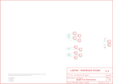

Contents
========

* [PRS10940 > LilyPad SimpleSnap Protoboard](#prs10940--lilypad-simplesnap-protoboard)
	* [Schematic](#schematic)
	* [PCB](#pcb)
	* [Interactive BOM](#interactive-bom)
	* [Images](#images)
	* [Tags](#tags)
  
![][im]
# PRS10940 > LilyPad SimpleSnap Protoboard

- ID: PROJ-SPAR-10940-STAN-01
- Hex ID: PRS10940
- Name: Sparkfun
- Description: Sparkfun
- Long Link: [http://oom.lt/PROJ-SPAR-10940-STAN-01](http://oom.lt/PROJ-SPAR-10940-STAN-01)
- Short Link: [http://oom.lt/PRS10940](http://oom.lt/PRS10940)

## Schematic
  

## PCB
  

## Interactive BOM

- Interactive BOM page: [ibom.html](https://htmlpreview.github.io/?https://github.com/oomlout/oomlout_OOMP_projects/blob/main/PROJ-SPAR-10940-STAN-01/kicad/bom/ibom.html)

## Images
  
  

|kicadPcb3d|kicadPcb3dFront|kicadPcb3dBack|eagleImage|eagleSchemImage|
| :---: | :---: | :---: | :---: | :---: |
||||||

## Tags

- hexID: PRS10940
- oompType: PROJ
- oompSize: SPAR
- oompColor: 10940
- oompDesc: STAN
- oompIndex: 01
- oompName: LilyPad SimpleSnap Protoboard
- sources: All source files from https://github.com/sparkfun/LilyPad_SimpleSnap_Protoboard (source licence details in srcLicense.md)
- linkBuyPage: https://www.sparkfun.com/products/10940
- oompID: PROJ-SPAR-10940-STAN-01
- rawParts: JP1,FIDUCIALUFIDUCIAL,FIDUCIALUFIDUCIAL,MICRO-FIDUCIAL,Fiducial Alignment Points,,
- rawParts: JP2,FIDUCIALUFIDUCIAL,FIDUCIALUFIDUCIAL,MICRO-FIDUCIAL,Fiducial Alignment Points,,
- rawParts: JP3,M01SNAP-MALE_LARGE,M01SNAP-MALE_LARGE,SNAP-MALE_LARGE,Header 1,,
- rawParts: JP4,M01SNAP-MALE_LARGE,M01SNAP-MALE_LARGE,SNAP-MALE_LARGE,Header 1,,
- rawParts: JP5,M01SNAP-MALE_LARGE,M01SNAP-MALE_LARGE,SNAP-MALE_LARGE,Header 1,,
- rawParts: JP6,M01SNAP-MALE_LARGE,M01SNAP-MALE_LARGE,SNAP-MALE_LARGE,Header 1,,
- rawParts: JP7,M01SNAP-MALE_LARGE,M01SNAP-MALE_LARGE,SNAP-MALE_LARGE,Header 1,,
- rawParts: JP8,M01SNAP-MALE_LARGE,M01SNAP-MALE_LARGE,SNAP-MALE_LARGE,Header 1,,
- rawParts: JP9,M01SNAP-MALE_LARGE,M01SNAP-MALE_LARGE,SNAP-MALE_LARGE,Header 1,,
- rawParts: JP10,M01SNAP-MALE_LARGE,M01SNAP-MALE_LARGE,SNAP-MALE_LARGE,Header 1,,
- rawParts: JP11,M01SNAP-MALE_LARGE,M01SNAP-MALE_LARGE,SNAP-MALE_LARGE,Header 1,,
- rawParts: JP12,M01SNAP-MALE_LARGE,M01SNAP-MALE_LARGE,SNAP-MALE_LARGE,Header 1,,
- rawParts: JP13,M01SNAP-MALE_LARGE,M01SNAP-MALE_LARGE,SNAP-MALE_LARGE,Header 1,,
- rawParts: U$1,LOGO-LPLP,LOGO-LPLP,LOGO-LILYPAD,,,

[im]: kicadPcb3d_450.png
