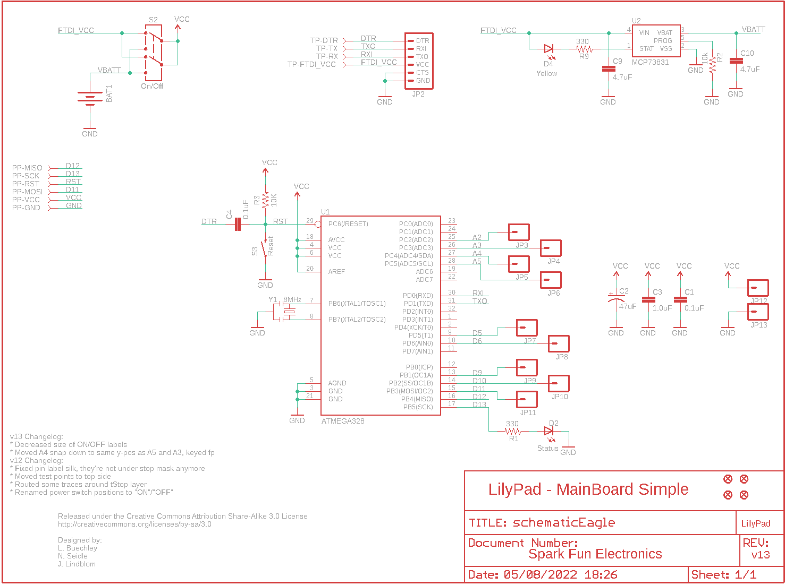
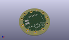
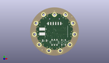
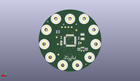
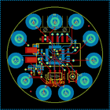
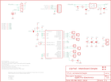

Contents
========

* [PRS10941 > Sparkfun](#prs10941--sparkfun)
	* [Schematic](#schematic)
	* [Interactive BOM](#interactive-bom)
	* [OOMP Parts](#oomp-parts)
	* [Images](#images)
	* [Tags](#tags)
  
![][im]
# PRS10941 > Sparkfun

- ID: PROJ-SPAR-10941-STAN-01
- Hex ID: PRS10941
- Name: Sparkfun
- Description: Sparkfun
- Long Link: [http://oom.lt/PROJ-SPAR-10941-STAN-01](http://oom.lt/PROJ-SPAR-10941-STAN-01)
- Short Link: [http://oom.lt/PRS10941](http://oom.lt/PRS10941)

## Schematic
  

## Interactive BOM

- Interactive BOM page: [ibom.html](https://htmlpreview.github.io/?https://github.com/oomlout/oomlout_OOMP_projects/blob/main/PROJ-SPAR-10941-STAN-01/kicad/bom/ibom.html)

## OOMP Parts
  

|OOMP Parts|
| :---: |
|BAT1,UNMATCHED-UNMATCHED-X-UNMATCHED-01,BAT1,,BATTERY110-TABS,LIPO-110-TABS,Battery Holders,,|
|C1,CAPC-0402-X-NF100-01,C1,0.1uF,CAP0402-CAP,0402-CAP,Capacitor,,|
|C2,CAPX-UNMATCHED-X-UF47-01,C2,47uF,CAP_POL3528,EIA3528,Capacitor Polarized,,|
|C3,CAPC-0402-X-UNMATCHED-01,C3,1.0uF,CAP0402-CAP,0402-CAP,Capacitor,,|
|C4,CAPC-0402-X-NF100-01,C4,0.1uF,CAP0402-CAP,0402-CAP,Capacitor,,|
|C9,CAPC-0402-X-UNMATCHED-01,C9,4.7uF,CAP0402-CAP,0402-CAP,Capacitor,,|
|C10,CAPC-0402-X-UNMATCHED-01,C10,4.7uF,CAP0402-CAP,0402-CAP,Capacitor,,|
|D2,LEDS-0603-G-STAN-01,D2,Status,LED0603,LED-0603,LEDs,,|
|D4,LEDS-0603-G-STAN-01,D4,Yellow,LED0603,LED-0603,LEDs,,|
|JP2,HEAD-I01-X-PI06-01,JP1,FIDUCIALUFIDUCIAL,FIDUCIALUFIDUCIAL,MICRO-FIDUCIAL,Fiducial Alignment Points,,|
|JP3,UNMATCHED-UNMATCHED-X-UNMATCHED-01,JP2,,ARDUINO_SERIAL_PROGRAMSMD,1X06-SMD,,,|
|JP4,UNMATCHED-UNMATCHED-X-UNMATCHED-01,JP3,M01SNAP-FEMALE_LARGE,M01SNAP-FEMALE,SNAP-FEMALE,Header 1,,|
|JP5,UNMATCHED-UNMATCHED-X-UNMATCHED-01,JP4,M01SNAP-FEMALE_LARGE,M01SNAP-FEMALE,SNAP-FEMALE,Header 1,,|
|JP6,UNMATCHED-UNMATCHED-X-UNMATCHED-01,JP5,M01SNAP-FEMALE_LARGE,M01SNAP-FEMALE,SNAP-FEMALE,Header 1,,|
|JP7,UNMATCHED-UNMATCHED-X-UNMATCHED-01,JP6,M01SNAP-FEMALE_LARGE,M01SNAP-FEMALE,SNAP-FEMALE,Header 1,,|
|JP8,UNMATCHED-UNMATCHED-X-UNMATCHED-01,JP7,M01SNAP-FEMALE_LARGE,M01SNAP-FEMALE,SNAP-FEMALE,Header 1,,|
|JP9,UNMATCHED-UNMATCHED-X-UNMATCHED-01,JP8,M01SNAP-FEMALE_LARGE,M01SNAP-FEMALE,SNAP-FEMALE,Header 1,,|
|JP10,UNMATCHED-UNMATCHED-X-UNMATCHED-01,JP9,M01SNAP-FEMALE_LARGE,M01SNAP-FEMALE,SNAP-FEMALE,Header 1,,|
|JP11,UNMATCHED-UNMATCHED-X-UNMATCHED-01,JP10,M01SNAP-FEMALE_LARGE,M01SNAP-FEMALE,SNAP-FEMALE,Header 1,,|
|JP12,UNMATCHED-UNMATCHED-X-UNMATCHED-01,JP11,M01SNAP-FEMALE_LARGE,M01SNAP-FEMALE,SNAP-FEMALE,Header 1,,|
|JP13,UNMATCHED-UNMATCHED-X-UNMATCHED-01,JP12,M01SNAP-FEMALE_LARGE,M01SNAP-FEMALE,SNAP-FEMALE,Header 1,,|
|PP-GND,UNMATCHED-UNMATCHED-X-UNMATCHED-01,JP13,M01SNAP-FEMALE_LARGE,M01SNAP-FEMALE,SNAP-FEMALE,Header 1,,|
|PP-MISO,UNMATCHED-UNMATCHED-X-UNMATCHED-01,JP14,FIDUCIALUFIDUCIAL,FIDUCIALUFIDUCIAL,MICRO-FIDUCIAL,Fiducial Alignment Points,,|
|PP-MOSI,UNMATCHED-UNMATCHED-X-UNMATCHED-01,JP15,FIDUCIALUFIDUCIAL,FIDUCIALUFIDUCIAL,MICRO-FIDUCIAL,Fiducial Alignment Points,,|
|PP-RST,UNMATCHED-UNMATCHED-X-UNMATCHED-01,JP16,FIDUCIALUFIDUCIAL,FIDUCIALUFIDUCIAL,MICRO-FIDUCIAL,Fiducial Alignment Points,,|
|PP-SCK,UNMATCHED-UNMATCHED-X-UNMATCHED-01,PP-GND,,TEST-POINT3X5,PAD.03X.05,,,|
|PP-VCC,UNMATCHED-UNMATCHED-X-UNMATCHED-01,PP-MISO,,TEST-POINT3X5,PAD.03X.05,,,|
|R1,RESE-0402-X-O331-01,PP-MOSI,,TEST-POINT3X5,PAD.03X.05,,,|
|R2,RESE-0402-X-O103-01,PP-RST,,TEST-POINT3X5,PAD.03X.05,,,|
|R3,RESE-0402-X-O103-01,PP-SCK,,TEST-POINT3X5,PAD.03X.05,,,|
|R9,RESE-0402-X-O331-01,PP-VCC,,TEST-POINT3X5,PAD.03X.05,,,|
|S2,UNMATCHED-UNMATCHED-X-UNMATCHED-01,R1,330,RESISTOR0402-RES,0402-RES,Resistor,,|
|S3,UNMATCHED-UNMATCHED-X-UNMATCHED-01,R2,10k,RESISTOR0402-RES,0402-RES,Resistor,,|
|TP-DTR,UNMATCHED-UNMATCHED-X-UNMATCHED-01,R3,10K,RESISTOR0402-RES,0402-RES,Resistor,,|
|TP-FTDI_VCC,UNMATCHED-UNMATCHED-X-UNMATCHED-01,R9,330,RESISTOR0402-RES,0402-RES,Resistor,,|
|TP-RX,UNMATCHED-UNMATCHED-X-UNMATCHED-01,S2,On/Off,AYZ0202,AYZ0202,SPDT Slide Switch,,|
|TP-TX,UNMATCHED-UNMATCHED-X-UNMATCHED-01,S3,Reset,SWITCH-MOMENTARY-2SMD,TACTILE_SWITCH_SMD,,,|
|U1,UNMATCHED-UNMATCHED-X-UNMATCHED-01,TP-DTR,,TEST-POINT3X5,PAD.03X.05,,,|
|U2,UNMATCHED-SO235-X-UNMATCHED-01,TP-FTDI_VCC,,TEST-POINT3X5,PAD.03X.05,,,|
|Y1,UNMATCHED-UNMATCHED-X-UNMATCHED-01,TP-RX,,TEST-POINT3X5,PAD.03X.05,,,|

## Images
  
  

|kicadPcb3d|kicadPcb3dFront|kicadPcb3dBack|eagleImage|eagleSchemImage|
| :---: | :---: | :---: | :---: | :---: |
||||||

## Tags

- hexID: PRS10941
- oompType: PROJ
- oompSize: SPAR
- oompColor: 10941
- oompDesc: STAN
- oompIndex: 01
- oompName: LilyPad Arduino SimpleSnap
- sources: All source files from https://github.com/sparkfun/LilyPad_Arduino_SimpleSnap (source licence details in srcLicense.md)
- linkBuyPage: https://www.sparkfun.com/products/10941
- oompID: PROJ-SPAR-10941-STAN-01
- oompParts: BAT1,UNMATCHED-UNMATCHED-X-UNMATCHED-01
- oompParts: C1,CAPC-0402-X-NF100-01
- oompParts: C2,CAPX-UNMATCHED-X-UF47-01
- oompParts: C3,CAPC-0402-X-UNMATCHED-01
- oompParts: C4,CAPC-0402-X-NF100-01
- oompParts: C9,CAPC-0402-X-UNMATCHED-01
- oompParts: C10,CAPC-0402-X-UNMATCHED-01
- oompParts: D2,LEDS-0603-G-STAN-01
- oompParts: D4,LEDS-0603-G-STAN-01
- oompParts: JP2,HEAD-I01-X-PI06-01
- oompParts: JP3,UNMATCHED-UNMATCHED-X-UNMATCHED-01
- oompParts: JP4,UNMATCHED-UNMATCHED-X-UNMATCHED-01
- oompParts: JP5,UNMATCHED-UNMATCHED-X-UNMATCHED-01
- oompParts: JP6,UNMATCHED-UNMATCHED-X-UNMATCHED-01
- oompParts: JP7,UNMATCHED-UNMATCHED-X-UNMATCHED-01
- oompParts: JP8,UNMATCHED-UNMATCHED-X-UNMATCHED-01
- oompParts: JP9,UNMATCHED-UNMATCHED-X-UNMATCHED-01
- oompParts: JP10,UNMATCHED-UNMATCHED-X-UNMATCHED-01
- oompParts: JP11,UNMATCHED-UNMATCHED-X-UNMATCHED-01
- oompParts: JP12,UNMATCHED-UNMATCHED-X-UNMATCHED-01
- oompParts: JP13,UNMATCHED-UNMATCHED-X-UNMATCHED-01
- oompParts: PP-GND,UNMATCHED-UNMATCHED-X-UNMATCHED-01
- oompParts: PP-MISO,UNMATCHED-UNMATCHED-X-UNMATCHED-01
- oompParts: PP-MOSI,UNMATCHED-UNMATCHED-X-UNMATCHED-01
- oompParts: PP-RST,UNMATCHED-UNMATCHED-X-UNMATCHED-01
- oompParts: PP-SCK,UNMATCHED-UNMATCHED-X-UNMATCHED-01
- oompParts: PP-VCC,UNMATCHED-UNMATCHED-X-UNMATCHED-01
- oompParts: R1,RESE-0402-X-O331-01
- oompParts: R2,RESE-0402-X-O103-01
- oompParts: R3,RESE-0402-X-O103-01
- oompParts: R9,RESE-0402-X-O331-01
- oompParts: S2,UNMATCHED-UNMATCHED-X-UNMATCHED-01
- oompParts: S3,UNMATCHED-UNMATCHED-X-UNMATCHED-01
- oompParts: TP-DTR,UNMATCHED-UNMATCHED-X-UNMATCHED-01
- oompParts: TP-FTDI_VCC,UNMATCHED-UNMATCHED-X-UNMATCHED-01
- oompParts: TP-RX,UNMATCHED-UNMATCHED-X-UNMATCHED-01
- oompParts: TP-TX,UNMATCHED-UNMATCHED-X-UNMATCHED-01
- oompParts: U1,UNMATCHED-UNMATCHED-X-UNMATCHED-01
- oompParts: U2,UNMATCHED-SO235-X-UNMATCHED-01
- oompParts: Y1,UNMATCHED-UNMATCHED-X-UNMATCHED-01
- rawParts: BAT1,,BATTERY110-TABS,LIPO-110-TABS,Battery Holders,,
- rawParts: C1,0.1uF,CAP0402-CAP,0402-CAP,Capacitor,,
- rawParts: C2,47uF,CAP_POL3528,EIA3528,Capacitor Polarized,,
- rawParts: C3,1.0uF,CAP0402-CAP,0402-CAP,Capacitor,,
- rawParts: C4,0.1uF,CAP0402-CAP,0402-CAP,Capacitor,,
- rawParts: C9,4.7uF,CAP0402-CAP,0402-CAP,Capacitor,,
- rawParts: C10,4.7uF,CAP0402-CAP,0402-CAP,Capacitor,,
- rawParts: D2,Status,LED0603,LED-0603,LEDs,,
- rawParts: D4,Yellow,LED0603,LED-0603,LEDs,,
- rawParts: JP1,FIDUCIALUFIDUCIAL,FIDUCIALUFIDUCIAL,MICRO-FIDUCIAL,Fiducial Alignment Points,,
- rawParts: JP2,,ARDUINO_SERIAL_PROGRAMSMD,1X06-SMD,,,
- rawParts: JP3,M01SNAP-FEMALE_LARGE,M01SNAP-FEMALE,SNAP-FEMALE,Header 1,,
- rawParts: JP4,M01SNAP-FEMALE_LARGE,M01SNAP-FEMALE,SNAP-FEMALE,Header 1,,
- rawParts: JP5,M01SNAP-FEMALE_LARGE,M01SNAP-FEMALE,SNAP-FEMALE,Header 1,,
- rawParts: JP6,M01SNAP-FEMALE_LARGE,M01SNAP-FEMALE,SNAP-FEMALE,Header 1,,
- rawParts: JP7,M01SNAP-FEMALE_LARGE,M01SNAP-FEMALE,SNAP-FEMALE,Header 1,,
- rawParts: JP8,M01SNAP-FEMALE_LARGE,M01SNAP-FEMALE,SNAP-FEMALE,Header 1,,
- rawParts: JP9,M01SNAP-FEMALE_LARGE,M01SNAP-FEMALE,SNAP-FEMALE,Header 1,,
- rawParts: JP10,M01SNAP-FEMALE_LARGE,M01SNAP-FEMALE,SNAP-FEMALE,Header 1,,
- rawParts: JP11,M01SNAP-FEMALE_LARGE,M01SNAP-FEMALE,SNAP-FEMALE,Header 1,,
- rawParts: JP12,M01SNAP-FEMALE_LARGE,M01SNAP-FEMALE,SNAP-FEMALE,Header 1,,
- rawParts: JP13,M01SNAP-FEMALE_LARGE,M01SNAP-FEMALE,SNAP-FEMALE,Header 1,,
- rawParts: JP14,FIDUCIALUFIDUCIAL,FIDUCIALUFIDUCIAL,MICRO-FIDUCIAL,Fiducial Alignment Points,,
- rawParts: JP15,FIDUCIALUFIDUCIAL,FIDUCIALUFIDUCIAL,MICRO-FIDUCIAL,Fiducial Alignment Points,,
- rawParts: JP16,FIDUCIALUFIDUCIAL,FIDUCIALUFIDUCIAL,MICRO-FIDUCIAL,Fiducial Alignment Points,,
- rawParts: PP-GND,,TEST-POINT3X5,PAD.03X.05,,,
- rawParts: PP-MISO,,TEST-POINT3X5,PAD.03X.05,,,
- rawParts: PP-MOSI,,TEST-POINT3X5,PAD.03X.05,,,
- rawParts: PP-RST,,TEST-POINT3X5,PAD.03X.05,,,
- rawParts: PP-SCK,,TEST-POINT3X5,PAD.03X.05,,,
- rawParts: PP-VCC,,TEST-POINT3X5,PAD.03X.05,,,
- rawParts: R1,330,RESISTOR0402-RES,0402-RES,Resistor,,
- rawParts: R2,10k,RESISTOR0402-RES,0402-RES,Resistor,,
- rawParts: R3,10K,RESISTOR0402-RES,0402-RES,Resistor,,
- rawParts: R9,330,RESISTOR0402-RES,0402-RES,Resistor,,
- rawParts: S2,On/Off,AYZ0202,AYZ0202,SPDT Slide Switch,,
- rawParts: S3,Reset,SWITCH-MOMENTARY-2SMD,TACTILE_SWITCH_SMD,,,
- rawParts: TP-DTR,,TEST-POINT3X5,PAD.03X.05,,,
- rawParts: TP-FTDI_VCC,,TEST-POINT3X5,PAD.03X.05,,,
- rawParts: TP-RX,,TEST-POINT3X5,PAD.03X.05,,,
- rawParts: TP-TX,,TEST-POINT3X5,PAD.03X.05,,,
- rawParts: U$2,LOGO-LPLP,LOGO-LPLP,LOGO-LILYPAD,,,
- rawParts: U1,ATMEGA328,ATMEGA168,TQFP32-08,,,
- rawParts: U2,MCP73831,MCP73831,SOT23-5,Microchips MCP73831,,
- rawParts: Y1,8MHz,RESONATORSMD,RESONATOR-SMD,Resonator,,

[im]: kicadPcb3d_450.png
