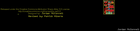

Contents
========

* [PROJ-SPAR-10968-STAN-01>NCP1402-5V Breakout](#proj-spar-10968-stan-01ncp1402-5v-breakout)
	* [Images](#images)
	* [Interactive BOM](#interactive-bom)
	* [Tags](#tags)
  
![][im]
# PROJ-SPAR-10968-STAN-01>NCP1402-5V Breakout

- ID: PROJ-SPAR-10968-STAN-01
- Hex ID: PRS10968
- Name: NCP1402-5V Breakout
- Description: 

## Images
  
  

|eagleImage|
| :---: |
||

## Interactive BOM

- Interactive BOM page: [ibom.html](kicad/bom/ibom.html)

## Tags

- hexID: PRS10968
- oompType: PROJ
- oompSize: SPAR
- oompColor: 10968
- oompDesc: STAN
- oompIndex: 01
- oompName: NCP1402-5V Breakout
- sources: All source files from https://github.com/sparkfun/NCP1402-5V_Breakout (source licence details in srcLicense.md)
- linkBuyPage: https://www.sparkfun.com/products/10968
- oompPart: CAPC-UNMATCHED-X-UF10-V25, C1, 3.8099999999999996, 6.35, 270
- oompPart: CAPE-UNMATCHED-X-UNMATCHED-01, C2, 2.54, 12.7, 90
- oompPart: UNMATCHED-UNMATCHED-X-UNMATCHED-01, D1, 10.16, 12.446, 90
- oompPart: SKIP-UNMATCHED-X-UNMATCHED-01, FID1, 11.43, 1.27, 0
- oompPart: SKIP-UNMATCHED-X-UNMATCHED-01, FID2, 4.7752, 15.570199999999998, 0
- oompPart: UNMATCHED-UNMATCHED-X-UNMATCHED-01, JP1, 3.8099999999999996, 1.27, 0
- oompPart: UNMATCHED-UNMATCHED-X-UNMATCHED-01, L1, 8.889999999999999, 6.35, 180
- oompPart: UNMATCHED-UNMATCHED-X-UNMATCHED-01, U1, 6.35, 11.811, 180
- rawPart: 

[im]: eagleImage_450.png
