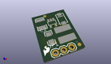
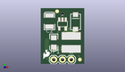
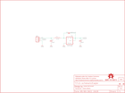

Contents
========

* [PRS10968 > Sparkfun](#prs10968--sparkfun)
	* [Schematic](#schematic)
	* [Interactive BOM](#interactive-bom)
	* [OOMP Parts](#oomp-parts)
	* [Images](#images)
	* [Tags](#tags)
  
![][im]
# PRS10968 > Sparkfun

- ID: PROJ-SPAR-10968-STAN-01
- Hex ID: PRS10968
- Name: Sparkfun
- Description: Sparkfun
- Long Link: [http://oom.lt/PROJ-SPAR-10968-STAN-01](http://oom.lt/PROJ-SPAR-10968-STAN-01)
- Short Link: [http://oom.lt/PRS10968](http://oom.lt/PRS10968)

## Schematic
  

## Interactive BOM

- Interactive BOM page: [ibom.html](https://htmlpreview.github.io/?https://github.com/oomlout/oomlout_OOMP_projects/blob/main/PROJ-SPAR-10968-STAN-01/kicad/bom/ibom.html)

## OOMP Parts
  

|OOMP Parts|
| :---: |
|C1,CAPX-UNMATCHED-X-UF10-01,C1,10uF,CAP_POL1206,EIA3216,Capacitor Polarized,,|
|C2,CAPX-UNMATCHED-X-UF68-01,C2,68uF,CAP_POL3528,EIA3528,Capacitor Polarized,,|
|D1,DIOD-UNMATCHED-X-UNMATCHED-01,D1,MBRA140,DIODESMA,SMA-DIODE,Diode,,|
|JP1,HEAD-I01-X-PI03-01,FID1,FIDUCIAL1X2,FIDUCIAL1X2,FIDUCIAL-1X2,Fiducial Alignment Points,,|
|L1,UNMATCHED-UNMATCHED-X-UNMATCHED-01,FID2,FIDUCIAL1X2,FIDUCIAL1X2,FIDUCIAL-1X2,Fiducial Alignment Points,,|
|U1,UNMATCHED-SO235-X-UNMATCHED-01,FRAME1,FRAME-LETTER,FRAME-LETTER,CREATIVE_COMMONS,Schematic Frame,,|

## Images
  
  

|kicadPcb3d|kicadPcb3dFront|kicadPcb3dBack|eagleImage|eagleSchemImage|
| :---: | :---: | :---: | :---: | :---: |
||||||

## Tags

- hexID: PRS10968
- oompType: PROJ
- oompSize: SPAR
- oompColor: 10968
- oompDesc: STAN
- oompIndex: 01
- oompName: NCP1402-5V Breakout
- sources: All source files from https://github.com/sparkfun/NCP1402-5V_Breakout (source licence details in srcLicense.md)
- linkBuyPage: https://www.sparkfun.com/products/10968
- oompID: PROJ-SPAR-10968-STAN-01
- oompParts: C1,CAPX-UNMATCHED-X-UF10-01
- oompParts: C2,CAPX-UNMATCHED-X-UF68-01
- oompParts: D1,DIOD-UNMATCHED-X-UNMATCHED-01
- oompParts: JP1,HEAD-I01-X-PI03-01
- oompParts: L1,UNMATCHED-UNMATCHED-X-UNMATCHED-01
- oompParts: U1,UNMATCHED-SO235-X-UNMATCHED-01
- rawParts: C1,10uF,CAP_POL1206,EIA3216,Capacitor Polarized,,
- rawParts: C2,68uF,CAP_POL3528,EIA3528,Capacitor Polarized,,
- rawParts: D1,MBRA140,DIODESMA,SMA-DIODE,Diode,,
- rawParts: FID1,FIDUCIAL1X2,FIDUCIAL1X2,FIDUCIAL-1X2,Fiducial Alignment Points,,
- rawParts: FID2,FIDUCIAL1X2,FIDUCIAL1X2,FIDUCIAL-1X2,Fiducial Alignment Points,,
- rawParts: FRAME1,FRAME-LETTER,FRAME-LETTER,CREATIVE_COMMONS,Schematic Frame,,
- rawParts: JP1,,M03PTH,1X03,Header 3,,
- rawParts: JP2,LOGO-SFESK,LOGO-SFESK,SFE-LOGO-FLAME,Spark Fun Electronics PCB Logo,,
- rawParts: L1,47uH,INDUCTORCR54,CR54,Inductors,,
- rawParts: U$1,OSHW-LOGOS,OSHW-LOGOS,OSHW-LOGO-S,Open Source Hardware Logo This logo indicates the piece of hardware it is found on incorporates a OSHW license and/or adheres to the definition of open source hardware found here: http://freedomdefined.org/OSHW,,
- rawParts: U1,NCP1402,V_REG_NCP1400SOT23-5,SOT23-5,Switching step-up voltage regulator,,

[im]: kicadPcb3d_450.png
