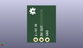

Contents
========

* [PROJ-SPAR-10968-STAN-01>NCP1402-5V Breakout](#proj-spar-10968-stan-01ncp1402-5v-breakout)
	* [Images](#images)
	* [Interactive BOM](#interactive-bom)
	* [OOMP Parts](#oomp-parts)
	* [Tags](#tags)
  
![][im]
# PROJ-SPAR-10968-STAN-01>NCP1402-5V Breakout

- ID: PROJ-SPAR-10968-STAN-01
- Hex ID: PRS10968
- Name: NCP1402-5V Breakout
- Description: 

## Images
  
  

|eagleImage|kicadPcb3dFront|kicadPcb3dBack|kicadPcb3d|
| :---: | :---: | :---: | :---: |
|||||

## Interactive BOM

- Interactive BOM page: [ibom.html](kicad/bom/ibom.html)

## OOMP Parts
  

|OOMP Parts|
| :---: |
|CAPC-UNMATCHED-X-UNMATCHED-01, C1, 3.8099999999999996, 6.35, 270,C1, 10uF, EIA3216, SparkFun, (0.15, 0.25), R270|
|CAPE-UNMATCHED-X-UNMATCHED-01, C2, 2.54, 12.7, 90,C2, 68uF, EIA3528, SparkFun, (0.1, 0.5), R90|
|UNMATCHED-UNMATCHED-X-UNMATCHED-01, D1, 10.16, 12.446, 90,D1, MBRA140, SMA-DIODE, SparkFun, (0.4, 0.49), R90|
|<table><tr><td></td><td> JP1</td><td>[HEAD-I01-X-PI03-01 2.54 mm 3 Pin Header](https://github.com/oomlout/oomlout_OOMP_parts/tree/main/HEAD-I01-X-PI03-01/)</td><td>[H03](https://github.com/oomlout/oomlout_OOMP_parts/tree/main/HEAD-I01-X-PI03-01/)</td></tr></table>|
|UNMATCHED-UNMATCHED-X-UNMATCHED-01, L1, 8.889999999999999, 6.35, 180,L1, 47uH, CR54, SparkFun, (0.35, 0.25), R180|
|UNMATCHED-UNMATCHED-X-UNMATCHED-01, U1, 6.35, 11.811, 180,U1, NCP1402, SOT23-5, SparkFun, (0.25, 0.465), R180|

## Tags

- hexID: PRS10968
- oompType: PROJ
- oompSize: SPAR
- oompColor: 10968
- oompDesc: STAN
- oompIndex: 01
- oompName: NCP1402-5V Breakout
- sources: All source files from https://github.com/sparkfun/NCP1402-5V_Breakout (source licence details in srcLicense.md)
- linkBuyPage: https://www.sparkfun.com/products/10968
- oompID: PROJ-SPAR-10968-STAN-01
- oompPart: CAPC-UNMATCHED-X-UNMATCHED-01, C1, 3.8099999999999996, 6.35, 270
- oompPart: CAPE-UNMATCHED-X-UNMATCHED-01, C2, 2.54, 12.7, 90
- oompPart: UNMATCHED-UNMATCHED-X-UNMATCHED-01, D1, 10.16, 12.446, 90
- oompPart: SKIP-UNMATCHED-X-UNMATCHED-01, FID1, 11.43, 1.27, 0
- oompPart: SKIP-UNMATCHED-X-UNMATCHED-01, FID2, 4.7752, 15.570199999999998, 0
- oompPart: HEAD-I01-X-PI03-01, JP1, 3.8099999999999996, 1.27, 0
- oompPart: UNMATCHED-UNMATCHED-X-UNMATCHED-01, L1, 8.889999999999999, 6.35, 180
- oompPart: UNMATCHED-UNMATCHED-X-UNMATCHED-01, U1, 6.35, 11.811, 180
- rawPart: C1, 10uF, EIA3216, SparkFun, (0.15, 0.25), R270
- rawPart: C2, 68uF, EIA3528, SparkFun, (0.1, 0.5), R90
- rawPart: D1, MBRA140, SMA-DIODE, SparkFun, (0.4, 0.49), R90
- rawPart: FID1, FIDUCIAL1X2, FIDUCIAL-1X2, SparkFun-Aesthetics, (0.45, 0.05), R0
- rawPart: FID2, FIDUCIAL1X2, FIDUCIAL-1X2, SparkFun-Aesthetics, (0.188, 0.613), R0
- rawPart: JP1, 1X03, SparkFun-Connectors, (0.15, 0.05), R0
- rawPart: L1, 47uH, CR54, SparkFun, (0.35, 0.25), R180
- rawPart: U1, NCP1402, SOT23-5, SparkFun, (0.25, 0.465), R180

[im]: kicadPcb3d_450.png
