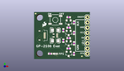
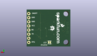
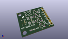

Contents
========

* [PROJ-SPAR-10995-STAN-01>GPS Evaluation Board GP-2106](#proj-spar-10995-stan-01gps-evaluation-board-gp-2106)
	* [Images](#images)
	* [Interactive BOM](#interactive-bom)
	* [OOMP Parts](#oomp-parts)
	* [Tags](#tags)
  
![][im]
# PROJ-SPAR-10995-STAN-01>GPS Evaluation Board GP-2106

- ID: PROJ-SPAR-10995-STAN-01
- Hex ID: PRS10995
- Name: GPS Evaluation Board GP-2106
- Description: 

## Images
  
  

|eagleImage|kicadPcb3dFront|kicadPcb3dBack|kicadPcb3d|
| :---: | :---: | :---: | :---: |
|||||

## Interactive BOM

- Interactive BOM page: [ibom.html](kicad/bom/ibom.html)

## OOMP Parts
  

|OOMP Parts|
| :---: |
|CAPC-0402-X-UNMATCHED-01, C1, 13.97, 8.889999999999999, 90,C1, 1uF, 0402-CAP, SparkFun, (0.55, 0.35), R90|
|CAPC-UNMATCHED-X-UNMATCHED-01, C2, 10.16, 8.889999999999999, 0,C2, 10uF, EIA3216, SparkFun, (0.4, 0.35), R0|
|CAPC-0402-X-NF100-V50, C3, 13.97, 13.97, 90,C3, 0.1uF, 0402-CAP, SparkFun, (0.55, 0.55), R90|
|CAPC-UNMATCHED-X-UNMATCHED-01, C4, 10.16, 13.97, 0,C4, 10uF, EIA3216, SparkFun, (0.4, 0.55), R0|
|HEAD-I01-X-PI01-01, JP1, 25.4, 20.32, 0,JP1, M01PTH, 1X01, SparkFun, (1, 0.8), R0|
|UNMATCHED-UNMATCHED-X-UNMATCHED-01, JP6, 25.4, 5.08, 90,JP6, FTDI_BASICPTH, FTDI_BASIC, SparkFun, (1, 0.2), R90|
|HEAD-I01-X-PI01-01, JP7, 25.4, 2.54, 0,JP7, M01PTH, 1X01, SparkFun, (1, 0.1), R0|
|UNMATCHED-0603-X-UNMATCHED-01, LED1, 10.16, 2.54, 90,LED1, red, LED-0603, SparkFun, (0.4, 0.1), R90|
|UNMATCHED-UNMATCHED-X-UNMATCHED-01, Q1, 16.509999999999998, 12.7, 180,Q1, MOSFET-NCHANNELSMD, SOT23-3, SparkFun, (0.65, 0.5), R180|
|UNMATCHED-UNMATCHED-X-UNMATCHED-01, Q2, 16.509999999999998, 7.619999999999999, 180,Q2, MOSFET-NCHANNELSMD, SOT23-3, SparkFun, (0.65, 0.3), R180|
|UNMATCHED-UNMATCHED-X-UNMATCHED-01, Q3, 16.509999999999998, 17.779999999999998, 180,Q3, MOSFET-NCHANNELSMD, SOT23-3, SparkFun, (0.65, 0.7), R180|
|UNMATCHED-UNMATCHED-X-UNMATCHED-01, Q4, 16.509999999999998, 2.54, 180,Q4, MOSFET-NCHANNELSMD, SOT23-3, SparkFun, (0.65, 0.1), R180|
|<table><tr><td></td><td> R1</td><td>[RESE-0402-X-O103-01 SMD (0402) 10k Ohm Resistor](https://github.com/oomlout/oomlout_OOMP_parts/tree/main/RESE-0402-X-O103-01/)</td><td>[R42103](https://github.com/oomlout/oomlout_OOMP_parts/tree/main/RESE-0402-X-O103-01/)</td></tr></table>|
|<table><tr><td></td><td> R2</td><td>[RESE-0402-X-O103-01 SMD (0402) 10k Ohm Resistor](https://github.com/oomlout/oomlout_OOMP_parts/tree/main/RESE-0402-X-O103-01/)</td><td>[R42103](https://github.com/oomlout/oomlout_OOMP_parts/tree/main/RESE-0402-X-O103-01/)</td></tr></table>|
|<table><tr><td></td><td> R3</td><td>[RESE-0402-X-O103-01 SMD (0402) 10k Ohm Resistor](https://github.com/oomlout/oomlout_OOMP_parts/tree/main/RESE-0402-X-O103-01/)</td><td>[R42103](https://github.com/oomlout/oomlout_OOMP_parts/tree/main/RESE-0402-X-O103-01/)</td></tr></table>|
|<table><tr><td></td><td> R4</td><td>[RESE-0402-X-O103-01 SMD (0402) 10k Ohm Resistor](https://github.com/oomlout/oomlout_OOMP_parts/tree/main/RESE-0402-X-O103-01/)</td><td>[R42103](https://github.com/oomlout/oomlout_OOMP_parts/tree/main/RESE-0402-X-O103-01/)</td></tr></table>|
|<table><tr><td></td><td> R5</td><td>[RESE-0402-X-O103-01 SMD (0402) 10k Ohm Resistor](https://github.com/oomlout/oomlout_OOMP_parts/tree/main/RESE-0402-X-O103-01/)</td><td>[R42103](https://github.com/oomlout/oomlout_OOMP_parts/tree/main/RESE-0402-X-O103-01/)</td></tr></table>|
|<table><tr><td></td><td> R6</td><td>[RESE-0402-X-O103-01 SMD (0402) 10k Ohm Resistor](https://github.com/oomlout/oomlout_OOMP_parts/tree/main/RESE-0402-X-O103-01/)</td><td>[R42103](https://github.com/oomlout/oomlout_OOMP_parts/tree/main/RESE-0402-X-O103-01/)</td></tr></table>|
|<table><tr><td></td><td> R7</td><td>[RESE-0402-X-O103-01 SMD (0402) 10k Ohm Resistor](https://github.com/oomlout/oomlout_OOMP_parts/tree/main/RESE-0402-X-O103-01/)</td><td>[R42103](https://github.com/oomlout/oomlout_OOMP_parts/tree/main/RESE-0402-X-O103-01/)</td></tr></table>|
|<table><tr><td></td><td> R8</td><td>[RESE-0402-X-O103-01 SMD (0402) 10k Ohm Resistor](https://github.com/oomlout/oomlout_OOMP_parts/tree/main/RESE-0402-X-O103-01/)</td><td>[R42103](https://github.com/oomlout/oomlout_OOMP_parts/tree/main/RESE-0402-X-O103-01/)</td></tr></table>|
|RESE-0402-X-UNMATCHED-01, R9, 7.619999999999999, 2.54, 0,R9, 0.27, 0402-RES, SparkFun, (0.3, 0.1), R0|
|UNMATCHED-UNMATCHED-X-UNMATCHED-01, S1, 10.16, 19.049999999999997, 180,S1, SWITCH-MOMENTARY-2SMD, TACTILE_SWITCH_SMD, SparkFun, (0.4, 0.75), R180|
|UNMATCHED-UNMATCHED-X-UNMATCHED-01, U1, 5.08, 11.43, 270,U1, GP-2106, GP-2106, SparkFun, (0.2, 0.45), R270|
|UNMATCHED-UNMATCHED-X-UNMATCHED-01, U2, 10.16, 11.43, 90,U2, V_REG_LDOSMD2, SC70, SparkFun, (0.4, 0.45), R90|

## Tags

- hexID: PRS10995
- oompType: PROJ
- oompSize: SPAR
- oompColor: 10995
- oompDesc: STAN
- oompIndex: 01
- oompName: GPS Evaluation Board GP-2106
- sources: All source files from https://github.com/sparkfun/GPS_Evaluation_Board_GP-2106 (source licence details in srcLicense.md)
- linkBuyPage: https://www.sparkfun.com/products/10995
- oompID: PROJ-SPAR-10995-STAN-01
- oompPart: CAPC-0402-X-UNMATCHED-01, C1, 13.97, 8.889999999999999, 90
- oompPart: CAPC-UNMATCHED-X-UNMATCHED-01, C2, 10.16, 8.889999999999999, 0
- oompPart: CAPC-0402-X-NF100-V50, C3, 13.97, 13.97, 90
- oompPart: CAPC-UNMATCHED-X-UNMATCHED-01, C4, 10.16, 13.97, 0
- oompPart: HEAD-I01-X-PI01-01, JP1, 25.4, 20.32, 0
- oompPart: UNMATCHED-UNMATCHED-X-UNMATCHED-01, JP6, 25.4, 5.08, 90
- oompPart: HEAD-I01-X-PI01-01, JP7, 25.4, 2.54, 0
- oompPart: SKIP-UNMATCHED-X-UNMATCHED-01, JP8, 0.7619999999999999, 22.098, 0
- oompPart: SKIP-UNMATCHED-X-UNMATCHED-01, JP9, 22.86, 1.27, 0
- oompPart: UNMATCHED-0603-X-UNMATCHED-01, LED1, 10.16, 2.54, 90
- oompPart: UNMATCHED-UNMATCHED-X-UNMATCHED-01, Q1, 16.509999999999998, 12.7, 180
- oompPart: UNMATCHED-UNMATCHED-X-UNMATCHED-01, Q2, 16.509999999999998, 7.619999999999999, 180
- oompPart: UNMATCHED-UNMATCHED-X-UNMATCHED-01, Q3, 16.509999999999998, 17.779999999999998, 180
- oompPart: UNMATCHED-UNMATCHED-X-UNMATCHED-01, Q4, 16.509999999999998, 2.54, 180
- oompPart: RESE-0402-X-O103-01, R1, 16.509999999999998, 15.239999999999998, 0
- oompPart: RESE-0402-X-O103-01, R2, 19.049999999999997, 12.7, 90
- oompPart: RESE-0402-X-O103-01, R3, 16.509999999999998, 10.16, 0
- oompPart: RESE-0402-X-O103-01, R4, 19.049999999999997, 7.619999999999999, 90
- oompPart: RESE-0402-X-O103-01, R5, 16.509999999999998, 20.32, 0
- oompPart: RESE-0402-X-O103-01, R6, 19.049999999999997, 17.779999999999998, 90
- oompPart: RESE-0402-X-O103-01, R7, 16.509999999999998, 5.08, 0
- oompPart: RESE-0402-X-O103-01, R8, 19.049999999999997, 2.54, 90
- oompPart: RESE-0402-X-UNMATCHED-01, R9, 7.619999999999999, 2.54, 0
- oompPart: UNMATCHED-UNMATCHED-X-UNMATCHED-01, S1, 10.16, 19.049999999999997, 180
- oompPart: SKIP-UNMATCHED-X-UNMATCHED-01, SJ1, 12.7, 2.54, M180
- oompPart: UNMATCHED-UNMATCHED-X-UNMATCHED-01, U1, 5.08, 11.43, 270
- oompPart: UNMATCHED-UNMATCHED-X-UNMATCHED-01, U2, 10.16, 11.43, 90
- rawPart: C1, 1uF, 0402-CAP, SparkFun, (0.55, 0.35), R90
- rawPart: C2, 10uF, EIA3216, SparkFun, (0.4, 0.35), R0
- rawPart: C3, 0.1uF, 0402-CAP, SparkFun, (0.55, 0.55), R90
- rawPart: C4, 10uF, EIA3216, SparkFun, (0.4, 0.55), R0
- rawPart: JP1, M01PTH, 1X01, SparkFun, (1, 0.8), R0
- rawPart: JP6, FTDI_BASICPTH, FTDI_BASIC, SparkFun, (1, 0.2), R90
- rawPart: JP7, M01PTH, 1X01, SparkFun, (1, 0.1), R0
- rawPart: JP8, FIDUCIALUFIDUCIAL, MICRO-FIDUCIAL, SparkFun, (0.03, 0.87), R0
- rawPart: JP9, FIDUCIALUFIDUCIAL, MICRO-FIDUCIAL, SparkFun, (0.9, 0.05), R0
- rawPart: LED1, red, LED-0603, SparkFun, (0.4, 0.1), R90
- rawPart: Q1, MOSFET-NCHANNELSMD, SOT23-3, SparkFun, (0.65, 0.5), R180
- rawPart: Q2, MOSFET-NCHANNELSMD, SOT23-3, SparkFun, (0.65, 0.3), R180
- rawPart: Q3, MOSFET-NCHANNELSMD, SOT23-3, SparkFun, (0.65, 0.7), R180
- rawPart: Q4, MOSFET-NCHANNELSMD, SOT23-3, SparkFun, (0.65, 0.1), R180
- rawPart: R1, 10k, 0402-RES, SparkFun, (0.65, 0.6), R0
- rawPart: R2, 10k, 0402-RES, SparkFun, (0.75, 0.5), R90
- rawPart: R3, 10k, 0402-RES, SparkFun, (0.65, 0.4), R0
- rawPart: R4, 10k, 0402-RES, SparkFun, (0.75, 0.3), R90
- rawPart: R5, 10k, 0402-RES, SparkFun, (0.65, 0.8), R0
- rawPart: R6, 10k, 0402-RES, SparkFun, (0.75, 0.7), R90
- rawPart: R7, 10k, 0402-RES, SparkFun, (0.65, 0.2), R0
- rawPart: R8, 10k, 0402-RES, SparkFun, (0.75, 0.1), R90
- rawPart: R9, 0.27, 0402-RES, SparkFun, (0.3, 0.1), R0
- rawPart: S1, SWITCH-MOMENTARY-2SMD, TACTILE_SWITCH_SMD, SparkFun, (0.4, 0.75), R180
- rawPart: SJ1, SOLDERJUMPERTRACE, SJ_2S-TRACE, SparkFun, (0.5, 0.1), MR180
- rawPart: U1, GP-2106, GP-2106, SparkFun, (0.2, 0.45), R270
- rawPart: U2, V_REG_LDOSMD2, SC70, SparkFun, (0.4, 0.45), R90

[im]: kicadPcb3d_450.png
